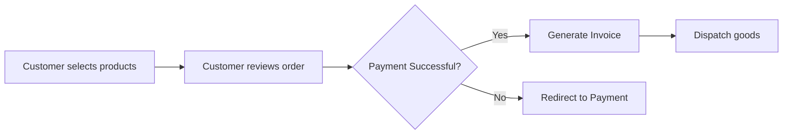
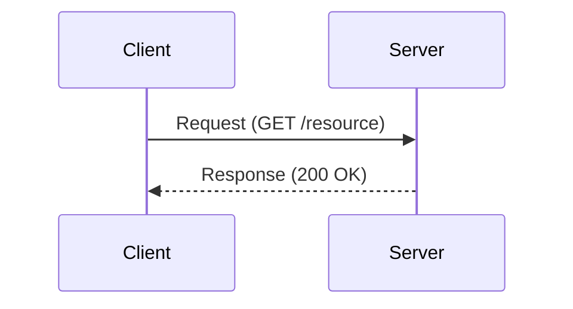
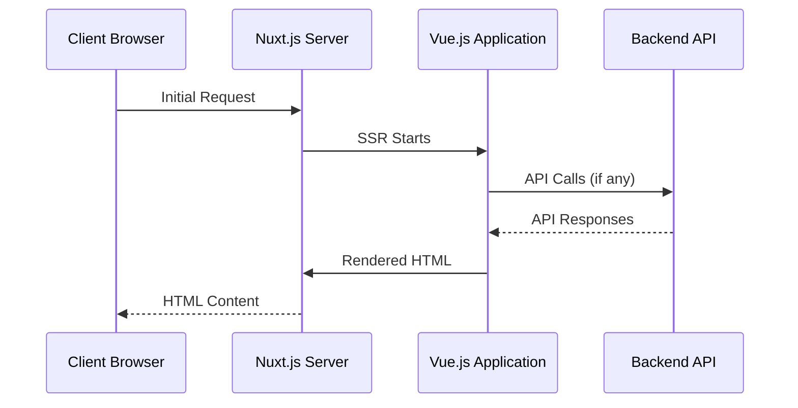

## TLDR

Learn how to combine ChatGPT and Mermaid to quickly create professional diagrams for technical documentation. This approach eliminates the complexity of traditional diagramming tools while maintaining high-quality output.

## Introduction

Mermaid is a markdown-like script language that generates diagrams from text descriptions. When combined with ChatGPT, it becomes a powerful tool for creating technical diagrams quickly and efficiently.

## Key Diagram Types

### Flowcharts

Perfect for visualizing processes:

```plaintext
flowchart LR
  A[Customer selects products] --> B[Customer reviews order]
  B --> C{Payment Successful?}
  C -->|Yes| D[Generate Invoice]
  D --> E[Dispatch goods]
  C -->|No| F[Redirect to Payment]
```



### Sequence Diagrams

Ideal for system interactions:

```plaintext
sequenceDiagram
    participant Client
    participant Server
    Client->>Server: Request (GET /resource)
    Server-->>Client: Response (200 OK)
```



## Using ChatGPT with Mermaid

1. Ask ChatGPT to explain your concept
2. Request a Mermaid diagram representation
3. Iterate on the diagram with follow-up questions

Example prompt: "Create a Mermaid sequence diagram showing how Nuxt.js performs server-side rendering"

```plaintext
sequenceDiagram
  participant Client as Client Browser
  participant Nuxt as Nuxt.js Server
  participant Vue as Vue.js Application
  participant API as Backend API

  Client->>Nuxt: Initial Request
  Nuxt->>Vue: SSR Starts
  Vue->>API: API Calls (if any)
  API-->>Vue: API Responses
  Vue->>Nuxt: Rendered HTML
  Nuxt-->>Client: HTML Content
```



## Quick Setup Guide

### Online Editor

Use [Mermaid Live Editor](https://mermaid.live/) for quick prototyping.

### VS Code Integration

1. Install "Markdown Preview Mermaid Support" extension
2. Create `.md` file with Mermaid code blocks
3. Preview with built-in markdown viewer

### Web Integration

```html
<script src="https://unpkg.com/mermaid/dist/mermaid.min.js"></script>
<script>
  mermaid.initialize({ startOnLoad: true });
</script>
<div class="mermaid">graph TD A-->B</div>
```

## Conclusion

The combination of ChatGPT and Mermaid streamlines technical diagramming, making it accessible and efficient. Try it in your next documentation project to save time while creating professional diagrams.
