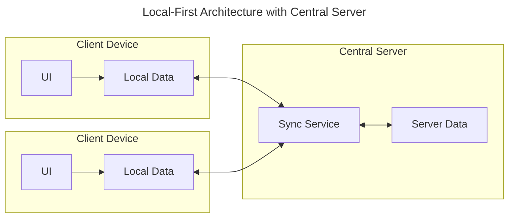
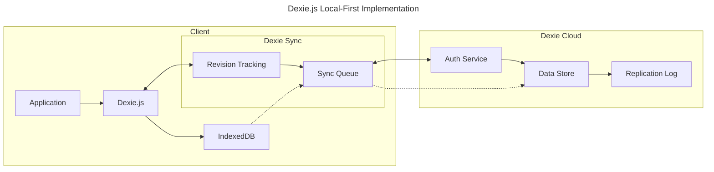
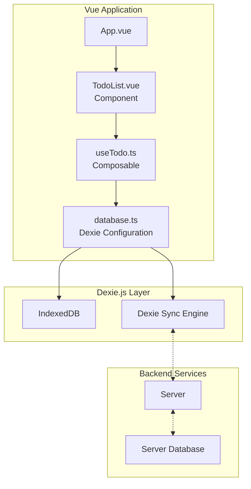
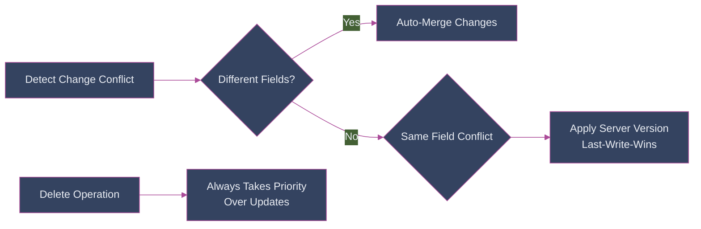

Ever been frustrated when your web app stops working because the internet connection dropped? That's where local-first applications come in! In this guide, we'll explore how to build robust, offline-capable apps using Vue 3 and Dexie.js. If you're new to local-first development, check out my [comprehensive introduction to local-first web development](https://alexop.dev/posts/what-is-local-first-web-development/) first.

## What Makes an App "Local-First"?

Martin Kleppmann defines local-first software as systems where "the availability of another computer should never prevent you from working." Think Notion's desktop app or Figma's offline mode - they store data locally first and seamlessly sync when online.

Three key principles:

1. Works without internet connection
2. Users stay productive when servers are down
3. Data syncs smoothly when connectivity returns

## The Architecture Behind Local-First Apps



Key decisions:

- How much data to store locally (full vs. partial dataset)
- How to handle multi-user conflict resolution

## Enter Dexie.js: Your Local-First Swiss Army Knife

Dexie.js provides a robust offline-first architecture where database operations run against local IndexedDB first, ensuring responsiveness without internet connection.



### Sync Strategies

1. **WebSocket Sync**: Real-time updates for collaborative apps
2. **HTTP Long-Polling**: Default sync mechanism, firewall-friendly
3. **Service Worker Sync**: Optional background syncing when configured

## Setting Up Dexie Cloud

To enable multi-device synchronization and real-time collaboration, we'll use Dexie Cloud. Here's how to set it up:

1. **Create a Dexie Cloud Account**:
   - Visit [https://dexie.org/cloud/](https://dexie.org/cloud/)
   - Sign up for a free developer account
   - Create a new database from the dashboard

2. **Install Required Packages**:

   ```bash
   npm install dexie-cloud-addon
   ```

3. **Configure Environment Variables**:
   Create a `.env` file in your project root:

   ```bash
   VITE_DEXIE_CLOUD_URL=https://db.dexie.cloud/db/<your-db-id>
   ```

   Replace `<your-db-id>` with the database ID from your Dexie Cloud dashboard.

4. **Enable Authentication**:
   Dexie Cloud provides built-in authentication. You can:
   - Use email/password authentication
   - Integrate with OAuth providers
   - Create custom authentication flows

The free tier includes:

- Up to 50MB of data per database
- Up to 1,000 sync operations per day
- Basic authentication and access control
- Real-time sync between devices

## Building a Todo App

Let's implement a practical example with a todo app:



## Setting Up the Database

```typescript
import Dexie, { type Table } from "dexie";
import dexieCloud from "dexie-cloud-addon";

export interface Todo {
  id?: string;
  title: string;
  completed: boolean;
  createdAt: Date;
}

export class TodoDB extends Dexie {
  todos!: Table<Todo>;

  constructor() {
    super("TodoDB", { addons: [dexieCloud] });

    this.version(1).stores({
      todos: "@id, title, completed, createdAt",
    });
  }

  async configureSync(databaseUrl: string) {
    await this.cloud.configure({
      databaseUrl,
      requireAuth: true,
      tryUseServiceWorker: true,
    });
  }
}

export const db = new TodoDB();

if (!import.meta.env.VITE_DEXIE_CLOUD_URL) {
  throw new Error("VITE_DEXIE_CLOUD_URL environment variable is not defined");
}

db.configureSync(import.meta.env.VITE_DEXIE_CLOUD_URL).catch(console.error);

export const currentUser = db.cloud.currentUser;
export const login = () => db.cloud.login();
export const logout = () => db.cloud.logout();
```

## Creating the Todo Composable

```typescript
import { db, type Todo } from "@/db/todo";
import { useObservable } from "@vueuse/rxjs";
import { liveQuery } from "dexie";
import { from } from "rxjs";
import { computed, ref } from "vue";

export function useTodos() {
  const newTodoTitle = ref("");
  const error = ref<string | null>(null);

  const todos = useObservable<Todo[]>(
    from(liveQuery(() => db.todos.orderBy("createdAt").toArray()))
  );

  const completedTodos = computed(
    () => todos.value?.filter(todo => todo.completed) ?? []
  );

  const pendingTodos = computed(
    () => todos.value?.filter(todo => !todo.completed) ?? []
  );

  const addTodo = async () => {
    try {
      if (!newTodoTitle.value.trim()) return;

      await db.todos.add({
        title: newTodoTitle.value,
        completed: false,
        createdAt: new Date(),
      });

      newTodoTitle.value = "";
      error.value = null;
    } catch (err) {
      error.value = "Failed to add todo";
      console.error(err);
    }
  };

  const toggleTodo = async (todo: Todo) => {
    try {
      await db.todos.update(todo.id!, {
        completed: !todo.completed,
      });
      error.value = null;
    } catch (err) {
      error.value = "Failed to toggle todo";
      console.error(err);
    }
  };

  const deleteTodo = async (id: string) => {
    try {
      await db.todos.delete(id);
      error.value = null;
    } catch (err) {
      error.value = "Failed to delete todo";
      console.error(err);
    }
  };

  return {
    todos,
    newTodoTitle,
    error,
    completedTodos,
    pendingTodos,
    addTodo,
    toggleTodo,
    deleteTodo,
  };
}
```

## Authentication Guard Component

```vue
<script setup lang="ts">
import { Button } from "@/components/ui/button";
import {
  Card,
  CardContent,
  CardDescription,
  CardFooter,
  CardHeader,
  CardTitle,
} from "@/components/ui/card";
import { currentUser, login, logout } from "@/db/todo";
import { Icon } from "@iconify/vue";
import { useObservable } from "@vueuse/rxjs";
import { computed, ref } from "vue";

const user = useObservable(currentUser);
const isAuthenticated = computed(() => !!user.value);
const isLoading = ref(false);

async function handleLogin() {
  isLoading.value = true;
  try {
    await login();
  } finally {
    isLoading.value = false;
  }
}
</script>

<template>
  <div
    v-if="!isAuthenticated"
    class="bg-background flex min-h-screen flex-col items-center justify-center p-4"
  >
    <Card class="w-full max-w-md">
      <!-- Login form content -->
    </Card>
  </div>
  <template v-else>
    <div class="bg-card sticky top-0 z-20 border-b">
      <!-- User info and logout button -->
    </div>
    <slot />
  </template>
</template>
```

## Better Architecture: Repository Pattern

```typescript
export interface TodoRepository {
  getAll(): Promise<Todo[]>;
  add(todo: Omit<Todo, "id">): Promise<string>;
  update(id: string, todo: Partial<Todo>): Promise<void>;
  delete(id: string): Promise<void>;
  observe(): Observable<Todo[]>;
}

export class DexieTodoRepository implements TodoRepository {
  constructor(private db: TodoDB) {}

  async getAll() {
    return this.db.todos.toArray();
  }

  observe() {
    return from(liveQuery(() => this.db.todos.orderBy("createdAt").toArray()));
  }

  async add(todo: Omit<Todo, "id">) {
    return this.db.todos.add(todo);
  }

  async update(id: string, todo: Partial<Todo>) {
    await this.db.todos.update(id, todo);
  }

  async delete(id: string) {
    await this.db.todos.delete(id);
  }
}

export function useTodos(repository: TodoRepository) {
  const newTodoTitle = ref("");
  const error = ref<string | null>(null);
  const todos = useObservable<Todo[]>(repository.observe());

  const addTodo = async () => {
    try {
      if (!newTodoTitle.value.trim()) return;
      await repository.add({
        title: newTodoTitle.value,
        completed: false,
        createdAt: new Date(),
      });
      newTodoTitle.value = "";
      error.value = null;
    } catch (err) {
      error.value = "Failed to add todo";
      console.error(err);
    }
  };

  return {
    todos,
    newTodoTitle,
    error,
    addTodo,
    // ... other methods
  };
}
```

## Understanding the IndexedDB Structure

When you inspect your application in the browser's DevTools under the "Application" tab > "IndexedDB", you'll see a database named "TodoDB-zy02f1..." with several object stores:

### Internal Dexie Stores (Prefixed with $)

> Note: These stores are only created when using Dexie Cloud for sync functionality.

- **$baseRevs**: Keeps track of base revisions for synchronization
- **$jobs**: Manages background synchronization tasks
- **$logins**: Stores authentication data including your last login timestamp
- **$members_mutations**: Tracks changes to member data for sync
- **$realms_mutations**: Tracks changes to realm/workspace data
- **$roles_mutations**: Tracks changes to role assignments
- **$syncState**: Maintains the current synchronization state
- **$todos_mutations**: Records all changes made to todos for sync and conflict resolution

### Application Data Stores

- **members**: Contains user membership data with compound indexes:
  - `[userId+realmId]`: For quick user-realm lookups
  - `[email+realmId]`: For email-based queries
  - `realmId`: For realm-specific queries
- **realms**: Stores available workspaces
- **roles**: Manages user role assignments
- **todos**: Your actual todo items containing:
  - Title
  - Completed status
  - Creation timestamp

Here's how a todo item actually looks in IndexedDB:

```json
{
  "id": "tds0PI7ogcJqpZ1JCly0qyAheHmcom",
  "title": "test",
  "completed": false,
  "createdAt": "Tue Jan 21 2025 08:40:59 GMT+0100 (Central Europe)",
  "owner": "opalic.alexander@gmail.com",
  "realmId": "opalic.alexander@gmail.com"
}
```

Each todo gets a unique `id` generated by Dexie, and when using Dexie Cloud, additional fields like `owner` and `realmId` are automatically added for multi-user support.

Each store in IndexedDB acts like a table in a traditional database, but is optimized for client-side storage and offline operations. The `$`-prefixed stores are managed automatically by Dexie.js to handle:

1. **Offline Persistence**: Your todos are stored locally
2. **Multi-User Support**: User data in `members` and `roles`
3. **Sync Management**: All `*_mutations` stores track changes
4. **Authentication**: Login state in `$logins`

## Understanding Dexie's Merge Conflict Resolution



Dexie's conflict resolution system is sophisticated and field-aware, meaning:

- Changes to different fields of the same record can be merged automatically
- Conflicts in the same field use last-write-wins with server priority
- Deletions always take precedence over updates to prevent "zombie" records

This approach ensures smooth collaboration while maintaining data consistency across devices and users.

## Conclusion

This guide demonstrated building local-first applications with Dexie.js and Vue. For simpler applications like todo lists or note-taking apps, Dexie.js provides an excellent balance of features and simplicity. For more complex needs similar to Linear, consider building a custom sync engine.

Find the complete example code on [GitHub](https://github.com/alexanderop/vue-dexie).
