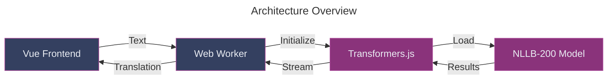

## Introduction

Most AI translation tools rely on external APIs.
This means sending data to servers and paying for each request. But what if you could run translations directly in your browser? This guide shows you how to build a free, offline translator that handles 200 languages using Vue and Transformers.js.

## The Tools

- Vue 3 for the interface
- Transformers.js to run AI models locally
- Web Workers to handle heavy processing
- NLLB-200, Meta's translation model



## Building the Translator


### 1. Set Up Your Project

Create a new Vue project with TypeScript:

```bash
npm create vite@latest vue-translator -- --template vue-ts
cd vue-translator
npm install
npm install @huggingface/transformers
```

### 2. Create the Translation Worker

The translation happens in a background process. Create `src/worker/translation.worker.ts`:

```typescript
import {
  pipeline,
  TextStreamer,
  TranslationPipeline,
} from "@huggingface/transformers";
import type { PipelineType, ProgressCallback } from "@huggingface/transformers";

// Singleton pattern for the translation pipeline
class MyTranslationPipeline {
  static task: PipelineType = "translation";
  // We use the distilled model for faster loading and inference
  static model = "Xenova/nllb-200-distilled-600M";
  static instance: TranslationPipeline | null = null;

  static async getInstance(progress_callback?: ProgressCallback) {
    if (!this.instance) {
      this.instance = (await pipeline(this.task, this.model, {
        progress_callback,
      })) as TranslationPipeline;
    }
    return this.instance;
  }
}

// Type definitions for worker messages
interface TranslationRequest {
  text: string;
  src_lang: string;
  tgt_lang: string;
}

// Worker message handler
self.addEventListener(
  "message",
  async (event: MessageEvent<TranslationRequest>) => {
    try {
      // Initialize the translation pipeline with progress tracking
      const translator = await MyTranslationPipeline.getInstance(x => {
        self.postMessage(x);
      });

      // Configure streaming for real-time translation updates
      const streamer = new TextStreamer(translator.tokenizer, {
        skip_prompt: true,
        skip_special_tokens: true,
        callback_function: (text: string) => {
          self.postMessage({
            status: "update",
            output: text,
          });
        },
      });

      // Perform the translation
      const output = await translator(event.data.text, {
        // @ts-ignore - Type definitions are incomplete
        tgt_lang: event.data.tgt_lang,
        src_lang: event.data.src_lang,
        streamer,
      });

      // Send the final result
      self.postMessage({
        status: "complete",
        output,
      });
    } catch (error) {
      self.postMessage({
        status: "error",
        error:
          error instanceof Error ? error.message : "An unknown error occurred",
      });
    }
  }
);
```

### 3. Build the Interface

Create a clean interface with two main components:

#### Language Selector (`src/components/LanguageSelector.vue`)

```vue
<script setup lang="ts">
// Language codes follow the ISO 639-3 standard with script codes
const LANGUAGES: Record<string, string> = {
  English: "eng_Latn",
  French: "fra_Latn",
  Spanish: "spa_Latn",
  German: "deu_Latn",
  Chinese: "zho_Hans",
  Japanese: "jpn_Jpan",
  // Add more languages as needed
};
// Strong typing for component props
interface Props {
  type: string;
  modelValue: string;
}

defineProps<Props>();
const emit = defineEmits<{
  (e: "update:modelValue", value: string): void;
}>();

const onChange = (event: Event) => {
  const target = event.target as HTMLSelectElement;
  emit("update:modelValue", target.value);
};
</script>

<template>
  <div class="language-selector">
    <label>{{ type }}: </label>
    <select :value="modelValue" @change="onChange">
      <option
        v-for="[key, value] in Object.entries(LANGUAGES)"
        :key="key"
        :value="value"
      >
        {{ key }}
      </option>
    </select>
  </div>
</template>

<style scoped>
.language-selector {
  display: flex;
  align-items: center;
  gap: 0.5rem;
}

select {
  padding: 0.5rem;
  border-radius: 4px;
  border: 1px solid rgb(var(--color-border));
  background-color: rgb(var(--color-card));
  color: rgb(var(--color-text-base));
  min-width: 200px;
}
</style>
```

#### Progress Bar (`src/components/ProgressBar.vue`)

```vue
<script setup lang="ts">
defineProps<{
  text: string;
  percentage: number;
}>();
</script>

<template>
  <div class="progress-container">
    <div class="progress-bar" :style="{ width: `${percentage}%` }">
      {{ text }} ({{ percentage.toFixed(2) }}%)
    </div>
  </div>
</template>

<style scoped>
.progress-container {
  width: 100%;
  height: 20px;
  background-color: rgb(var(--color-card));
  border-radius: 10px;
  margin: 10px 0;
  overflow: hidden;
  border: 1px solid rgb(var(--color-border));
}

.progress-bar {
  height: 100%;
  background-color: rgb(var(--color-accent));
  transition: width 0.3s ease;
  display: flex;
  align-items: center;
  padding: 0 10px;
  color: rgb(var(--color-text-base));
  font-size: 0.9rem;
  white-space: nowrap;
}

.progress-bar:hover {
  background-color: rgb(var(--color-card-muted));
}
</style>
```

### 4. Put It All Together

In your main app file:

```vue
<script setup lang="ts">
import { ref, onMounted, onUnmounted, watch, computed } from "vue";
import LanguageSelector from "./components/LanguageSelector.vue";
import ProgressBar from "./components/ProgressBar.vue";

interface ProgressItem {
  file: string;
  progress: number;
}

// State
const worker = ref<Worker | null>(null);
const ready = ref<boolean | null>(null);
const disabled = ref(false);
const progressItems = ref<Map<string, ProgressItem>>(new Map());

const input = ref("I love walking my dog.");
const sourceLanguage = ref("eng_Latn");
const targetLanguage = ref("fra_Latn");
const output = ref("");

// Computed property for progress items array
const progressItemsArray = computed(() => {
  return Array.from(progressItems.value.values());
});

// Watch progress items
watch(
  progressItemsArray,
  newItems => {
    console.log("Progress items updated:", newItems);
  },
  { deep: true }
);

// Translation handler
const translate = () => {
  if (!worker.value) return;

  disabled.value = true;
  output.value = "";

  worker.value.postMessage({
    text: input.value,
    src_lang: sourceLanguage.value,
    tgt_lang: targetLanguage.value,
  });
};

// Worker message handler
const onMessageReceived = (e: MessageEvent) => {
  switch (e.data.status) {
    case "initiate":
      ready.value = false;
      progressItems.value.set(e.data.file, {
        file: e.data.file,
        progress: 0,
      });
      progressItems.value = new Map(progressItems.value);
      break;

    case "progress":
      if (progressItems.value.has(e.data.file)) {
        progressItems.value.set(e.data.file, {
          file: e.data.file,
          progress: e.data.progress,
        });
        progressItems.value = new Map(progressItems.value);
      }
      break;

    case "done":
      progressItems.value.delete(e.data.file);
      progressItems.value = new Map(progressItems.value);
      break;

    case "ready":
      ready.value = true;
      break;

    case "update":
      output.value += e.data.output;
      break;

    case "complete":
      disabled.value = false;
      break;

    case "error":
      console.error("Translation error:", e.data.error);
      disabled.value = false;
      break;
  }
};

// Lifecycle hooks
onMounted(() => {
  worker.value = new Worker(
    new URL("./workers/translation.worker.ts", import.meta.url),
    { type: "module" }
  );
  worker.value.addEventListener("message", onMessageReceived);
});

onUnmounted(() => {
  worker.value?.removeEventListener("message", onMessageReceived);
  worker.value?.terminate();
});
</script>

<template>
  <div class="app">
    <h1>Transformers.js</h1>
    <h2>ML-powered multilingual translation in Vue!</h2>

    <div class="container">
      <div class="language-container">
        <LanguageSelector type="Source" v-model="sourceLanguage" />
        <LanguageSelector type="Target" v-model="targetLanguage" />
      </div>

      <div class="textbox-container">
        <textarea
          v-model="input"
          rows="3"
          placeholder="Enter text to translate..."
        />
        <textarea
          v-model="output"
          rows="3"
          readonly
          placeholder="Translation will appear here..."
        />
      </div>
    </div>

    <button :disabled="disabled || ready === false" @click="translate">
      {{ ready === false ? "Loading..." : "Translate" }}
    </button>

    <div class="progress-bars-container">
      <label v-if="ready === false"> Loading models... (only run once) </label>
      <div v-for="item in progressItemsArray" :key="item.file">
        <ProgressBar :text="item.file" :percentage="item.progress" />
      </div>
    </div>
  </div>
</template>

<style scoped>
.app {
  max-width: 800px;
  margin: 0 auto;
  padding: 2rem;
  text-align: center;
}

.container {
  margin: 2rem 0;
}

.language-container {
  display: flex;
  justify-content: center;
  gap: 2rem;
  margin-bottom: 1rem;
}

.textbox-container {
  display: flex;
  gap: 1rem;
}

textarea {
  flex: 1;
  padding: 0.5rem;
  border-radius: 4px;
  border: 1px solid rgb(var(--color-border));
  background-color: rgb(var(--color-card));
  color: rgb(var(--color-text-base));
  font-size: 1rem;
  min-height: 100px;
  resize: vertical;
}

button {
  padding: 0.5rem 2rem;
  font-size: 1.1rem;
  cursor: pointer;
  background-color: rgb(var(--color-accent));
  color: rgb(var(--color-text-base));
  border: none;
  border-radius: 4px;
  transition: background-color 0.3s;
}

button:hover:not(:disabled) {
  background-color: rgb(var(--color-card-muted));
}

button:disabled {
  opacity: 0.6;
  cursor: not-allowed;
}

.progress-bars-container {
  margin-top: 2rem;
}

h1 {
  color: rgb(var(--color-text-base));
  margin-bottom: 0.5rem;
}

h2 {
  color: rgb(var(--color-card-muted));
  font-size: 1.2rem;
  font-weight: normal;
  margin-top: 0;
}
</style>
```

## Step 5: Optimizing the Build

Configure Vite to handle our Web Workers and TypeScript efficiently:

```typescript
import { defineConfig } from "vite";
import vue from "@vitejs/plugin-vue";

export default defineConfig({
  plugins: [vue()],
  worker: {
    format: "es", // Use ES modules format for workers
    plugins: [], // No additional plugins needed for workers
  },
  optimizeDeps: {
    exclude: ["@huggingface/transformers"], // Prevent Vite from trying to bundle Transformers.js
  },
});
```

## How It Works

1. You type text and select languages
2. The text goes to a Web Worker
3. Transformers.js loads the AI model (once)
4. The model translates your text
5. You see the translation appear in real time

The translator works offline after the first run. No data leaves your browser. No API keys needed.

## Try It Yourself

Want to explore the code further? Check out the complete source code on [GitHub](https://github.com/alexanderop/vue-ai-translate-poc).

Want to learn more? Explore these resources:

- [Transformers.js docs](https://huggingface.co/docs/transformers.js)
- [NLLB-200 model details](https://huggingface.co/facebook/nllb-200-distilled-600M)
- [Web Workers guide](https://developer.mozilla.org/en-US/docs/Web/API/Web_Workers_API)
