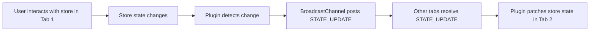

## TLDR

Create a Pinia plugin that enables state synchronization across browser tabs using the BroadcastChannel API. The plugin allows you to mark specific stores for cross-tab syncing and handles state updates automatically with timestamp-based conflict resolution.

## Introduction

In modern web applications, users often work with multiple browser tabs open. When using Pinia for state management, we sometimes need to ensure that state changes in one tab are reflected across all open instances of our application. This post will guide you through creating a plugin that adds cross-tab state synchronization to your Pinia stores.

## Understanding Pinia Plugins

A Pinia plugin is a function that extends the functionality of Pinia stores. Plugins are powerful tools that help:

- Reduce code duplication
- Add reusable functionality across stores
- Keep store definitions clean and focused
- Implement cross-cutting concerns

## Cross-Tab Communication with BroadcastChannel

The BroadcastChannel API provides a simple way to send messages between different browser contexts (tabs, windows, or iframes) of the same origin. It's perfect for our use case of synchronizing state across tabs.

Key features of BroadcastChannel:

- Built-in browser API
- Same-origin security model
- Simple pub/sub messaging pattern
- No need for external dependencies

### How BroadcastChannel Works

The BroadcastChannel API operates on a simple principle: any browsing context (window, tab, iframe, or worker) can join a channel by creating a `BroadcastChannel` object with the same channel name. Once joined:

1. Messages are sent using the `postMessage()` method
2. Messages are received through the `onmessage` event handler
3. Contexts can leave the channel using the `close()` method

## Implementing the Plugin

### Store Configuration

To use our plugin, stores need to opt-in to state sharing through configuration:

```ts
import { ref, computed } from "vue";
import { defineStore } from "pinia";

export const useCounterStore = defineStore(
  "counter",
  () => {
    const count = ref(0);
    const doubleCount = computed(() => count.value * 2);

    function increment() {
      count.value++;
    }

    return { count, doubleCount, increment };
  },
  {
    share: {
      enable: true,
      initialize: true,
    },
  }
);
```

The `share` option enables cross-tab synchronization and controls whether the store should initialize its state from other tabs.

### Plugin Registration `main.ts`

Register the plugin when creating your Pinia instance:

```ts
import { createPinia } from "pinia";
import { PiniaSharedState } from "./plugin/plugin";

const pinia = createPinia();
pinia.use(PiniaSharedState);
```

### Plugin Implementation `plugin/plugin.ts`

Here's our complete plugin implementation with TypeScript support:

```ts
import type { PiniaPluginContext, StateTree, DefineStoreOptions } from "pinia";

type Serializer<T extends StateTree> = {
  serialize: (value: T) => string;
  deserialize: (value: string) => T;
};

interface BroadcastMessage {
  type: "STATE_UPDATE" | "SYNC_REQUEST";
  timestamp?: number;
  state?: string;
}

type PluginOptions<T extends StateTree> = {
  enable?: boolean;
  initialize?: boolean;
  serializer?: Serializer<T>;
};

export interface StoreOptions<
  S extends StateTree = StateTree,
  G = object,
  A = object,
> extends DefineStoreOptions<string, S, G, A> {
  share?: PluginOptions<S>;
}

// Add type extension for Pinia
declare module "pinia" {
  // eslint-disable-next-line @typescript-eslint/no-unused-vars
  export interface DefineStoreOptionsBase<S, Store> {
    share?: PluginOptions<S>;
  }
}

export function PiniaSharedState<T extends StateTree>({
  enable = false,
  initialize = false,
  serializer = {
    serialize: JSON.stringify,
    deserialize: JSON.parse,
  },
}: PluginOptions<T> = {}) {
  return ({ store, options }: PiniaPluginContext) => {
    if (!(options.share?.enable ?? enable)) return;

    const channel = new BroadcastChannel(store.$id);
    let timestamp = 0;
    let externalUpdate = false;

    // Initial state sync
    if (options.share?.initialize ?? initialize) {
      channel.postMessage({ type: "SYNC_REQUEST" });
    }

    // State change listener
    store.$subscribe((_mutation, state) => {
      if (externalUpdate) return;

      timestamp = Date.now();
      channel.postMessage({
        type: "STATE_UPDATE",
        timestamp,
        state: serializer.serialize(state as T),
      });
    });

    // Message handler
    channel.onmessage = (event: MessageEvent<BroadcastMessage>) => {
      const data = event.data;
      if (
        data.type === "STATE_UPDATE" &&
        data.timestamp &&
        data.timestamp > timestamp &&
        data.state
      ) {
        externalUpdate = true;
        timestamp = data.timestamp;
        store.$patch(serializer.deserialize(data.state));
        externalUpdate = false;
      }

      if (data.type === "SYNC_REQUEST") {
        channel.postMessage({
          type: "STATE_UPDATE",
          timestamp,
          state: serializer.serialize(store.$state as T),
        });
      }
    };
  };
}
```

The plugin works by:

1. Creating a BroadcastChannel for each store
2. Subscribing to store changes and broadcasting updates
3. Handling incoming messages from other tabs
4. Using timestamps to prevent update cycles
5. Supporting custom serialization for complex state

### Communication Flow Diagram



## Using the Synchronized Store

Components can use the synchronized store just like any other Pinia store:

```ts
import { useCounterStore } from "./stores/counter";

const counterStore = useCounterStore();
// State changes will automatically sync across tabs
counterStore.increment();
```

## Conclusion

With this Pinia plugin, we've added cross-tab state synchronization with minimal configuration. The solution is lightweight, type-safe, and leverages the built-in BroadcastChannel API. This pattern is particularly useful for applications where users frequently work across multiple tabs and need a consistent state experience.

Remember to consider the following when using this plugin:

- Only enable sharing for stores that truly need it
- Be mindful of performance with large state objects
- Consider custom serialization for complex data structures
- Test thoroughly across different browser scenarios

## Future Optimization: Web Workers

For applications with heavy cross-tab communication or complex state transformations, consider offloading the BroadcastChannel handling to a Web Worker. This approach can improve performance by:

- Moving message processing off the main thread
- Handling complex state transformations without blocking UI
- Reducing main thread load when syncing large state objects
- Buffering and batching state updates for better performance

This is particularly beneficial when:

- Your application has many tabs open simultaneously
- State updates are frequent or computationally intensive
- You need to perform validation or transformation on synced data
- The application handles large datasets that need to be synced

You can find the complete code for this plugin in the [GitHub repository](https://github.com/alexanderop/pluginPiniaTabs).
It also has examples of how to use it with Web Workers.
