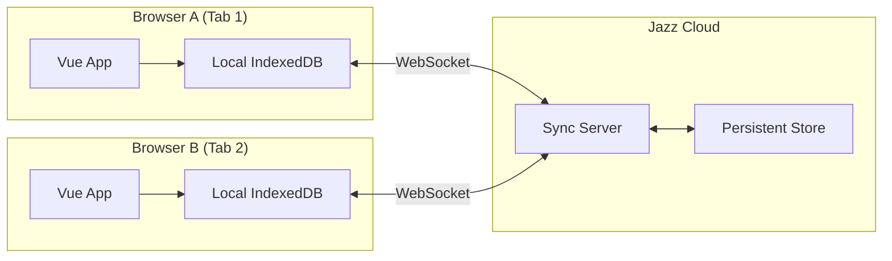
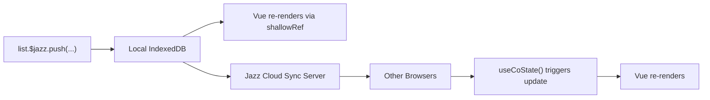

## TLDR

Build a real-time, offline-capable todo app with Jazz and Vue 3. Jazz replaces your entire backend with collaborative data structures called CoValues. Combined with `community-jazz-vue`, you get composables like `useCoState` that plug into Vue's reactivity system. The app syncs across tabs and devices, supports drag-and-drop with fractional indexing, and generates shareable URLs.

## Why Jazz Replaces Your Entire Backend

You want real-time collaboration, offline support, and shareable URLs. In a traditional stack, that means building a sync server, a conflict resolution strategy, a permissions layer, and an API. Jazz collapses all of that into collaborative data structures called CoValues.

Vue's `ref` keeps the virtual DOM in sync with the real DOM. CoValues extend that idea: they sync your data across devices and users, across network boundaries. You mutate data locally. Jazz handles the rest.

This post builds a complete Vue 3 app on top of Jazz. You can find the official Jazz documentation at [jazz.tools](https://jazz.tools/).

Combined with `community-jazz-vue`, a community-maintained Vue binding, you get composables like `useCoState` and a provider component that plug into Vue's reactivity system.

If you're new to local-first, start with the first post in this series:

For comparison, the same app built with Dexie.js and IndexedDB:

Anselm Eickhoff, the creator of Jazz, gave a workshop on local-first at VueConf 2025 where he live-coded with Jazz:

## Your First CoValue: A Synced Counter

Vue's `ref` keeps the virtual DOM in sync with the real DOM. You update a `ref`, Vue re-renders. That's reactive state within one browser tab. Jazz's `useCoState` extends that across devices, users, and network boundaries. You mutate locally, Jazz propagates the change to every connected peer.

The simplest CoValue is a single field:

```ts
import { co, z } from "jazz-tools";

const Counter = co.map({ count: z.number() });
```

That's one line of schema. Now subscribe to it in a Vue component:

```vue
<script setup lang="ts">
import { ref } from "vue";
import { useCoState } from "community-jazz-vue";
import { Counter } from "./schema";

// Create a counter and grab its ID
const counterId = ref<string | undefined>();
const newCounter = Counter.create({ count: 0 });
counterId.value = newCounter.$jazz.id;

// Subscribe — returns a reactive ref that updates on local and remote changes
const counter = useCoState(Counter, counterId);

function increment() {
  if (counter.value?.$isLoaded) {
    counter.value.$jazz.set("count", (counter.value.count ?? 0) + 1);
  }
}

function decrement() {
  if (counter.value?.$isLoaded) {
    counter.value.$jazz.set("count", Math.max(0, (counter.value.count ?? 0) - 1));
  }
}
</script>

<template>
  <div v-if="!counter?.$isLoaded">Loading...</div>
  <div v-else>
    <p>{{ counter.count }}</p>
    <button @click="decrement">−</button>
    <button @click="increment">+</button>
  </div>
</template>
```

1. `Counter.create({ count: 0 })` creates a new CoValue instance and persists it locally.
2. `useCoState(Counter, counterId)` subscribes to that CoValue. It returns a reactive `Ref` that starts unloaded, populates once available, and re-renders on every change. Same as Vue's `ref`, but across the network.
3. `$jazz.set("count", ...)` mutates the CoValue. No API call, no action dispatch. Jazz syncs the change to all connected peers.

This works for a single user. But there's a problem: **by default, CoValues are private**. Only the creator can read or write them. If you shared this counter's ID with another user, they'd get nothing. The CoValue is invisible to them.

### Making It Shareable with Groups

To let others access the counter, you need a **Group**. Groups are how Jazz controls who gets access and what they can do. Every CoValue has an owner: either an Account (private) or a Group (shared).

```ts
import { Group } from "jazz-tools";

const group = Group.create();
group.addMember("everyone", "writer");
const newCounter = Counter.create({ count: 0 }, { owner: group });
```

That's three lines. `Group.create()` makes a new permission group. `addMember("everyone", "writer")` grants public write access. The `"everyone"` keyword is a special shorthand that includes all users, even anonymous guests. Passing `{ owner: group }` to `Counter.create` assigns the counter to that group instead of the default private account.

Now anyone who knows the CoValue ID can read and write the same counter. No API keys, no auth server. Sharing the ID is all it takes.

Try it. Click the + button in one panel and watch the count update in the other. Both panels are independent Jazz clients syncing via Jazz Cloud:

> 
The `"everyone"` + `"writer"` combination is permissive, great for demos and public collaboration. For real apps, Jazz supports granular roles (`reader`, `writer`, `admin`) and per-user membership. We'll use the same pattern for the todo app below.

That's the entire model: define your data with `co.map`, subscribe with `useCoState`, mutate. But we glossed over something important. How does Jazz decide who can access a CoValue, and what stops someone from escalating their own permissions?

## How Jazz Permissions Work

The counter example used `addMember("everyone", "writer")` to make data publicly accessible.

Jazz defines a role hierarchy where each role includes the permissions of the roles below it:

When we create a Group and grant public write access, the permission structure looks like this:

So what stops a malicious user from upgrading their own role from `writer` to `admin`? Jazz enforces permissions cryptographically, in the data itself.

Every change to a CoValue is signed with the author's private key (Ed25519). When a peer receives a transaction, it verifies the signature and checks whether that account had permission to make that change. A writer trying to modify Group roles? The signature is valid, but the Group's internal rules reject it. Only admins can change roles. The transaction gets discarded.

The Jazz Cloud sync server can't tamper with your data. It relays signed transactions. If the server modified anything, the signatures wouldn't match and peers would reject it. Jazz also encrypts data with a shared read key (XSalsa20), so the server can't read what it's relaying.

> 
For more complex apps, Jazz supports granular permissions on nested CoValues. Each nested CoValue can have its own Group with different roles. A project board where managers can edit columns but clients can only read specific tasks. Groups can also be members of other groups, enabling cascading permission hierarchies.

Now for something more ambitious.

## What We're Building: A Real-Time Vue 3 Todo App

A todo list app that:

- Syncs in real-time across tabs and devices via Jazz Cloud
- Works offline with a toggle to simulate going on/off the network
- Supports drag-and-drop reordering via `useSortable`
- Shows a dynamic page title with the count of incomplete todos
- Generates a shareable URL so anyone with the link sees the same list
- Includes the Jazz Inspector for debugging CoValues in development

Try it out. Both todo apps below are independent Jazz clients, each running as a Vue component embedded in this page. Add a todo in one and watch it sync to the other via Jazz Cloud:

> 
Click the Jazz icon in the bottom-right corner to open the Jazz Inspector. You can copy any `co_z...` CoValue ID shown in the app UI, paste it into the inspector, and hit "Inspect CoValue" to see the raw data inside: its fields, current values, and sync status.

The high-level architecture:



We'll build it step by step.

## Project Setup

You'll need Node.js v20+ and a package manager (we'll use pnpm, but npm/yarn work too).

Start with a fresh Vue project (select TypeScript when prompted) and install the dependencies:

```bash
npm create vue@latest vue-jazz-todo
cd vue-jazz-todo

pnpm add jazz-tools community-jazz-vue @vueuse/core @vueuse/integrations sortablejs fractional-indexing tailwindcss @tailwindcss/vite
pnpm add -D @types/sortablejs vite-plugin-vue-devtools
```

Here's the project structure we'll end up with:

## Defining the Schema

Jazz uses Collaborative Values (CoValues) as its building blocks: reactive, synced data structures. If you've used Zod before, the schema API will feel familiar. Create `src/schema.ts`:

```ts
import { co, z } from "jazz-tools";

export const ToDo = co.map({ title: z.string(), completed: z.boolean(), order: z.string() });
export const ToDoList = co.list(ToDo);
```

Two lines. `co.map` defines a collaborative object with typed fields, `co.list` defines an ordered list. The `order` field stores a fractional index string for drag-and-drop (more on that in the reordering section). Jazz handles sync, persistence, and conflict resolution for you.

> 
Jazz's CoValues are built on [CRDTs](https://jakelazaroff.com/words/an-interactive-intro-to-crdts/) (Conflict-free Replicated Data Types). Unlike Dexie.js where the server handles conflicts, Jazz bakes conflict resolution into the data structures. You never have to think about it.

In practice, a `CoMap` tracks every change from every device. When Alice sets `completed: false` at 8:05 AM and Bob sets `completed: true` at 8:03 AM, the later timestamp wins. Step through the timeline to see how the resolved state changes as transactions arrive:

## Entry Point and Build Configuration

The entry point is standard Vue. Update `src/main.ts`:

```ts
import { createApp } from "vue";
import App from "./App.vue";
import "./assets/main.css";

createApp(App).mount("#app");
```

For Tailwind CSS v4, replace `src/assets/main.css` with a single import, no `tailwind.config.js` needed:

```css
@import "tailwindcss";
```

We also need to tell Vue about the Jazz Inspector custom element so Vue doesn't try to resolve it as a component. Update `vite.config.ts`:

```ts
import { fileURLToPath, URL } from 'node:url'
import { defineConfig } from 'vite'
import vue from '@vitejs/plugin-vue'
import vueDevTools from 'vite-plugin-vue-devtools'
import tailwindcss from '@tailwindcss/vite'

export default defineConfig({
  plugins: [
    vue({
      template: {
        compilerOptions: {
          isCustomElement: (tag) => tag === 'jazz-inspector',
        },
      },
    }),
    vueDevTools(),
    tailwindcss(),
  ],
  resolve: {
    alias: {
      '@': fileURLToPath(new URL('./src', import.meta.url))
    },
  },
})
```

The `isCustomElement` line matters because Jazz ships with a built-in inspector for browsing and debugging CoValues at runtime. It appears as a floating panel where you can click into any CoValue to see its current state, history, and sync status. Since the inspector is a Web Component (`<jazz-inspector />`), you need to tell Vue not to resolve it as a Vue component.

## Setting Up the Jazz Provider

Instead of manually creating a context manager, we use the `JazzVueProvider` component from `community-jazz-vue`. It handles context creation, cleanup, and provides Jazz to all child components via Vue's dependency injection.

Create `src/App.vue`:

```vue
<script setup lang="ts">
import { ref, computed } from "vue";
import { JazzVueProvider } from "community-jazz-vue";
import "jazz-tools/inspector/register-custom-element";
import TodoApp from "./TodoApp.vue";

const isOnline = ref(true);
const syncConfig = computed(() => ({
  peer: "wss://cloud.jazz.tools/?key=vue-jazz-todo-example" as const,
  when: isOnline.value ? ("always" as const) : ("never" as const),
}));
</script>

<template>
  <JazzVueProvider :sync="syncConfig">
    <TodoApp v-model:is-online="isOnline" />
    <jazz-inspector />
  </JazzVueProvider>
</template>
```

Two things worth understanding about this setup:

- `JazzVueProvider` wraps the entire app and takes a `sync` prop. It only renders children once the Jazz context is ready, so downstream components can safely assume Jazz is available. The sync config is reactive: the `computed` derives the config from `isOnline`. When the user toggles the switch, `when` flips between `"always"` and `"never"`, and Jazz switches between syncing and offline mode.
- `import "jazz-tools/inspector/register-custom-element"` registers the `<jazz-inspector>` Web Component as a side-effect import. The `isOnline` state lives here and is passed down via `v-model:is-online`, keeping the sync config and toggle UI separated.

## Building the Todo App

Now for the main component. Create `src/TodoApp.vue` and we'll build it piece by piece.

### Imports and Setup

```ts
import { ref, computed, useTemplateRef, watchEffect } from "vue";
import { co, Group } from "jazz-tools";
import { useCoState } from "community-jazz-vue";
import { useClipboard, useUrlSearchParams, useTitle, useFocus } from "@vueuse/core";
import { useSortable, removeNode, insertNodeAt } from "@vueuse/integrations/useSortable";
import { generateKeyBetween } from "fractional-indexing";
import { ToDo, ToDoList } from "./schema";

const isOnline = defineModel<boolean>("isOnline", { required: true });
const newTitle = ref("");
const { copy, copied } = useClipboard({ copiedDuring: 2000 });
```

We receive `isOnline` from the parent via `defineModel` and set up a ref for the input field plus VueUse's clipboard composable for the "Copy link" button.

### Routing via URL

```ts
const params = useUrlSearchParams("history");
const listId = ref<string | undefined>(params.id as string | undefined);

if (!listId.value) {
  const group = Group.create();
  group.addMember("everyone", "writer");
  const newList = ToDoList.create([], { owner: group });
  listId.value = newList.$jazz.id;
  params.id = newList.$jazz.id;
}
```

We use VueUse's `useUrlSearchParams("history")` instead of raw `URLSearchParams`. The `"history"` mode uses the History API (no page reload) and gives us a reactive object. If the URL has an `?id=` parameter, we subscribe to that existing list. Otherwise, we create a new list owned by a Group with public write access (the same pattern from the permissions section) so anyone with the link can read and write.

### Subscribing to the List

```ts
const todoList = useCoState(ToDoList, listId, {
  resolve: { $each: true },
});

const todos = computed(() => {
  const list = todoList.value;
  if (!list?.$isLoaded) return [];
  return [...list].sort((a, b) => (a.order < b.order ? -1 : a.order > b.order ? 1 : 0));
});
```

`useCoState` is the core composable from `community-jazz-vue`. It takes a CoValue schema, an ID (which can be a ref), and a resolve query. It returns a Vue `Ref` that starts as unloaded, populates once available, and re-renders on both local and remote changes.

The `resolve: { $each: true }` tells Jazz to deeply load each item in the list. Without it, you'd get the list but each ToDo entry would be an unresolved reference. Items are sorted by their `order` field rather than their position in the CoList.

If you're interested in how Vue composables like this are designed, I wrote about the patterns here:

[Vue Composables Style Guide: Lessons from VueUse's Codebase](/blog/vueuse_composables_style_guide)

### Dynamic Page Title

```ts
const pageTitle = useTitle("To Do");
watchEffect(() => {
  const count = todos.value.filter((t) => !t.completed).length;
  pageTitle.value = count > 0 ? `(${count}) To Do` : "To Do";
});
```

A small UX touch: the browser tab shows "(3) To Do" when there are 3 incomplete items.

### CRUD Operations

```ts
const inputEl = useTemplateRef<HTMLInputElement>("inputEl");
const { focused: inputFocused } = useFocus(inputEl);

function addTodo() {
  const list = todoList.value;
  const title = newTitle.value.trim();
  if (!title || !list?.$isLoaded) return;
  const sorted = todos.value;
  const lastOrder = sorted.length > 0 ? sorted[sorted.length - 1]!.order : null;
  const order = generateKeyBetween(lastOrder, null);
  list.$jazz.push({ title, completed: false, order });
  newTitle.value = "";
  inputFocused.value = true;
}

function toggleTodo(todo: co.loaded<typeof ToDo>) {
  todo.$jazz.set("completed", !todo.completed);
}

function deleteTodo(todo: co.loaded<typeof ToDo>) {
  const list = todoList.value;
  if (!list?.$isLoaded) return;
  const listIndex = [...list].findIndex((t) => t.$jazz.id === todo.$jazz.id);
  if (listIndex !== -1) list.$jazz.remove(listIndex);
}

const copyLink = () => copy(window.location.href);
```

Every loaded CoValue exposes a `$jazz` accessor for mutations: `$jazz.push()`, `$jazz.set()`, `$jazz.remove()`. These mutations apply locally and sync to all connected peers. No "save" button, no API call.

`addTodo` generates a fractional index via `generateKeyBetween(lastOrder, null)`, which creates a key that sorts after all existing items. `deleteTodo` finds the item by its CoValue ID instead of relying on the array index, since our `todos` computed is sorted by `order` and the display index won't match the `CoList` position.

### The Sync Lifecycle

The lifecycle of a mutation like `list.$jazz.push(...)`:



The mutation returns before the sync starts. Your UI updates first. When the data reaches other peers, their `useCoState` subscriptions fire and Vue re-renders on their end too.

## The TodoApp.vue Template

The complete template ties together the add form, sortable list, online toggle, and shareable link:

```vue
<template>
  <div class="min-h-screen bg-gray-950 flex items-start justify-center pt-16 px-4">
    <div class="w-full max-w-md">
      <!-- Header with online toggle -->
      <div class="flex items-center justify-between mb-8">
        <div class="flex items-center gap-2">
          <svg class="w-7 h-7 text-blue-500" viewBox="0 0 24 24" fill="currentColor">
            <path d="M12 3v10.55c-.59-.34-1.27-.55-2-.55C7.79 13 6 14.79 6 17s1.79 4 4 4 4-1.79 4-4V7h4V3h-6z"/>
          </svg>
          <span class="text-white text-xl font-semibold tracking-tight">jazz</span>
        </div>
        <div class="flex items-center gap-2">
          <span class="text-gray-300 text-sm">Online</span>
          <button
            @click="isOnline = !isOnline"
            :class="[
              'relative inline-flex h-6 w-11 items-center rounded-full transition-colors',
              isOnline ? 'bg-blue-600' : 'bg-gray-600',
            ]"
          >
            <span
              :class="[
                'inline-block h-4 w-4 rounded-full bg-white transition-transform',
                isOnline ? 'translate-x-6' : 'translate-x-1',
              ]"
            />
          </button>
        </div>
      </div>

      <!-- Card -->
      <div class="bg-gray-900 border border-gray-700 rounded-xl p-6">
        <h1 class="text-3xl font-bold text-white mb-6">To Do</h1>

        <div v-if="!todoList?.$isLoaded" class="text-gray-400 text-center py-8">
          Loading...
        </div>

        <template v-else>
          <form @submit.prevent="addTodo" class="mb-6 space-y-3">
            <input
              ref="inputEl"
              v-model="newTitle"
              placeholder="New task"
              class="w-full px-3 py-2 bg-gray-800 border border-gray-600 rounded-lg text-white placeholder-gray-500 focus:outline-none focus:ring-2 focus:ring-blue-500 focus:border-transparent"
            />
            <button
              type="submit"
              class="w-full px-4 py-2 bg-blue-600 text-white rounded-lg hover:bg-blue-700 transition-colors font-medium"
            >
              Add
            </button>
          </form>

          <ul ref="todoListEl" class="space-y-2">
            <li
              v-for="(todo, index) in todos"
              :key="todo.$jazz.id"
              class="group flex items-center gap-3 p-2 rounded-lg hover:bg-gray-800"
            >
              <span
                class="drag-handle cursor-grab active:cursor-grabbing text-gray-600 group-hover:text-gray-400 transition-colors select-none"
                title="Drag to reorder"
              >
                <svg class="w-4 h-4" viewBox="0 0 24 24" fill="currentColor">
                  <circle cx="9" cy="6" r="1.5" /><circle cx="15" cy="6" r="1.5" />
                  <circle cx="9" cy="12" r="1.5" /><circle cx="15" cy="12" r="1.5" />
                  <circle cx="9" cy="18" r="1.5" /><circle cx="15" cy="18" r="1.5" />
                </svg>
              </span>
              <input
                type="checkbox"
                :checked="todo.completed"
                @change="toggleTodo(todo)"
                class="h-4 w-4 rounded border-gray-600 bg-gray-800 text-blue-600 focus:ring-blue-500 focus:ring-offset-gray-900"
              />
              <span
                class="flex-1"
                :class="todo.completed ? 'line-through text-gray-500' : 'text-gray-200'"
              >
                {{ todo.title }}
              </span>
              <button
                @click="deleteTodo(todo)"
                class="opacity-0 group-hover:opacity-100 transition-opacity text-gray-500 hover:text-red-400 p-1"
                title="Delete"
              >
                <svg class="w-4 h-4" viewBox="0 0 24 24" fill="none" stroke="currentColor" stroke-width="2">
                  <path d="M18 6L6 18M6 6l12 12" />
                </svg>
              </button>
            </li>
          </ul>

          <p v-if="todos.length === 0" class="text-gray-500 text-center py-4">
            No todos yet. Add one above!
          </p>

          <div v-if="listId" class="mt-6 flex items-center gap-2">
            <p class="text-xs text-gray-500 break-all flex-1">
              List ID: {{ listId }}
            </p>
            <button
              @click="copyLink"
              class="shrink-0 px-3 py-1 text-xs rounded-md border transition-colors"
              :class="copied
                ? 'border-green-600 text-green-400'
                : 'border-gray-600 text-gray-400 hover:text-gray-200 hover:border-gray-500'"
            >
              {{ copied ? "Copied!" : "Copy link" }}
            </button>
          </div>
        </template>
      </div>
    </div>
  </div>
</template>
```

In the template, `:key="todo.$jazz.id"` gives Vue a stable, globally unique key for each item. The `ref="inputEl"` connects to `useFocus` so the input regains focus after adding a todo. `@change="toggleTodo(todo)"` shows how clean mutations are: no actions, no dispatching, no reducers.

## Drag-and-Drop Reordering

We use [`useSortable`](https://vueuse.org/integrations/useSortable/) from VueUse for drag-and-drop. The simplest approach would be to call `splice` on the `CoList`: remove the item from its old position, insert it at the new one. For a single user, that works fine.

### The Problem with `splice`

Jazz's `CoList` implements `splice` as a delete-plus-insert, not as an atomic move. That distinction matters as soon as two users are involved. If both users reorder the same item while offline, each one generates an independent delete-plus-insert. When they sync back up, the list CRDT sees two separate insert operations, and the item appears twice.

List CRDTs have no "move" operation. Only deletes and inserts. So we need a different strategy for ordering.

### Fractional Indexing

[Fractional indexing](https://www.npmjs.com/package/fractional-indexing) (by Rocicorp, based on [this Observable post](https://observablehq.com/@dgreensp/implementing-fractional-indexing) by David Greenspan) sidesteps the problem. Instead of moving an item in the list, you store an `order` field on each item and update only that field when reordering. When you move an item between positions A and C, `generateKeyBetween("a", "c")` returns a key like `"b"` that sorts between them. The rest of the list stays untouched.

Because `order` is a field on a `CoMap`, updates use last-writer-wins semantics. The worst case during a concurrent edit is that one user's reorder "wins." The item never duplicates.

### Implementation

The `useSortable` implementation:

```ts
const todoListEl = useTemplateRef<HTMLElement>("todoListEl");

useSortable(todoListEl, todos, {
  handle: ".drag-handle",
  animation: 150,
  onUpdate: (e) => {
    // Revert SortableJS DOM manipulation — let Vue re-render from data
    removeNode(e.item);
    insertNodeAt(e.from, e.item, e.oldIndex!);

    const list = todoList.value;
    if (!list?.$isLoaded || e.oldIndex == null || e.newIndex == null) return;

    const sorted = todos.value;
    const before = sorted[e.newIndex - 1]?.order ?? null;
    const after = sorted[e.newIndex + (e.newIndex > e.oldIndex ? 1 : 0)]?.order ?? null;
    const item = sorted[e.oldIndex];
    if (item) item.$jazz.set("order", generateKeyBetween(before, after));
  },
});
```

The `onUpdate` handler contains a subtle DOM revert pattern: SortableJS directly manipulates the DOM when the user drags an item, but our source of truth is the `order` field on each `CoMap`. So we first undo the DOM change, then update the `order` field. Vue's computed re-sorts and re-renders correctly.

The reorder syncs to all peers just like any other mutation. If you've worked with cross-tab state syncing before, you'll know how tricky this can be:

[Building a Pinia Plugin for Cross-Tab State Syncing](/blog/building-pinia-plugin-cross-tab-sync)

## Running It

```bash
pnpm dev
```

Open two browser tabs. Add a todo in one, watch it appear in the other. Toggle "Online" off, add more todos, toggle back on. They sync up. Copy the link, open it in an incognito window. Same list.

## Conclusion

The full project is four files of application code:

- `src/schema.ts` (4 lines): CoValue definitions
- `src/App.vue` (20 lines): Provider + inspector + online toggle
- `src/TodoApp.vue` (~80 lines script + ~125 lines template): The complete app
- `vite.config.ts` (26 lines): Build config with custom element support

Coming from the Dexie.js approach, the amount of code surprised me. Jazz eliminates the backend-sync-API stack. You define your data, mutate it locally, and it syncs.

Two things worth highlighting: fractional indexing for drag-and-drop avoids the duplicate-item problem that `CoList` splice-based reordering can cause during concurrent offline edits. Jazz Groups with `addMember("everyone", "writer")` make the shared URL accessible. Without this, CoValues are private to the creator.

Check out the [Jazz documentation](https://jazz.tools) for more, and the [community-jazz-vue package](https://www.npmjs.com/package/community-jazz-vue) ([source code](https://github.com/garden-co/jazz/tree/main/packages/community-jazz-vue/src)) for the full Vue API.

---

**Source code:** [github.com/alexanderop/vue-jazz-todo-example](https://github.com/alexanderop/vue-jazz-todo-example)
