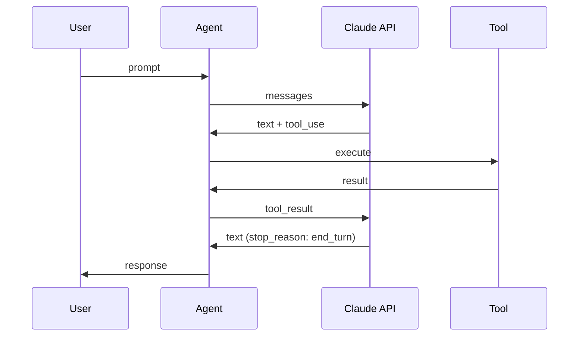
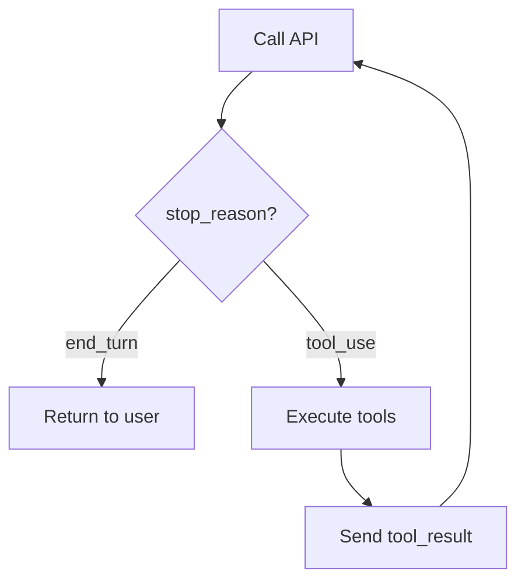

A practical guide to creating a minimal Claude-powered coding assistant in TypeScript. We'll start with a basic chat loop and progressively add tools until we have a fully functional coding agent.

---

## What We're Building

By the end of this tutorial, you'll have a working command-line coding agent that can read, write, and edit files, search your codebase, and execute shell commands. We'll call it **nanocode**—a stripped-down alternative to Claude Code that demonstrates the core concepts in about 400 lines.

**Prerequisites:** Basic TypeScript knowledge, [Bun](https://bun.sh) installed, and an Anthropic API key.

---

## Part 1: The Simplest Possible Agent

Let's start with just a chat loop—no tools, just conversation. If you're unfamiliar with how LLMs like Claude work under the hood, my post on [how ChatGPT works](/blog/how-chatgpt-works-for-dummies) covers the fundamentals of token prediction and generation.

### Basic Types

```typescript
type Message = {
  role: 'user' | 'assistant'
  content: string
}

type ApiResponse = {
  content: Array<{ type: 'text'; text: string }>
  stop_reason: string
}
```

### The API Client

```typescript
const API_URL = 'https://api.anthropic.com/v1/messages'
const MODEL = 'claude-sonnet-4-20250514'

async function callApi(messages: Message[]): Promise<ApiResponse> {
  const response = await fetch(API_URL, {
    method: 'POST',
    headers: {
      'Content-Type': 'application/json',
      'x-api-key': process.env.ANTHROPIC_API_KEY ?? '',
      'anthropic-version': '2023-06-01'
    },
    body: JSON.stringify({
      model: MODEL,
      max_tokens: 8192,
      system: 'You are a helpful coding assistant.',
      messages
    })
  })

  if (!response.ok) {
    throw new Error(`API error: ${response.status}`)
  }

  return response.json()
}
```

### The Chat Loop

```typescript
async function main() {
  const messages: Message[] = []

  while (true) {
    // Get user input
    process.stdout.write('You: ')
    const input = await new Promise<string>(resolve => {
      process.stdin.once('data', data => resolve(data.toString().trim()))
    })

    if (input === '/exit') break

    // Add user message and call API
    messages.push({ role: 'user', content: input })
    const response = await callApi(messages)

    // Extract and display response
    const text = response.content[0].text
    console.log(`\nAssistant: ${text}\n`)

    // Add assistant message to history
    messages.push({ role: 'assistant', content: text })
  }
}

main()
```

Run this with `bun run agent.ts` and you have a working chatbot. But it can't do anything—it can only talk. Let's fix that.

---

## Part 2: Adding Tool Support

Tools transform a chatbot into an agent. The key insight: Claude can request tool calls, and we execute them and send back results. This is the same pattern that powers [MCP (Model Context Protocol)](/blog/what-is-model-context-protocol-mcp)—a standardized way to connect AI models to external tools.

### Expanded Types

```typescript
// Claude can respond with text OR tool requests
type TextBlock = { type: 'text'; text: string }
type ToolUseBlock = {
  type: 'tool_use'
  id: string
  name: string
  input: Record<string, unknown>
}
type ContentBlock = TextBlock | ToolUseBlock

// We send back tool results
type ToolResultBlock = {
  type: 'tool_result'
  tool_use_id: string
  content: string
}

type Message = {
  role: 'user' | 'assistant'
  content: string | ContentBlock[] | ToolResultBlock[]
}

type ApiResponse = {
  content: ContentBlock[]
  stop_reason: string  // 'end_turn' or 'tool_use'
}
```

### Tool Definition Structure

Each tool needs three things: a description (so Claude knows when to use it), a schema (so Claude knows what arguments to pass), and an execute function:

```typescript
type Tool = {
  description: string
  schema: {
    type: 'object'
    properties: Record<string, { type: string; description?: string }>
    required: string[]
  }
  execute: (args: Record<string, unknown>) => Promise<string>
}

const tools: Map<string, Tool> = new Map()
```

### The Agentic Loop

Here's the core pattern. Instead of a simple request-response, we loop until Claude stops requesting tools:



```typescript
async function agentLoop(messages: Message[]): Promise<Message[]> {
  // Call the API with our tools
  const response = await callApi(messages, tools)

  // Show any text output
  for (const block of response.content) {
    if (block.type === 'text') {
      console.log(`\nAssistant: ${block.text}`)
    }
  }

  // Add assistant response to history
  messages.push({ role: 'assistant', content: response.content })

  // Find tool calls
  const toolCalls = response.content.filter(
    (b): b is ToolUseBlock => b.type === 'tool_use'
  )

  // If no tool calls, we're done
  if (toolCalls.length === 0) {
    return messages
  }

  // Execute each tool and collect results
  const results: ToolResultBlock[] = []
  for (const call of toolCalls) {
    console.log(`\n[Running ${call.name}...]`)
    const result = await runTool(call.name, call.input)
    console.log(`[Result: ${result.slice(0, 100)}${result.length > 100 ? '...' : ''}]`)

    results.push({
      type: 'tool_result',
      tool_use_id: call.id,
      content: result
    })
  }

  // Send results back and continue the loop
  messages.push({ role: 'user', content: results })
  return agentLoop(messages)
}

async function runTool(name: string, args: Record<string, unknown>): Promise<string> {
  const tool = tools.get(name)
  if (!tool) return `Error: unknown tool "${name}"`

  try {
    return await tool.execute(args)
  } catch (err) {
    return `Error: ${err instanceof Error ? err.message : String(err)}`
  }
}
```

Notice that errors are returned as strings, not thrown. This lets Claude see what went wrong and try something different.

The recursive structure is the key insight:



### Updated API Client

We need to pass tools to the API:

```typescript
async function callApi(messages: Message[], tools: Map<string, Tool>): Promise<ApiResponse> {
  const toolSchemas = Array.from(tools.entries()).map(([name, tool]) => ({
    name,
    description: tool.description,
    input_schema: tool.schema
  }))

  const response = await fetch(API_URL, {
    method: 'POST',
    headers: {
      'Content-Type': 'application/json',
      'x-api-key': process.env.ANTHROPIC_API_KEY ?? '',
      'anthropic-version': '2023-06-01'
    },
    body: JSON.stringify({
      model: MODEL,
      max_tokens: 8192,
      system: `Coding assistant. Working directory: ${process.cwd()}`,
      messages,
      tools: toolSchemas
    })
  })

  if (!response.ok) {
    throw new Error(`API error: ${response.status}`)
  }

  return response.json()
}
```

Now we have the infrastructure. But with no tools registered, Claude can't do anything yet. Let's add our first tool.

---

## Part 3: First Tool — Reading Files

The most essential capability: seeing what's in a file.

```typescript
tools.set('read', {
  description: 'Read the contents of a file. Returns the file with line numbers.',
  schema: {
    type: 'object',
    properties: {
      path: { type: 'string', description: 'Path to the file to read' },
      offset: { type: 'integer', description: 'Line number to start from (0-indexed)' },
      limit: { type: 'integer', description: 'Maximum number of lines to return' }
    },
    required: ['path']
  },
  execute: async (args) => {
    const path = args.path as string
    const text = await Bun.file(path).text()
    const lines = text.split('\n')

    const offset = (args.offset as number | undefined) ?? 0
    const limit = (args.limit as number | undefined) ?? lines.length

    return lines
      .slice(offset, offset + limit)
      .map((line, i) => `${(offset + i + 1).toString().padStart(4)}| ${line}`)
      .join('\n')
  }
})
```

**Why line numbers?** When Claude wants to edit a file later, it needs to reference specific locations. Line numbers make edits precise.

**Why offset and limit?** Large files can overflow Claude's context window. Pagination lets Claude read files in chunks.

Try it:

```
You: What's in package.json?
[Running read...]
[Result:    1| {
   2|   "name": "my-project",
...]
Assistant: This is a Node.js project called "my-project"...
```

Claude can now see your code. But it can't change anything yet.

---

## Part 4: Writing Files

Let's add the ability to create new files:

```typescript
tools.set('write', {
  description: 'Write content to a file. Creates the file if it does not exist, overwrites if it does.',
  schema: {
    type: 'object',
    properties: {
      path: { type: 'string', description: 'Path to write to' },
      content: { type: 'string', description: 'Content to write' }
    },
    required: ['path', 'content']
  },
  execute: async (args) => {
    const path = args.path as string
    const content = args.content as string
    await Bun.write(path, content)
    return 'ok'
  }
})
```

Simple and direct. Now Claude can create files:

```
You: Create a hello.ts file with a function that greets someone by name
[Running write...]
[Result: ok]
Assistant: I've created hello.ts with a greet function...
```

But there's a problem. If Claude wants to modify an existing file, it has to rewrite the entire thing. For large files, that's wasteful and error-prone. We need surgical edits.

---

## Part 5: Editing Files

This is the trickiest tool. We want Claude to replace specific text without rewriting everything:

```typescript
tools.set('edit', {
  description: 'Edit a file by replacing one string with another. The string to replace must be unique in the file unless all=true.',
  schema: {
    type: 'object',
    properties: {
      path: { type: 'string', description: 'Path to the file' },
      old: { type: 'string', description: 'Text to find and replace (must be unique)' },
      new: { type: 'string', description: 'Text to replace it with' },
      all: { type: 'boolean', description: 'Replace all occurrences instead of requiring uniqueness' }
    },
    required: ['path', 'old', 'new']
  },
  execute: async (args) => {
    const path = args.path as string
    const oldText = args.old as string
    const newText = args.new as string
    const replaceAll = (args.all as boolean) ?? false

    const content = await Bun.file(path).text()

    // Check if target exists
    if (!content.includes(oldText)) {
      return 'error: old string not found in file'
    }

    // Require uniqueness unless replacing all
    const occurrences = content.split(oldText).length - 1
    if (!replaceAll && occurrences > 1) {
      return `error: found ${occurrences} occurrences, must be unique (or use all=true)`
    }

    const updated = replaceAll
      ? content.replaceAll(oldText, newText)
      : content.replace(oldText, newText)

    await Bun.write(path, updated)
    return 'ok'
  }
})
```

**Why require uniqueness?** Without this check, Claude might accidentally replace the wrong occurrence. If a string appears multiple times, Claude needs to include more context to make it unique, or explicitly say "replace all."

**Why return errors as strings?** Claude can read the error and adjust. Maybe it needs to include more surrounding code to make the match unique.

```
You: In hello.ts, change the greeting from "Hello" to "Hey"
[Running read...]
[Running edit...]
[Result: ok]
Assistant: Done! I've updated the greeting...
```

Now Claude can make targeted edits. But to edit effectively, it needs to find things first.

---

## Part 6: Finding Files with Glob

When Claude doesn't know where something is, it needs to explore:

```typescript
tools.set('glob', {
  description: 'Find files matching a glob pattern. Returns paths sorted by modification time (newest first).',
  schema: {
    type: 'object',
    properties: {
      pattern: { type: 'string', description: 'Glob pattern like "**/*.ts" or "src/**/*.json"' },
      path: { type: 'string', description: 'Base directory to search from' }
    },
    required: ['pattern']
  },
  execute: async (args) => {
    const pattern = args.pattern as string
    const basePath = (args.path as string) ?? '.'

    const globber = new Bun.Glob(`${basePath}/${pattern}`.replace('//', '/'))
    const files: string[] = []

    for (const file of globber.scanSync('.')) {
      files.push(file)
    }

    // Sort by modification time, newest first
    const sorted = files
      .map(f => ({ path: f, mtime: Bun.file(f).lastModified }))
      .sort((a, b) => b.mtime - a.mtime)
      .map(f => f.path)

    return sorted.join('\n') || 'no matches'
  }
})
```

**Why sort by modification time?** The files you edited recently are usually the ones you care about. This helps Claude find relevant files faster.

```
You: What TypeScript files are in this project?
[Running glob...]
[Result: src/index.ts
src/utils.ts
tests/main.test.ts]
Assistant: I found 3 TypeScript files...
```

Glob finds files by name patterns. But what if Claude needs to find files by content?

---

## Part 7: Searching Content with Grep

Sometimes you need to find where something is used:

```typescript
tools.set('grep', {
  description: 'Search file contents using a regex pattern. Returns matching lines with file paths and line numbers.',
  schema: {
    type: 'object',
    properties: {
      pattern: { type: 'string', description: 'Regex pattern to search for' },
      path: { type: 'string', description: 'Directory to search in' }
    },
    required: ['pattern']
  },
  execute: async (args) => {
    const pattern = new RegExp(args.pattern as string)
    const basePath = (args.path as string) ?? '.'
    const matches: string[] = []

    const globber = new Bun.Glob(`${basePath}/**/*`)

    for (const filepath of globber.scanSync('.')) {
      try {
        const file = Bun.file(filepath)
        // Skip large files and binaries
        if ((await file.exists()) && file.size < 1_000_000) {
          const text = await file.text()
          text.split('\n').forEach((line, i) => {
            if (pattern.test(line) && matches.length < 50) {
              matches.push(`${filepath}:${i + 1}:${line}`)
            }
          })
        }
      } catch {
        // Skip unreadable files
      }
    }

    return matches.join('\n') || 'no matches'
  }
})
```

**Why limit to 50 matches?** Too many results overwhelm Claude's context. If there are more, Claude can narrow the search.

**Why skip large files?** Files over 1MB are usually binaries, logs, or generated code—not useful for searching.

```
You: Where is the database connection configured?
[Running grep...]
[Result: src/db.ts:15:const connection = createConnection({
config/database.json:3:  "host": "localhost"]
Assistant: The database connection is configured in two places...
```

Claude can now navigate your codebase. One more tool will make it truly powerful.

---

## Part 8: Running Shell Commands

For everything else, there's bash:

```typescript
tools.set('bash', {
  description: 'Execute a shell command and return the output.',
  schema: {
    type: 'object',
    properties: {
      command: { type: 'string', description: 'The command to run' }
    },
    required: ['command']
  },
  execute: async (args) => {
    const command = args.command as string
    const result = Bun.spawnSync(['sh', '-c', command], {
      timeout: 30_000  // 30 second timeout
    })

    const stdout = result.stdout.toString()
    const stderr = result.stderr.toString()

    return (stdout + stderr).trim() || '(no output)'
  }
})
```

**Why a timeout?** Runaway commands could hang forever. 30 seconds is enough for most operations.

**Why combine stdout and stderr?** Claude needs to see errors to understand what went wrong.

This tool is a force multiplier. Claude can now:

- Run tests: `bun test`
- Install dependencies: `bun add lodash`
- Check git status: `git status`
- Run linters: `eslint src/`
- Anything else you can do in a terminal

```
You: Run the tests and fix any failures
[Running bash...] (bun test)
[Result: FAIL src/utils.test.ts > parseConfig > handles empty input]
[Running read...]
[Running edit...]
[Running bash...] (bun test)
[Result: All tests passed]
Assistant: There was a failing test in parseConfig. The function wasn't handling empty input correctly. I've added a check for that case and all tests pass now.
```

---

## Part 9: Putting It All Together

Here's the complete main loop:

```typescript
async function main() {
  console.log(`nanocode | ${MODEL} | ${process.cwd()}\n`)

  const messages: Message[] = []

  while (true) {
    process.stdout.write('\n❯ ')
    const input = await new Promise<string>(resolve => {
      process.stdin.once('data', data => resolve(data.toString().trim()))
    })

    if (!input) continue
    if (input === '/exit') break
    if (input === '/clear') {
      messages.length = 0
      console.log('Cleared conversation history')
      continue
    }

    messages.push({ role: 'user', content: input })

    try {
      await agentLoop(messages)
    } catch (err) {
      console.error(`Error: ${err instanceof Error ? err.message : err}`)
    }
  }
}

main()
```

---

## The Complete Code

Save this as `nanocode.ts`:

```typescript
#!/usr/bin/env bun

// --- Types ---

type TextBlock = { type: 'text'; text: string }
type ToolUseBlock = { type: 'tool_use'; id: string; name: string; input: Record<string, unknown> }
type ContentBlock = TextBlock | ToolUseBlock
type ToolResultBlock = { type: 'tool_result'; tool_use_id: string; content: string }

type Message = {
  role: 'user' | 'assistant'
  content: string | ContentBlock[] | ToolResultBlock[]
}

type Tool = {
  description: string
  schema: { type: 'object'; properties: Record<string, any>; required: string[] }
  execute: (args: Record<string, unknown>) => Promise<string>
}

// --- Configuration ---

const API_URL = 'https://api.anthropic.com/v1/messages'
const MODEL = process.env.ANTHROPIC_MODEL ?? 'claude-sonnet-4-20250514'

// --- Tool Registry ---

const tools = new Map<string, Tool>()

tools.set('read', {
  description: 'Read file contents with line numbers',
  schema: {
    type: 'object',
    properties: {
      path: { type: 'string' },
      offset: { type: 'integer' },
      limit: { type: 'integer' }
    },
    required: ['path']
  },
  execute: async (args) => {
    const text = await Bun.file(args.path as string).text()
    const lines = text.split('\n')
    const offset = (args.offset as number) ?? 0
    const limit = (args.limit as number) ?? lines.length
    return lines.slice(offset, offset + limit)
      .map((line, i) => `${(offset + i + 1).toString().padStart(4)}| ${line}`)
      .join('\n')
  }
})

tools.set('write', {
  description: 'Write content to a file',
  schema: {
    type: 'object',
    properties: {
      path: { type: 'string' },
      content: { type: 'string' }
    },
    required: ['path', 'content']
  },
  execute: async (args) => {
    await Bun.write(args.path as string, args.content as string)
    return 'ok'
  }
})

tools.set('edit', {
  description: 'Replace text in a file (old must be unique unless all=true)',
  schema: {
    type: 'object',
    properties: {
      path: { type: 'string' },
      old: { type: 'string' },
      new: { type: 'string' },
      all: { type: 'boolean' }
    },
    required: ['path', 'old', 'new']
  },
  execute: async (args) => {
    const content = await Bun.file(args.path as string).text()
    const oldText = args.old as string
    if (!content.includes(oldText)) return 'error: old string not found'
    const count = content.split(oldText).length - 1
    if (!(args.all as boolean) && count > 1) {
      return `error: ${count} occurrences found, must be unique`
    }
    const updated = (args.all as boolean)
      ? content.replaceAll(oldText, args.new as string)
      : content.replace(oldText, args.new as string)
    await Bun.write(args.path as string, updated)
    return 'ok'
  }
})

tools.set('glob', {
  description: 'Find files by glob pattern, sorted by mtime',
  schema: {
    type: 'object',
    properties: {
      pattern: { type: 'string' },
      path: { type: 'string' }
    },
    required: ['pattern']
  },
  execute: async (args) => {
    const base = (args.path as string) ?? '.'
    const glob = new Bun.Glob(`${base}/${args.pattern}`.replace('//', '/'))
    const files = [...glob.scanSync('.')].map(f => ({
      path: f,
      mtime: Bun.file(f).lastModified
    }))
    return files.sort((a, b) => b.mtime - a.mtime).map(f => f.path).join('\n') || 'none'
  }
})

tools.set('grep', {
  description: 'Search files for regex pattern',
  schema: {
    type: 'object',
    properties: {
      pattern: { type: 'string' },
      path: { type: 'string' }
    },
    required: ['pattern']
  },
  execute: async (args) => {
    const regex = new RegExp(args.pattern as string)
    const base = (args.path as string) ?? '.'
    const matches: string[] = []
    for (const f of new Bun.Glob(`${base}/**/*`).scanSync('.')) {
      try {
        const file = Bun.file(f)
        if (await file.exists() && file.size < 1_000_000) {
          const text = await file.text()
          text.split('\n').forEach((line, i) => {
            if (regex.test(line) && matches.length < 50) {
              matches.push(`${f}:${i + 1}:${line}`)
            }
          })
        }
      } catch {}
    }
    return matches.join('\n') || 'none'
  }
})

tools.set('bash', {
  description: 'Run a shell command',
  schema: {
    type: 'object',
    properties: { command: { type: 'string' } },
    required: ['command']
  },
  execute: async (args) => {
    const result = Bun.spawnSync(['sh', '-c', args.command as string], { timeout: 30_000 })
    return (result.stdout.toString() + result.stderr.toString()).trim() || '(empty)'
  }
})

// --- API Client ---

async function callApi(messages: Message[]): Promise<{ content: ContentBlock[]; stop_reason: string }> {
  const response = await fetch(API_URL, {
    method: 'POST',
    headers: {
      'Content-Type': 'application/json',
      'x-api-key': process.env.ANTHROPIC_API_KEY ?? '',
      'anthropic-version': '2023-06-01'
    },
    body: JSON.stringify({
      model: MODEL,
      max_tokens: 8192,
      system: `Concise coding assistant. cwd: ${process.cwd()}`,
      messages,
      tools: [...tools.entries()].map(([name, t]) => ({
        name, description: t.description, input_schema: t.schema
      }))
    })
  })
  if (!response.ok) throw new Error(`API ${response.status}: ${await response.text()}`)
  return response.json()
}

// --- Agent Loop ---

async function agentLoop(messages: Message[]): Promise<void> {
  const response = await callApi(messages)

  for (const block of response.content) {
    if (block.type === 'text') console.log(`\n${block.text}`)
  }

  messages.push({ role: 'assistant', content: response.content })

  const toolCalls = response.content.filter((b): b is ToolUseBlock => b.type === 'tool_use')
  if (toolCalls.length === 0) return

  const results: ToolResultBlock[] = []
  for (const call of toolCalls) {
    const tool = tools.get(call.name)
    const result = tool ? await tool.execute(call.input) : `unknown tool: ${call.name}`
    console.log(`\n[${call.name}] ${result.slice(0, 80)}${result.length > 80 ? '...' : ''}`)
    results.push({ type: 'tool_result', tool_use_id: call.id, content: result })
  }

  messages.push({ role: 'user', content: results })
  return agentLoop(messages)
}

// --- Main ---

async function main() {
  console.log(`nanocode | ${MODEL} | ${process.cwd()}\n`)
  const messages: Message[] = []

  while (true) {
    process.stdout.write('\n❯ ')
    const input = await new Promise<string>(r => process.stdin.once('data', d => r(d.toString().trim())))
    if (!input) continue
    if (input === '/exit') break
    if (input === '/clear') { messages.length = 0; console.log('Cleared'); continue }

    messages.push({ role: 'user', content: input })
    try { await agentLoop(messages) }
    catch (e) { console.error(`Error: ${e}`) }
  }
}

main()
```

Run it:

```bash
export ANTHROPIC_API_KEY=sk-ant-...
bun nanocode.ts
```

---

## Key Takeaways

Building a coding agent comes down to three things:

1. **The agentic loop**: Call the API, execute tools, send results back, repeat until done
2. **Good tool design**: Clear descriptions, strict schemas, errors as return values
3. **The right primitives**: Read, write, edit, find, search, execute

The model decides which tools to use and in what order. Your job is to give it reliable tools and accurate feedback.

Start with this foundation, verify it works, then add complexity: streaming responses, confirmation prompts, better UI, more tools. That's how you build reliable AI agents.

If you want to see how these concepts scale to a production tool, check out my guide to [Claude Code's full feature stack](/blog/understanding-claude-code-full-stack)—which builds on these same primitives with skills, hooks, and subagents.
