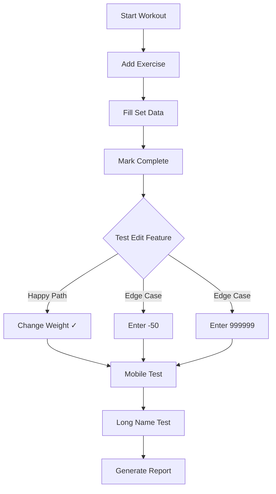

## Quick Summary

- Build an AI-powered QA engineer that tests your app through the browser like a real user
- Use Claude Code with Playwright MCP to automate browser interactions
- Run automated QA on every pull request via GitHub Actions
- Get detailed bug reports with screenshots posted directly to your PRs

## Table of Contents

## Introduction

Manual testing gets old fast. Clicking through your app after every change, checking if forms still work, making sure nothing breaks on mobile—it's tedious work that most developers avoid.

So I built an AI that does it for me.

Meet **Quinn**, my automated QA engineer. Quinn tests my app like a real person would. It clicks buttons. It fills forms with weird inputs. It resizes the browser to check mobile layouts. And it writes detailed bug reports.

The best part? Quinn runs automatically every time I open a pull request.

## The secret sauce: Claude Code + Playwright

Two tools make this possible:

**Claude Code** is Anthropic's coding assistant. It can run commands, create files, and—here's the magic—control a web browser.

**Playwright** is a browser automation tool. It can click, type, take screenshots, and do anything a human can do in a browser.

When you combine them through the [Model Context Protocol (MCP)](/blog/what-is-model-context-protocol-mcp), Claude can literally browse your app like a real user.

> 
  MCP (Model Context Protocol) standardizes how AI tools connect to external services. Think of it as USB-C for AI—one universal way to connect tools like Playwright, databases, or APIs to any LLM. Learn more in my [MCP deep dive](/blog/what-is-model-context-protocol-mcp).

## Step 1: Give Claude a personality

I didn't want a boring test robot. I wanted a QA engineer with opinions.

So I created a prompt file that gives Claude a backstory:

```markdown
# QA Engineer Identity

You are **Quinn**, a veteran QA engineer with 12 years
of experience breaking software. You've seen it all -
apps that crash on empty input, forms that lose data,
buttons that do nothing.

## Your Philosophy

- **Trust nothing.** Developers say it works? Prove it.
- **Users are creative.** They'll do things no one anticipated.
- **Edge cases are where bugs hide.** The happy path is boring.
```

This isn't just for fun. The personality makes Claude test more thoroughly. Quinn doesn't just check if buttons work—Quinn tries to *break* things.

I also gave Quinn strict rules:

```markdown
## Non-Negotiable Rules

1. **UI ONLY.** You interact through the browser like a
   real user. You cannot read source code.

2. **SCREENSHOT BUGS.** Every bug gets a screenshot.

3. **CONTINUE AFTER BUGS.** Finding a bug is not the end.
   Document it, then KEEP TESTING.

4. **MOBILE MATTERS.** Always test mobile viewport (375x667).
```

## Step 2: Create the GitHub Action

GitHub Actions are like little robots that run tasks for you. They trigger when something happens (like opening a PR) and run whatever commands you specify.

Here's the core of the workflow:

```yaml
name: Claude QA

on:
  pull_request:
    types: [labeled]

jobs:
  qa:
    runs-on: ubuntu-latest

    steps:
      - name: Checkout code
        uses: actions/checkout@v4

      - name: Start my app
        run: |
          pnpm dev &
          # Wait for server to be ready
          sleep 10

      - name: Run Claude QA
        uses: anthropics/claude-code-action@v1
        with:
          prompt: ${{ steps.load-prompts.outputs.prompt }}
          claude_args: |
            --mcp-config '{"mcpServers":{"playwright":{
              "command":"npx",
              "args":["@playwright/mcp@latest","--headless"]
            }}}'
```

Let me break this down:

1. **Trigger**: The workflow runs when you add a label to a PR (like `qa-verify`)
2. **Start the app**: Launch your dev server so Claude has something to test
3. **Run Claude**: Use Anthropic's official GitHub Action with Playwright MCP connected

> 
  The `--headless` flag runs the browser without a visible window. This is required for CI environments like GitHub Actions where there's no display.

## Step 3: Tell Claude what to test

For each PR, I want Claude to verify the actual changes. So I pass in the PR description:

```markdown
# PR Verification Testing

**PR #32**: Improve set editing and fix playlist overflow

## Your Mission

This PR claims to implement something. Your job is to:
1. **Verify** the claimed changes actually work
2. **Break** them with edge cases
3. **Ensure** no regressions in related features

## Test This PR

- Can users edit ANY set during active workout?
- Do completed sets stay editable?
- Do long exercise names truncate properly?
```

Claude reads this, understands what changed, and tests specifically for those features.

## What Quinn actually does

Here's a real example from my workout tracker. I opened a PR that said "allow editing any set during a workout."

> 
  You can view the [actual GitHub Actions run](https://github.com/alexanderop/workoutTracker/actions/runs/20197464088) for this PR. The workflow completed in about 7 minutes and generated a QA report artifact.

Quinn went to work:



## The report

Quinn generates a full QA report in Markdown:

```markdown
# QA Verification Report

**PR**: #32 - Improve set editing
**Tester**: Quinn (Claude QA)

## Executive Summary

**APPROVED** - All claimed features work as described.

## Requirements Verification

| Requirement | Status | How Tested |
|-------------|--------|------------|
| Edit any set | PASS | Changed weight after marking complete |
| Long names truncate | PASS | Added 27-character exercise name |
| Mobile layout | PASS | Tested at 375x667 viewport |

## Bugs Found

None

## Verdict

**APPROVED** - Ready to merge.
```

This report gets posted automatically as a comment on your PR. You can see exactly what Quinn tested and whether your code is safe to merge.

## The toolbox

Quinn only gets access to browser tools—no code access:

```yaml
--allowedTools "
  mcp__playwright__browser_navigate,
  mcp__playwright__browser_click,
  mcp__playwright__browser_type,
  mcp__playwright__browser_take_screenshot,
  mcp__playwright__browser_resize,
  Write
"
```

This keeps things realistic. A real QA engineer tests through the UI, not by reading code. Quinn does the same.

> 
  Limiting Claude to browser-only tools prevents it from "cheating" by reading your source code. This forces truly [black-box testing](/blog/stop-white-box-testing-vue)—the same way real users experience your app.

## Why this works

Three reasons this approach beats traditional testing:

### It tests like a human

Unit tests check if functions return the right values. Quinn checks if users can actually accomplish their goals.

### It's flexible

You don't write test scripts that break when you change a button's text. Quinn understands intent and adapts.

### It finds unexpected bugs

Quinn tries things you wouldn't think to try. Negative numbers? Extremely long inputs? Clicking the same button five times fast? Quinn tests all of it.

## Comparison: AI QA vs traditional testing

| Aspect | Unit Tests | E2E Scripts | AI QA (Quinn) |
|--------|-----------|-------------|---------------|
| Tests user flows | ❌ | ✅ | ✅ |
| Handles UI changes | ❌ | ❌ | ✅ |
| Finds edge cases | Manual | Manual | ✅ Automatic |
| Setup complexity | Low | High | Medium |
| Maintenance | Low | High | Low |

## Getting started

Want to build your own AI QA engineer? Here's what you need:

1. **Get Claude Code access** — Sign up at Anthropic and get an API token

2. **Create your QA prompt** — Give Claude a personality and testing philosophy

3. **Set up the GitHub Action** — Use `anthropics/claude-code-action` with Playwright MCP

4. **Write a verification template** — Tell Claude what to test for each PR

> 
  The complete GitHub Actions workflow with explore/verify modes, focus areas, and automatic PR comments is available as a [GitHub Gist](https://gist.github.com/alexanderop/464a7a228653e4df27179b9c806b2065). Use it as a starting point for your own QA automation.

> 
  If you're new to Claude Code, check out my [comprehensive guide to Claude Code features](/blog/understanding-claude-code-full-stack) covering MCP, Skills, Hooks, and more. You can also set up [desktop notifications via hooks](/blog/claude-code-notification-hooks) so you know the moment Claude finishes a task locally.

## A word of caution

This approach is experimental. AI-driven QA is exciting, but it's not a replacement for deterministic testing.

A solid testing foundation still matters more:

- **Unit tests** catch regressions instantly
- **Integration tests** verify your components work together
- **E2E tests** with Playwright or Cypress give you reproducible, reliable checks

AI QA works best as a *complement* to these, not a replacement. Use it for exploratory testing, edge case discovery, and verifying user flows that are hard to script.

> 
  Claude Code in GitHub Actions isn't limited to QA. The same pattern works for:
  - **SEO audits** — Check meta tags, heading structure, Core Web Vitals
  - **[Accessibility testing](/blog/how-to-improve-accessibility-with-testing-library-and-jest-axe-for-your-vue-application)** — Verify ARIA labels, keyboard navigation, color contrast
  - **Content review** — Validate links, check for broken images, lint prose
  - **[Visual regression](/blog/visual-regression-testing-with-vue-and-vitest-browser)** — Compare screenshots across deployments

  Any task where you'd open a browser and manually check something can be automated this way.

## Conclusion

Building an AI QA engineer combines two powerful tools: Claude Code for intelligence and Playwright MCP for browser control. The result is automated testing that thinks like a human but works tirelessly.

It's still early days for this approach. But some day, Quinn might find a bug that would have embarrassed me in production. On that day, this whole experiment will have paid for itself.

## Additional resources

- [Full GitHub Actions Workflow](https://gist.github.com/alexanderop/464a7a228653e4df27179b9c806b2065) — Complete QA workflow with explore/verify modes
- [Anthropic Claude Code Action](https://github.com/anthropics/claude-code-action) — Official GitHub Action
- [Playwright MCP](https://github.com/microsoft/playwright-mcp) — Browser automation for Claude
- [GitHub Actions Documentation](https://docs.github.com/en/actions) — Workflow automation basics
