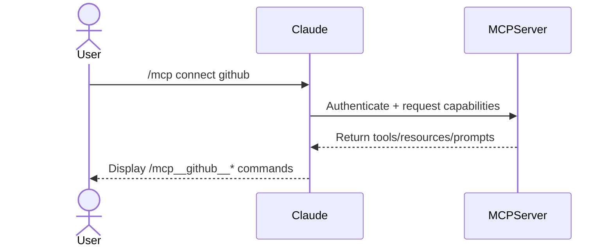
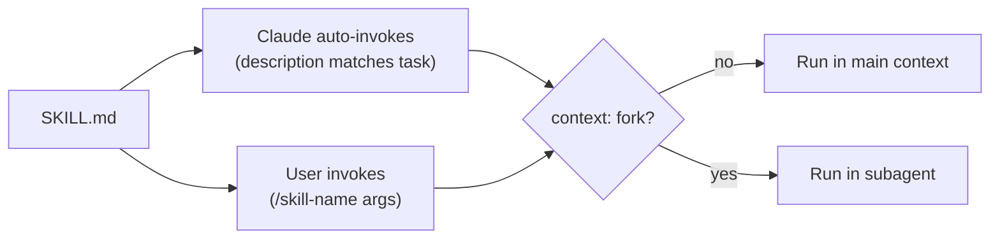
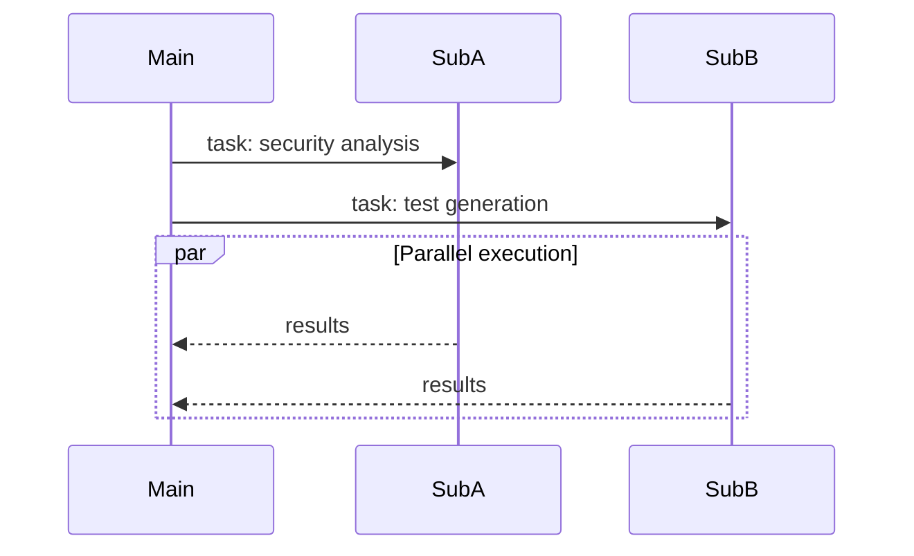
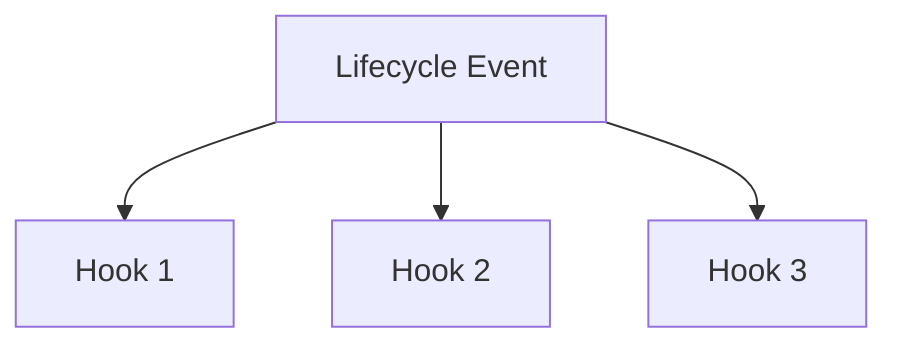
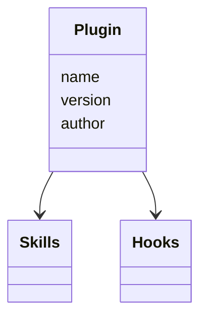

I used Claude Code for months as a glorified autocomplete. Quick edits. Boilerplate. The vibe coding tool.

Then I dug into MCP servers, slash commands, plugins, skills, hooks, subagents, and CLAUDE.md files. Claude Code is a framework for orchestrating AI agents, and most people use one or two features without seeing how they stack together. (It also runs in more places now: CLI, VS Code, JetBrains, a standalone desktop app, a web app at claude.ai/code, and iOS.)

This guide explains each concept **in the order they build on each other**, from external connections to automatic behaviors. (New to using LLMs for development? Start with my [overview of how I use LLMs](/blog/how-i-use-llms) for context.)

> Claude Code is, with hindsight, poorly named. It's not purely a coding tool: it's a tool for general computer automation. Anything you can achieve by typing commands into a computer is something that can now be automated by Claude Code. It's best described as a general agent. Skills make this a whole lot more obvious and explicit.
>
> — Simon Willison, [Claude Skills are awesome, maybe a bigger deal than MCP](https://simonwillison.net/2025/Oct/16/claude-skills/)

## The feature stack

1. **Model Context Protocol (MCP)** — the foundation for connecting external tools and data sources
2. **Claude Code core features** — project memory, skills, subagents, and hooks
3. **Plugins** — shareable packages that bundle skills, hooks, and metadata
4. **Skills** — the unified extensibility model (replaces the old command/skill split)
5. **Scheduled Tasks** — cloud-based triggers that run Claude on a cron schedule

---

## 1) Model Context Protocol (MCP) — connecting external systems



**What it is.** The [Model Context Protocol](/blog/what-is-model-context-protocol-mcp) connects Claude Code to external tools and data sources. Think universal adapter for GitHub, databases, APIs, and other systems.

**How it works.** Connect an MCP server, get access to its tools, resources, and prompts as slash commands:

```bash
# Install a server
claude mcp add playwright npx @playwright/mcp@latest

# Use it
/mcp__playwright__create-test [args]
```

> 
  Claude Code no longer loads full MCP tool schemas at startup. It loads tool names only, then fetches the full schema on demand via `ToolSearch`. If you run 50+ MCP tools, this cuts context overhead by an order of magnitude. Monitor remaining usage with `/context`.

**Remote servers.** The MCP spec added streamable HTTP transport (replacing SSE) and OAuth 2.1 with PKCE for authentication. You can now connect to remote MCP servers without running a local stdio process.

**The gotcha.** MCP servers expose their own tools. They don't inherit Claude's Read, Write, or Bash unless you provide them.

**Real-world example.** Want to see MCP in action? Check out how to [build an AI QA engineer with Playwright MCP](/blog/building_ai_qa_engineer_claude_code_playwright) that tests your app like a real user.

---

## 2) Claude Code core features

### 2.1) Project memory with `CLAUDE.md`

**What it is.** Markdown files Claude loads at startup. They give Claude memory about your project's conventions, architecture, and patterns.

**How it works.** Files merge hierarchically from enterprise → user (`~/.claude/CLAUDE.md`) → project (`./CLAUDE.md`). When you reference `@components/Button.vue`, Claude also reads CLAUDE.md from that directory and its parents.

Two additions since launch: `CLAUDE.local.md` files sit alongside `CLAUDE.md` but are gitignored, so you can add personal preferences without affecting the team. And `~/.claude/rules/` lets you split global instructions into separate files instead of one large `~/.claude/CLAUDE.md`.

**Example structure for a Vue app:**

When you work on `src/components/Button.vue`, Claude loads context from:

1. Enterprise CLAUDE.md (if configured)
2. User `~/.claude/CLAUDE.md` (personal preferences)
3. Project root `CLAUDE.md` (project-wide info)
4. `src/components/CLAUDE.md` (component-specific patterns)

**What goes in.** Common commands, coding standards, architectural patterns. Keep it concise — reference guide, not documentation. Need help creating your own? Check out this [CLAUDE.md creation guide](/prompts/claude/claude-create-md).

Here's my blog's CLAUDE.md:

````markdown
# CLAUDE.md

## Project Overview

Alexander Opalic's personal blog built on AstroPaper - Astro-based blog theme with TypeScript, React, TailwindCSS.

**Tech Stack**: Astro 5, TypeScript, React, TailwindCSS, Shiki, FuseJS, Playwright

## Development Commands

```bash
npm run dev              # Build + Pagefind + dev server (localhost:4321)
npm run build            # Production build
npm run lint             # ESLint for .astro, .ts, .tsx
---
```
````

### 2.2) Skills — the unified extensibility model



> 
  As of 2026, slash commands and skills are unified. Files in `.claude/commands/` still work, but the recommended approach is `.claude/skills/`. Every skill gets a `/slash-command` interface. Frontmatter controls whether Claude can auto-invoke it, whether users see it in the `/` menu, and whether it runs in a subagent.

**What they are.** Folders with a `SKILL.md` file (plus optional helper scripts) that define reusable behaviors. Frontmatter controls invocation: Claude can auto-invoke based on task context, you can trigger manually with `/skill-name`, or both.

**Key frontmatter fields:**

| Field | Purpose |
|-------|---------|
| `name` | Display name, becomes `/slash-command`. Lowercase, hyphens, max 64 chars. Defaults to directory name. |
| `description` | What the skill does. Claude uses this to decide auto-invocation. |
| `disable-model-invocation` | Set `true` to prevent Claude from auto-invoking (deploy, commit). |
| `user-invocable` | Set `false` to hide from `/` menu (background knowledge only). |
| `allowed-tools` | Tools Claude can use without asking. |
| `context` | Set to `fork` to run in an isolated subagent context. |
| `agent` | Subagent type when `context: fork` is set (`Explore`, `Plan`, `general-purpose`). |
| `model` | Model override (`haiku`, `sonnet`, `opus`). |
| `argument-hint` | Hint for expected arguments, shown in autocomplete. |
| `paths` | Glob patterns limiting when skill auto-loads (e.g., `src/**/*.ts`). |

**Argument substitution:** `$ARGUMENTS` for all args, `$0`, `$1`, `$2` for positional, `${CLAUDE_SKILL_DIR}` for the skill's directory.

**Key features:**

- `@file` syntax to inline code
- `allowed-tools: Bash(...)` for pre-execution scripts
- [
    XML-tagged prompts
  ](/blog/xml-tagged-prompts-framework-reliable-ai-responses)
  for reliable outputs

**When to use.** Repeatable workflows, domain expertise, automated enforcement. For a complete example of a git workflow built with skills, see my [Slash Commands Guide](/blog/claude-code-slash-commands-guide). Want to create your own? Use this [skill creation guide](/prompts/claude/claude-create-skill).

**Example: a deploy skill that only you can trigger:**

```markdown
---
name: deploy
description: Deploy the application to production
disable-model-invocation: true
allowed-tools: Bash(npm:*), Bash(git:*)
---

Deploy to production:
1. Run tests
2. Build
3. Push to deployment target
```

This creates `/deploy` that **only you can invoke** — Claude cannot auto-trigger it.

**Example: a skill that runs in a subagent:**

```markdown
---
name: deep-research
description: Research a topic thoroughly
context: fork
agent: Explore
allowed-tools: Read, Grep, Glob
---

Research $ARGUMENTS thoroughly. Find relevant files, read and analyze them, summarize findings.
```

When invoked, this spawns a separate context window. Your main conversation stays clean.

---

### 2.3) Subagents — specialized AI personalities for delegation



**What they are.** Pre-configured AI personalities with specific expertise areas. Each subagent has its own system prompt, allowed tools, and separate context window. Claude delegates to them when a task matches their expertise.

**Why use them.** Keep your main conversation clean while offloading specialized work. Each subagent works in its own context window, preventing token bloat. Run multiple subagents in parallel for concurrent analysis.

> 
  Subagents prevent "context poisoning" — when detailed implementation work
  clutters your main conversation. Use subagents for deep dives (security
  audits, test generation, refactoring) that would otherwise fill your primary
  context with noise.

**Example structure:**

```markdown
---
name: security-auditor
description: Analyzes code for security vulnerabilities
tools: Read, Grep, Bash # Controls what this personality can access
model: sonnet # Optional: sonnet, opus, haiku, inherit
---

You are a security-focused code auditor.

Identify vulnerabilities (XSS, SQL injection, CSRF, etc.)
Check dependencies and packages
Verify auth/authorization
Review data validation

Provide severity levels: Critical, High, Medium, Low.
Focus on OWASP Top 10.
```

The system prompt shapes the subagent's behavior. The `description` tells Claude when to delegate. The `tools` field restricts access.

**Best practices:** One expertise area per subagent. Minimal tool access. Use `haiku` for simple tasks, `sonnet` for complex analysis. Run independent work in parallel. Need a template? Check out this [subagent creation guide](/prompts/claude/claude-create-agent).

> 
  Set `isolation: worktree` to give a subagent its own git worktree. Each subagent works on an isolated copy of the repo, so multiple subagents can edit files in parallel without conflicts. The worktree is cleaned up if no changes are made; if the subagent produces changes, you get the worktree path and branch back.

Claude also ships three built-in subagent types you can use without writing a config file: **Explore** (fast, read-only, uses Haiku), **Plan** (research and architecture, read-only), and **General-purpose** (full tool access).

> 
  Subagents report to a parent. Agent teams are different: multiple Claude sessions that coordinate as peers, messaging each other and sharing tasks. Think of subagents as delegation and agent teams as collaboration.

---

### 2.4) Hooks — automatic event-driven actions



**What they are.** JSON-configured handlers in `.claude/settings.json` that trigger on lifecycle events. No manual invocation.

**Available events** (expanded from the original 7):

- **Tool lifecycle:** `PreToolUse`, `PostToolUse`
- **Session lifecycle:** `SessionStart`, `Stop`, `SubagentStart`, `SubagentStop`
- **Task lifecycle:** `TaskCreated`, `TaskCompleted`
- **Environment:** `CwdChanged`, `FileChanged`
- **Permissions:** `PermissionDenied`
- **Context:** `PreCompact`, `PostCompact`
- **User input:** `UserPromptSubmit`, `Notification`

**Handler types:**

- **Command:** Run shell commands (fast, predictable)
- **Prompt:** Let Claude decide with the LLM (flexible, context-aware)
- **HTTP:** POST JSON to an external service with auth headers
- **Async:** Add `"async": true` to run a hook in the background without blocking

PreToolUse hooks can also return `updatedInput` to modify tool arguments before execution.

**Example:** Auto-lint after file edits.

```json
{
  "hooks": {
    "PostToolUse": [
      {
        "matcher": "Edit|Write",
        "hooks": [
          {
            "type": "command",
            "command": "\"$CLAUDE_PROJECT_DIR\"/.claude/hooks/run-oxlint.sh"
          }
        ]
      }
    ]
  }
}
```

```bash
#!/usr/bin/env bash
file_path="$(jq -r '.tool_input.file_path // ""')"

if [[ "$file_path" =~ \.(js|jsx|ts|tsx|vue)$ ]]; then
  pnpm lint:fast
fi
```

**Common uses:** Auto-format after edits, require approval for bash commands, validate writes, initialize sessions. For a practical example, see how to [set up desktop notifications](/blog/claude-code-notification-hooks) when Claude needs your attention. Want to build your own? Use this [hook creation guide](/prompts/claude/claude-create-hook).

---

## 3) Plugins — shareable, packaged configurations



**What they are.** Distributable bundles of skills, hooks, and metadata. Share your setup with teammates or install pre-built configurations.

**Basic structure:**

**When to use.** Share team configurations, [package domain workflows](/blog/building-my-first-claude-code-plugin), distribute opinionated patterns, install community tooling.

**How it works.** Install a plugin, get instant access. Hooks combine, skills appear in autocomplete and activate on context match. Ready to build your own? Check out this [plugin creation guide](/prompts/claude/claude-create-plugin).

---

## 4) Skills deep dive — where to put them and how they compose

Skills were covered in section 2.2. This section focuses on discovery, placement, and composition patterns.

**How Claude discovers skills.** When you give Claude a task, it reviews available skill descriptions to find relevant ones. If a skill's `description` field matches the task context, Claude loads the full instructions. You don't need to invoke auto-invoked skills by name — Claude finds them.

> 
  Check out the [official Anthropic skills
  repository](https://github.com/anthropics/skills) for ready-to-use examples.

> Claude Skills are awesome, maybe a bigger deal than MCP
>
> — Simon Willison, [Claude Skills are awesome, maybe a bigger deal than MCP](https://simonwillison.net/2025/Oct/16/claude-skills/)

> 
Want rigorous, spec-driven development? Check out [obra's superpowers](https://github.com/obra/superpowers) — a comprehensive skills library that enforces systematic workflows.

**What it provides:** TDD workflows (RED-GREEN-REFACTOR), systematic debugging, code review processes, git worktree management, and brainstorming frameworks. Each skill pushes you toward verification-based development instead of "trust me, it works."

**The philosophy:** Test before implementation. Verify with evidence. Debug systematically through four phases. Plan before coding. No shortcuts.

**Use when:** You want Claude to be more disciplined about development practices, especially for production code.

**Where to put them:**

- `~/.claude/skills/` — personal, all projects
- `.claude/skills/` — project-specific
- Inside plugins — distributable

**Skills vs CLAUDE.md.** Skills are modular chunks of a CLAUDE.md file. Instead of reviewing a massive document on every task, Claude loads specific skill instructions only when the task matches. Better context efficiency, same automatic behavior.

**Controlling invocation with frontmatter.** The old command/skill split is gone. A single SKILL.md file with different frontmatter covers every use case:

| Pattern | Frontmatter | Result |
|---------|-------------|--------|
| Auto-invoke only (old "skill") | `description:` set, defaults | Claude invokes when relevant |
| Manual only (old "command") | `disable-model-invocation: true` | Only runs when you type `/name` |
| Background knowledge | `user-invocable: false` | Claude reads it, users don't see it in `/` menu |
| Both auto and manual | `description:` set, `user-invocable: true` | Claude can invoke it, you can too |
| Isolated execution | `context: fork`, `agent: Explore` | Runs in a subagent with its own context |

> 
Files in `.claude/commands/` still work and appear as `/slash-commands`. But new work should go in `.claude/skills/`. The skill format supports everything commands did, plus auto-invocation, `context: fork`, `paths` filtering, and model overrides.

---

## 5) Scheduled Tasks and Triggers — running Claude without you

**What they are.** Cloud-based cron jobs that run Claude Code on Anthropic's infrastructure. You define a schedule and a prompt; Claude executes it on the cron interval, with full access to your project.

**How to set one up.** Use the `/schedule` command or `claude trigger create` from the CLI. Define the cron expression and the task prompt:

```bash
claude trigger create --schedule "0 9 * * 1" --prompt "Review open PRs and summarize status"
```

**In-session polling.** For shorter-lived recurring work, `/loop 5m /your-command` runs a slash command on an interval inside your current session.

> 
  Channels let MCP servers push messages into a Claude session. You can connect Telegram, Discord, webhooks, or other services so external events trigger Claude's attention. Still a research preview as of April 2026.

---

## Putting it all together

How these features work together in practice:

1. **Memory (`CLAUDE.md`)** — Establish project context and conventions that Claude always knows
2. **Skills** — Define reusable behaviors, from manual workflows to auto-invoked expertise
3. **Subagents** — Offload parallel or isolated work to specialized agents
4. **Hooks** — Enforce rules and automate repetitive actions at key lifecycle events
5. **Plugins** — Package and distribute your entire setup to others
6. **MCP** — Connect external systems and make their capabilities available as commands
7. **Scheduled Tasks** — Run Claude on a cron schedule for recurring work

### Example: A Task-Based Development Workflow

A real-world workflow that combines multiple features:

**Setup phase:**

- `CLAUDE.md` contains implementation standards ("don't commit until I approve", "write tests first")
- `/load-context` skill (`disable-model-invocation: true`) initializes new chats with project state
- `update-documentation` skill (auto-invoked) activates after implementations
- Hook triggers linting after file edits

**Planning phase (Chat 1):**

- Main agent plans bug fix or new feature
- Outputs detailed task file with approach

**Implementation phase (Chat 2):**

- Start fresh context with `/load-context`
- Feed in the plan from Chat 1
- Implementation subagent executes the plan
- `update-documentation` skill updates docs on its own
- `/resolve-task` skill marks task complete

**Why this works:** Main context stays focused on planning. Heavy implementation work happens in isolated context. Skills handle documentation. Hooks enforce quality standards.

## Decision guide: choosing the right tool

> 
  🎉 **Huge thanks to [@thewiredbear](https://github.com/thewiredbear)** for creating the [Claude Code Driver](https://github.com/thewiredbear/Claude_Code_Driver/) repository! This community-driven collection includes examples, templates, and resources based on this guide. Perfect for getting started quickly or finding inspiration for your own Claude Code setup. Check it out and contribute your own patterns!

> 
  For a comprehensive visual guide to all Claude Code features, check out the
  [Awesome Claude Code Cheat Sheet](https://awesomeclaude.ai/code-cheatsheet).

> 
  Want model name, context usage, and cost displayed in your terminal? See how to [customize your Claude Code status line](/blog/customize_claude_code_status_line).

> 

- **Use `CLAUDE.md`** to define lasting project context — architecture, conventions, and patterns Claude should always remember. Best for: static knowledge that rarely changes.
- **Use [Skills](/blog/claude-code-slash-commands-guide)** for reusable workflows and expertise. Set `disable-model-invocation: true` for manual-only triggers, leave it off for auto-invocation, or use `context: fork` to run in a subagent. Best for: everything from deploy scripts to style enforcement.
- **Use Subagents** when you need parallel execution or want to isolate heavy computational work. Best for: preventing context pollution, specialized deep dives.
- **Use Hooks** to enforce standards or react to specific events. Best for: quality gates, actions tied to tool usage.
- **Use Plugins** to package and share complete configurations across teams or projects. Best for: team standardization, distributing opinionated setups.
- **Use MCP** to integrate external systems and expose their capabilities as native commands. Best for: connecting databases, APIs, third-party tools.
- **Use Scheduled Tasks** for recurring work that should run without you present. Best for: nightly audits, weekly reports, periodic maintenance.

### Feature comparison

> 
  This comparison table is adapted from [IndyDevDan's video "I finally CRACKED
  Claude Agent Skills"](https://www.youtube.com/watch?v=kFpLzCVLA20&t=1027s).

| Category            | Skill              | MCP     | Subagent | Trigger  |
| ------------------- | ------------------ | ------- | -------- | -------- |
| Triggered By        | Agent, Engineer, or Both | Both | Both | Schedule |
| Context Efficiency  | High               | Low     | High     | High     |
| Context Persistence | ✅                 | ✅      | ✅       | ❌       |
| Parallelizable      | ✅ (context: fork) | ❌      | ✅       | ✅       |
| Specializable       | ✅                 | ✅      | ✅       | ✅       |
| Sharable            | ✅                 | ✅      | ✅       | ❌       |
| Modularity          | High               | High    | Mid      | Low      |
| Tool Permissions    | ✅                 | ❌      | ✅       | ✅       |
| Can Use Prompts     | ✅                 | ✅      | ✅       | ✅       |
| Can Use Skills      | ✅                 | Kind of | ✅       | ✅       |
| Can Use MCP Servers | ✅                 | ✅      | ✅       | ✅       |
| Can Use Subagents   | ✅                 | ✅      | ✅       | ✅       |

### Real-world examples

| Use Case                                               | Best Tool     | Why                                                  |
| ------------------------------------------------------ | ------------- | ---------------------------------------------------- |
| "Always use Pinia for state management in Vue apps"    | `CLAUDE.md`   | Persistent context that applies to all conversations |
| Generate standardized commit messages                  | Skill (`disable-model-invocation: true`) | Explicit action you trigger when ready to commit |
| Check Jira tickets and analyze security simultaneously | Subagents     | Parallel execution with isolated contexts            |
| Run linter after every file edit                       | Hook          | Automatic reaction to lifecycle event                |
| Share your team's Vue testing patterns                 | Plugin        | Distributable package with commands + skills         |
| Query PostgreSQL database for reports                  | MCP           | External system integration                          |
| [Run automated SEO audits with browser testing](/blog/how-i-use-claude-code-for-doing-seo-audits) | MCP | External system integration |
| Detect style guide violations during any edit          | Skill         | Automatic behavior based on task context             |
| Create React components from templates                 | Skill (`disable-model-invocation: true`) | Manual workflow with repeatable structure |
| "Never use `any` type in TypeScript"                   | Hook          | Automatic enforcement after code changes             |
| Auto-format code on save                               | Hook          | Event-driven automation                              |
| Connect to GitHub for issue management                 | MCP           | External API integration                             |
| Run comprehensive test suite in parallel               | Subagent      | Isolated, resource-intensive work                    |
| Deploy to staging environment                          | Skill (`disable-model-invocation: true`) | Manual trigger with safeguards |
| [Enforce TDD workflow automatically](/blog/custom-tdd-workflow-claude-code-vue) | Skill | Context-aware automatic behavior |
| Initialize new projects with team standards            | Plugin        | Shareable, complete configuration                    |
| Run nightly dependency audit                           | Trigger       | Recurring task on a cron schedule                    |
| Summarize open PRs every Monday morning                | Trigger       | Scheduled report without manual invocation           |
