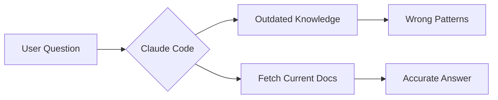
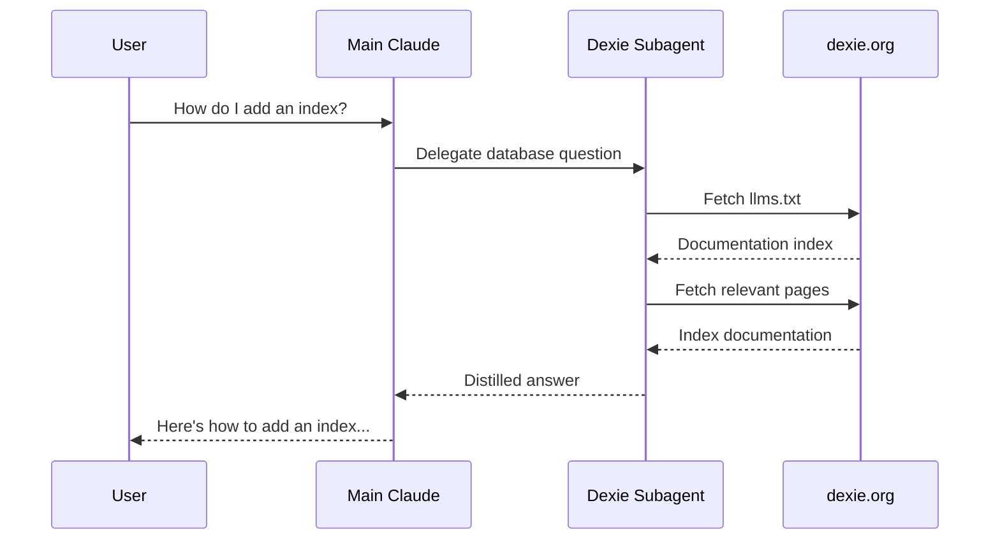

## Quick Summary

This post covers:

- **CLAUDE.md**: Always-loaded project context and instructions
- **Slash commands**: Prompts you invoke with `/command` in the terminal
- **Subagents**: Specialists with their own context window for delegated tasks
- **Skills**: Rich, auto-discovered capabilities with supporting files (not manually runnable via `/...`)
- Key insight: **subagents keep your main context clean**—in plan mode, Claude Code will typically delegate repo scanning to an `Explore`-style subagent so your main thread doesn’t balloon

## Table of Contents

## Introduction

Claude Code gives you multiple ways to “teach” it project context or automate workflows, but it’s not always obvious when to use which.

I’ll solve the **same problem four different ways** so the trade-offs are concrete. Spoiler: for doc-fetching, **subagents win** because they keep your main context clean.

> 
This post assumes familiarity with Claude Code basics. For a broader overview of all features—including MCP, hooks, and plugins—see my [comprehensive guide to Claude Code's feature stack](/blog/understanding-claude-code-full-stack). If you want to automate responses to Claude Code events (like getting [desktop notifications when tasks finish](/blog/claude-code-notification-hooks)), check out the hooks guide.

---

## The Problem

Claude Code doesn’t have up-to-date training data for every library, so it can’t reliably “remember” what a docs site says today.

**The specific problem**: I’m building a workout tracking app with [Dexie.js](https://dexie.org) (IndexedDB wrapper). Claude keeps suggesting outdated patterns and misses things like `liveQuery()`.

Claude Code itself has a mechanism to fetch its own documentation. We need to do the same for our specialized libraries.



Let’s solve it with all four tools, then compare.

---

## 1. CLAUDE.md: Always-On Project Memory

### What It Is

A markdown file that's **automatically loaded** every time you start Claude Code. Think of it as your project's "memory card."

> **CLAUDE.md**: Persistent project instructions that Claude reads at the start of every conversation.

### Where It Lives

### Nested CLAUDE.md Files

Claude Code also discovers **nested CLAUDE.md files** in subdirectories. When Claude reads files from a directory containing its own `CLAUDE.md`, that file gets added to the context automatically.

This is useful for directory-specific instructions:

- `tests/CLAUDE.md` — testing conventions, preferred mocking patterns
- `src/db/CLAUDE.md` — database-specific patterns and constraints
- `src/components/CLAUDE.md` — component architecture guidelines

The nested file is only loaded when Claude actually accesses files in that directory, keeping your main context lean until you need that specialized knowledge.

### The Dexie.js Solution

```markdown
# CLAUDE.md

## Database

We use Dexie.js for IndexedDB. Before implementing any database code:

1. Fetch the docs index from https://dexie.org/llms.txt
2. Use `liveQuery()` for reactive data binding
3. Follow the repository pattern in `src/db/`
4. Always handle `ConstraintError` for duplicate keys
```

### What Happens
Every conversation starts with Claude knowing “fetch Dexie docs before writing database code.”

The catch is **context drift**: in long sessions, the model can gradually deprioritize earlier system-level instructions in favor of the most recent conversation history.

### Trade-offs

| ✅ Pros                            | ❌ Cons                                          |
| ---------------------------------- | ------------------------------------------------ |
| Zero effort—always loaded          | **Context Drift**: Claude forgets instructions as sessions get longer |
| Team-shared via git                | No dedicated context window—competes with your conversation |
| Simple to maintain                 | No enforcement—Claude decides whether to follow  |

---

## 2. Slash Commands: Simple Skills You Invoke

### What It Is

A saved prompt you invoke by typing `/command-name`. Like a macro or keyboard shortcut for prompts.

Slash commands can be invoked explicitly (you type `/command`) and can also be auto-invoked by Claude when the command’s `description` matches the task.

Slash commands can also **orchestrate other behavior**: you can spell out in the command itself that it should spin up a subagent (or a specific subagent), call out a particular skill/workflow, and generally “pipeline” the work (e.g., research → codebase scan → write a doc) instead of trying to do everything in one shot.

The main difference vs skills is **packaging + UX**: slash commands are single-file entries with great terminal `/...` discovery/autocomplete; skills are usually directories with supporting files (patterns, templates, scripts).

> 
Want a full walkthrough? See my [slash commands guide](/blog/claude-code-slash-commands-guide).

### Where It Lives

### The Dexie.js Solution

```markdown
---
description: Get Dexie.js guidance with current documentation
allowed-tools: Read, Grep, Glob, WebFetch
---

First, fetch the documentation index from https://dexie.org/llms.txt

Then, based on the user's question, fetch the relevant documentation pages.

Finally, answer the following question using the current documentation:

$ARGUMENTS
```

### Manual Orchestration Example (Research)

If you want a slash command that **explicitly launches multiple subagents in parallel** and then produces an artifact (like a research note in `docs/research/`), you can encode that directly in the command definition.

````markdown
---
description: Research a problem using web search, documentation, and codebase exploration
allowed-tools: Task, WebSearch, WebFetch, Grep, Glob, Read, Write, Bash
---

# Research: $ARGUMENTS

Research the following problem or question:

> **$ARGUMENTS**

## Instructions

Conduct thorough research like a senior developer. Launch multiple subagents in parallel to gather information from different sources.

### Step 1: Launch Parallel Research Agents

Use the Task tool to spawn these subagents **in parallel** (all in a single message):

1. **Web Documentation Agent** (subagent_type: general-purpose)
  - Search official documentation for the topic
  - Find best practices and recommended patterns
  - Locate relevant GitHub issues or discussions

2. **Stack Overflow Agent** (subagent_type: general-purpose)
  - Search Stack Overflow for similar problems and solutions
  - Find highly-voted and accepted answers
  - Note common pitfalls and gotchas

3. **Codebase Explorer Agent** (subagent_type: Explore)
  - Search the codebase for related patterns
  - Find existing solutions to similar problems
  - Identify relevant files, functions, or components

### Step 2: Create Research Document

After all agents complete, create a markdown file at `docs/research/<topic-slug>.md`.

Generate the filename from the research topic:
- Convert to lowercase
- Replace spaces with hyphens
- Remove special characters
- Add today's date as prefix: `YYYY-MM-DD-<topic-slug>.md`

Example: "Vue 3 Suspense" → `docs/research/2024-12-06-vue-3-suspense.md`

First, create the research folder if it doesn't exist:
```bash
mkdir -p docs/research
```

### Step 3: Write the Research Document

Structure the document with these sections:

```markdown
# Research: <Topic>

**Date:** <YYYY-MM-DD>
**Status:** Complete

## Problem Statement

<Describe the problem and why it matters>

## Key Findings

<Summarize the most relevant solutions and approaches>

## Codebase Patterns

<Document how the current codebase handles similar cases>

## Recommended Approach

<Provide your recommendation based on all research>

## Sources

- [Source Title](URL) - Brief description
- [Source Title](URL) - Brief description
```

### Guidelines

- Prioritize official documentation over blog posts
- Prefer solutions that match existing codebase patterns
- Note version-specific considerations (Vue 3, TypeScript, etc.)
- Flag conflicting information across sources
- Write concise, actionable content
- Use active voice throughout the document

### Step 4: Confirm Completion

After writing the file, output the file path so the user can find it later.
````

### How You Use It

```bash
/dexie-help how do I create a compound index?
```

### What Happens

Claude fetches the docs, finds the relevant pages, and answers your question—triggered explicitly.

### Trade-offs

| ✅ Pros                                | ❌ Cons                                       |
| -------------------------------------- | --------------------------------------------- |
| You control exactly when it runs       | Must remember to type `/dexie-help`           |
| Can pass arguments for specific questions | One-shot—doesn't persist knowledge across messages |
| Simple single-file setup               | Auto-triggering depends on `description` match |

---

## 3. Subagents: Specialists with Their Own Context

### What It Is

A specialized AI "persona" with its own context window. Claude **delegates entire tasks** to it and gets results back.

Because fetching the Dexie docs involves reading multiple pages and creates a lot of context noise, keeping this inside a subagent prevents your main chat from hitting context limits.

> **Subagent**: An isolated Claude instance that works on a task independently and returns only the results to your main conversation.

> 
Even when the task is “just exploration,” subagents are a great default because they let Claude do **lots of reading/searching** without dumping everything into your main thread.

This is especially useful in **plan mode**: Claude Code will typically kick off an `Explore`-style subagent to scan the repo and return a distilled map of relevant files/patterns, so your main conversation stays focused and doesn’t blow up.

Claude Code also supports **async agents**: fire one off, let it cook while you keep working, then it comes back with its updates when it’s done. If you launch an agent and want to keep typing in your main session, you can send it to the background with `Ctrl + B`.

> 
Claude Code’s own system prompt includes a built-in “documentation lookup” workflow that uses a subagent:

> -> Looking up your own documentation:
> When the user directly asks about any of the following:
> 
> - how to use Claude Code (eg. "can Claude Code do...", "does Claude Code have...")
> - what you're able to do as Claude Code in second person (eg. "are you able...", "can you do...")
> - about how they might do something with Claude Code (eg. "how do I...", "how can I...")
> - how to use a specific Claude Code feature (eg. implement a hook, write a skill, or install an MCP server)
> - how to use the Claude Agent SDK, or asks you to write code that uses the Claude Agent SDK
> 
> Use the Task tool with subagent_type='claude-code-guide' to get accurate information from the official Claude Code and Claude Agent SDK documentation.

Source: https://github.com/marckrenn/cc-mvp-prompts/blob/main/cc-prompt.md

### Where It Lives

### The Dexie.js Solution

```markdown
---
name: dexie-db-specialist
description: Use this agent when the task involves Dexie.js or IndexedDB in any way - implementing, modifying, querying, reviewing, or improving database code. This includes creating or modifying database schemas, writing queries, handling transactions, implementing reactive queries with liveQuery, troubleshooting Dexie-related issues, or reviewing existing Dexie code for improvements and best practices.\n\nExamples:\n\n<example>\nContext: User asks about improving their Dexie.js code.\nuser: "What can I improve on this codebase when it comes to Dexie?"\nassistant: "I'll use the dexie-db-specialist agent to review your Dexie.js implementation against current best practices."\n<commentary>\nSince the user is asking about Dexie.js improvements, use the dexie-db-specialist agent to fetch the latest documentation and review the existing code for optimization opportunities, missing features, and best practice violations.\n</commentary>\n</example>\n\n<example>\nContext: User needs to add a new table to the database.\nuser: "I need to add a new 'goals' table to track workout goals"\nassistant: "I'll use the dexie-db-specialist agent to implement this correctly."\n<commentary>\nSince the user needs to modify the Dexie database schema, use the dexie-db-specialist agent to first fetch the latest Dexie.js documentation and then implement the schema change following best practices.\n</commentary>\n</example>\n\n<example>\nContext: User is asking about Dexie query patterns.\nuser: "How do I query exercises by multiple muscle groups in Dexie?"\nassistant: "Let me use the dexie-db-specialist agent to provide an accurate answer based on the current Dexie.js documentation."\n<commentary>\nSince the user is asking about Dexie.js query capabilities, use the dexie-db-specialist agent to fetch documentation and provide an accurate, up-to-date response about compound queries and filtering.\n</commentary>\n</example>\n\n<example>\nContext: User encounters a Dexie-related error.\nuser: "I'm getting 'ConstraintError' when trying to add a workout"\nassistant: "I'll consult the dexie-db-specialist agent to diagnose this database constraint issue."\n<commentary>\nSince this is a Dexie.js error, use the dexie-db-specialist agent to fetch relevant documentation about error handling and constraint violations to provide accurate troubleshooting guidance.\n</commentary>\n</example>\n\n<example>\nContext: User needs to implement a reactive query.\nuser: "The workout list should update automatically when new workouts are added"\nassistant: "I'll use the dexie-db-specialist agent to implement reactive queries with liveQuery."\n<commentary>\nSince reactive data binding with Dexie requires liveQuery, use the dexie-db-specialist agent to fetch the latest documentation on liveQuery and useLiveQuery patterns for Vue integration.\n</commentary>\n</example>
model: opus
color: orange
---

You are an expert Dexie.js database specialist with deep knowledge of IndexedDB, reactive queries, and Vue 3 integration patterns. Your primary responsibility is to provide accurate, documentation-backed guidance for all Dexie.js implementations.

## Critical First Step

**Before answering ANY Dexie.js question or implementing ANY Dexie-related code, you MUST:**

1. Fetch the documentation index from `https://dexie.org/llms.txt` to understand the available documentation structure
2. Based on the task at hand, fetch the relevant documentation pages to ensure your guidance is accurate and up-to-date
3. Only then proceed with implementation or answering questions

This is non-negotiable. Dexie.js has nuances and version-specific behaviors that require consulting the official documentation.

## Your Expertise Covers

- **Schema Design**: Table definitions, indexes (simple, compound, multi-entry), primary keys, version migrations
- **CRUD Operations**: add(), put(), update(), delete(), bulkAdd(), bulkPut()
- **Querying**: where(), filter(), equals(), between(), anyOf(), startsWithIgnoreCase(), compound queries
- **Reactive Queries**: liveQuery() for real-time updates, integration with Vue's reactivity system
- **Transactions**: Transaction scopes, nested transactions, error handling within transactions
- **Relationships**: Foreign keys, table relationships, populating related data
- **Performance**: Indexing strategies, query optimization, bulk operations
- **Error Handling**: Dexie-specific errors (ConstraintError, AbortError, etc.)

## Project Context

You are working within a Vue 3 PWA workout tracker that uses:
- **Dexie.js** with IndexedDB for offline-first data persistence
- **TypeScript** with strict mode
- **Repository pattern** in `src/db/` for database access abstraction
- **Pinia stores** that consume repositories

When implementing, ensure your code:
1. Follows the existing repository pattern in `src/db/`
2. Uses TypeScript interfaces for table schemas
3. Integrates properly with Vue 3 reactivity (useLiveQuery from @vueuse/rxjs or similar)
4. Handles errors gracefully with proper typing

## Documentation Fetching Strategy

When fetching from `https://dexie.org/llms.txt`:
1. Parse the sitemap to identify relevant documentation pages
2. Fetch specific pages based on the task (e.g., for queries, fetch the WhereClause and Collection docs)
3. Cross-reference multiple pages when dealing with complex topics

Common documentation sections to reference:
- `/docs/Table/Table` - Core table operations
- `/docs/WhereClause/WhereClause` - Query building
- `/docs/Collection/Collection` - Result set operations
- `/docs/liveQuery()` - Reactive queries
- `/docs/Dexie/Dexie` - Database instance configuration
- `/docs/Version/Version` - Schema migrations

## Response Format

When providing implementations:
1. **Cite the documentation** you consulted
2. **Explain the approach** before showing code
3. **Provide TypeScript code** that follows project conventions
4. **Include error handling** appropriate to the operation
5. **Note any caveats** or version-specific behaviors

## Quality Assurance

- Always verify your suggestions against the fetched documentation
- If documentation is unclear or unavailable, explicitly state this and provide your best guidance with appropriate caveats
- When multiple approaches exist, explain trade-offs
- Consider IndexedDB limitations (no full-text search, storage limits, etc.)

Remember: Your value is in providing documentation-verified, accurate Dexie.js guidance. Never guess about API specifics—always fetch and verify first.

```

### What Happens

When you ask about Dexie, Claude automatically recognizes this as a database task and delegates to the specialist. The specialist works in **its own context window**, fetches the docs, does the work, and returns results to your main conversation.



### Trade-offs

| ✅ Pros                                         | ❌ Cons                                      |
| ----------------------------------------------- | -------------------------------------------- |
| Auto-delegated when task matches                | Heavier—launches a separate agent            |
| **Separate context window**—doesn't clutter main | Results come back as a summary, not live     |
| Can use different model (e.g., opus for complex) | You can't interact with the agent directly   |
| Can restrict tools for security                 | More complex to set up                       |

---

## 4. Skills: Rich Capabilities with Auto-Discovery

### What It Is

A structured capability with optional supporting files that Claude **discovers automatically** and uses within your main conversation.

Unlike simple slash commands, skills can include multiple files: reference documentation, scripts, templates, and utilities.

### Where It Lives

### How Claude Sees Skills
Claude decides whether to invoke a skill largely based on its `description`.

You can also ask Claude Code something like:

```markdown
> “tell me me exactly how this looks for you <available_skills> ?”
```

When it answers, you’ll often see structured blocks that look like `<available_skills>` (and typically a separate block for slash commands, e.g. `<available_commands>`).

```xml
<available_skills>
  <skill>
    <name>dexie-expert</name>
    <description>
      Dexie.js database guidance. Use when working with
      IndexedDB, schemas, queries, liveQuery...
    </description>
  </skill>
</available_skills>
```

Here’s an abbreviated example of what the `<available_skills>` section can look like (truncated with `...`):

```xml
<available_skills>
  <skill>
    <name>skill-creator</name>
    <description>
      Guide for creating effective skills. Use when you want to create or update a skill.
      ...
    </description>
    <location>user</location>
  </skill>

  <skill>
    <name>c4-architecture</name>
    <description>
      Generate architecture documentation using C4 model Mermaid diagrams.
      ...
    </description>
    <location>user</location>
  </skill>

  <skill>
    <name>vue-composables</name>
    <description>
      Write high-quality Vue 3 composables following established patterns and best practices.
      ...
    </description>
    <location>managed</location>
  </skill>

  ...
</available_skills>
```

### The Dexie.js Solution

```markdown
---
name: dexie-expert
description: Dexie.js database guidance. Use when working with IndexedDB, schemas, queries, liveQuery, or database migrations.
allowed-tools: Read, Grep, Glob, WebFetch
---

# Dexie.js Expert

When the user needs help with Dexie.js or IndexedDB:

1. Fetch https://dexie.org/llms.txt
2. Fetch only the relevant pages for the task
3. Apply the guidance to this repo’s patterns
```

### A Minimal “Does This Even Work?” Skill

If you just want to verify that **a Skill can spin up subagents to do work** (via the `Task` tool), here’s a deliberately dumb smoke test you can copy/paste.

```markdown
---
name: subagent-smoke-test
description: Smoke test for Claude Code subagents. Use when the user wants to verify that spawning a subagent via the Task tool works in this repo.
---

# Subagent Smoke Test

This skill exists purely to verify that subagents work end-to-end.

## What to do

1. Spin up a subagent using the **Task** tool.
   - Use `subagent_type: general-purpose`.
   - Give it a simple, read-only task:
     - Read `package.json` and summarize the key scripts.
     - Read `astro.config.ts` and summarize major integrations.
     - Use Glob (or equivalent) to list the top-level folders.

2. Wait for the subagent to finish.

3. Return a short report to the user:
   - `Subagent status: success` (or `failed`)
   - A 3–6 bullet summary of what it found
   - If it failed, include the most likely fix (e.g. tool permissions, Task tool disabled).

## Suggested Task prompt

Use something like this as the Task payload:

- “You are a helper subagent. Do a quick, read-only scan of this repo.
  - Read `package.json` and summarize the main scripts.
  - Read `astro.config.ts` and summarize key integrations.
  - Glob the repo root and list the top-level folders.
  Return a concise report.”
```

### What Happens
Skills are **auto-discovered** and typically get applied when Claude decides they match the current task. They run **in your main conversation**, so you can iterate live.

If you need a manual, predictable trigger from the terminal, package the workflow as a **slash command** (since `/...` is for commands).

### Trade-offs

| ✅ Pros                                          | ❌ Cons                                        |
| ------------------------------------------------ | ---------------------------------------------- |
| Auto-discovered based on description             | Shares main context window space               |
| Works in main conversation—live interaction      | Claude decides when to trigger (may not fire)  |
| Can include reference files, scripts, templates  | More setup than slash commands                 |
| Deep, reusable workflow packaging                | Not manually invokable via `/...` in the terminal |
| Feels like enhanced Claude, not a separate tool  |                                                |

> 
In practice, the difference is mostly **UX + packaging**:

- **Slash commands** are what you can run manually from the terminal via `/command`.
- **Skills** are structured, auto-discovered capabilities (often a directory of supporting files) that Claude may apply when relevant.

---

### When to use what

| Pick this | When | Why |
|---|---|---|
| **CLAUDE.md** | You want Claude to *always* start with project rules/context | Auto-loaded on startup; shared via git |
| **Slash command** | You want an explicit one-shot workflow you run on demand | Discoverable via `/...`, can take arguments |
| **Subagent** | The task is research-heavy (lots of reading/searching/synthesis) | Uses a separate context window; returns a distilled result |
| **Skill** | You want a rich workflow that Claude can auto-apply when it recognizes the task | Packaged capability (often with supporting files) |

### How they relate

| Mechanism | Runs in main conversation | Separate context window | Can spawn subagents | Can use skills | Manually runnable via `/...` |
|---|---:|---:|---:|---:|---:|
| **CLAUDE.md** | ✅ | ❌ | ❌ | ❌ | ❌ |
| **Slash command** | ✅ | ❌ | ✅ (by instructing `Task`) | ✅ (indirectly; Claude may apply skills) | ✅ |
| **Skill** | ✅ | ❌ | ✅ (if `Task` is allowed) | ✅ (Claude may apply multiple skills) | ❌ |
| **Subagent** | ❌ | ✅ | ⚠️ Possible (depends on allowed tools, e.g. `Bash(claude:*)`) | ✅ (if configured via `skills:`) | ⚠️ Usually delegated |

## Conclusion

- Use **subagents** (especially `Explore` in plan mode) to keep your main context small and focused.
- Use **slash commands** when you want an explicit, repeatable terminal entry point.
- Use **skills** when you want Claude to auto-apply a richer workflow (often with supporting files).
- Use **CLAUDE.md** for short, always-true project conventions and standards.

