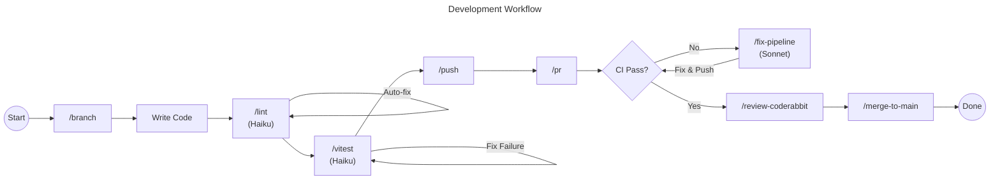

I was wasting time. Every commit message, every branch name, every PR description. I typed the same things over and over.
Then I discovered Slash Commands in Claude Code. Now I type `/commit` and it writes the message for me. `/branch "add dark mode"` and it creates `feat/add-dark-mode`. `/pr` and it generates a full PR description from my commits.
This post shows you how to build the same workflow. I'll cover how Slash Commands work, then we'll build a complete system that automates your entire git lifecycle.

> 
Slash Commands are just one piece of the Claude Code puzzle. For the full picture—including MCP, hooks, subagents, and skills—see my [comprehensive guide to Claude Code's feature stack](/blog/understanding-claude-code-full-stack).

> 
You need Git and the GitHub CLI (`gh`). Install `gh` with `brew install gh` on macOS or check [cli.github.com](https://cli.github.com). Run `gh auth login` to authenticate.

Without `gh`, commands like `/pr` and `/fix-pipeline` will not work.

## Two things you need to know

Before we build the workflow, you need to understand two features.

### Bash command execution

Write `!git status` inside a command file. Claude runs the command first, captures the output, and injects it into the prompt. The AI sees the result before it starts thinking.

This is how `/commit` knows what you changed. It runs `!git diff` automatically. See the [official documentation](https://docs.anthropic.com/en/docs/claude-code/slash-commands#bash-command-execution) for more details.

### Model selection

You don't need a powerful model to fix a missing semicolon.
Claude Code lets you pick the model in the frontmatter:

- `sonnet` — for complex reasoning (default)
- `haiku` — fast and cheap

Add `model: haiku` and commands run almost instantly.

## Command structure

Slash commands are Markdown files stored in `.claude/commands/` (project-level) or `~/.claude/commands/` (personal). The filename becomes the command name: `commit.md` becomes `/commit`.

Here is a complete example:

```markdown
---
description: Create a git commit with a conventional message
allowed-tools: Bash(git add:*), Bash(git commit:*)
argument-hint: [message]
model: haiku
---

# Commit Changes

<git_diff>
!`git diff --cached`
</git_diff>

Create a commit message following Conventional Commits.
If $ARGUMENTS is provided, use it as the commit message.
```

### Frontmatter options

| Option | Purpose | Default |
|--------|---------|---------|
| `description` | Brief description shown in `/help` | First line of prompt |
| `allowed-tools` | Tools the command can use | Inherits from conversation |
| `model` | Model to use (`sonnet`, `haiku`, or full model ID) | Inherits from conversation |
| `argument-hint` | Shows expected arguments in autocomplete | None |

### Arguments

Use `$ARGUMENTS` to capture everything passed to the command:

```markdown
Create a branch named: $ARGUMENTS
```

For multiple arguments, use positional parameters `$1`, `$2`, etc:

```markdown
---
argument-hint: [pr-number] [priority]
---

Review PR #$1 with priority $2.
```

### File references

Include file contents with the `@` prefix:

```markdown
Review the implementation in @src/utils/helpers.js
```

## The workflow

I replaced my manual git rituals with custom commands. They live in `.claude/commands/`. Here is how I drive a feature from start to merge.



### /branch — start a task

I type `/branch "implement dark mode toggle"` and Claude checks out main, pulls latest, and creates `feat/dark-mode-toggle`. No more thinking about naming conventions.

### /lint — fix before commit

I type `/lint`. It runs the linter with auto-fix, and if errors remain, Claude fixes them. Uses Haiku for speed—runs in about 20 seconds.

### /vitest — run unit tests

I type `/vitest`. It runs the test suite and fixes any failures. The prompt tells Claude to fix the code, not the test—implementation should match expected behavior.

### /commit — save your work

I type `/commit`. Claude analyzes the diff, generates a Conventional Commit message, and commits. It looks at recent commits to match your project's style.

### /push — commit and push in one step

I type `/push`. It stages everything, generates a commit message, commits, and pushes. My most-used command—one word and the code is on GitHub.

### /fix-pipeline — fix failing CI tests

I type `/fix-pipeline`. It fetches the failed logs via `gh`, analyzes the error, and fixes it. Uses Sonnet because debugging requires reasoning. The prompt includes guardrails—Claude must read the actual error before proposing fixes.

### /pr — create a pull request

I type `/pr`. It analyzes all commits on the branch, generates a PR title and description, and opens it via `gh pr create`. Checks if a PR already exists first.

### /review-coderabbit — address review comments

I type `/review-coderabbit`. It fetches CodeRabbit's comments via GraphQL, verifies each suggestion against the codebase, implements valid fixes or pushes back with reasoning, and resolves every thread. AI reviewers aren't always right—the prompt ensures Claude verifies before acting.

### /merge-to-main — finish the task

I type `/merge-to-main`. It squash merges the PR, deletes the branch, and pulls main. Done.

## Summary

By moving your process into `.claude/commands/`, you are building a system.

- Bash command execution injects real-time context
- Model selection balances speed vs reasoning
- The workflow automates branching, linting, committing, CI debugging, PRs, and merging

Define the process once. Claude executes it every time.

Want to extend Claude Code even further? Connect external tools via [MCP (Model Context Protocol)](/blog/what-is-model-context-protocol-mcp) or package your commands into a [shareable plugin](/blog/building-my-first-claude-code-plugin).

I don't think about naming conventions, commit messages, or PR descriptions anymore. The commands handle it.

> 
You can skip the interactive prompt entirely with `claude -p`. Add aliases to your `.zshrc` or `.bashrc`:

```bash
alias clint="claude -p '/lint'"
alias cpush="claude -p '/push'"
alias ccommit="claude -p '/commit'"
alias cbranch="claude -p '/branch'"
```

Now `clint` runs the lint command without opening the interactive session. The `-p` flag passes the prompt directly—Claude executes and exits. Two steps become one keystroke.

