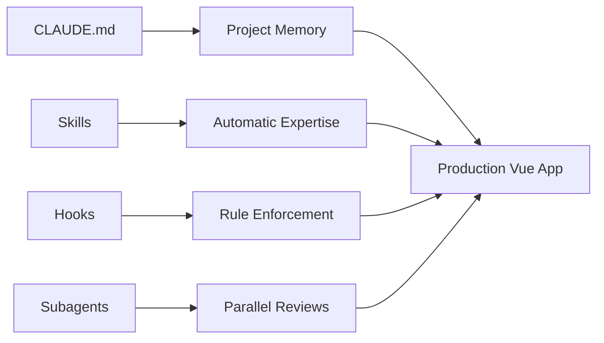
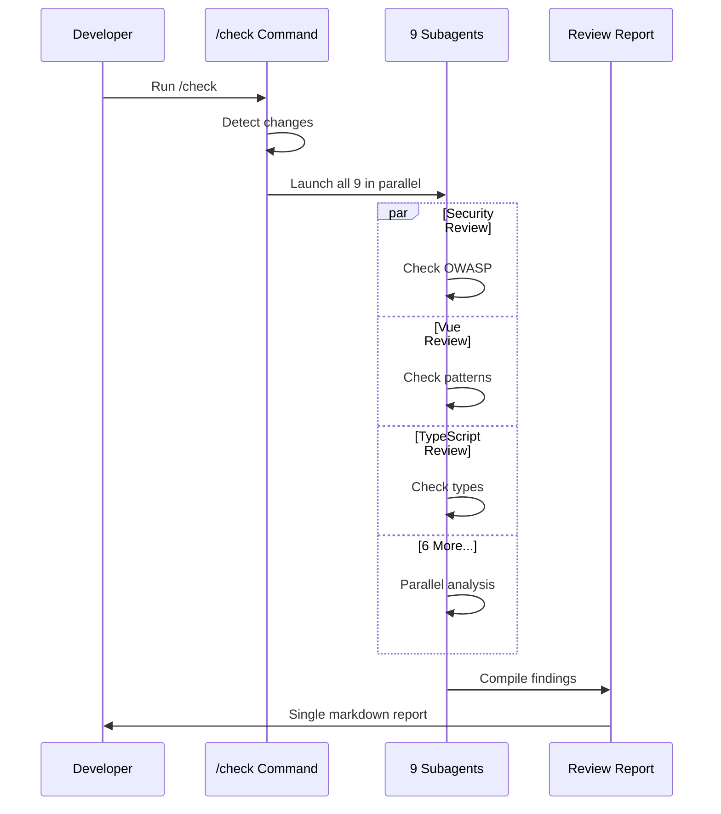
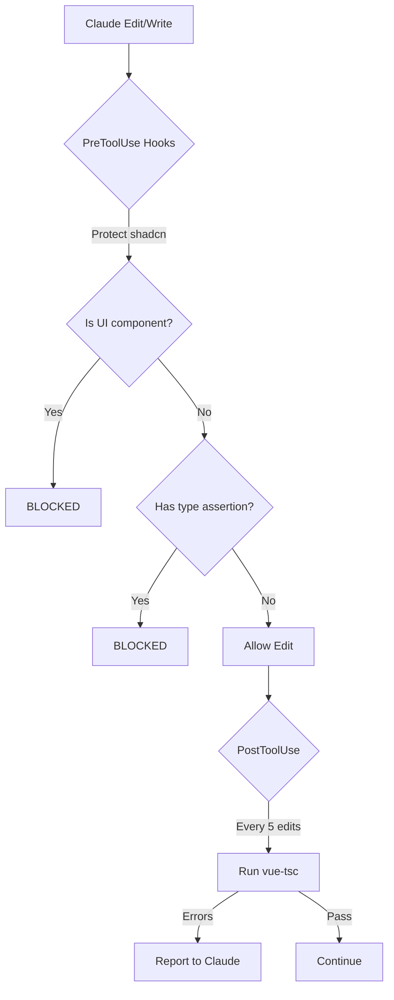
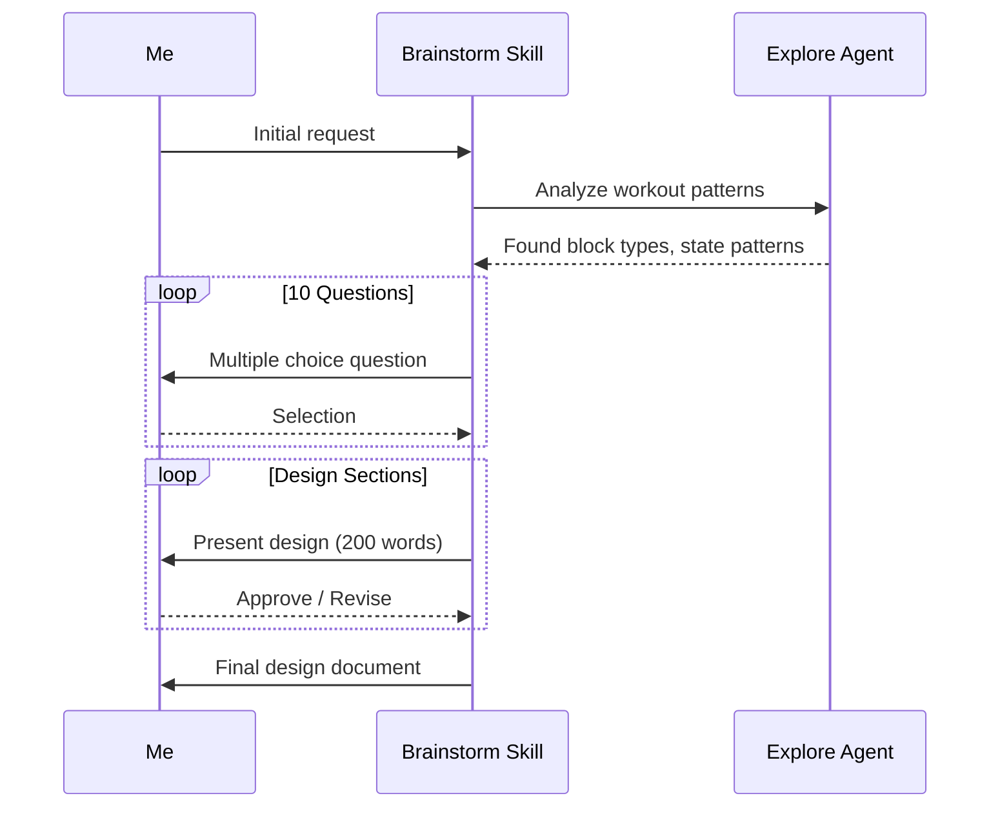

## Quick Summary

This post covers how I configured Claude Code for a Vue 3 workout tracker PWA:

- CLAUDE.md files give Claude persistent memory about Vue patterns and architecture
- Skills automatically activate for composables, testing, and database patterns
- Subagents run 9 parallel code reviews (security, accessibility, TypeScript, Vue patterns)
- Hooks enforce rules: protect shadcn components, block type assertions, run typecheck
- Slash commands automate PR creation, code review, and CI pipeline fixes

## Table of Contents

## Introduction

I was building a workout tracker PWA in Vue 3. Week one: basic vibe coding. Week two: I discovered skills. Week three: I had 9 AI agents reviewing my code in parallel.

Most developers use Claude Code for quick edits and generating boilerplate. The "vibe coding" tool everyone talks about. Then I actually explored what it could do. [MCP servers](/blog/what-is-model-context-protocol-mcp). Slash commands. Skills. Hooks. Subagents. CLAUDE.md files.

Claude Code isn't just a coding assistant. It's a framework for orchestrating AI agents. It speeds up Vue development in ways I've never seen before.

This guide walks through how I configured Claude Code to build a production Vue 3 PWA. You'll see real examples from my codebase, not abstract concepts.



---

## What I Built

A **Vue 3.5+ Progressive Web App** for tracking strength training and CrossFit workouts.

| Layer | Technology |
|-------|------------|
| Frontend | Vue 3.5+, TypeScript (strict mode), Tailwind CSS |
| State | Pinia stores + singleton refs |
| Database | Dexie (IndexedDB wrapper) with [Repository pattern](https://martinfowler.com/eaaCatalog/repository.html) |
| Testing | Vitest with Playwright browser mode |
| UI Components | shadcn-vue (reka-ui based) |

**Key features**: Block-based workout builder (strength, AMRAP, EMOM, Tabata, For Time), exercise library, workout templates, benchmarks with PR tracking, rest timers, and retroactive workout logging.

The codebase follows **Bulletproof feature-based architecture** with ESLint-enforced dependency rules: Views can import Features, Features can only import Shared. Cross-feature imports are forbidden. For more on Vue project architecture, see [How to Structure Vue Projects](/blog/how-to-structure-vue-projects).

---

## Why shadcn-vue for AI-Assisted Development

I chose shadcn-vue over traditional component libraries for one reason: **the components live in your codebase**.

Most UI libraries are black boxes. You install them, import components, and hope the AI understands the API. With shadcn-vue, every component source file sits in `src/components/ui/`. Claude Code can read `Button.vue`, `Dialog.vue`, `Select.vue` directly.

This changes how Claude writes UI code:

| Traditional Library | shadcn-vue |
|---------------------|------------|
| Claude guesses API from memory | Claude reads actual component source |
| Limited to library's components | Easy to add custom variants |
| Docs require external fetch | Component patterns visible in codebase |

### Custom Components Are First-Class

Need a specialized component? Copy an existing shadcn component, modify it, and it's part of your system. Claude sees the pattern and follows it. I've added custom form components this way—Claude understood the existing patterns and matched them perfectly.

### Skills Over MCPs for Documentation

I have a `shadcn-vue-docs` skill that provides Claude with component documentation and reka-ui API references. Why not use an MCP server instead?

**MCPs have two problems for me:**
1. **Context explosion** - MCP responses dump large amounts of text into context, eating tokens on every query
2. **No customization** - I can't tailor what gets returned or add project-specific guidance

Skills give me control. My shadcn-vue skill includes:
- Component API references (only what's needed)
- Project-specific patterns (our form conventions)
- Common gotchas (reka-ui vs Radix differences)

The skill activates when Claude needs it, provides focused context, and doesn't pollute unrelated conversations.

---

## Project Memory with CLAUDE.md

Markdown files that give Claude persistent context about your project. They're loaded automatically when Claude starts, creating "memory" about your conventions and patterns.

> 
  My CLAUDE.md approach is heavily influenced by [Writing a Good CLAUDE.md](https://www.humanlayer.dev/blog/writing-a-good-claude-md) from HumanLayer. It covers the key principles: keep it concise, enforce with tooling, and link to detailed docs rather than embedding everything.

### My Setup: 4 Hierarchical Files

When I reference a file like `@src/features/workout/useWorkout.ts`, Claude loads context from all parent CLAUDE.md files. It knows my patterns before I ask.

### My Root CLAUDE.md (Minimal by Design)

I started with verbose documentation. Now my root file is ~50 lines. The key insight: **enforce with tooling, not documentation**.

```markdown
# CLAUDE.md

AI agent guidance for Vue 3 PWA workout tracker.

## Project

**Stack**: Vue 3.5+, TypeScript (strict), Vite, Pinia, Dexie (IndexedDB), Vitest, shadcn-vue, Tailwind

**Architecture**: Bulletproof feature-based. ESLint enforces `Views → Features → Shared` boundaries.

## Commands

pnpm dev          # Development server
pnpm test         # Run tests
pnpm lint         # Fix lint errors (enforces ALL code style rules)
pnpm type-check   # TypeScript checking
pnpm build        # Production build
pnpm knip         # Find unused exports

## Before Committing

pnpm type-check && pnpm lint && pnpm test

[Conventional Commits](https://www.conventionalcommits.org/) with scope: `feat(workout): add rest timer`

## Directory Map

- `src/features/` - Feature modules (links to detailed CLAUDE.md)
- `src/__tests__/` - Testing patterns (links to detailed CLAUDE.md)
- `src/db/` - Database/repositories (links to detailed CLAUDE.md)
- `src/composables/` - Shared reactive logic (timers, dialogs, search)
- `src/views/` - Route-level pages
- `src/components/ui/` - shadcn-vue primitives (**do not edit**)

## Vue Pattern (No ESLint Rule)

Use `defineModel` for two-way binding: `const open = defineModel<boolean>('open')`

## Available Tools

`gh` (GitHub CLI), `tree`, `rg` (ripgrep) are installed.

## Quick Find

rg -n "export (const|function) use" src/composables src/features  # Composables
rg -n "RouteNames\." src/router                                    # Routes
tree src/features -L 2                                             # Directory structure
```

Notice what's **not** here: no "use `type` over `interface`", no "no `any` types", no "use `tryCatch()`". Those are enforced by ESLint rules and hooks now. Documentation that can be automated should be automated.

> 
  I used to document "don't use type assertions" in CLAUDE.md. Now a hook blocks it automatically. Every documented rule is a rule that can be forgotten. Hooks and ESLint can't be forgotten.

### What ESLint Enforces (So CLAUDE.md Doesn't Have To)

My ESLint config has 10+ plugins and dozens of custom rules. This isn't over-engineering—it's the "enforce with tooling" philosophy in action.

| Plugin | What It Enforces |
|--------|-----------------|
| `eslint-plugin-vue` | Vue 3.5+ APIs (`defineModel`, `useTemplateRef`), component naming, max props/depth |
| `@typescript-eslint` | No type assertions (`as T`), strict type checking |
| `eslint-plugin-import-x` | Feature boundaries (Bulletproof architecture) |
| `@intlify/vue-i18n` | No raw text in templates (i18n required) |
| `eslint-plugin-unicorn` | Modern patterns, prefer ternary |
| `@vitest/eslint-plugin` | Test best practices |
| Custom local rules | Repository `tryCatch()` wrapper, semantic Tailwind colors |

**No else/else-if** - Enforces early returns:
```typescript
// ❌ ESLint error
if (condition) { return a } else { return b }

// ✅ Allowed
if (condition) { return a }
return b
```

**No native try/catch** - Must use `tryCatch()` utility:
```typescript
// ❌ ESLint error
try { await fetch() } catch (e) { }

// ✅ Allowed
const [error, data] = await tryCatch(fetch())
```

**No enums** - Use literal unions:
```typescript
// ❌ ESLint error
enum Status { Active, Inactive }

// ✅ Allowed
type Status = 'active' | 'inactive'
```

**Feature boundaries** - Cross-feature imports blocked:
```typescript
// ❌ ESLint error (in features/workout/)
import { something } from '@/features/exercises'

// ✅ Allowed
import { something } from '@/shared/lib'
```

**No direct DOM manipulation** - Use Vue refs:
```typescript
// ❌ ESLint error
document.getElementById('foo')

// ✅ Allowed
const el = useTemplateRef('foo')
```

**[vue/max-template-depth](https://eslint.vuejs.org/rules/max-template-depth)** - Forces smaller components:
```vue
<!-- ❌ ESLint error: exceeds maxDepth of 8 -->
<div>           <!-- 1 -->
  <section>     <!-- 2 -->
    <article>   <!-- 3 -->
      <div>     <!-- 4 -->
        <ul>    <!-- 5 -->
          <li>  <!-- 6 -->
            <div> <!-- 7 -->
              <span> <!-- 8 -->
                <p>Too deep!</p> <!-- 9 - ERROR -->
              </span>
            </div>
          </li>
        </ul>
      </div>
    </article>
  </section>
</div>

<!-- ✅ Solution: Extract nested content into child components -->
```

**[vue/max-props](https://eslint.vuejs.org/rules/max-props)** - Signals component is doing too much:
```vue
<!-- ❌ ESLint error: exceeds maxProps of 6 -->
<UserCard
  :name="name"
  :email="email"
  :avatar="avatar"
  :role="role"
  :department="department"
  :startDate="startDate"
  :manager="manager"
/>

<!-- ✅ Solution: Group related props or split component -->
```

> 
  I also use [oxlint](https://oxc.rs/docs/guide/usage/linter.html)—a Rust-based linter that's 50-100x faster than ESLint. It doesn't cover all rules yet, so I use `eslint-plugin-oxlint` to disable ESLint rules that oxlint already handles. Best of both worlds: speed where possible, comprehensive coverage where needed.

### Domain-Specific Context: Features CLAUDE.md

The feature-specific patterns live in `src/features/CLAUDE.md`. It documents the singleton state pattern and block-based architecture:

```markdown
## Singleton State Pattern

The `useWorkout()` composable provides a **singleton ref** shared across all components:

// src/features/workout/composables/useWorkout.ts
import { getWorkoutRef } from '@/stores/workoutState'

const workout = getWorkoutRef() // Shared singleton ref

export function useWorkout() {
  return {
    workout,           // Ref<Workout> - shared across all components
    selectBlock,
    removeBlock,
    // ...
  }
}

**Why**: All components see the same workout state, no prop drilling needed.

## Block-Based Workout Model

Workouts are sequences of **blocks** using discriminated unions via `kind`:

type WorkoutBlock = StrengthBlock | TimedBlock | CardioBlock
type TimedBlock = AmrapBlock | EmomBlock | TabataBlock | ForTimeBlock

## Gotchas

### 1. Wrap Destructured Props in Getters for Watchers

// ❌ BAD - breaks reactivity
const { count } = defineProps<{ count: number }>()
watch(count, ...)

// ✅ GOOD - wrap in getter
watch(() => count, ...)

### 2. shadcn-vue Uses reka-ui (Not Radix)

<!-- ❌ BAD - v-model:checked doesn't exist -->
<Switch v-model:checked="enabled" />

<!-- ✅ GOOD - use v-model -->
<Switch v-model="enabled" />

Check reka-ui docs for correct API.
```

### Why Hierarchical Files Work

When I ask Claude to write a new composable, it already knows:
- Singleton state patterns and gotchas (from features/CLAUDE.md)
- Testing patterns with [page objects](https://martinfowler.com/bliki/PageObject.html) (from __tests__/CLAUDE.md)
- Repository conventions with converters (from db/CLAUDE.md)

No explaining. No reminding. Claude just follows the patterns.

---

## Skills: Automatic Vue Expertise

> **Skills**: Folders with a `SKILL.md` descriptor that Claude loads automatically when it detects relevant tasks. Unlike slash commands, you don't invoke skills—Claude does. **Crucially, subagents can also use skills**, making them available throughout parallel review processes and multi-agent workflows.

### My Vue Skills Ecosystem

### vue-composables Skill

**Triggers automatically when**: "create a composable", "write a use* function", "extract logic into a composable"

For more patterns on writing composables, see [Vue Composables Style Guide: Lessons from VueUse's Codebase](/blog/vueuse_composables_style_guide).

```typescript
// Structure order the skill enforces:
export function useExample() {
  // 1. Initializing - setup logic, router, external dependencies

  // 2. Primary State - main reactive state
  const data = ref<Data | null>(null)

  // 3. State Metadata - status, errors, loading
  const status = ref<'idle' | 'loading' | 'success' | 'error'>('idle')
  const error = ref<Error | null>(null)

  // 4. Computed - derived state
  const isLoading = computed(() => status.value === 'loading')

  // 5. Methods - state manipulation (using project's tryCatch pattern)
  const fetchData = async () => {
    status.value = 'loading'
    const [err, result] = await tryCatch(apiCall())
    if (err) {
      status.value = 'error'
      error.value = err
      return
    }
    data.value = result
    status.value = 'success'
  }

  // 6. Lifecycle Hooks
  onMounted(() => { /* ... */ })

  // 7. Watchers
  watch(data, (newValue) => { /* ... */ })

  return { data, status, error, isLoading, fetchData }
}
```

**Key rules from the skill**:
- Single responsibility: one composable = one purpose
- Expose error state: return `error` ref, never swallow errors
- No UI logic: composables return state, components handle UI
- Object arguments for 4+ parameters
- Group related state (4+ props) into single ref object

### vue-integration-testing Skill

**Triggers when**: "write integration tests", "test user flows", "add integration specs"

For comprehensive testing strategies, see [Vue 3 Testing Pyramid: A Practical Guide with Vitest Browser Mode](/blog/vue3_testing_pyramid_vitest_browser_mode).

```typescript
import { createTestApp } from '@/__tests__/helpers/createTestApp'
import { page } from 'vitest/browser'

describe('Feature Name', () => {
  afterEach(async () => {
    resetWorkout()
    await resetDatabase()
    document.body.style.cssText = ''
    document.body.innerHTML = ''
  })

  it('navigates through workout flow', async () => {
    const app = await createTestApp({ initialRoute: '/' })

    await app.navigateTo('/workout/active')
    await app.workout.clickStartWorkout()

    // Use Vitest Browser locators - pass directly, no .element()
    await expect.element(
      page.getByRole('button', { name: /start/i })
    ).toBeVisible()

    app.cleanup()
  })
})
```

**Key patterns**:
- Always reset database between tests (fake-indexeddb)
- Use `createTestApp()` helper for full app context
- [Page objects](https://martinfowler.com/bliki/PageObject.html) for complex interactions
- Query priority: `getByRole` > `getByLabelText` > `getByText` > `getByTestId`
- Pass locators directly to userEvent methods (no `.element()` needed)

### repository-pattern Skill

**Triggers when**: "add repository", "create database schema", "persist"

**What it teaches** - a 6-step workflow:


```typescript
// What Claude generates following the skill:
export function createDexieEntityRepository(db: WorkoutTrackerDb): EntityRepository {
  return {
    async getAll(): Promise<ReadonlyArray<DbEntity>> {
      const [error, entities] = await tryCatch(
        db.entities.orderBy('createdAt').reverse().toArray(),
      )
      if (error) {
        throw createDatabaseError('LOAD_FAILED', 'retrieve entities', error)
      }
      return entities
    },
    // ... other methods
  }
}
```

### brainstorm Skill

**Activates before**: Writing code on non-trivial features

**What it does**:
1. Asks questions one at a time (not overwhelming)
2. Prefers multiple choice when possible
3. Proposes 2-3 approaches with trade-offs
4. Presents design in 200-300 word sections
5. Validates each section before continuing

This skill changed how I start features. Instead of jumping into code, Claude asks clarifying questions and validates my design incrementally.

---

## Subagents: 9 Parallel Code Reviews

My favorite feature. The `/check` command launches 9 specialized AI agents to review code simultaneously.

### The Review Squad

| Agent | Focus Area |
|-------|------------|
| fowler-refactoring-reviewer | Code smells, technical debt, Martin Fowler patterns |
| vue-reviewer | Component patterns, composables, Michael Thiessen patterns |
| typescript-reviewer | No `any`, proper generics, discriminated unions |
| kcd-test-reviewer | [Testing Trophy](/blog/vue3_testing_pyramid_vitest_browser_mode), [Kent C. Dodds philosophy](https://kentcdodds.com/blog/the-testing-trophy-and-testing-classifications) |
| accessibility-reviewer | WCAG, ARIA, keyboard navigation, focus management |
| performance-reviewer | Reactivity efficiency, shallowRef, memory leaks |
| architecture-reviewer | Feature isolation, dependency direction, layer violations |
| security-reviewer | XSS, injection, data validation, OWASP |
| vueuse-reviewer | Opportunities to simplify with VueUse composables |

### How the /check Command Works

The command automatically detects what to review:
1. **Uncommitted changes** (staged or unstaged) - reviews local work
2. **Branch changes** (when on a feature branch) - reviews all commits since diverging from main
3. **Nothing to review** (on main, clean) - reports no changes



Then it launches all 9 agents in parallel with the appropriate diff.

### What the Vue Reviewer Checks

Each agent has detailed instructions. Here's what the vue-reviewer looks for:

| Pattern | Signal | Fix |
|---------|--------|-----|
| **Humble Components** | API calls, complex calculations in component | Move logic to composables |
| **Hidden Components** | Props always used together in distinct "modes" | Split into separate focused components |
| **Extract Conditional** | Large v-if/v-else blocks (10+ lines each) | Extract each branch into its own component |
| **Long Components** | Template > 100 lines, script > 150 lines | Break into smaller, well-named components |

### Why Parallel Matters

Each agent has its own context window. A security audit doesn't pollute the TypeScript review. The accessibility review doesn't compete with performance analysis.

Total review time: ~30 seconds for comprehensive feedback across all 9 domains.

The output is compiled into a single report:

```markdown
# Code Review Report

## Review Mode
[Reviewing uncommitted changes OR branch changes against main]

## Summary
[Overview of findings across all 9 reviewers]

## Critical Issues
[High-severity items that must be fixed]

## Recommended Actions
[Top 5 actionable items, ordered by priority]
```

---

## Hooks: Automatic Enforcement

> **Hooks**: JSON-configured scripts that run automatically on lifecycle events. No manual invocation. They just work.

### My Hook Setup

```json
{
  "hooks": {
    "PreToolUse": [
      {
        "matcher": "Write|Edit",
        "hooks": [
          { "type": "command", "command": "tsx pre-tool-protect-shadcn.ts" },
          { "type": "command", "command": "tsx pre-tool-no-else.ts" },
          { "type": "command", "command": "tsx pre-tool-no-type-assertion.ts" }
        ]
      },
      {
        "matcher": "Bash",
        "hooks": [
          { "type": "command", "command": "tsx pre-tool-block-non-pnpm.ts" }
        ]
      }
    ],
    "PostToolUse": [
      {
        "matcher": "Write|Edit",
        "hooks": [
          { "type": "command", "command": "tsx post-tool-typecheck.ts" }
        ]
      }
    ]
  }
}
```



### Hook 1: Protect shadcn Components

Never let Claude edit shadcn-vue primitives. They should be managed through the CLI.

```typescript
// pre-tool-protect-shadcn.ts
if (filePath.includes('src/components/ui/')) {
  const output: SyncHookJSONOutput = {
    hookSpecificOutput: {
      hookEventName: 'PreToolUse',
      permissionDecision: 'deny',
      permissionDecisionReason:
        '🚫 BLOCKED: Cannot edit shadcn/ui components directly. ' +
        'Use `npx shadcn-vue@latest add` to manage components.',
    },
  }
  stdout.write(JSON.stringify(output))
}
```

### Hook 2: Block Type Assertions

TypeScript strict mode means no `as T` escape hatches.

```typescript
// pre-tool-no-type-assertion.ts
// Checks if new_string contains type assertions like "as SomeType"
if (newContent.match(/\s+as\s+[A-Z]/)) {
  return {
    permissionDecision: 'deny',
    permissionDecisionReason: 'Type assertions (as T) are not allowed'
  }
}
```

### Hook 3: Enforce Package Manager

Prevent accidental `npm install` or `yarn add` commands.

```typescript
// pre-tool-block-non-pnpm.ts
// Blocks npm/yarn commands, only allows pnpm
if (command.startsWith('npm ') || command.startsWith('yarn ')) {
  return {
    permissionDecision: 'deny',
    permissionDecisionReason: 'Use pnpm instead of npm/yarn'
  }
}
```

### Hook 4: Batched Type Checking

Running `vue-tsc` after every edit is slow. Running it never means type errors pile up. Solution: run every 5 edits.

```typescript
// post-tool-typecheck.ts
const BATCH_SIZE = 5
const STATE_FILE = join(tmpdir(), 'claude-typecheck-count')

function main() {
  // Only track code file edits
  if (!isCodeFile(filePath)) return

  const currentCount = getEditCount() + 1

  if (currentCount < BATCH_SIZE) {
    setEditCount(currentCount)
    return
  }

  // Reset counter and run type check
  setEditCount(0)
  const result = runTypeCheck()

  return {
    feedback: result.success
      ? `✅ Type check passed (after ${BATCH_SIZE} edits)`
      : `⚠️ Type check found errors:\n\n${result.output}`
  }
}
```

> 
  Every rule you can automate with a hook is a rule that can't be forgotten. Hooks provide enforcement, not suggestions.

---

## Slash Commands: Explicit Workflows

> **Slash Commands**: Commands you trigger manually for specific workflows. Unlike skills (automatic), you type `/command` to run them.

> 
  The key architectural difference: **skills are available to subagents**, while slash commands are main-context only. When my 9 review agents run in parallel, each can activate relevant skills. A slash command can't be invoked by a subagent—it's strictly manual.

### Commands I Use Daily

| Command | Purpose |
|---------|---------|
| `/pr` | Create PR with Gherkin-style test plans |
| `/push` | Commit and push with conventional commits |
| `/check` | Launch 9 parallel review agents |
| `/review-coderabbit` | Process and implement CodeRabbit PR comments |
| `/fix-pipeline` | Analyze and fix CI failures |
| `/coverage` | Run tests with coverage, suggest integration tests |
| `/type-check` | Run vue-tsc and fix errors |
| `/lint` | Run ESLint and fix issues |
| `/research` | Web search + docs + codebase exploration |
| `/handoff` | Create session handoff document |
| `/pickup` | Resume from previous handoff |

### /pr Command Structure

```markdown
---
description: Open a pull request from the current branch
allowed-tools: Bash(git status), Bash(git diff:*), Bash(gh pr:*)
---

# Open Pull Request

<git_status>
!`git status`
</git_status>

<commits_on_branch>
!`git log --oneline origin/main..HEAD`
</commits_on_branch>

## Instructions
1. Check for uncommitted changes
2. Push the branch if needed
3. Analyze changes and generate PR description
4. Create PR with Gherkin test plan
```

The `!` syntax executes shell commands before Claude sees the prompt. By the time Claude processes the command, it already has all the context it needs.

Example PR output:

```markdown
## Test plan
Prerequisites: Run `pnpm dev` and open http://localhost:5173

- [ ] **Scenario 1: German locale shows localized dates**
  - Given I open the app and navigate to Settings
  - When I change the language to "Deutsch"
  - And I navigate to History
  - Then month headers display German format (e.g., "Dezember 2024")

- [ ] Run `pnpm type-check && pnpm lint && pnpm test` - all pass
```

### The Handoff System

For multi-session work, I use `/handoff`:

```markdown
# Timer Audio TDD Implementation

## Primary Request
Add audio notifications to timer workouts...

## Files Changed
- src/components/timers/WorkoutTabataView.vue
- src/composables/timers/useTimerAudio.ts
- src/__tests__/integration/timer-audio-playback.spec.ts

## Pending Tasks
1. Wire EMOM view to audio (Cycle 3 GREEN)
2. Add AMRAP audio tests
3. Add For Time audio tests

## Next Step
Edit WorkoutEmomView.vue following the Tabata pattern...
```

Next session: `/pickup` resumes with full context.

---

## A Real Feature: Log Past Workout (In Depth)

Let me show exactly how I used Claude Code to build a complete feature from idea to merged PR.

### Session Context: What Claude Already Knows

When I start a new session, Claude Code loads my project memory automatically:

```
📊 Context Economics
  Loading: 50 observations (13,742 tokens to read)
  Work investment: 163,053 tokens spent on research, building, and decisions
  Your savings: 149,311 tokens (92% reduction from reuse)

Dec 15, 2025

🎯 #S46 Implement Vue 3.5 ESLint rules for props destructuring
  #633  ✅  ESLint Vue 3.5 Rules Enforcement Complete
  #634  ✅  TypeScript Type-Check Passes Successfully

🎯 #S49 Remove unnecessary .element() calls from Vitest tests
  #660  🔴  Removed final .element() calls from standalone-timers-flow.spec.ts
  #663  🔄  Removed unnecessary .element() calls from userEvent methods
```

> 
  This startup context comes from [claude-mem](https://github.com/thedotmack/claude-mem), a community plugin that automatically captures tool usage during sessions and injects relevant observations at startup. It's optional—Claude Code works fine without it. I'm still evaluating whether the memory persistence is worth the added complexity.

Before I type anything, Claude has context from 50 previous observations spanning days of work. That's 92% fewer tokens than re-explaining everything each session.

### Phase 1: Collaborative Design (Brainstorm Skill)

My prompt:

```
use the brainstorm and frontend skill and help me you are my product
owner and we want to add the functionality for a user to log workouts
in hindsight when they didn't have the app with them
```

The brainstorm skill activated and asked 10 multiple-choice questions, one at a time:

| Question | My Answer |
|----------|-----------|
| Primary scenario for retroactive logging? | Gym without phone |
| How much detail do users typically remember? | Most details (exercises, weights, reps) |
| How should users start a past workout? | All options (template, history, blank) |
| What date/time info is needed? | Date + duration (not exact start time) |
| Strength set entry approach? | All sets at once (grid view) |
| Timed workout handling? | Results only (total rounds, time) |
| Where should this option live? | Home screen action |

After each answer, Claude presented the next design section and asked for validation:

- "Does this core concept match your vision?" → *Yes, continue*
- "Does this user flow work?" → *Yes, show set entry UX*
- "Does this grid-based set entry approach work?" → *Yes, perfect*
- "Does this results-only approach for timed blocks work?" → *Yes, looks good*



### Phase 2: Implementation (TDD Flow)

With the design approved, Claude created a todo list and started implementation:

```
□ Create feature module structure
□ Add DateDurationPicker component
□ Add SourceSelector component
□ Add StrengthBlockGrid component
□ Write integration tests
□ Add repository method for direct insertion
```

**The TDD cycle in action:**

Claude wrote a failing test first:

```typescript
it('displays duration options with actual numbers', async () => {
  await expect.element(page.getByText('15 min')).toBeVisible()
})
```

Ran the test → **Failed**. The UI showed "min min" instead of "15 min".

Claude identified the bug in DateDurationPicker.vue:

```vue
<!-- Before (broken) -->
{{ t('logPastWorkout.durationMinutes', '{minutes} min', { minutes: option }) }}

<!-- After (fixed) -->
{{ `${option} min` }}
```

Ran test again → **Passed**.

This cycle repeated across the feature. By the end:
- 530 lines of integration tests in `log-past-workout.spec.ts`
- 288-line page object in `LogPastWorkoutPO.ts`
- Complete feature module with 4 components and 2 composables

### Phase 3: CodeRabbit Review Fixes

After pushing, CodeRabbit analyzed the PR and flagged issues. I ran `/review-coderabbit`:

```
Fetching PR #48 comments from GitHub API...
Found 12 comments across 6 files.

Validating suggestions:
✓ Missing ErrorDialog for save failures - VALID
✓ Locale handling bug in DateDurationPicker - VALID
✓ Convert getStrengthBlocks to computed - VALID
✓ Extract block conversion helpers - VALID
✗ Suggested refactor would break type inference - SKIPPED
```

Claude automatically implemented the valid fixes:

| Fix | What Changed |
|-----|--------------|
| ErrorDialog | Added error state and dialog for save failures |
| Locale handling | Used `getCurrentLocale()` instead of hardcoded format |
| Computed conversion | Changed `getStrengthBlocks` function to computed for memoization |
| Helper extraction | Extracted `convertBlockToHistoryBlock()` to reduce complexity |
| Missing import | Added `ScrollArea` import (runtime error fix) |
| Accessibility | Added `aria-label` on back button, `aria-hidden` on decorative icon |

### Final Stats

| Metric | Value |
|--------|-------|
| Lines added | 2,505 |
| Lines deleted | 30 |
| Files touched | 26 |
| Commits | 4 (1 feature + 3 review fixes) |
| Integration tests | 530 lines |
| Page object | 288 lines |


The entire feature—from "I want to log past workouts" to merged PR—used:
- **Brainstorm skill** for collaborative design
- **Explore agent** to understand existing patterns
- **vue-composables skill** for proper composable structure
- **vue-integration-testing skill** for test patterns
- **repository-pattern skill** for database layer
- **/check command** for parallel code review
- **/review-coderabbit** for automated fix implementation
- **Hooks** for continuous type checking

For more on testing Vue composables specifically, see [How to Test Vue Composables](/blog/how-to-test-vue-composables).

---

## Getting Started: Minimum Viable Setup

You don't need 16 skills and 9 review agents on day one. Here's how to start:

### 1. Create a Root CLAUDE.md

```markdown
# CLAUDE.md

## Project Overview
Vue 3 PWA using TypeScript strict mode.

## Tech Stack
- Vue 3.5+, TypeScript, Vite
- Pinia for state management
- [Your UI library]

## Commands
pnpm dev     # Development
pnpm test    # Run tests
pnpm lint    # Lint and fix
```

### 2. Add One Skill

Create `.claude/skills/vue-composables/SKILL.md`:

```markdown
---
name: vue-composables
description: Write Vue 3 composables following best practices.
---

# Vue Composables Guide

## Structure
1. State
2. Computed
3. Methods
4. Return

## Rules
- Expose error state via refs
- No UI logic in composables
```

### 3. Add One Hook

Protect your UI library:

```json
{
  "hooks": {
    "PreToolUse": [{
      "matcher": "Write|Edit",
      "hooks": [{
        "type": "command",
        "command": "node protect-ui.js"
      }]
    }]
  }
}
```

### 4. Create One Command

Start with `/lint`:

```markdown
---
description: Run ESLint and fix any issues
---

Run `pnpm lint` and fix any issues found. If there are errors, analyze them and apply fixes.
```

### Progressive Enhancement

| Timeline | Addition |
|----------|----------|
| Week 2 | Add a testing skill |
| Week 3 | Add a `/pr` command |
| Month 2 | Add your first review agent |
| Month 3 | Build out parallel reviews |

My setup evolved over months. Yours will too.

---

## Conclusion

Claude Code isn't just autocomplete. When you configure it properly:

- **CLAUDE.md** becomes your project's memory (but keep it minimal)
- **Skills** activate automatically to guide patterns
- **Subagents** enable parallel, specialized reviews
- **Hooks** enforce rules without documentation
- **Commands** automate explicit workflows

The evolution: start with documentation, graduate to enforcement. Every rule you can automate is a rule that can't be forgotten.

Start small. Add one CLAUDE.md file. Create one skill. Add one hook. Watch how Claude adapts to your patterns.

Then build from there.

For more on using Claude Code with Vue, see [Forcing Claude Code to TDD: An Agentic Red-Green-Refactor Loop](/blog/custom-tdd-workflow-claude-code-vue).

---

## Additional Resources

- [Claude Code Documentation](https://docs.anthropic.com/en/docs/claude-code)
- [Official Anthropic Skills Repository](https://github.com/anthropics/skills)
- [obra's superpowers](https://github.com/anthropics/skills) - Advanced skills library
- [Awesome Claude Code Cheat Sheet](https://awesomeclaude.ai/code-cheatsheet)
