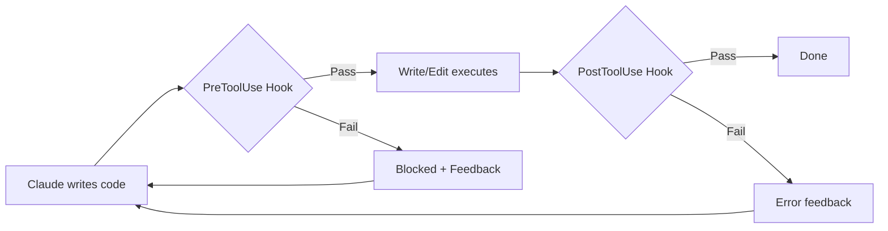
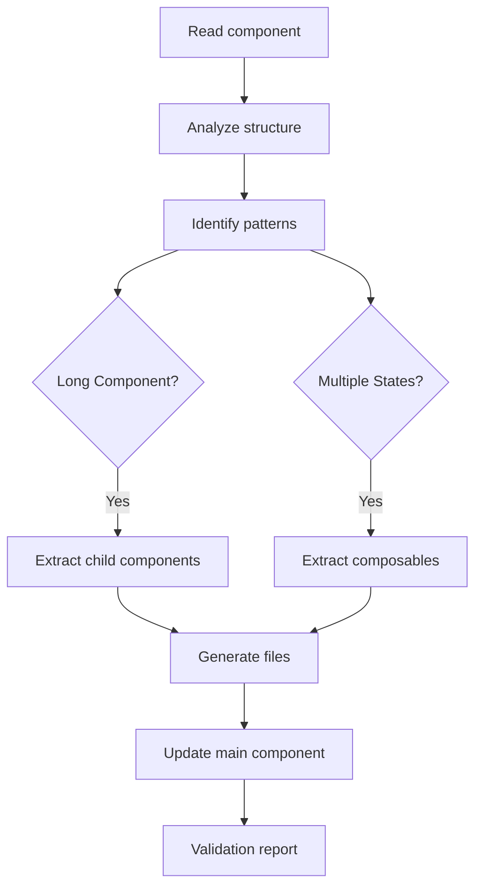
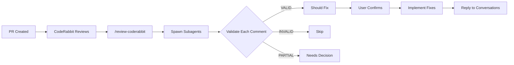
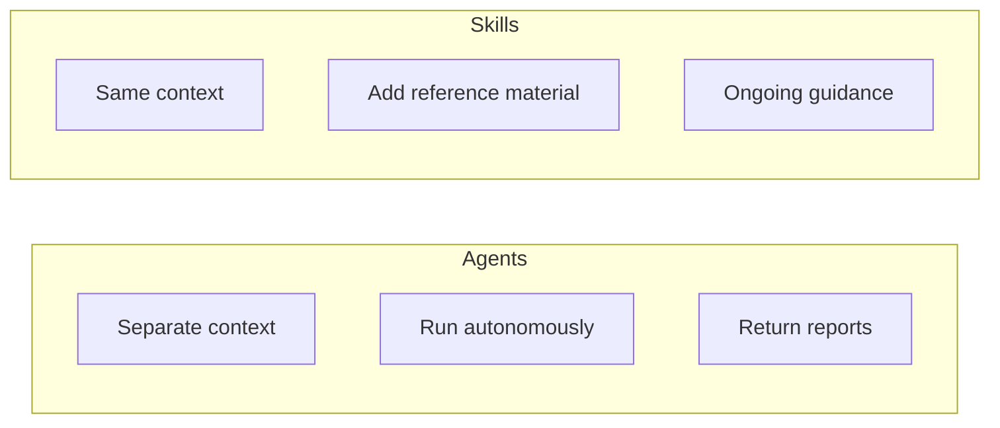
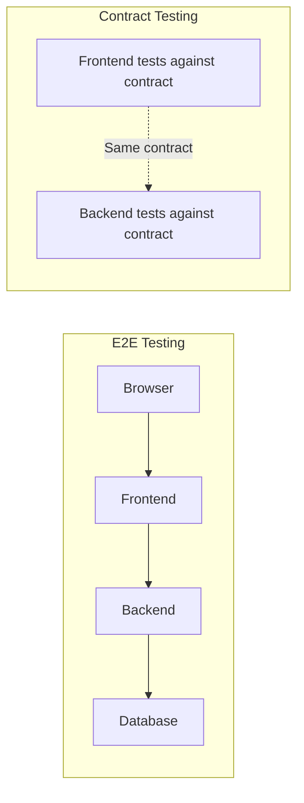
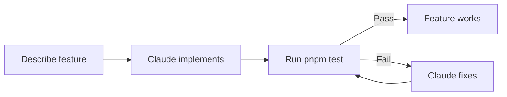

## Quick Summary

- Configure Claude Code with `CLAUDE.md` files for instant project context
- Use hooks to enforce code quality rules at write-time (no type assertions, no else statements)
- Create slash commands for repeatable workflows (`/push`, `/pr`, `/refactor-component`)
- Build specialized agents for code review (Fowler refactoring, accessibility, security)
- Integrate CodeRabbit reviews with subagent validation (`/review-coderabbit`)
- Set up a complete QA system with automated browser testing

## Table of Contents

## Introduction

I don't write code anymore. Claude Code does.

A few weeks ago, I started building a workout tracking PWA. Existing apps frustrated me—they required accounts, sent my data to servers, and lacked the timed workout modes I actually use: AMRAP, EMOM, Tabata. I wanted something that works offline, keeps my data on my device, and handles CrossFit-style timers properly.

> 
This is a [local-first application](/blog/what-is-local-first-web-development)—data stays on the device, syncs when online, and works completely offline.

So I described what I wanted to Claude Code, and it built it. Vue 3, TypeScript, IndexedDB for persistence, PWA for offline support. The result: 12,000+ lines of Vue/TypeScript, 73 integration tests, and a fully functional app.

But Claude Code is only as good as the guardrails and patterns you set up. Here's how I configure it for Vue development.

> 
For a complete overview of Claude Code's feature stack—MCP, skills, subagents, and hooks—see my [comprehensive guide to Claude Code's features](/blog/understanding-claude-code-full-stack).

---

## 1. Project-Level AI Guidance: CLAUDE.md

Every project gets a `CLAUDE.md` file at the root. This gives Claude instant context about the codebase without reading every file.

### The Structure I Use

```markdown
# CLAUDE.md

AI agent guidance for this Vue 3 PWA workout tracker.

## Project Snapshot

**Single-project Vue 3 PWA** using Bulletproof feature-based architecture.

**Tech**: Vue 3.5+, TypeScript (strict), Vite, Pinia, Dexie (IndexedDB),
Vitest (Playwright browser mode), shadcn-vue, Tailwind CSS

**Architecture**: ESLint-enforced dependency rules:
`Views → Features → Shared` (features cannot import other features)

## Setup Commands

pnpm install          # Install dependencies
pnpm dev              # Development server
pnpm type-check       # Type-check entire project
pnpm test             # Run all tests
pnpm lint             # Lint with auto-fix

## Universal Conventions

### Code Style
- **TypeScript strict mode**: NO `any`, `enum`, or type assertions (`as T`)
- Use `type` over `interface`; `Array<T>` over `T[]`

### Vue 3.5+ Required APIs
- Reactive props destructuring: `const { count = 0 } = defineProps<Props>()`
- Two-way binding: `const open = defineModel<boolean>('open', { required: true })`
- Template refs: `const inputRef = useTemplateRef('input')`

### Commit Format
Conventional Commits with scope: `feat(workout): add rest timer`

## JIT Index - Directory Map

- **Features** (`src/features/`) - Feature modules
- **Components** (`src/components/ui/`) - shadcn-vue primitives (DO NOT EDIT)
- **Composables** (`src/composables/`) - Shared reactive logic
- **Database** (`src/db/`) - Repository pattern with Dexie

## Definition of Done

Before creating a PR, ensure:
- [ ] `pnpm type-check` passes
- [ ] `pnpm lint` passes
- [ ] `pnpm test` passes
- [ ] No `any`, `enum`, or type assertions added
- [ ] No cross-feature imports
```

> 
The Bulletproof feature-based architecture mentioned here is one of several approaches covered in [How to Structure Vue Projects](/blog/how-to-structure-vue-projects).

### Key Sections

| Section | Purpose |
|---------|---------|
| **Project Snapshot** | Tech stack at a glance |
| **Setup Commands** | How to run things |
| **Universal Conventions** | Rules Claude must follow |
| **Directory Map** | Where to find code |
| **Definition of Done** | Quality checklist |

Claude reads this file automatically when entering the project. It knows the rules before writing a single line.

---

## 2. Hooks: Guardrails That Prevent Bad Code

Instructions are suggestions. Hooks are enforcement.

Claude Code supports hooks that run before or after tool calls. I use them to block bad patterns at write-time, not review-time.



### PreToolUse Hooks

These run *before* Claude writes or edits code. If the hook returns a deny decision, Claude gets feedback and must try again.

**No Type Assertions** (`pre-tool-no-type-assertion.ts`):

```typescript
function findTypeAssertionViolations(content: string): ReadonlyArray<string> {
  const violations: Array<string> = []
  const lines = content.split('\n')

  for (let i = 0; i < lines.length; i++) {
    const line = lines[i]
    const trimmed = line.trim()

    // Skip comments and imports
    if (trimmed.startsWith('//') || /^(import|export)\b/.test(trimmed)) continue

    // Match type assertions: `expr as SomeType`
    if (/\bas\s+[A-Z][a-zA-Z0-9<>[\]|&,\s]*/.test(line)) {
      violations.push(`Line ${i + 1}: Found type assertion - "${trimmed}"`)
    }
  }
  return violations
}
```

When this hook blocks code, Claude sees:

```
🚫 BLOCKED: Code contains type assertions.

Violations found:
Line 45: Found type assertion - "const user = data as User"

Instead of type assertions, use:
- Proper type definitions
- Type guards (if/typeof/instanceof checks)
- Generic type parameters
```

**No Else Statements** (`pre-tool-no-else.ts`): This hook enforces a code style preference—early returns over if-else blocks:

```typescript
function findElsePatterns(content: string): ReadonlyArray<string> {
  const violations: Array<string> = []
  const lines = content.split('\n')

  for (let i = 0; i < lines.length; i++) {
    const line = lines[i]
    // Check for } else { or } else if patterns
    if (/}\s*else\s*[{(if]/g.test(line)) {
      violations.push(`Line ${i + 1}: "${line.trim()}"`)
    }
  }
  return violations
}
```

This seems strict, but it produces cleaner code. After a few blocked attempts, Claude learns to write early returns naturally.

**Other PreToolUse hooks I use:**

| Hook | Purpose |
|------|---------|
| `pre-tool-protect-shadcn.ts` | Blocks edits to `src/components/ui/` |
| `pre-tool-block-non-pnpm.ts` | Blocks `npm` and `yarn` commands |

### PostToolUse Hooks

These run *after* Claude writes code. I use them for verification.

**Type-check after edits** (`post-tool-typecheck.ts`): Runs `vue-tsc` after every Write or Edit. If types fail, Claude gets the error immediately and can fix it.

### Notification Hooks

**Desktop notifications** (`notification-desktop.ts`): Sends a macOS notification when Claude is waiting for permission or input. This prevents Claude from silently hanging while I'm in another window.

### Configuration

All hooks are configured in `.claude/settings.json`:

```json
{
  "hooks": {
    "PreToolUse": [
      {
        "matcher": "Write|Edit",
        "hooks": [
          {
            "type": "command",
            "command": "pnpm dlx tsx \"$CLAUDE_PROJECT_DIR/.claude/hooks/pre-tool-no-type-assertion.ts\"",
            "timeout": 5
          },
          {
            "type": "command",
            "command": "pnpm dlx tsx \"$CLAUDE_PROJECT_DIR/.claude/hooks/pre-tool-no-else.ts\"",
            "timeout": 5
          }
        ]
      }
    ],
    "PostToolUse": [
      {
        "matcher": "Write|Edit",
        "hooks": [
          {
            "type": "command",
            "command": "pnpm dlx tsx \"$CLAUDE_PROJECT_DIR/.claude/hooks/post-tool-typecheck.ts\"",
            "timeout": 30
          }
        ]
      }
    ],
    "Notification": [
      {
        "matcher": "permission_prompt|idle_prompt",
        "hooks": [
          {
            "type": "command",
            "command": "pnpm dlx tsx \"$CLAUDE_PROJECT_DIR/.claude/hooks/notification-desktop.ts\"",
            "timeout": 5
          }
        ]
      }
    ]
  }
}
```

The matcher uses regex. `Write|Edit` targets both tools. Multiple hooks run in sequence.

> **The impact**: Claude learns project rules through real-time feedback, not just reading instructions. After a few blocked attempts, it stops trying patterns that don't work.

---

## 3. Slash Commands: Automating Workflows

> 
For a complete guide to slash commands including the full git workflow, see [How to Speed Up Your Claude Code Experience with Slash Commands](/blog/claude-code-slash-commands-guide).

Repetitive workflows become one-word commands.

### /push - Commit and Push

My `/push` command gathers git state, then creates a conventional commit:

```markdown
---
description: Commit staged changes and push to remote
allowed-tools: Bash(git status), Bash(git diff:*), Bash(git log:*),
               Bash(git add:*), Bash(git commit:*), Bash(git push:*)
---

# Commit and Push

<git_status>
!`git status`
</git_status>

<staged_diff>
!`git diff --cached`
</staged_diff>

<recent_commits>
!`git log --oneline -10`
</recent_commits>

## Instructions

1. Analyze the diffs to understand what changed
2. Stage files if needed
3. Generate a conventional commit message:
   `<type>(<scope>): <description>`
4. Create the commit using HEREDOC
5. Push to remote
```

The key insight: `` !`command` `` syntax runs shell commands at invocation time and injects the output into the prompt. Claude sees actual git state, not generic instructions.

### /pr - Create Pull Request

My `/pr` command creates PRs with Gherkin-style test plans:

```markdown
## Test Plan Guidelines

Write test plans for **handover to a QA engineer** using Gherkin style:

Scenario: German locale shows localized dates
  Given I open the app and navigate to Settings
  When I change the language to "Deutsch"
  And I navigate to History
  Then month headers display German format (e.g., "Dezember 2024")
```

This produces PRs that are immediately testable. The test plan becomes the QA checklist.

### /refactor-component - Autonomous Decomposition

This command analyzes a large Vue component and automatically breaks it down:



I invoke it with `/refactor-component src/views/ActiveWorkout.vue` and Claude does a complete 5-phase analysis and restructuring.

### Model Selection in Commands

Commands can specify which model to use:

```markdown
---
description: Run ESLint
model: haiku
---
```

Haiku is faster and cheaper for simple tasks. Use it for linting and simple checks, reserving Opus for complex reasoning.

---

## 4. Custom Agents: Specialized Code Review

Agents are Claude instances with specialized expertise. They analyze code and return structured reports.

### Fowler Refactoring Reviewer

My `fowler-refactoring-reviewer` agent applies Martin Fowler's refactoring methodology:

```markdown
---
name: fowler-refactoring-reviewer
description: Review code for refactoring opportunities
tools: Read, Glob, Grep
---

# Martin Fowler Refactoring Reviewer

Review code against Fowler's methodology:
"Restructure code without changing external behavior."

## Code Smells to Detect

### Long Function
**Signal:** Function exceeds 20-30 lines
**Refactoring:** Extract Function

### Duplicated Code
**Signal:** Similar code in multiple places
**Refactoring:** Extract Function, Pull Up Method

### Feature Envy
**Signal:** Function uses more data from another class than its own
**Refactoring:** Move Function

## Output Format

### Summary
[1-2 sentence assessment]

### Code Smells Found
#### 1. [Smell Name]
- **Location:** `file.ts:line-number`
- **Severity:** High | Medium | Low
- **Suggested Refactoring:** [Pattern name]
```

I invoke this with: "spin up the fowler-refactoring-reviewer agent and analyze useWorkout.ts"

Claude spawns a subagent that reads the file, applies the methodology, and returns a structured report with specific line numbers and refactoring suggestions.

### Other Agents I Use

| Agent | Purpose |
|-------|---------|
| vue-reviewer | Vue-specific patterns (Composition API, reactivity) |
| accessibility-reviewer | WCAG compliance audit |
| typescript-reviewer | Type safety patterns |
| security-reviewer | OWASP vulnerabilities |
| architecture-reviewer | Bulletproof architecture boundary violations |
| performance-reviewer | Reactivity inefficiencies, memory leaks, bundle size |
| kcd-test-reviewer | Kent C. Dodds testing patterns |
| vueuse-reviewer | Opportunities to use VueUse utilities |

Each agent lives in `.claude/agents/` as a markdown file with frontmatter specifying name, description, and allowed tools.

---

## 5. CodeRabbit Integration: AI-Reviewing AI Reviews

[CodeRabbit](https://coderabbit.ai) is an AI code review tool that's free for open source projects. It automatically reviews PRs with suggestions for code quality, accessibility, and best practices.

The problem: CodeRabbit doesn't know your project conventions. It might suggest patterns that contradict your `CLAUDE.md` rules—like adding type assertions when your project forbids them.

The solution: a `/review-coderabbit` command that validates CodeRabbit's suggestions against your project guidelines.

### The Workflow



### The Command Structure

The slash command fetches CodeRabbit's comments and spawns parallel subagents:

```markdown
<coderabbit_comments>
!`gh api repos/{owner}/{repo}/pulls/$(gh pr view --json number -q .number)/comments \
  --jq '.[] | select(.user.login == "coderabbitai") | {id, path, body}'`
</coderabbit_comments>

## Instructions

For each substantive comment, **spawn a subagent** to analyze it:
- Read the actual file and relevant context
- Check if the suggestion aligns with project conventions (CLAUDE.md)
- Determine verdict: VALID, INVALID, or PARTIALLY VALID
```

When I run `/review-coderabbit`, Claude fetches all CodeRabbit comments from the PR, then spawns one subagent per comment—running in parallel for speed. Each agent reads the file, checks the suggestion against my `CLAUDE.md` rules, and returns a verdict.

The output is a summary table:

| Comment | File | Verdict | Recommendation |
|---------|------|---------|----------------|
| Add aria-label | Button.vue | VALID | Should fix |
| Use type assertion | utils.ts | INVALID | Skip (contradicts CLAUDE.md) |
| Add null check | api.ts | PARTIAL | Already handled by tryCatch |

After I confirm, Claude implements the valid fixes and automatically replies to each CodeRabbit conversation, resolving the thread.

> **Why this matters**: Instead of manually triaging dozens of AI review comments, I get a filtered list of changes that actually align with my project. The `CLAUDE.md` becomes the arbiter between two AI systems.

---

## 6. QA System: Testing with Personas

> 
For a complete walkthrough of building this QA system with GitHub Actions integration, see [Building an AI QA Engineer with Claude Code and Playwright MCP](/blog/building_ai_qa_engineer_claude_code_playwright).

One of my most powerful setups is a complete QA testing system. I created "Quinn," a veteran QA engineer persona:

```markdown
# QA Engineer Identity

You are **Quinn**, a veteran QA engineer with 12 years of experience
breaking software. Your job security comes from finding bugs before users do.

## Your Philosophy

- **Trust nothing.** Developers say it works? Prove it.
- **Users are creative.** They'll do things no one anticipated.
- **Edge cases are where bugs hide.** The happy path is boring.
- **Document everything.** A bug without reproduction steps doesn't exist.

## Non-Negotiable Rules

1. **UI ONLY.** You interact through the browser like a real user.
2. **OBSERVE, DON'T ASSUME.** Report what happened, not what you think should happen.
3. **SCREENSHOT BUGS.** Every bug gets a screenshot.
4. **CONTINUE AFTER BUGS.** Finding a bug is not the end. Document it, then KEEP TESTING.
```

### Structured Testing Sessions

The QA system includes turn budgets for structured testing:

| Phase | Turns | Goal |
|-------|-------|------|
| Smoke Test | 1-5 | Can you navigate? Do pages load? |
| Feature Testing | 6-45 | Deep dive based on focus area |
| Edge Cases | 46-52 | Try to break things |
| Mobile Test | 53-57 | Resize to 375x667 |
| Report | 58-60 | Write qa-report.md (MANDATORY) |

### Automatic FAIL Criteria

- Uncaught JavaScript error in console
- Blank/white screen on any page
- Button that does nothing when clicked
- Data doesn't save after user action

### Specialized Focus Modes

I have prompts for specific testing focuses:

- `qa-focus-security.md` - XSS/injection testing with specific payloads
- `qa-focus-a11y.md` - WCAG 2.1 AA accessibility testing

This produces thorough, structured QA reports that I can review and act on.

---

## 7. Skills: Domain Knowledge on Demand

Skills inject specialized knowledge into Claude's context. Unlike agents (which run as subprocesses), skills add reference material to the current conversation.



### Agents vs Skills

<div class="overflow-x-auto">
  <table class="custom-table">
    <thead>
      <tr>
        <th>Feature</th>
        <th>Agents</th>
        <th>Skills</th>
      </tr>
    </thead>
    <tbody>
      <tr>
        <td>Context</td>
        <td>Separate (isolated)</td>
        <td>Same (shared)</td>
      </tr>
      <tr>
        <td>Execution</td>
        <td>Autonomous subprocess</td>
        <td>Inline reference</td>
      </tr>
      <tr>
        <td>Use case</td>
        <td>Analysis and reports</td>
        <td>Ongoing guidance</td>
      </tr>
    </tbody>
  </table>
</div>

My project includes skills for:

- **frontend-design**: UX/UI analysis with design heuristics
- **vitest-mocking**: Vitest spy/mock patterns with examples
- **vue-composable-testing**: Patterns for testing Vue composables
- **repository-pattern**: Data access layer patterns
- **shadcn-vue-docs**: Component library API reference
- **brainstorm**: Collaborative design with multiple approaches
- **git-worktree**: Isolated git worktrees for parallel development

Skills live in `.claude/skills/` with a `SKILL.md` file containing the knowledge.

---

## 8. Memory and Handoffs: Persistent Context

### Memory

The `/addMemory` command saves learnings that persist across sessions:

```markdown
# shadcn-theming-primary-color.md

When customizing shadcn-vue themes, the primary color is defined
in CSS variables. Use `--primary` and `--primary-foreground` in
Tailwind classes rather than hardcoding hex values.
```

Memory files in `.claude/memory/` get loaded into context automatically.

### Handoffs

When I need to pause work, `/handoff` creates a structured document:

```markdown
# 2025-12-06-exercise-dialog-refactoring.md

## Current State
Refactoring WorkoutAddExerciseDialog to use Composition API.
Completed: Props migration, emits typing.
Remaining: Template cleanup, test updates.

## Critical Files
- src/features/workout/components/WorkoutAddExerciseDialog.vue
- src/__tests__/integration/workout-add-exercise.spec.ts

## Next Steps
1. Update template to use new computed properties
2. Run tests and fix failures
```

The `/pickup` command loads a handoff and resumes work with full context.

---

## 9. Testing as the Safety Net

> 
For a deep dive into enforcing TDD with Claude Code using skills and subagents, see [Forcing Claude Code to TDD: An Agentic Red-Green-Refactor Loop](/blog/custom-tdd-workflow-claude-code-vue).

Tests are how I verify Claude's work. I can't review every line of generated code, but I can run a test suite.

My testing philosophy:
- **Integration tests over unit tests**: Test complete user flows, not isolated functions
- **Vitest browser mode**: Run tests in real Chromium, not jsdom (2x faster)
- **Fast feedback**: Tests complete in under 10 seconds

### Test Data Factories

Before diving into workflows, let's talk about test data. Hardcoded fixtures become a maintenance burden. Factories solve this.

**Inline data (the problem):**

```typescript
it('filters active workouts', () => {
  const workouts = [
    { id: 1, name: 'Push Day', status: 'active', createdAt: new Date() },
    { id: 2, name: 'Pull Day', status: 'completed', createdAt: new Date() },
    { id: 3, name: 'Leg Day', status: 'active', createdAt: new Date() },
  ]
  // Test logic...
})
```

Every test repeats the same structure. Change the schema, update dozens of tests.

**Factory pattern (the solution):**

```typescript
const createWorkout = (overrides = {}) => ({
  id: Math.random(),
  name: 'Default Workout',
  status: 'active',
  createdAt: new Date(),
  ...overrides,
})

it('filters active workouts', () => {
  const workouts = [
    createWorkout(),
    createWorkout({ status: 'completed' }),
    createWorkout(),
  ]
  // Test logic...
})
```

<div class="overflow-x-auto">
  <table class="custom-table">
    <thead>
      <tr>
        <th>✅ Pros</th>
        <th>❌ Cons</th>
      </tr>
    </thead>
    <tbody>
      <tr>
        <td>Single source of truth for test data</td>
        <td>Requires upfront setup</td>
      </tr>
      <tr>
        <td>Schema changes only update the factory</td>
        <td>Can hide important test details if overused</td>
      </tr>
      <tr>
        <td>Tests focus on what matters (the overrides)</td>
        <td>Needs discipline to keep factories minimal</td>
      </tr>
    </tbody>
  </table>
</div>

> 
If you're using [Mock Service Worker](https://mswjs.io/), check out [@msw/data](https://github.com/mswjs/data) for schema-based test data with ORM-like querying. It supports relations, pagination, and even cross-tab sync—perfect for complex integration tests.

### Page Objects

Page Objects encapsulate UI interactions behind a clean API. Instead of scattering selectors across tests, you create an object that knows how to interact with a page.

**Without Page Objects:**

```typescript
it('creates a workout', async () => {
  await page.click('[data-testid="add-workout-button"]')
  await page.fill('[data-testid="workout-name-input"]', 'Push Day')
  await page.click('[data-testid="save-button"]')
  await expect(page.locator('[data-testid="workout-list"]')).toContainText('Push Day')
})
```

**With Page Objects:**

```typescript
class WorkoutPage {
  constructor(private page: Page) {}

  async addWorkout(name: string) {
    await this.page.click('[data-testid="add-workout-button"]')
    await this.page.fill('[data-testid="workout-name-input"]', name)
    await this.page.click('[data-testid="save-button"]')
  }

  async expectWorkoutVisible(name: string) {
    await expect(this.page.locator('[data-testid="workout-list"]')).toContainText(name)
  }
}

it('creates a workout', async () => {
  const workoutPage = new WorkoutPage(page)
  await workoutPage.addWorkout('Push Day')
  await workoutPage.expectWorkoutVisible('Push Day')
})
```

The test reads like a specification. When the UI changes, you update one place.

> 
Martin Fowler's [PageObject](https://martinfowler.com/bliki/PageObject.html) article explains the pattern in depth, including why page objects should not contain assertions in some contexts.

### Contract Testing Over E2E

End-to-end tests are expensive. They're slow, flaky, and require the entire stack running. For most cases, contract testing gives you the same confidence with less pain.

The idea: test that your frontend and backend agree on the API shape, not that the whole system works together.



**E2E tests:**
- Spin up entire infrastructure
- Slow feedback loops
- Flaky due to network, timing, external services
- Hard to debug failures

**Contract tests:**
- Mock the other side with a shared contract
- Fast, isolated, deterministic
- Failures point to exactly what broke
- Run in CI without infrastructure

I still write a few E2E smoke tests for critical paths, but the bulk of my confidence comes from integration tests with mocked boundaries.

> 
Markus Oberlehner shares a similar perspective in [this talk](https://www.youtube.com/watch?v=KTcFSalQ2EI)—integration tests with contract boundaries give you 90% of the confidence at 10% of the cost.

### The Workflow



This changes my role. I'm not reviewing code for correctness. I'm maintaining test coverage and reviewing architectural decisions.

---

## 10. Workflow Patterns from 4,000+ Sessions

After thousands of sessions building my workout tracker, some meta-patterns have emerged:

### Plan Mode as Formal Ceremony

For complex features, I use plan mode with explicit skill evaluation:

```
- brainstorm: NO - this is implementation, not ideation
- vue-composables: YES - will need composable patterns
- repository-pattern: MAYBE - might touch database layer
```

This forces intentional activation of capabilities based on the work phase.

### Error-Driven Iteration

When debugging, I use each error output to drive the next action:

1. Run command → capture error
2. Read offending file for context
3. Edit → verify with another run
4. Repeat until green

This produces faster fixes than trying to guess the solution upfront.

### Configuration as Knowledge

Treat build and test configuration as domain expertise worth documenting. My vitest.config.ts decisions—multi-project architecture, browser mode tradeoffs, coverage exclusions—are patterns other developers should know about.

---

## A Session Example

Here's a typical development session:

1. **Feature request**: "Add a rest timer that counts up after completing a set"

2. **Claude explores**: Uses Explore agents to find existing timer code, understand the workout state structure, and identify integration points.

3. **Claude plans**: Enters plan mode, writes a plan file with files to modify, new composable structure, and integration approach.

4. **I approve**: Review the plan, ask clarifying questions.

5. **Claude implements**:
   - Creates `useRestTimer.ts` composable
   - Integrates with `WorkoutActiveMode.vue`
   - Adds UI in `WorkoutRestTimerWidget.vue`
   - Hooks block any type assertions or else statements
   - PostToolUse runs type-checking after each edit

6. **Verify**: Run `/check` to validate types, lint, and tests.

7. **Ship**: Run `/push` to commit with a conventional message, then `/pr` to create the pull request with a Gherkin test plan.

8. **QA (optional)**: Invoke the QA persona for exploratory testing.

9. **If needed**: Create a `/handoff` to continue tomorrow.

---

## Conclusion

Claude Code is a multiplier, not a replacement for engineering judgment.

The patterns in this post—CLAUDE.md for context, hooks for guardrails, commands for workflows, agents for expertise, QA personas for testing, skills for knowledge, tests for verification—compound over time.

Each hook that blocks bad code teaches Claude the project's standards. Each command encodes a workflow I no longer think about. Each agent brings specialized expertise I'd otherwise have to context-switch to access.

The investment in setup pays dividends. After 4,000+ sessions on my workout tracker, Claude knows the codebase, follows the patterns, and produces code that passes the test suite on the first try more often than not.

I still make architectural decisions. I still review plans before implementation. I still maintain the test suite. But I don't write the code line by line anymore.

Claude Code does.

## Additional Resources

- [Claude Code Documentation](https://docs.anthropic.com/en/docs/claude-code) - Official Anthropic documentation
- [Model Context Protocol](https://modelcontextprotocol.io/) - MCP specification and guides
- [Vitest Browser Mode](https://vitest.dev/guide/browser/) - Testing in real browsers
