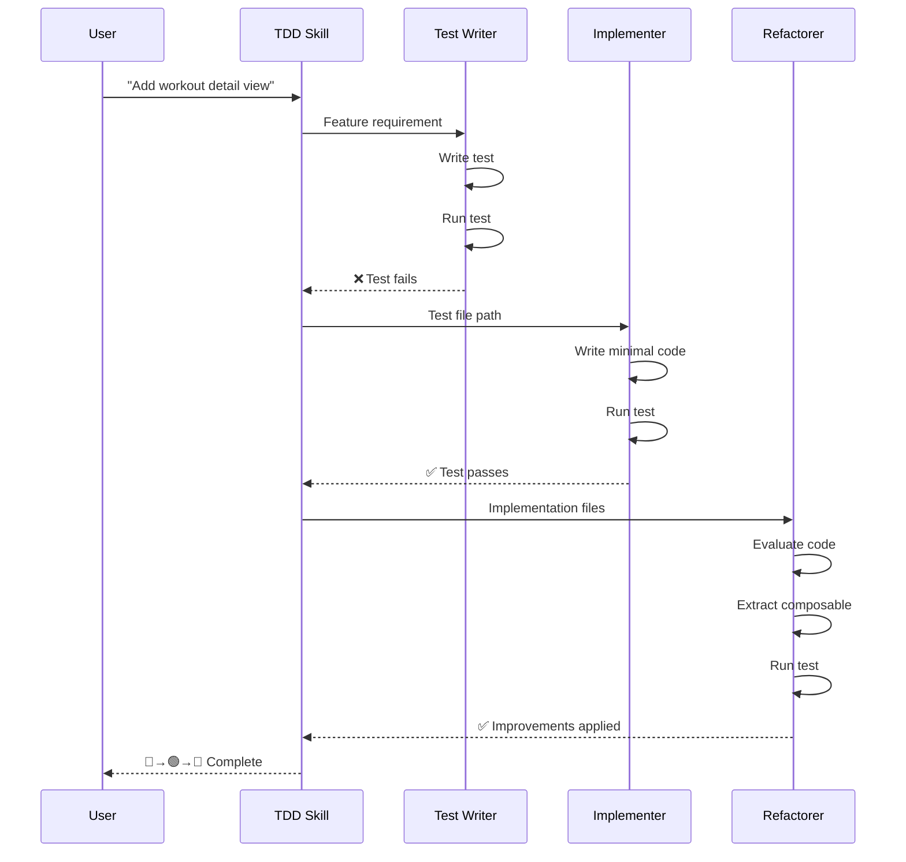

I rely on Claude Code, but it has a structural limitation: it defaults to implementation-first. It writes the "Happy Path," ignoring edge cases. When I try to force TDD in a single context window, the implementation "bleeds" into the test logic (context pollution). This article documents a multi-agent system using Claude's "Skills" and "Hooks" that enforces a strict Red-Green-Refactor cycle.

> 
  While this article uses Vue as an example, the TDD principles and Claude Code workflow apply to any technology. Whether you're working with React, Angular, Svelte, or even backend languages like Python, Go, or Rust—the Red-Green-Refactor cycle and subagent orchestration work the same way.

## The Problem with AI-Assisted TDD

When I ask Claude to "implement feature X," it writes the implementation first. Every time. TDD flips this—you write the test first, watch it fail, then write minimal code to make it pass.

I needed a way to:
* **Force test-first** — No implementation before a failing test exists
* **Keep phases focused** — The test writer shouldn't think about implementation details
* **Ensure refactoring happens** — Easy to skip when the feature already works

## Skills + Subagents

Claude Code supports two features I hadn't explored until recently:

* **[Skills](/blog/understanding-claude-code-full-stack)** (`.claude/skills/`): High-level workflows that orchestrate complex tasks
* **Agents** (`.claude/agents/`): Specialized workers that handle specific jobs

You might wonder: why use subagents at all? Skills alone could handle the TDD workflow. But there's a catch—context pollution.

### The Context Pollution Problem

> 
When everything runs in one context window, **the LLM cannot truly follow TDD**. The test writer's detailed analysis bleeds into the implementer's thinking. The implementer's code exploration pollutes the refactorer's evaluation. Each phase drags along baggage from the others.

This isn't just messy—it fundamentally breaks TDD. The whole point of writing the test first is that **you don't know the implementation yet**. But if the same context sees both phases, the LLM subconsciously designs tests around the implementation it's already planning. It "cheats" without meaning to.

**Subagents solve this architectural limitation.** Each phase runs in complete isolation:

- The **test writer** focuses purely on test design—it has no idea how the feature will be implemented
- The **implementer** sees only the failing test—it can't be influenced by test-writing decisions
- The **refactorer** evaluates clean implementation code—it starts fresh without implementation baggage

Each agent starts with exactly the context it needs and nothing more. This isn't just organization—it's the only way to get genuine test-first development from an LLM.

Combining skills with subagents gave me exactly what I needed:

## The TDD Skill

The orchestrating skill lives at `.claude/skills/tdd-integration/skill.md`:

```markdown
---
name: tdd-integration
description: Enforce Test-Driven Development with strict Red-Green-Refactor cycle using integration tests. Auto-triggers when implementing new features or functionality. Trigger phrases include "implement", "add feature", "build", "create functionality", or any request to add new behavior. Does NOT trigger for bug fixes, documentation, or configuration changes.
---

# TDD Integration Testing

Enforce strict Test-Driven Development using the Red-Green-Refactor cycle with dedicated subagents.

## Mandatory Workflow

Every new feature MUST follow this strict 3-phase cycle. Do NOT skip phases.

### Phase 1: RED - Write Failing Test

🔴 RED PHASE: Delegating to tdd-test-writer...

Invoke the `tdd-test-writer` subagent with:
- Feature requirement from user request
- Expected behavior to test

The subagent returns:
- Test file path
- Failure output confirming test fails
- Summary of what the test verifies

**Do NOT proceed to Green phase until test failure is confirmed.**

### Phase 2: GREEN - Make It Pass

🟢 GREEN PHASE: Delegating to tdd-implementer...

Invoke the `tdd-implementer` subagent with:
- Test file path from RED phase
- Feature requirement context

The subagent returns:
- Files modified
- Success output confirming test passes
- Implementation summary

**Do NOT proceed to Refactor phase until test passes.**

### Phase 3: REFACTOR - Improve

🔵 REFACTOR PHASE: Delegating to tdd-refactorer...

Invoke the `tdd-refactorer` subagent with:
- Test file path
- Implementation files from GREEN phase

The subagent returns either:
- Changes made + test success output, OR
- "No refactoring needed" with reasoning

**Cycle complete when refactor phase returns.**

## Multiple Features

Complete the full cycle for EACH feature before starting the next:

Feature 1: 🔴 → 🟢 → 🔵 ✓
Feature 2: 🔴 → 🟢 → 🔵 ✓
Feature 3: 🔴 → 🟢 → 🔵 ✓

## Phase Violations

Never:
- Write implementation before the test
- Proceed to Green without seeing Red fail
- Skip Refactor evaluation
- Start a new feature before completing the current cycle
```

The `description` field contains trigger phrases so Claude activates this skill automatically when I ask to implement something. Each phase has explicit "Do NOT proceed until..." gates—Claude needs clear boundaries. The 🔴🟢🔵 emojis make tracking progress easy in the output.

## The Test Writer Agent (RED Phase)

At `.claude/agents/tdd-test-writer.md`:

```markdown
---
name: tdd-test-writer
description: Write failing integration tests for TDD RED phase. Use when implementing new features with TDD. Returns only after verifying test FAILS.
tools: Read, Glob, Grep, Write, Edit, Bash
skills: vue-integration-testing
---

# TDD Test Writer (RED Phase)

Write a failing integration test that verifies the requested feature behavior.

## Process

1. Understand the feature requirement from the prompt
2. Write an integration test in `src/__tests__/integration/`
3. Run `pnpm test:unit <test-file>` to verify it fails
4. Return the test file path and failure output

## Test Structure

typescript
import { afterEach, describe, expect, it } from 'vitest'
import { createTestApp } from '../helpers/createTestApp'
import { resetWorkout } from '@/composables/useWorkout'
import { resetDatabase } from '../setup'

describe('Feature Name', () => {
  afterEach(async () => {
    resetWorkout()
    await resetDatabase()
    document.body.innerHTML = ''
  })

  it('describes the user journey', async () => {
    const app = await createTestApp()

    // Act: User interactions
    await app.user.click(app.getByRole('button', { name: /action/i }))

    // Assert: Verify outcomes
    expect(app.router.currentRoute.value.path).toBe('/expected')

    app.cleanup()
  })
})

## Requirements

- Test must describe user behavior, not implementation details
- Use `createTestApp()` for full app integration
- Use Testing Library queries (`getByRole`, `getByText`)
- Test MUST fail when run - verify before returning

## Return Format

Return:
- Test file path
- Failure output showing the test fails
- Brief summary of what the test verifies
```

I limited the tools to only what's needed for writing and running tests. The `skills` field pulls in my `vue-integration-testing` skill for project-specific context. And the explicit return format ensures clean handoffs between phases.

> 
  This skill defines how I want tests written: using jsdom with Vue Test Utils, writing BDD-style tests that describe user behavior, and avoiding mocks wherever possible. I don't see much value in unit tests that mock everything—they often just verify implementation details rather than actual functionality. Integration tests that exercise real code paths catch more bugs.

## The Implementer Agent (GREEN Phase)

At `.claude/agents/tdd-implementer.md`:

```markdown
---
name: tdd-implementer
description: Implement minimal code to pass failing tests for TDD GREEN phase. Write only what the test requires. Returns only after verifying test PASSES.
tools: Read, Glob, Grep, Write, Edit, Bash
---

# TDD Implementer (GREEN Phase)

Implement the minimal code needed to make the failing test pass.

## Process

1. Read the failing test to understand what behavior it expects
2. Identify the files that need changes
3. Write the minimal implementation to pass the test
4. Run `pnpm test:unit <test-file>` to verify it passes
5. Return implementation summary and success output

## Principles

- **Minimal**: Write only what the test requires
- **No extras**: No additional features, no "nice to haves"
- **Test-driven**: If the test passes, the implementation is complete
- **Fix implementation, not tests**: If the test fails, fix your code

## Return Format

Return:
- Files modified with brief description of changes
- Test success output
- Summary of the implementation
```

## The Refactorer Agent (REFACTOR Phase)

At `.claude/agents/tdd-refactorer.md`:

```markdown
---
name: tdd-refactorer
description: Evaluate and refactor code after TDD GREEN phase. Improve code quality while keeping tests passing. Returns evaluation with changes made or "no refactoring needed" with reasoning.
tools: Read, Glob, Grep, Write, Edit, Bash
skills: vue-composables
---

# TDD Refactorer (REFACTOR Phase)

Evaluate the implementation for refactoring opportunities and apply improvements while keeping tests green.

## Process

1. Read the implementation and test files
2. Evaluate against refactoring checklist
3. Apply improvements if beneficial
4. Run `pnpm test:unit <test-file>` to verify tests still pass
5. Return summary of changes or "no refactoring needed"

## Refactoring Checklist

Evaluate these opportunities:

- **Extract composable**: Reusable logic that could benefit other components
- **Simplify conditionals**: Complex if/else chains that could be clearer
- **Improve naming**: Variables or functions with unclear names
- **Remove duplication**: Repeated code patterns
- **Thin components**: Business logic that should move to composables

## Decision Criteria

Refactor when:
- Code has clear duplication
- Logic is reusable elsewhere
- Naming obscures intent
- Component contains business logic

Skip refactoring when:
- Code is already clean and simple
- Changes would be over-engineering
- Implementation is minimal and focused

## Return Format

If changes made:
- Files modified with brief description
- Test success output confirming tests pass
- Summary of improvements

If no changes:
- "No refactoring needed"
- Brief reasoning (e.g., "Implementation is minimal and focused")
```

This agent has a **decision framework** for whether to refactor. Sometimes "no refactoring needed" is the right answer. The `skills` field references my `vue-composables` skill so it knows my project's patterns for extracting reusable logic.

## Real Example: Adding Workout Detail View

Here's what this looks like in practice. My request:

> "When a user is on the Workouts page, they should be able to click on a past workout and see a detail view of what exercises and sets they completed."

The workflow executes like this:



### 🔴 RED Phase

The `tdd-test-writer` produced:

```typescript
// src/__tests__/integration/workout-detail.spec.ts
import { afterEach, describe, expect, it } from 'vitest'
import { createTestApp } from '../helpers/createTestApp'
import { db, generateId } from '@/db'

describe('Workout History Detail View', () => {
  afterEach(async () => {
    // cleanup
  })

  it('navigates to detail view when clicking a completed workout', async () => {
    // Arrange: Create a completed workout
    const completedWorkout = {
      id: generateId(),
      name: 'Push Day',
      exercises: [{
        name: 'Bench Press',
        sets: [{ kg: '100', reps: '10' }]
      }],
      completedAt: Date.now(),
    }
    await db.workouts.add(completedWorkout)

    // Act: Navigate and click
    const app = await createTestApp()
    await app.user.click(app.getByRole('button', { name: /workouts/i }))
    await app.user.click(await app.findByText('Push Day'))

    // Assert
    expect(app.router.currentRoute.value.path)
      .toBe(`/workouts/${completedWorkout.id}`)
    expect(app.getByText('Bench Press')).toBeDefined()
    expect(app.getByText('100')).toBeDefined()

    app.cleanup()
  })
})
```

The test failed:
```
AssertionError: expected '/workouts' to be '/workouts/d747077d-...'
```

Exactly what I wanted—a clear failure pointing to missing functionality.

### 🟢 GREEN Phase

The `tdd-implementer` created:
* `WorkoutDetailView.vue` — New detail view component
* Modified `TheWorkoutsView.vue` — Added click handlers
* Modified `router/index.ts` — Added `/workouts/:id` route

Test passed. Minimal implementation, just enough to satisfy the assertions.

### 🔵 REFACTOR Phase

The `tdd-refactorer` evaluated the code and made improvements:
* **Extracted [`useWorkoutDetail` composable](/blog/how-to-test-vue-composables)** — Reusable data fetching with discriminated union states
* **Created shared formatters** — Pulled `formatDuration` and `formatDate` into `lib/formatters.ts`
* **Added accessibility** — Keyboard navigation for clickable cards

All tests still passed. The cycle completed.

## The Test Helper

A crucial piece making all this work is my `createTestApp()` helper:

```typescript
// src/__tests__/helpers/createTestApp.ts
export async function createTestApp(): Promise<TestApp> {
  const pinia = createPinia()
  const router = createRouter({
    history: createMemoryHistory(),
    routes,
  })

  render(App, {
    global: { plugins: [router, pinia] },
  })

  await router.isReady()

  return {
    router,
    user: userEvent.setup(),
    getByRole: screen.getByRole,
    getByText: screen.getByText,
    findByText: screen.findByText,
    waitForRoute: (pattern) => waitFor(() => {
      if (!pattern.test(router.currentRoute.value.path)) {
        throw new Error('Route mismatch')
      }
    }),
    cleanup: () => { document.body.innerHTML = '' },
  }
}
```

This gives agents a consistent API for rendering the full app and simulating user interactions. They don't need to figure out how to set up Vue, Pinia, and Vue Router each time—they just call `createTestApp()` and start writing assertions.

## Hooks for Consistent Skill Activation

Even with well-written skills, Claude sometimes skipped evaluation and jumped straight to implementation. I tracked this informally—skill activation happened maybe 20% of the time.

I found a great solution in [Scott Spence's post on making skills activate reliably](https://scottspence.com/posts/how-to-make-claude-code-skills-activate-reliably). He tested 200+ prompts across different hook configurations and found that a "forced eval" approach—making Claude explicitly evaluate each skill before proceeding—jumped activation from ~20% to ~84%.

The fix: **[hooks](/blog/claude-code-notification-hooks)**. Claude Code runs hooks at specific lifecycle points, and I used `UserPromptSubmit` to inject a reminder before every response.

In `.claude/settings.json`:

```json
{
  "hooks": {
    "UserPromptSubmit": [
      {
        "matcher": "",
        "hooks": [
          {
            "type": "command",
            "command": "npx tsx \"$CLAUDE_PROJECT_DIR/.claude/hooks/user-prompt-skill-eval.ts\"",
            "timeout": 5
          }
        ]
      }
    ]
  }
}
```

The hook script at `.claude/hooks/user-prompt-skill-eval.ts`:

```typescript
#!/usr/bin/env npx tsx
import { readFileSync } from 'node:fs'
import { stdout } from 'node:process'

function main(): void {
  readFileSync(0, 'utf-8') // consume stdin

  const instruction = `
INSTRUCTION: MANDATORY SKILL ACTIVATION SEQUENCE

Step 1 - EVALUATE:
For each skill in <available_skills>, state: [skill-name] - YES/NO - [reason]

Step 2 - ACTIVATE:
IF any skills are YES → Use Skill(skill-name) tool for EACH relevant skill NOW
IF no skills are YES → State "No skills needed" and proceed

Step 3 - IMPLEMENT:
Only after Step 2 is complete, proceed with implementation.

CRITICAL: You MUST call Skill() tool in Step 2. Do NOT skip to implementation.
`

  stdout.write(instruction.trim())
}

main()
```

> 
  With this hook, skill activation jumped from ~20% to ~84%. Now when I say "implement the workout detail view," the TDD skill triggers automatically.

## Conclusion

Claude Code's default behavior produces implementation-first code with minimal test coverage. Without constraints, it optimizes for "working code" rather than "tested code."

The system described here addresses this through architectural separation:

* **Hooks** inject evaluation logic before every prompt, increasing skill activation from ~20% to ~84%
* **Skills** define explicit phase gates that block progression until each TDD step completes
* **Subagents** enforce context isolation—the test writer cannot see implementation plans, so tests reflect actual requirements rather than anticipated code structure

The setup cost is ~2 hours of configuration. After that, each feature request automatically follows the Red-Green-Refactor cycle without manual enforcement.
