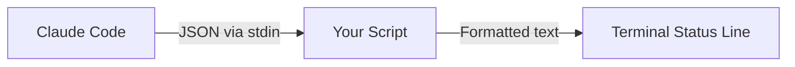

Ever glanced at Claude Code and wondered which model you're actually using? Or how much of the context window you've burned through? By default, this information is hidden away—but you can surface it right in your terminal.

A custom status line shows you what matters at a glance:

```
[Opus] Context: 12%
```

This tells you the active model and context usage without interrupting your flow. Let me show you how to set it up.

## How the status line works

Claude Code pipes JSON data to your status line script via stdin. Your script processes that data and outputs whatever text you want displayed.



The JSON contains everything you'd want to know: model info, token counts, costs, and workspace details.

## Step 1: Create the status line script

Create a new file at `~/.claude/statusline.sh`:

```bash
#!/bin/bash
input=$(cat)

MODEL=$(echo "$input" | jq -r '.model.display_name')
INPUT_TOKENS=$(echo "$input" | jq -r '.context_window.total_input_tokens')
OUTPUT_TOKENS=$(echo "$input" | jq -r '.context_window.total_output_tokens')
CONTEXT_SIZE=$(echo "$input" | jq -r '.context_window.context_window_size')

TOTAL_TOKENS=$((INPUT_TOKENS + OUTPUT_TOKENS))
PERCENT_USED=$((TOTAL_TOKENS * 100 / CONTEXT_SIZE))

echo "[$MODEL] Context: ${PERCENT_USED}%"
```

The script reads JSON from stdin, extracts the fields we care about using `jq`, calculates the percentage, and outputs the formatted string.

## Step 2: Make it executable

```bash
chmod +x ~/.claude/statusline.sh
```

## Step 3: Configure Claude Code

Add the status line configuration to `~/.claude/settings.json`:

```json
{
  "statusLine": {
    "type": "command",
    "command": "~/.claude/statusline.sh"
  }
}
```

If you already have settings in this file, add the `statusLine` block alongside your existing configuration.

## Step 4: Restart Claude Code

Close and reopen Claude Code. Your new status line should appear.

## Available variables

The script receives JSON with these fields:

| Variable | Description |
|----------|-------------|
| `model.id` | Full model ID (e.g., `claude-opus-4-5-20251101`) |
| `model.display_name` | Short name (e.g., `Opus`) |
| `context_window.total_input_tokens` | Input tokens used |
| `context_window.total_output_tokens` | Output tokens used |
| `context_window.context_window_size` | Max context size |
| `cost.total_cost_usd` | Session cost in USD |
| `cost.total_duration_ms` | Total duration |
| `workspace.current_dir` | Current directory |

## Adding cost tracking

Want to see how much your session is costing? Extend the script:

```bash
#!/bin/bash
input=$(cat)

MODEL=$(echo "$input" | jq -r '.model.display_name')
INPUT_TOKENS=$(echo "$input" | jq -r '.context_window.total_input_tokens')
OUTPUT_TOKENS=$(echo "$input" | jq -r '.context_window.total_output_tokens')
CONTEXT_SIZE=$(echo "$input" | jq -r '.context_window.context_window_size')
COST=$(echo "$input" | jq -r '.cost.total_cost_usd')

TOTAL_TOKENS=$((INPUT_TOKENS + OUTPUT_TOKENS))
PERCENT_USED=$((TOTAL_TOKENS * 100 / CONTEXT_SIZE))

printf "[%s] Context: %d%% | $%.2f" "$MODEL" "$PERCENT_USED" "$COST"
```

Now you'll see something like: `[Opus] Context: 12% | $0.45`

> 
  Use the `/statusline` slash command for a guided setup. Just type `/statusline show the model name and context usage percentage` and Claude Code creates the configuration automatically.

## Troubleshooting

**Status line not showing?**

1. Check that `jq` is installed: `brew install jq` (macOS) or `apt install jq` (Linux)
2. Verify the script is executable: `ls -la ~/.claude/statusline.sh`
3. Restart Claude Code after making changes

**Test your script manually:**

```bash
echo '{"model":{"display_name":"Opus"},"context_window":{"total_input_tokens":1000,"total_output_tokens":500,"context_window_size":200000}}' | ~/.claude/statusline.sh
```

Should output: `[Opus] Context: 0%`

> 
  The status line script requires `jq` for JSON parsing. If you don't have it installed, the script will fail silently.

## Taking it further

The status line is one piece of the Claude Code customization puzzle. Once you're comfortable with scripts like this, explore:

- [Notification hooks](/blog/claude-code-notification-hooks) to get desktop alerts when Claude needs input
- [Slash commands](/blog/claude-code-slash-commands-guide) to automate repetitive tasks
- [The full Claude Code feature stack](/blog/understanding-claude-code-full-stack) for MCP, skills, and subagents

The status line script pattern—reading JSON from stdin and outputting formatted text—is the same foundation that powers many of Claude Code's extensibility features.
