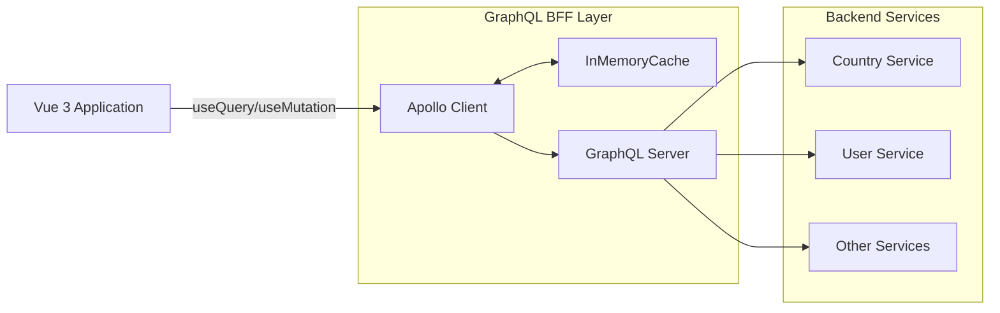

## Introduction

For over a year now, I've been working with GraphQL and a Backend-for-Frontend (BFF) at my job.
Before this role, I had only worked with REST APIs and Axios, so it's been a big learning curve.
That's why I want to share everything I've learned over the past months with you.
I'll start with a small introduction and continue adding more posts over time.

## What is GraphQL and why should Vue developers care?

GraphQL is a query language for APIs.  
You send a query describing the data you want, and the server gives you exactly that. Nothing more. Nothing less.

For Vue developers, this means:

- **Less boilerplate** — no stitching REST calls together
- **Better typing** — GraphQL schemas fit TypeScript perfectly
- **Faster apps** — fetch only what you need

GraphQL and the Vue 3 Composition API go together like coffee and morning sun.  
Highly reactive. Highly type-safe. Way less code.

## Try it yourself

Here is a GraphQL explorer you can use right now. Try this query:

```graphql
query {
  countries {
    name
    emoji
    capital
  }
}
```

<div class="relative w-full" style="padding-top: 75%;">
  <iframe
    src="https://studio.apollographql.com/public/countries/variant/current/explorer?explorerURLState=N4IgJg9gxgrgtgUwHYBcQC4QEcYIE4CeABAOIIoBOAzgC5wDKMYADnfQJYzPUBmAhlwBuAQwA2cGnQDaAXQC%2BIAA"
    class="absolute left-0 top-0 h-full w-full rounded-lg border-2 border-gray-200"
    style="min-height: 500px;"
    loading="lazy"
    allow="clipboard-write"
  />
</div>

> 💡 If the embed breaks, [open it in a new tab](https://studio.apollographql.com/public/countries/variant/current/explorer).

## Under the hood: GraphQL is just HTTP

GraphQL feels magical.  
Underneath, it is just an HTTP POST request to a single endpoint like `/graphql`.

Here is what a query looks like in code:

```js
const COUNTRIES = gql`
  query AllCountries {
    countries {
      code
      name
      emoji
    }
  }
`;
```

Apollo transforms that into a regular POST request:

```bash
curl 'https://countries.trevorblades.com/graphql' \
  -H 'content-type: application/json' \
  --data-raw '{
    "operationName": "AllCountries",
    "variables": {},
    "query": "query AllCountries { countries { code name emoji } }"
  }'
```

Request parts:

- `operationName`: for debugging
- `variables`: if your query needs inputs
- `query`: your actual GraphQL query

The server parses it, runs it, and spits back a JSON shaped exactly like you asked.  
That is it. No special protocol. No magic. Just structured HTTP.

## GraphQL as your BFF (Backend For Frontend)



One of GraphQL's real superpowers: it makes an amazing Backend For Frontend layer.

When your frontend pulls from multiple services or APIs, GraphQL lets you:

- Merge everything into a single request
- Transform and normalize data easily
- Centralize error handling
- Create one clean source of truth

And thanks to caching:

- You make fewer requests
- You fetch smaller payloads
- You invalidate cache smartly based on types

Compared to fetch or axios juggling REST endpoints, GraphQL feels like you just switched from horse-drawn carriage to spaceship.

It gives you:

- **Declarative fetching** — describe the data, let GraphQL figure out the rest
- **Type inference** — strong IDE autocomplete, fewer runtime bugs
- **Built-in caching** — Apollo handles it for you
- **Real-time updates** — subscriptions for the win
- **Better errors** — clean structured error responses

## Where Apollo fits in

Apollo Client is the most popular GraphQL client for a reason.

It gives you:

- **Caching out of the box** — like TanStack Query, but built for GraphQL
- **Smart hooks** — `useQuery`, `useMutation`, `useSubscription`
- **Fine control** — decide when to refetch or serve from cache
- **Real-time support** — subscriptions with WebSockets made easy

If you know TanStack Query, the mapping is simple:

| TanStack Query      | Apollo Client        |
| ------------------- | -------------------- |
| `useQuery`          | `useQuery`           |
| `useMutation`       | `useMutation`        |
| `QueryClient` cache | Apollo InMemoryCache |
| Devtools            | Apollo Devtools      |

Main difference: Apollo speaks GraphQL natively. It understands operations, IDs, and types on a deeper level.

Now let us build something real.

## 1. Bootstrap a fresh Vue 3 project

```bash
npm create vite@latest vue3-graphql-setup -- --template vue-ts
cd vue3-graphql-setup
npm install
```

## 2. Install GraphQL and Apollo

```bash
npm install graphql graphql-tag @apollo/client @vue/apollo-composable
```

## 3. Create an Apollo plugin

Create `src/plugins/apollo.ts`:

```ts
import { DefaultApolloClient } from "@vue/apollo-composable";
import type { App } from "vue";
import {
  ApolloClient,
  createHttpLink,
  InMemoryCache,
} from "@apollo/client/core";

const httpLink = createHttpLink({
  uri: "https://countries.trevorblades.com/graphql",
});

const cache = new InMemoryCache();

const apolloClient = new ApolloClient({
  link: httpLink,
  cache,
});

export const apolloPlugin = {
  install(app: App) {
    app.provide(DefaultApolloClient, apolloClient);
  },
};
```

This wraps Apollo cleanly inside a Vue plugin and provides it across the app.

## 4. Install the plugin

Edit `src/main.ts`:

```ts
import { createApp } from "vue";
import App from "./App.vue";
import { apolloPlugin } from "./plugins/apollo";
import "./style.css";

const app = createApp(App);

app.use(apolloPlugin);

app.mount("#app");
```

Done. Apollo is now everywhere in your app.

## 5. Your first GraphQL query

Create `src/components/CountryList.vue`:

```vue
<script setup lang="ts">
import { useQuery } from "@vue/apollo-composable";
import gql from "graphql-tag";

const COUNTRIES = gql`
  query AllCountries {
    countries {
      code
      name
      emoji
    }
  }
`;

const { result, loading, error } = useQuery(COUNTRIES);
</script>

<template>
  <section>
    <h1 class="mb-4 text-2xl font-bold">🌎 Countries (GraphQL)</h1>

    <p v-if="loading">Loading…</p>
    <p v-else-if="error" class="text-red-600">{{ error.message }}</p>

    <ul v-else class="grid gap-1">
      <li v-for="c in result?.countries" :key="c.code">
        {{ c.emoji }} {{ c.name }}
      </li>
    </ul>
  </section>
</template>
```

Drop it into `App.vue`:

```vue
<template>
  <CountryList />
</template>

<script setup lang="ts">
import CountryList from "./components/CountryList.vue";
</script>
```

Fire up your dev server:

```bash
npm run dev
```

You should see a live list of countries.  
No REST call nightmares. No complex wiring.

## 6. Bonus: add stronger types (optional)

Apollo already types generically.  
If you want **perfect** types per query, you can add **GraphQL Code Generator**.

I will show you how in the next post. For now, enjoy basic type-safety.

## 7. Recap and what is next

✅ Set up Vue 3 and Vite  
✅ Installed Apollo Client and connected it  
✅ Ran first GraphQL query and rendered data  
✅ Learned about proper GraphQL package imports

👉 Coming next: _Type-Safe Queries in Vue 3 with graphql-codegen_  
We will generate typed `useQuery` composables and retire manual interfaces for good.

## Source Code

Find the full demo here: [example](https://github.com/alexanderop/vue-graphql-simple-example)

> **Note:**  
> The code for this tutorial is on the `part-one` branch.  
> After cloning the repository, make sure to check out the correct branch:
>
> ```bash
> git clone https://github.com/alexanderop/vue-graphql-simple-example.git
> cd vue-graphql-simple-example
> git checkout part-one
> ```
>
> [View the branch directly on GitHub](https://github.com/alexanderop/vue-graphql-simple-example/tree/part-one)
