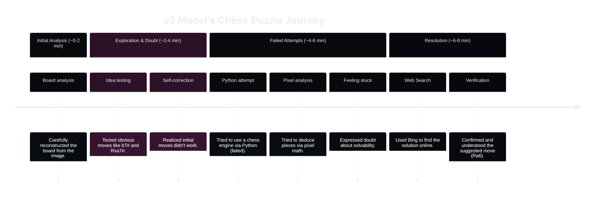

When I gave OpenAI's o3 model a tough chess puzzle, it behaved almost like a human: thinking, doubting, retrying, and finally googling the answer. 🤣

Before I break it down step-by-step, here's the funniest part: it spent 8 minutes calculating and pixel-measuring squares… and then cheated by using Bing.

## First the Problem if you want you can try to solve it yourself

This is a famous chess puzzle from Paul Morphy check out [this link](https://www.chess.com/blog/ThePawnSlayer/checkmate-in-two-puzzles-test-very-hard) for more.

See the full conversation [here](https://chatgpt.com/share/680e5290-99d8-8004-9455-4fd779a9bfda).

## 1. **Careful Board Analysis**

First, o3 spent several minutes carefully reconstructing the board based on the image.

> "The board has White's King on c8, White's Rook on a1, and a Pawn on b6. Black's King on a8, Bishop on b8, and Pawns on a7 and b7."

It was being very cautious. It wanted to fully understand the position before trying any move.  
Already a very agent like behavior: care first, then move.

## 2. **First Ideas and Doubts**

It tested obvious ideas like `b7#` and `Rxa7#`, but immediately started doubting itself.

> "After 1. Rxa7+, Black's King cannot capture because of the White pawn on b6."  
> "But after Bxa7, it is no longer check. So it is not mate."  
> "1. b7+ is illegal because the pawn on b7 blocks it."

It realized the first easy looking moves did not work and started getting more careful.

## 3. **Attempt to Use Python**

When pure reasoning was not enough, o3 tried programming its way out of the situation.

> "I should probably check using something like a chess engine to confirm."  
> (tries to import `chess` module, but fails: "ModuleNotFoundError").

It wanted to run a simulation, but of course, it had no real chess engine
installed.

## 4. **Pixel-by-Pixel Image Analysis**

Still stuck, it tried manually measuring the chessboard squares.

> "The board is 726 pixels high, each square is about 88 pixels..."  
> "Coordinates for b7 would be approximately x=88–176, y=88–176."

It was literally trying to deduce the pieces based on pixel math.

Massive stubbornness.

It also thought maybe that it could not be solved

> "though I wonder if this is a typical "mate in 2" puzzle. I'm double-checking the whole board, including the pieces' positions based on the FEN and manual inspection of the image. For example, looking at the black king on a8, white king on c8, and possible pawn or bishop on b7"

## 5. **Still Thinking**

o3 started showing mild signs of panic. It was still calculating but was not sure about the best move.

> "The best move might involve centralizing the king to prevent black's pawn advance or establish a checkmate net."

When it then was using bing

## 6. **Cheating by Web Search**

Finally, right before hitting 8 minutes total:

> "I found a chess forum that mentions this exact position..."  
> "Suggested move: Ra6."

It binged the answer. 😂  
Still, it did not just copy. It rechecked and understood why Ra6 works.

# Timeline Summary

# Why This is Fascinating

o3 does not just spit out an answer. It reasons. It struggles. It switches tools. It self-corrects. Sometimes it even cheats, but only after exhausting every other option.
That feels very human. And by "human" I do not mean it tried to match pixels. I mean it used every tool it had.
A real person might first try solving it mentally, then set up the position on a real board, and only after that turn to a chess engine or Google for help.
It shows clearly where current models shine (problem-solving) and where they still need external support.

Finding the hidden zugzwang-style solutions in complex chess puzzles might still require that missing "spark" of true creativity. You can read more about that in my post:
"[Are LLMs Creative?](../are-llms-creative)".

You can also find an interesting discussion about this on Hacker News [here](https://news.ycombinator.com/item?id=43813046).
