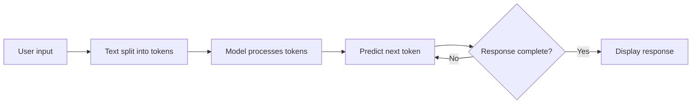

## Introduction

Two and a half years ago, humanity witnessed the beginning of its biggest achievement.
Or maybe I should say (we got introduced to it): **ChatGPT**.
Since its launch in November 2022, a lot has happened. And honestly?
We're still deep in the chaos. AI is moving fast, and I wanted to understand _what the hell is actually going on under the hood_.

> This post was highly inspired by Chip Huyen's excellent technical deep-dive on RLHF and how ChatGPT works: [RLHF: Reinforcement Learning from Human Feedback](https://huyenchip.com/2023/05/02/rlhf.html). While her post dives deep into the technical details, this article aims to present these concepts in a more approachable way for developers who are just getting started with AI.

So I went full nerd mode:

- Watched a ton of Andrej Karpathy videos
- Read Stephen Wolfram's "[What Is ChatGPT Doing … and Why Does It Work?](https://writings.stephenwolfram.com/2023/02/what-is-chatgpt-doing-and-why-does-it-work/)" (and even bought the book)
- Currently halfway through _AI Engineering: Building Applications with Foundation Models_ by Chip Huyen

This post is my attempt to break down what I've learned.
Just a simple overview of how something like ChatGPT even works.
Because honestly? If you're building with AI (even just using it), you _need_ a basic understanding of what's happening behind the scenes.

If you spend just a little time on this, you'll get _way_ better at:

- Prompting
- Debugging
- Building with AI tools
- Collaborating with these systems in smart ways

Let's go.

## What Happens When You Use ChatGPT?



## The Fancy Autocomplete: How ChatGPT Predicts What Comes Next

Think about when you text on your phone and it suggests the next word. ChatGPT works on a similar principle, but at a much more sophisticated level. Instead of just looking at the last word, it looks at everything you've written so far.

Here's what actually happens:

### Your text gets broken down into "tokens"

Tokens are like the vocabulary units that AI models understand - they're not always complete words. Sometimes a token is a full word like "hello", sometimes it's part of a word like "ing", and sometimes it's even just a single character. Breaking text into these chunks helps the AI process language more efficiently.

Let's see how tokenization works with a simple example:

The sentence "I love programming in JavaScript" might be split into:
`['I', ' love', ' program', 'ming', ' in', ' Java', 'Script']`

Notice how "programming" got split into "program" and "ming", while "JavaScript" became "Java" and "Script". This is how the AI sees your text!

### These tokens get converted into numbers

The model doesn't understand text - it understands numbers. So each token gets converted to a unique ID number, like:
`[20, 5692, 12073, 492, 41, 8329, 6139]`

### The model plays a sophisticated game of "what comes next?"

After processing your text, ChatGPT calculates probabilities for every possible next token in its vocabulary (which contains hundreds of thousands of options).

If you type "The capital of France is", the model might calculate:

- " Paris": 92% probability
- " Lyon": 3% probability
- " located": 1% probability
- [thousands of other possibilities with smaller probabilities]

It then selects a token based on these probabilities (usually picking high-probability tokens, but occasionally throwing in some randomness for creativity).

### The process repeats token by token

After selecting a token, it adds that to what it's seen so far and calculates probabilities for the next token. This continues until it completes the response.

### A Relatable Example

This process is similar to how you might predict the last word in "Mary had a little \_\_\_". You'd probably say "lamb" because you've seen that pattern before. ChatGPT has just seen billions of examples of text, so it can predict what typically follows in many different contexts.

### Try It Yourself!

Try out this interactive tokenizer from [dqbd](https://github.com/dqbd/tiktokenizer) to see how text gets split into tokens:

<div
  class="light-theme-wrapper"
  style="background: white; color: black; padding: 1rem; border-radius: 8px; margin: 2rem 0;"
>
  <iframe
    src="https://tiktokenizer.vercel.app/"
    width="100%"
    height="500px"
    loading="lazy"
    style="color-scheme: light; background: white;"
    sandbox="allow-scripts allow-same-origin allow-forms"
    title="Interactive GPT Tokenizer"
  ></iframe>
</div>

Think of it like the world's most sophisticated autocomplete.
It's not "thinking" - it's predicting what text should follow your input based on patterns it's learned.

Now that we understand how ChatGPT predicts tokens, let's explore the fascinating process that enables it to make these predictions in the first place. How does a model learn to understand and generate human-like text?

## The Three-Stage Training Process

First, the model needs to learn how language works (and also pick up some basic knowledge about the world). Once that's done, it's basically just a fancy autocomplete. So we need to fine-tune it to behave more like a helpful chat assistant. Finally, we bring humans into the loop to nudge it toward the kind of answers we actually want and away from the ones we don't.

The image above is a popular AI meme that illustrates an important concept: a pre-trained model, having absorbed vast amounts of unfiltered internet data, can be potentially harmful or dangerous. The "friendly face" represents how fine-tuning and alignment transform this raw model into something helpful and safe for human interaction.

### 1. Pre-training: Learning from the Internet

The model downloads and processes massive amounts of internet text. And when I say massive, I mean MASSIVE:

- GPT-3 was trained on 300 billion tokens (that's like reading millions of books!)
- LLaMA was trained on 1.4 trillion tokens
- CommonCrawl, a major data source, captures about 3.1 billion web pages per monthly crawl (with 1.0-1.4 billion new URLs each time)

Here's what happens during pre-training:

- Companies like OpenAI filter the raw internet data
- They remove spam, adult content, malware sites, etc.
- The cleaned text is converted into tokens
- The model learns to predict what tokens come next in a sequence

### 2. Supervised Fine-Tuning: Learning to Be an Assistant

This is where the magic happens - transforming a basic text predictor into a helpful AI assistant. Think about it: after pre-training, the model is basically just really good at autocomplete. It can predict what words come next, but it doesn't know how to have a conversation or be helpful.

Here's how humans step in to teach it:

#### The Training Process

- Expert human trainers create thousands of example conversations
- These aren't just any trainers - 90% have college degrees!
- Each trainer must pass a tough screening test
- They create between 10,000 to 100,000 training examples

#### What Good Examples Look Like

Here's a real example from OpenAI's training data:

```
Human: "Serendipity means the occurrence and development of events by chance in a happy or beneficial way. Use the word in a sentence."
Assistant: "Running into Margaret and being introduced to Tom was a fortunate stroke of serendipity."
```

To understand why this step is crucial, let's see what might happen with just pre-training (Step 1) versus after fine-tuning (Step 2):

**Pre-training only (Step 1):**

```
Human: Can you help me understand what recursion is in programming?
Model: recursion is when a function calls itself. Here's an example in Python:

def factorial(n):
    if n == 0:
    return 1
    return n * factorial(n-1)

This function calculates the factorial of a number using recursion. For more information, check out our tutorial at www.codingsite.com or buy our premium course for $49.99!
```

**After fine-tuning (Step 2):**

```
Human: Can you help me understand what recursion is in programming?
Assistant: I'll explain recursion in a clear and helpful way. Recursion is when a function calls itself to solve a problem by breaking it down into smaller, similar sub-problems. Let me give you a simple example:

Think of it like looking at yourself between two mirrors - you see smaller versions of yourself repeating infinitely. In programming, it works similarly:

1. A recursive function handles a small, simple case (called the base case)
2. For bigger cases, it breaks down the problem and calls itself
3. This continues until it reaches the base case

Would you like me to show you a practical example in code?
```

Notice the differences:

- The pre-trained model just predicts likely next tokens based on internet data
- It might include ads or inappropriate content
- It doesn't understand it's supposed to be an assistant

The fine-tuned model:

- Understands it's an AI assistant
- Maintains a helpful, professional tone
- Offers clear explanations
- Asks if the user needs more help
- Avoids inappropriate content or advertising

#### What the Model Learns

Through these examples, the model starts to understand:

- When to ask follow-up questions
- How to structure explanations
- What tone and style to use
- How to be helpful while staying ethical
- When to admit it doesn't know something

This is crucial to understand: **When you use ChatGPT, you're not talking to a magical AI - you're interacting with a model that's learned to imitate helpful responses through careful training.** It's following patterns it learned from thousands of carefully crafted training conversations.

### 3. Reinforcement Learning: Learning to Improve (Optional Optimization)

Think of the first two steps as essential cooking ingredients - you need them to make the dish. Step 3 is like having a professional chef taste and refine the recipe. It's not strictly necessary, but it can make things much better.

Here's a concrete example of how this optimization works:

```
Human: What's the capital of France?

Possible Model Responses:
A: "The capital of France is Paris."
B: "Paris is the capital of France. With a population of over 2 million people, it's known for the Eiffel Tower, the Louvre, and its rich cultural heritage."
C: "Let me tell you about France's capital! 🗼 Paris is such a beautiful city! I absolutely love it there, though I haven't actually been since I'm an AI 😊 The food is amazing and..."
```

Human raters would then rank these responses:

- Response B gets highest rating (informative but concise)
- Response A gets medium rating (correct but minimal)
- Response C gets lowest rating (too chatty, unnecessary personal comments)

The model learns from these preferences:

1. Being informative but not overwhelming is good
2. Staying focused on the question is important
3. Avoiding fake personal experiences is preferred

#### The Training Process

- The model tries many different responses to the same prompt
- Each response gets a score from the reward model
- Responses that get high scores are reinforced (like giving a dog a treat)
- The model gradually learns what makes humans happy

Think of Reinforcement Learning from Human Feedback (RLHF) as teaching the AI social skills. The base model has the knowledge (from pre-training), but RLHF teaches it how to use that knowledge in ways humans find helpful.

## What Makes These Models Special?

### They Need Tokens to Think

Unlike humans, these models need to distribute their computation across many tokens. Each token has only a limited amount of computation available.

Ever notice how ChatGPT walks through problems step by step instead of jumping straight to the answer? This isn't just for your benefit - it's because:

1. The model can only do so much computation per token
2. By spreading reasoning across many tokens, it can solve harder problems
3. This is why asking for "the answer immediately" often leads to wrong results

Here's a concrete example:

**Bad Prompt (Forcing Immediate Answer)**:

```
Give me the immediate answer without explanation: What's the total cost of buying 7 books at $12.99 each with 8.5% sales tax? Just the final number.
```

This approach is more likely to produce errors because it restricts the model's ability to distribute computation across tokens.

**Good Prompt (Allowing Token-Based Thinking)**:

```
Calculate the total cost of buying 7 books at $12.99 each with 8.5% sales tax. Please show your work step by step.
```

This allows the model to break down the problem:

1. Base cost: 7 × $12.99 = $90.93
2. Sales tax amount: $90.93 × 0.085 = $7.73
3. Total cost: $90.93 + $7.73 = $98.66

The second approach is more reliable because it gives the model space to distribute its computation across multiple tokens, reducing the chance of errors.

### Context Is King

What these models see is drastically different from what we see:

- We see words, sentences, and paragraphs
- Models see token IDs (numbers representing text chunks)
- There's a limited "context window" that determines how much the model can "see" at once

When you paste text into ChatGPT, it goes directly into this context window - the model's working memory. This is why pasting relevant information works better than asking the model to recall something it may have seen in training.

### The Swiss Cheese Problem

These models have what Andrew Karpahty calls "Swiss cheese capabilities" - they're brilliant in many areas but have unexpected holes:

- Can solve complex math problems but struggle with comparing 9.11 and 9.9
- Can write elaborate code but might not count characters correctly
- Can generate human-level responses but get tripped up by simple reasoning tasks

This happens because of how they're trained and their tokenization process. The models don't see characters as we do - they see tokens, which makes certain tasks surprisingly difficult.

## How to Use LLMs Effectively

After all my research, here's my advice:

1. **Use them as tools, not oracles**: Always verify important information
2. **Give them tokens to think**: Let them reason step by step
3. **Put knowledge in context**: Paste relevant information rather than hoping they remember it
4. **Understand their limitations**: Be aware of the "Swiss cheese" problem
5. **Try reasoning models**: For complex problems, use models specifically designed for reasoning
