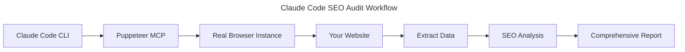
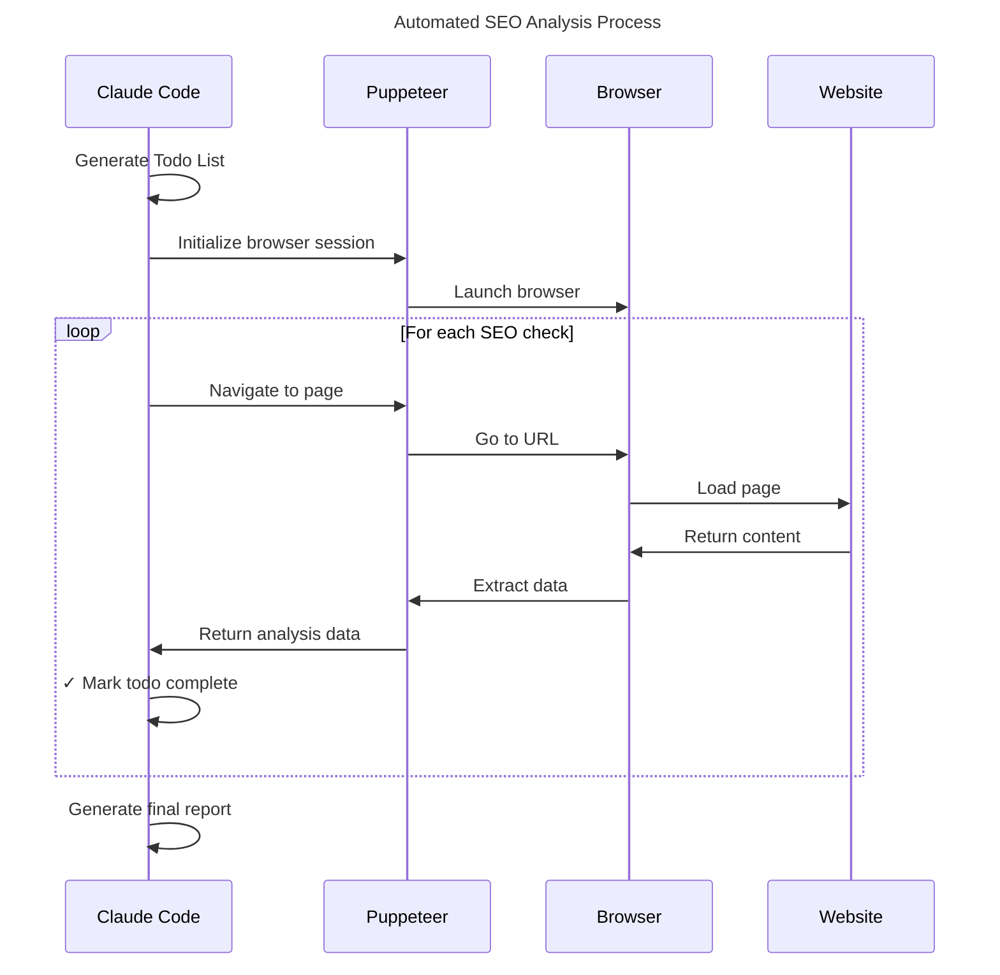
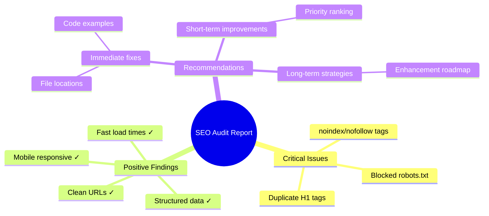

I'm building a Nuxt blog starter called [NuxtPapier](https://github.com/alexanderop/NuxtPapier). Like any developer who wants their project to show up in search results, I needed to make sure it works well with search engines. Manual SEO audits take too much time and I often miss things, so I used Claude Code with Puppeteer MCP to do this automatically.

## What is Claude Code?

Claude Code is Anthropic's official command-line tool that brings AI help right into your coding workflow. Think of it like having a skilled developer sitting next to you, ready to help with any coding task. What makes it really powerful for SEO audits is that it can use MCP (Model Context Protocol) tools. For a deeper look at what Claude Code can do, see my [[understanding-claude-code-full-stack|overview of the full Claude Code feature stack]].

## Enter Puppeteer MCP

> **What is MCP?**  
> According to [Anthropic's official documentation](https://www.anthropic.com/news/model-context-protocol), the Model Context Protocol (MCP) is "an open standard that enables developers to build secure, two-way connections between their data sources and AI-powered tools." It provides a universal interface for connecting AI systems with external tools, systems, and data sources, replacing fragmented integrations with a single protocol.

MCP lets Claude Code connect with outside tools and services. I was using the [Puppeteer MCP server](https://github.com/merajmehrabi/puppeteer-mcp-server) which gives Claude Code the power to:

- Control a real web browser with code
- Go to any website
- Take screenshots
- Pull data from web pages
- Check page structure and speed

This means Claude Code can visit your website, look at it the same way search engines do, and give you detailed insights.



## My SEO Audit Prompt

Here's the exact prompt I used:

```
You are a SEO expert your name is John Wick. I gave you so much money now you have to do a SEO audit for this blog. When you are done write down everything into a own markdown file so I can solve the problems later. Use Puppeteer MCP, the server is already running.
```

Simple and direct. It uses Claude Code's ability to act like an expert while using the Puppeteer tools.

Claude Code quickly responded with:

> "I'll do a complete SEO audit for your blog, Senpai Alex. Let me start by making a plan and then checking your site using Puppeteer."

## The Automated Process

One of the coolest things is how Claude Code organizes itself by making todos. It quickly made its own plan:

**Claude Code's Self-Generated Todo List:**

- [ ] Navigate to the homepage and take screenshots
- [ ] Analyze meta tags and SEO elements
- [ ] Check blog post pages for optimization
- [ ] Evaluate page structure and heading hierarchy
- [ ] Analyze site performance and loading times
- [ ] Check mobile responsiveness
- [ ] Review robots.txt and sitemap availability
- [ ] Document all findings in a markdown report

What amazed me was how Claude Code worked through each todo step by step, using Puppeteer to get real data from my site - checking meta tags, measuring how fast pages load, checking structured data, and even taking mobile screenshots. It checked off each item as it finished them.

While working, Claude Code told me what it found:

> "I found a big SEO problem - the robots meta tag says 'noindex, nofollow' which stops search engines from finding your site. This is a major issue."



## The Report

Claude Code created a detailed SEO audit report that I could actually use. It included:

**Critical Issues:**

- My site had `noindex, nofollow` meta tags (development setting blocking all search engines!)
- robots.txt was blocking all crawlers
- Duplicate H1 tags on blog posts

**Positive Findings:**

- Proper structured data implementation
- Good mobile responsiveness
- Fast page load times (200ms)
- Clean URL structure

**What to Fix:**

- Quick fixes with code examples
- Short-term improvements ranked by importance
- Long-term improvement plans

The report even told me exactly which files to change and what code to fix.

Claude Code wrapped up with:

> "The audit found big blocking problems - search engines can't see your site because of noindex, nofollow meta tags and development robots.txt settings. But the good news is your blog has great technical basics with proper structured data, mobile-friendly design, and fast loading."



## Why This Workflow Works So Well

1. **Speed**: Claude Code finished in minutes what would take me hours to do by hand
2. **Complete**: Claude Code checked things I might have missed
3. **Useful Results**: Not just problems, but solutions with code examples
4. **Documentation**: Everything saved in a markdown file I can use later

## Getting Started

To copy this workflow:

1. Install Claude Code: `npm install -g @anthropic/claude-code`
2. Set up the [Puppeteer MCP server](https://github.com/merajmehrabi/puppeteer-mcp-server)
3. Start your development server
4. Give Claude Code a clear prompt about what you want checked

Claude Code's smarts plus Puppeteer's browser control makes a powerful SEO audit tool that any developer can use. No more guessing about SEO problems - just run the audit and get a professional report in minutes. You can further automate workflows like this using [[claude-code-customization-guide-claudemd-skills-subagents|CLAUDE.md, skills, and subagents]].

Try it on your own projects and see what SEO problems you might be missing!
