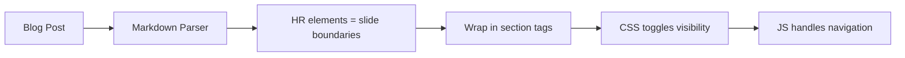

This blog has a presentation mode feature that transforms any post into fullscreen slides. Press **P** on any post with `presentation: true` in its frontmatter, and you get keyboard navigation, incremental reveals, and even drawing annotations. This tutorial explains how it works so you can build something similar for your Astro site.

## Heavily Inspired by Slidev

Before diving in, I want to credit [Slidev](https://sli.dev/) by Anthony Fu as the primary inspiration for this implementation. Slidev is an excellent presentation framework built on Vue, and many of the concepts here come directly from it:

- The v-click syntax for incremental reveals
- CSS-based slide scaling approach
- Keyboard shortcuts (P, arrows, G for grid)
- The magic-move animation concept for code transitions
- Slide layout patterns

**Why build this instead of using Slidev directly?** Content reuse. With presentation mode built into the blog, I can write a post once and present it at meetups without recreating everything in another tool. The blog post and presentation share a single source of truth.

## Core Architecture

The key insight is to use **CSS visibility toggling** instead of DOM manipulation. This preserves React component hydration and event handlers, which is critical for interactive components in slides.

Here's how it works:

1. Horizontal rules (`---`) in markdown become slide boundaries
2. Content between `<hr>` elements gets wrapped in `<section data-slide="N">` elements
3. A `.presentation-active` class on the article triggers CSS that hides all slides
4. Only the slide with `.slide-visible` class is displayed
5. JavaScript handles keyboard events and manages which slide is visible

This approach is similar to Reveal.js - slides exist in the DOM at all times, with CSS handling visibility.



## Step-by-Step Implementation

### 1. Content Schema Setup

First, add a `presentation` field to your content schema. In Astro, this lives in `src/content/config.ts`:

```typescript
// src/content/config.ts
import { defineCollection, z } from "astro:content";

const blog = defineCollection({
  type: "content",
  schema: z.object({
    title: z.string(),
    description: z.string(),
    pubDatetime: z.date(),
    // Add presentation support
    presentation: z.boolean().optional().default(false),
    conference: z.string().optional(), // Optional: for displaying event name
    // ... other fields
  }),
});
```

Now posts can opt-in to presentation mode:

```yaml
---
title: "My Talk"
presentation: true
conference: "VueConf 2026"
---
```

### 2. Conditional Rendering in Layout

In your post layout component, check the frontmatter flag and render the presentation component:

```astro
---
// src/layouts/PostDetails.astro
import PresentationMode from "@features/presentation/components/PresentationMode";

const { presentation, conference, title } = Astro.props.post.data;
---

<article id="article" class="prose mx-auto mt-8 max-w-5xl">
  <Content />
</article>

{presentation && (
  <PresentationMode
    client:load
    articleSelector="#article"
    title={title}
    conference={conference}
  />
)}
```

The `client:load` directive ensures React hydrates immediately, which is needed for keyboard event handling.

### 3. Slide Wrapping Logic

The core transformation happens in a utility function that wraps content between `<hr>` elements:

```typescript
// src/features/presentation/utils/slideWrapper.ts
export function wrapSlidesInPlace(article: HTMLElement): SlideData[] {
  const children = Array.from(article.childNodes);
  const slides: SlideData[] = [];
  let currentSlideContent: Node[] = [];
  let slideIndex = 0;

  const createSlide = (content: Node[], index: number): SlideData | null => {
    if (content.length === 0) return null;

    const slideEl = document.createElement("section");
    slideEl.dataset.slide = String(index);

    // Move content into the slide element (preserves React hydration!)
    content.forEach(node => slideEl.appendChild(node));

    return {
      element: slideEl,
      layout: "default",
      totalClicks: 0,
    };
  };

  children.forEach(child => {
    if (child.nodeName === "HR") {
      // HR = slide boundary
      const slide = createSlide(currentSlideContent, slideIndex);
      if (slide) {
        article.insertBefore(slide.element, child);
        slides.push(slide);
        slideIndex++;
      }
      // Mark HR for hiding
      if (child instanceof HTMLElement) {
        child.classList.add("slide-separator");
      }
      currentSlideContent = [];
    } else {
      currentSlideContent.push(child);
    }
  });

  // Don't forget the last slide
  const lastSlide = createSlide(currentSlideContent, slideIndex);
  if (lastSlide) {
    article.appendChild(lastSlide.element);
    slides.push(lastSlide);
  }

  return slides;
}
```

**Critical detail**: We use `appendChild` to move nodes, not `innerHTML`. This preserves React component instances and their event handlers.

### 4. CSS Visibility System

The CSS uses a fixed canvas approach (borrowed from Slidev) with responsive scaling:

```css
/* src/styles/presentation.css */

/* Lock body scroll */
html.presentation-mode,
body.presentation-mode {
  overflow: hidden !important;
}

/* Fullscreen container with scaling */
.presentation-active {
  position: fixed !important;
  inset: 0 !important;
  z-index: 101 !important;
  background-color: black !important;
  display: flex !important;
  align-items: center !important;
  justify-content: center !important;

  /* Slidev-style scale calculation */
  --slide-scale: min(
    calc(100vw / (var(--slide-canvas-width) * 1px)),
    calc(100vh / (var(--slide-canvas-height) * 1px))
  );
}

/* Hide all slides by default */
.presentation-active [data-slide] {
  display: none;
  opacity: 0;
  width: calc(var(--slide-canvas-width) * 1px);
  height: calc(var(--slide-canvas-height) * 1px);
  transform-origin: center center;
}

/* Show only the current slide */
.presentation-active [data-slide].slide-visible {
  display: flex;
  flex-direction: column;
  opacity: 1;
  transform: scale(var(--slide-scale, 1));
}
```

The `--slide-canvas-width` and `--slide-canvas-height` CSS variables define your base slide dimensions (e.g., 980x552 for 16:9). The scale calculation ensures slides fit any viewport while maintaining aspect ratio.

### 5. Keyboard Navigation

The React component handles keyboard events. Here's the essential structure:

```tsx
// src/features/presentation/components/PresentationMode.tsx
export function PresentationMode({ articleSelector }: Props) {
  const [isOpen, setIsOpen] = useState(false);
  const [currentSlide, setCurrentSlide] = useState(0);
  const slidesRef = useRef<SlideData[]>([]);

  // Keyboard shortcuts
  useEffect(() => {
    const isInputFocused = () => {
      const activeEl = document.activeElement;
      return (
        activeEl instanceof HTMLInputElement ||
        activeEl instanceof HTMLTextAreaElement ||
        (activeEl instanceof HTMLElement && activeEl.isContentEditable)
      );
    };

    const handleKeyDown = (e: KeyboardEvent) => {
      // P toggles presentation (when not in input)
      if (e.key.toLowerCase() === "p" && !isInputFocused()) {
        e.preventDefault();
        setIsOpen(prev => !prev);
        return;
      }

      if (!isOpen) return;

      switch (e.key) {
        case "ArrowRight":
        case " ":
          e.preventDefault();
          goNext();
          break;
        case "ArrowLeft":
          e.preventDefault();
          goPrev();
          break;
        case "Home":
          e.preventDefault();
          goToSlide(0);
          break;
        case "End":
          e.preventDefault();
          goToSlide(totalSlides - 1);
          break;
        case "Escape":
          e.preventDefault();
          setIsOpen(false);
          break;
        case "1": case "2": case "3": case "4": case "5":
        case "6": case "7": case "8": case "9": {
          const slideNum = parseInt(e.key, 10) - 1;
          if (slideNum < totalSlides) {
            goToSlide(slideNum);
          }
          break;
        }
      }
    };

    document.addEventListener("keydown", handleKeyDown);
    return () => document.removeEventListener("keydown", handleKeyDown);
  }, [isOpen, totalSlides]);

  // ... render logic
}
```

**Important**: Check `isInputFocused()` before handling the P key. Otherwise, typing "p" in any input field would toggle the presentation.

### 6. V-Click Animations (Slidev Feature)

V-clicks let you reveal content incrementally. The implementation has two parts:

**Syntax parsing** - For `.md` files, use HTML comments:

```markdown
<!--v-click-->
This appears on click 1.

<!--v-click-->
This appears on click 2.
```

For `.mdx` files, use components:

```mdx
<VClick />
This appears on click 1.

<VClick />
This appears on click 2.
```

**Click tracking** - The parser extracts click markers and adds data attributes:

```typescript
// Simplified from src/features/presentation/utils/vclickParser.ts
export function parseClickSteps(html: string) {
  const clickSteps: ClickStep[] = [];
  let clickCounter = 0;

  // Replace <!--v-click--> with data attributes
  const processedHtml = html.replace(
    /<!--v-click(?::(\d+))?-->/g,
    (match, explicitOrder) => {
      const order = explicitOrder ? parseInt(explicitOrder) : ++clickCounter;
      clickSteps.push({ order, type: "show" });
      return `<span data-v-click="${order}" class="vclick-hidden">`;
    }
  );

  return { processedHtml, clickSteps, totalClicks: clickCounter };
}
```

Then CSS handles visibility based on the current click step:

```css
.vclick-hidden {
  opacity: 0;
  pointer-events: none;
}

.vclick-visible {
  opacity: 1;
  pointer-events: auto;
  transition: opacity 0.3s ease;
}
```

### 7. Slide Layouts

Support different layouts with metadata extraction. In `.md` files:

```markdown
<!--slide:{"layout":"cover","image":"/hero.jpg"}-->
# My Title
```

In `.mdx` files, use a component:

```mdx
<Slide layout="cover" image={heroImage} />
# My Title
```

The parser extracts this metadata and applies data attributes:

```typescript
const metadata = extractSlideMetadata(slideEl);
slideEl.dataset.slideLayout = metadata.layout || "default";

if (metadata.image) {
  slideEl.style.backgroundImage = `url(${metadata.image})`;
}
```

Then CSS handles each layout:

```css
/* Cover layout - centered title with optional background */
.presentation-active [data-slide][data-slide-layout="cover"] {
  justify-content: center;
  align-items: center;
  text-align: center;
  background-size: cover;
  background-position: center;
}

/* Two-column layout */
.presentation-active [data-slide][data-slide-layout="two-cols"] {
  display: grid;
  grid-template-columns: 1fr 1fr;
  gap: 2rem;
}
```

## Key Implementation Decisions

| Decision | Why |
|----------|-----|
| CSS visibility over DOM copying | Preserves React hydration and event handlers |
| HTML comments for `.md` syntax | Works without build changes or custom plugins |
| Components for `.mdx` syntax | Type safety and better developer experience |
| Feature directory structure | Encapsulation - all presentation code in one place |
| Slidev-compatible v-click syntax | Familiar to developers who know Slidev |

## Bonus Features

The full implementation includes several additional features:

**Drawing mode** - Press D to draw annotations on slides using Excalidraw. Drawings persist per-slide and can be saved to localStorage.

**URL sharing** - Navigate to a slide and copy the URL (`/post/my-talk#slide-3`). Direct links open the presentation at that slide.

**Grid overview** - Press G to see a thumbnail grid of all slides. Click to jump to any slide.

**Magic Move** - Animated code transitions using shiki-magic-move. Show code evolution with smooth token morphing.

**PDF/PNG export** - Use Playwright to capture slides as screenshots, then compile into a PDF.

## Getting Started Checklist

If you want to implement this for your Astro blog:

1. **Create the directory structure**:
   ```
   src/features/presentation/
   ├── components/
   │   └── PresentationMode.tsx
   ├── utils/
   │   └── slideWrapper.ts
   └── index.ts
   ```

2. **Add the schema field** in `src/content/config.ts`

3. **Add conditional rendering** in your post layout

4. **Create the CSS file** at `src/styles/presentation.css`

5. **Import the CSS** in your global styles

6. **Start simple** - Get P key toggling and arrow navigation working first, then add features incrementally

## Conclusion

Building presentation mode for an Astro blog is achievable with:

- **CSS visibility toggling** instead of DOM manipulation
- **Horizontal rules** as natural slide boundaries
- **React components** with `client:load` for interactivity
- **Feature directory structure** for maintainability

The full source code for this implementation is available in the . Press P on that page to see all the features in action.

And again, huge thanks to [Anthony Fu](https://antfu.me/) and the [Slidev](https://sli.dev/) project for the inspiration. If you're building standalone presentations (not blog posts), definitely check out Slidev - it's fantastic.
