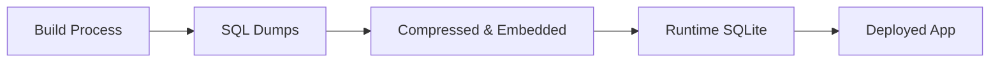
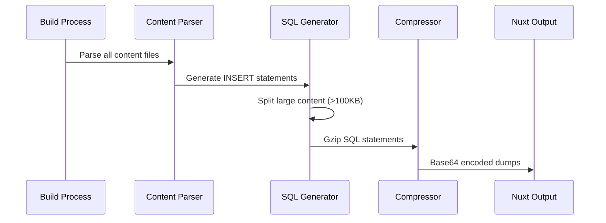
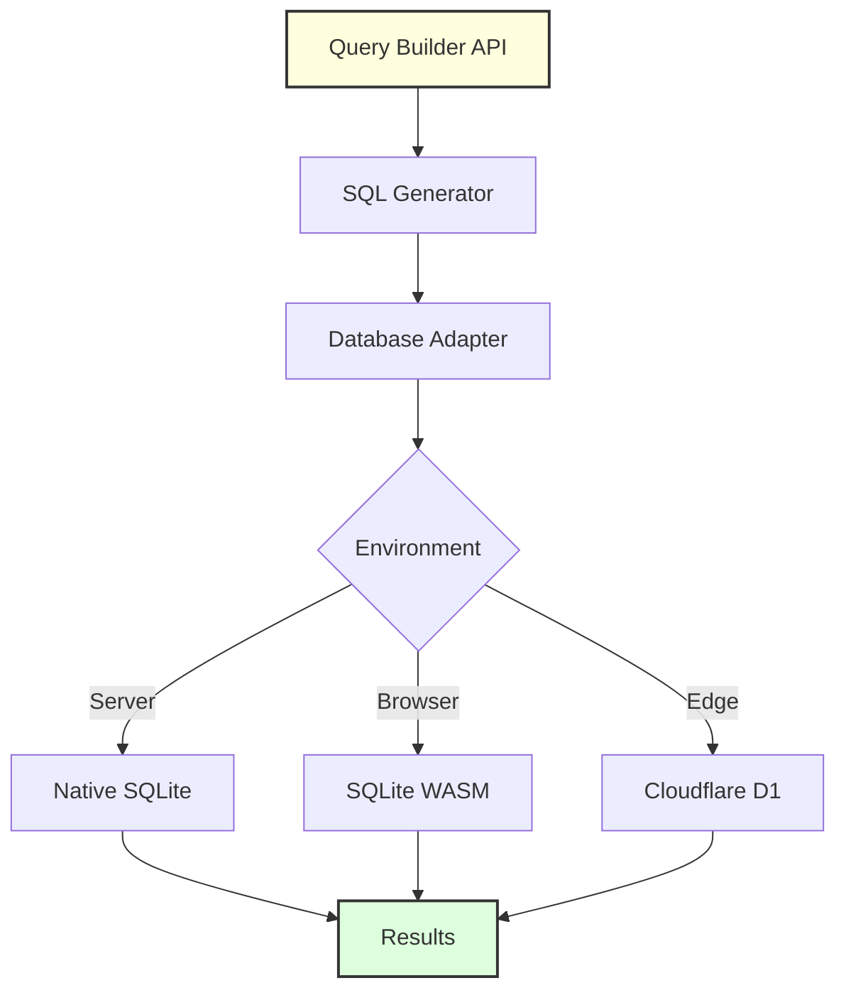
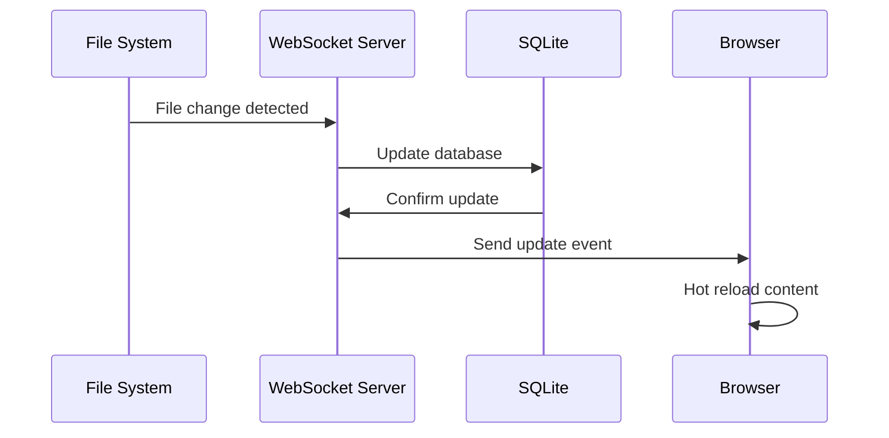

Have you ever wondered how Nuxt Content manages to deliver lightning-fast content queries while supporting both server-side and client-side rendering? The secret lies in its clever use of SQLite. In this post, we'll explore how Nuxt Content transforms your markdown files into a powerful SQL database, making it one of the most innovative content management systems in the Vue ecosystem.

## What Makes Nuxt Content Special?

Unlike traditional CMS systems that require external databases or API calls, Nuxt Content takes a unique approach:

1. **Build-time Processing**: Your content is processed and optimized during build time
2. **SQLite at the Core**: Uses SQLite for blazing-fast queries
3. **Works Everywhere**: Runs on servers, edge workers, and even in browsers
4. **Type-Safe**: Provides full TypeScript support for your content

## The Journey of Your Content: From Markdown to SQLite

Let's trace how a simple markdown file becomes a queryable database record:


### Step 1: Content Discovery and Parsing

When you run `nuxt build` or `nuxt dev`, Nuxt Content scans your `content/` directory. Each file goes through a specialized parser based on its extension:

- `.md` files → Markdown parser (with MDC support for Vue components)
- `.yml`/`.yaml` → YAML parser
- `.json` → JSON parser
- `.csv` → CSV parser

```javascript
// Example content file: content/blog/my-post.md
---
title: My First Blog Post
date: 2024-01-15
tags: [nuxt, sqlite, vue]
---

# Welcome to my blog!

This is my first post using Nuxt Content.
```

### Step 2: Schema-Driven Table Generation

Here's where it gets interesting. Nuxt Content uses Zod schemas to define collection structures, which are then converted to SQL tables:


The schema transformation happens in `src/runtime/database/sqlite/utils.ts`:

```typescript
// Simplified version of how Nuxt Content creates tables
function createTableFromSchema(collection: string, schema: ZodSchema) {
  const sqlColumns = Object.entries(schema.shape).map(([key, type]) => {
    const sqlType = mapZodTypeToSQL(type);
    return `${key} ${sqlType}`;
  });

  return `CREATE TABLE _content_${collection} (
    id TEXT PRIMARY KEY,
    ${sqlColumns.join(",\n    ")},
    __hash__ TEXT
  );`;
}
```

### Step 3: The Dual Database System

One of Nuxt Content's clever features is its dual database approach:

#### Development Flow


#### Production Flow



## Understanding the SQLite Implementation

### Database Adapters

Nuxt Content supports multiple SQLite implementations through adapters (`src/runtime/database/adapters/`):

1. **better-sqlite3**: Default for Node.js environments
2. **Bun SQLite**: Optimized for Bun runtime
3. **Cloudflare D1**: For edge deployments
4. **SQLite WASM**: Runs SQLite in the browser!

```typescript
// How Nuxt Content selects the right adapter
async function createDatabase(options: DatabaseOptions) {
  if (process.env.NUXT_CONTENT_EXPERIMENTAL_WASM) {
    return createWasmDatabase();
  }
  if (import.meta.env.RUNTIME === "bun") {
    return createBunDatabase();
  }
  if (globalThis.__env__) {
    return createCloudflareDatabase();
  }
  return createNodeDatabase();
}
```

### The Magic of SQL Dumps

During build time, Nuxt Content generates compressed SQL dumps for each collection:



Here's what happens behind the scenes (`src/build/sql-dump.ts`):

```typescript
// Simplified SQL dump generation
async function generateSQLDump(collection: Collection, items: ContentItem[]) {
  const statements = [];

  // Create table
  statements.push(createTableSQL(collection));

  // Generate INSERT statements
  for (const item of items) {
    const sql = generateInsertSQL(collection, item);

    // Handle Cloudflare D1 limits
    if (sql.length > 100_000) {
      statements.push(...splitLargeInsert(sql));
    } else {
      statements.push(sql);
    }
  }

  // Compress and encode
  const compressed = await gzip(statements.join("\n"));
  return base64Encode(compressed);
}
```

### Content Integrity with Hashing

Every piece of content gets a unique hash for change detection:

```typescript
// How content hashing works
function hashContent(item: ContentItem): string {
  const contentString = JSON.stringify(item, Object.keys(item).sort());
  return createHash("sha256")
    .update(contentString)
    .digest("hex")
    .substring(0, 16);
}
```

This enables Nuxt Content to:

- Detect changes efficiently
- Update only modified content
- Validate data integrity

## Querying Your Content

The query system provides a fluent API that generates optimized SQL:

```typescript
// Your code
const posts = await queryCollection('blog')
  .where({ tags: { $contains: 'nuxt' } })
  .order('date', 'DESC')
  .limit(10)
  .find();

// Generated SQL (simplified)
SELECT * FROM _content_blog
WHERE json_extract(tags, '$') LIKE '%"nuxt"%'
ORDER BY date DESC
LIMIT 10;
```

### Query Architecture



## Performance Optimizations

### 1. Chunk Processing

Content is processed in chunks to handle large datasets efficiently (`src/build/process.ts`):

```typescript
const CHUNK_SIZE = 25;

async function processContent(items: ContentItem[]) {
  const chunks = [];
  for (let i = 0; i < items.length; i += CHUNK_SIZE) {
    chunks.push(items.slice(i, i + CHUNK_SIZE));
  }

  // Process chunks in parallel
  await Promise.all(chunks.map(processChunk));
}
```

### 2. Client-Side Caching

In the browser, SQL dumps are cached in localStorage:

```typescript
// Simplified caching logic
async function loadDatabase() {
  const cached = localStorage.getItem(`nuxt-content-${collection}`);
  const checksum = await fetchChecksum();

  if (cached && cached.checksum === checksum) {
    return cached.data;
  }

  const sqlDump = await fetchSQLDump();
  localStorage.setItem(`nuxt-content-${collection}`, {
    checksum,
    data: sqlDump,
  });

  return sqlDump;
}
```

### 3. WebSocket Hot Reload

During development, content changes are instantly reflected:



## Real-World Example: Blog System

Let's see how all these pieces come together in a blog:

```vue
<!-- pages/blog/[slug].vue -->
<template>
  <article>
    <h1>{{ post.title }}</h1>
    <time>{{ post.date }}</time>
    <ContentRenderer :value="post" />
  </article>
</template>

<script setup>
// This query becomes an optimized SQL query
const { slug } = useRoute().params;
const post = await queryCollectionItem("blog", slug);
</script>
```

Behind the scenes:

1. Query is converted to SQL: `SELECT * FROM _content_blog WHERE id = ?`
2. SQLite executes the query in microseconds
3. Results are type-safe and ready to use

## Key Takeaways

1. **SQLite Everywhere**: Nuxt Content runs SQLite in Node.js, Bun, browsers, and edge workers
2. **Build-Time Optimization**: Content is pre-processed and optimized during build
3. **Type Safety**: Full TypeScript support from schema to query results
4. **Performance**: Chunk processing, caching, and SQL optimization for speed
5. **Developer Experience**: Hot reload, WebSocket updates, and intuitive query API

## Conclusion

Nuxt Content's SQLite implementation showcases innovative approaches to content management:

- **Portability**: Works anywhere JavaScript runs
- **Performance**: Sub-millisecond queries with SQLite
- **Simplicity**: No external database needed
- **Flexibility**: From simple blogs to complex content systems

By understanding how Nuxt Content leverages SQLite, you can build faster, more efficient content-driven applications. The combination of build-time processing, runtime flexibility, and SQLite's power creates a unique solution that pushes the boundaries of what's possible in modern web development.

## Learn More

- [Nuxt Content Documentation](https://content.nuxt.com)
- [Source Code: Database Implementation](https://github.com/nuxt/content/tree/main/src/runtime/database)
- [Source Code: Build Process](https://github.com/nuxt/content/tree/main/src/build)
- [SQLite WASM Documentation](https://sqlite.org/wasm/doc/trunk/index.md)
