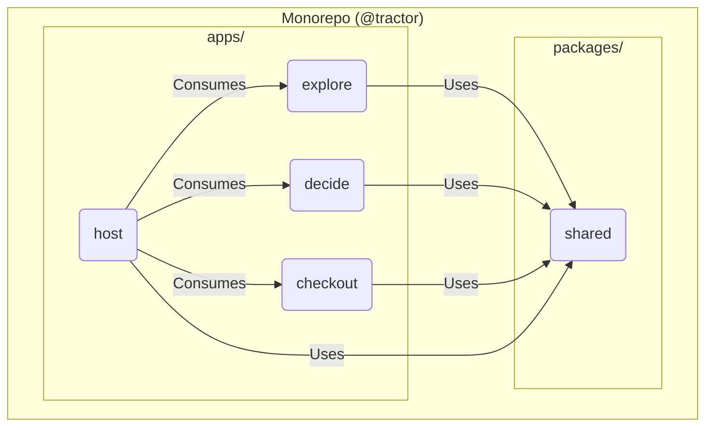

> 
  Monorepo with `pnpm`. Vue 3 SPA. Client side composition with Module
  Federation. Host owns routing. Events for navigation. Cart sync through
  localStorage plus events. Shared UI library for consistency. Fallbacks for
  remote failures. Code:
  https://github.com/alexanderop/tractorStoreVueModuleFederation

> 
  You know Vue and basic bundling. You want to split a SPA into independent
  parts without tight coupling. If you do not have multiple teams or deployment
  bottlenecks, you likely do not need microfrontends.

I wanted to write about microfrontends three years ago. My first touchpoint was the book _Micro Frontends in Action_ by Michael Geers. It taught me a lot, and I was still confused. This post shows a practical setup that works today with Vue 3 and Module Federation.

## Scope

We build microfrontends for a Vue 3 SPA with client side composition. Server and universal rendering exist, but they are out of scope here.

> Microfrontends are the technical representation of a business subdomain. They allow independent implementations with minimal shared code and single team ownership.
> (Luca Mezzalira)

## The Tractor Store in one minute

The Tractor Store is a reference shop that lets us compare microfrontend approaches on the same feature set (explore, decide, checkout). It is clear enough to show boundaries and realistic enough to surface routing, shared state, and styling issues.

## Architecture decisions

| Question         | Decision                                                        | Notes                                              |
| ---------------- | --------------------------------------------------------------- | -------------------------------------------------- |
| Repo layout      | Monorepo with `pnpm` workspaces                                 | Shared configs, atomic refactors, simple local dev |
| Composition      | Client side with Module Federation                              | Fast iteration, simple hosting                     |
| Routing          | Host owns routing                                               | One place for guards, links, and errors            |
| Team boundaries  | Explore, Decide, Checkout, plus Host                            | Map to clear user flows                            |
| Communication    | Custom events for navigation. Cart via localStorage plus events | Low coupling and no shared global store            |
| UI consistency   | Shared UI library in `packages/shared`                          | Buttons, inputs, tokens                            |
| Failure handling | Loading and error fallbacks in host. Retry once                 | Keep the shell usable                              |
| Styles           | Team prefixes or Vue scoped styles. Tokens in shared            | Prevent leakage and keep a common look             |

Repository layout:

```
├── apps/
│   ├── host/          (Shell application)
│   ├── explore/       (Product discovery)
│   ├── decide/        (Product detail)
│   └── checkout/      (Cart and checkout)
├── packages/
│   └── shared/        (UI, tokens, utils)
└── pnpm-workspace.yaml
```

Workspace definition:

```yaml
packages:
  - "apps/*"
  - "packages/*"
```

High level view:



## Implementation

We compose at the client in the host. The host loads remote components at runtime and routes between them.

### Host router

```ts
// apps/host/src/router.ts
import { createRouter, createWebHistory } from "vue-router";
import { remote } from "../utils/remote";

export const router = createRouter({
  history: createWebHistory(),
  routes: [
    { path: "/", component: remote("explore/HomePage") },
    {
      path: "/products/:category?",
      component: remote("explore/CategoryPage"),
      props: true,
    },
    {
      path: "/product/:id",
      component: remote("decide/ProductPage"),
      props: true,
    },
    { path: "/checkout/cart", component: remote("checkout/CartPage") },
  ],
});
```

### `remote()` utility

> 
Vue `defineAsyncComponent` wraps any loader in a friendly component. It gives lazy loading, built in states, and retries. This is why it fits microfrontends.

```js
import { defineAsyncComponent } from "vue";

const AsyncComp = defineAsyncComponent({
  loader: () => Promise.resolve(/* component */),
  delay: 200,
  timeout: 3000,
  onError(error, retry, fail, attempts) {
    if (attempts <= 1) retry();
    else fail();
  },
});
```

```ts
// apps/host/src/utils/remote.ts
import { defineAsyncComponent, h } from "vue";

export function remote(id: string, delay = 150) {
  return defineAsyncComponent({
    loader: async () => {
      const loader = (window as any).getComponent?.(id);
      if (!loader) throw new Error(`Missing loader for ${id}`);
      return await loader();
    },
    delay,
    loadingComponent: {
      render: () => h("div", { class: "mf-loading" }, "Loading..."),
    },
    errorComponent: {
      render: () => h("div", { class: "mf-error" }, "Failed to load."),
    },
    onError(error, retry, fail, attempts) {
      if (attempts <= 1) setTimeout(retry, 200);
      else fail();
    },
  });
}
```

> 
  Module Federation enables dynamic loading of JavaScript modules from different
  applications at runtime. Think of it as splitting your app into independently
  deployable pieces that can share code and communicate. You can use **Webpack
  5**, **Rspack**, or **Vite** as bundlers. **Rspack offers the most
  comprehensive Module Federation support** with excellent performance, but for
  this solution I used **Rspack** (for the host) and **Vite** (for one remote)
  to showcase interoperability between different bundlers.

### Module Federation runtime

The host bootstraps Module Federation and exposes a single loader.

```ts
// apps/host/src/mf.ts
import {
  createInstance,
  loadRemote,
} from "@module-federation/enhanced/runtime";

declare global {
  interface Window {
    getComponent: (id: string) => () => Promise<any>;
  }
}

createInstance({
  name: "host",
  remotes: [
    {
      name: "decide",
      entry: "http://localhost:5175/mf-manifest.json",
      alias: "decide",
    },
    {
      name: "explore",
      entry: "http://localhost:3004/mf-manifest.json",
      alias: "explore",
    },
    {
      name: "checkout",
      entry: "http://localhost:3003/mf-manifest.json",
      alias: "checkout",
    },
  ],
  plugins: [
    {
      name: "fallback-plugin",
      errorLoadRemote(args: any) {
        console.warn(`Failed to load remote: ${args.id}`, args.error);
        return {
          default: {
            template: `<div style="padding: 2rem; text-align: center; border: 1px solid #ddd; border-radius: 8px; background: #f9f9f9; margin: 1rem 0;">
              <h3 style="color: #c00; margin-bottom: 1rem;">Remote unavailable</h3>
              <p><strong>Remote:</strong> ${args.id}</p>
              <p>Try again or check the service.</p>
            </div>`,
          },
        };
      },
    },
  ],
});

window.getComponent = (id: string) => {
  return async () => {
    const mod = (await loadRemote(id)) as any;
    return mod.default || mod;
  };
};
```

**Why this setup**

- The host is the single source of truth for remote URLs and versions.
- URLs can change without rebuilding remotes.
- The fallback plugin gives a consistent error experience.

## Communication

We avoid a shared global store. We use two small patterns that keep coupling low.

> 
A global store looks handy. In microfrontends it creates tight runtime coupling. That kills independent deploys.

What goes wrong:

- Lockstep releases (one store change breaks other teams)
- Hidden contracts (store shape is an API that drifts)
- Boot order traps (who creates the store and plugins)
- Bigger blast radius (a store error can break the whole app)
- Harder tests (cross team mocks and brittle fixtures)

Do this instead:

- Each microfrontend owns its state
- Communicate with explicit custom events
- Use URL and localStorage for simple shared reads
- Share code not state (tokens, UI, pure utils)
- If shared state grows, revisit boundaries rather than centralize it

> 
  You could use VueUse's `useEventBus` for more Vue-like event communication
  instead of vanilla JavaScript events. It provides a cleaner API with
  TypeScript support and automatic cleanup in component lifecycle. However,
  adding VueUse means another dependency in your microfrontends. The tradeoff is
  developer experience vs. bundle size and dependency management: vanilla
  JavaScript events keep things lightweight and framework-agnostic.

### Navigation through custom events

Remotes dispatch `mf:navigate` with `{ to }`. The host listens and calls `router.push`.

```ts
// apps/host/src/main.ts
window.addEventListener("mf:navigate", (e: Event) => {
  const to = (e as CustomEvent).detail?.to;
  if (to) router.push(to);
});
```

### Cart sync through localStorage plus events

The checkout microfrontend owns cart logic. It listens for `add-to-cart` and `remove-from-cart`. After each change, it writes to localStorage and dispatches `updated-cart`. Any component can listen and re read.

```ts
// apps/checkout/src/stores/cartStore.ts
window.addEventListener("add-to-cart", (ev: Event) => {
  const { sku } = (ev as CustomEvent).detail;
  // update cart array here
  localStorage.setItem("cart", JSON.stringify(cart));
  window.dispatchEvent(new CustomEvent("updated-cart"));
});
```

## Styling

- Design tokens in `packages/shared` (CSS variables).
- Shared UI in `packages/shared/ui` (Button, Input, Card).
- Local isolation with Vue scoped styles or BEM with team prefixes (`e_`, `d_`, `c_`, `h_`).
- Host provides `.mf-loading` and `.mf-error` classes for fallback UI.

Example with BEM plus team prefix:

```css
/* decide */
.d_ProductPage__title {
  font-size: 2rem;
  color: var(--color-primary);
}
.d_ProductPage__title--featured {
  color: var(--color-accent);
}
```

Or Vue scoped styles:

```vue
<template>
  <div class="product-information">
    <h1 class="title">{{ product.name }}</h1>
  </div>
</template>

<style scoped>
.product-information {
  padding: 1rem;
}
.title {
  font-size: 2rem;
}
</style>
```

## Operations

Plan for failure and keep the shell alive.

- Each remote shows a clear loading state and a clear error state.
- Navigation works even if a remote fails.
- Logs are visible in the host during development.

Global styles in the host help here:

```css
/* apps/host/src/styles.css */
.mf-loading {
  display: flex;
  align-items: center;
  justify-content: center;
  padding: 2rem;
  color: var(--color-text-muted);
}

.mf-error {
  padding: 1rem;
  background: var(--color-error-background);
  border: 1px solid var(--color-error-border);
  color: var(--color-error-text);
  border-radius: 4px;
}
```

## More Module Federation features (short hints)

Our solution is simple on purpose. Module Federation can do more. Use these when your app needs them.

**Prefetch** (requires registering lazyLoadComponentPlugin)  
Pre load JS, CSS, and data for a remote before the user clicks (for example on hover). This cuts wait time.

```js
// after registering lazyLoadComponentPlugin on the runtime instance
import { getInstance } from "@module-federation/enhanced/runtime";

const mf = getInstance();
function onHover() {
  mf.prefetch({
    id: "shop/Button",
    dataFetchParams: { productId: "12345" },
    preloadComponentResource: true, // also fetch JS and CSS
  });
}
```

**Component level data fetching**  
Expose a `.data` loader next to a component. The consumer can ask the runtime to fetch data before render (works in CSR and SSR). Use a `.data.client.ts` file for client loaders when SSR falls back.

**Caching for loaders**  
Wrap expensive loaders in a cache helper (with maxAge, revalidate, tag, and custom keys). You get stale while revalidate behavior and tag based invalidation.

```js
// inside your DataLoader file
const fetchDashboard = cache(async () => getStats(), {
  maxAge: 120000,
  revalidate: 60000,
});
```

**Type hinting for remotes**  
`@module-federation/enhanced` can generate types for exposes. Add this to tsconfig.json so editors resolve remote types and hot reload them.

```json
{
  "compilerOptions": { "paths": { "*": ["./@mf-types/*"] } },
  "include": ["./@mf-types/*"]
}
```

**Vue bridge for app level modules**  
Mount a whole remote Vue app into a route when you need an application level integration (not just a component).

```js
import { createRemoteAppComponent } from "@module-federation/bridge-vue3";
const RemoteApp = createRemoteAppComponent({
  loader: () => loadRemote("remote1/export-app"),
});
// router: { path: '/remote1/:pathMatch(.*)*', component: RemoteApp }
```

You can read more about these interesting techniques at [module-federation.io](https://module-federation.io/).

### Summary

This was my first attempt to understand **microfrontends** better while solving the _Tractor Store_ exercise.

In the future, I may also try it with **SSR** and **universal rendering**, which I find interesting.

Another option could be to use **Nuxt Layers** and take a _“microfrontend-ish”_ approach at build time.
