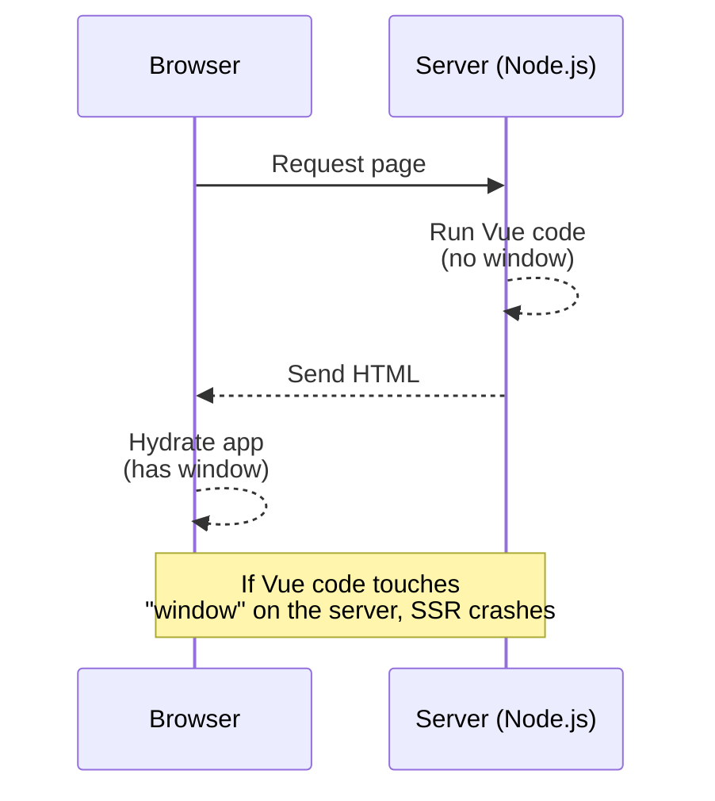
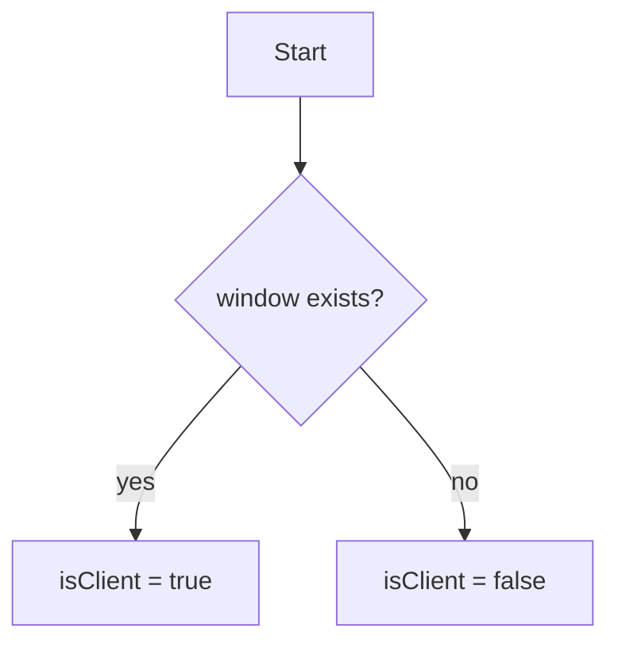
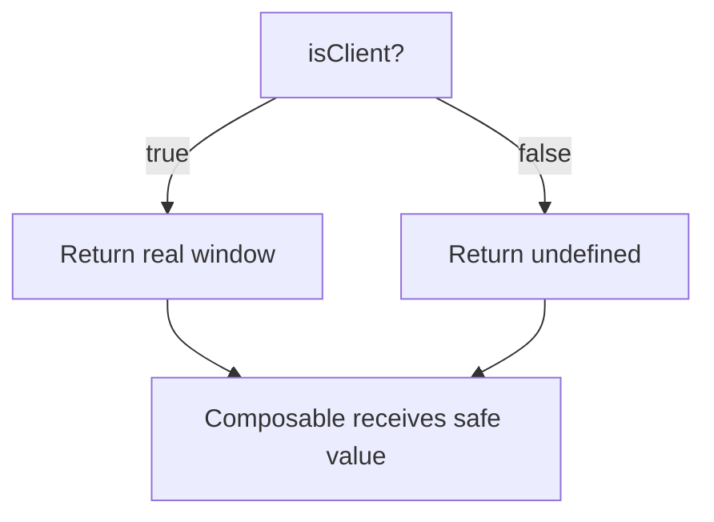
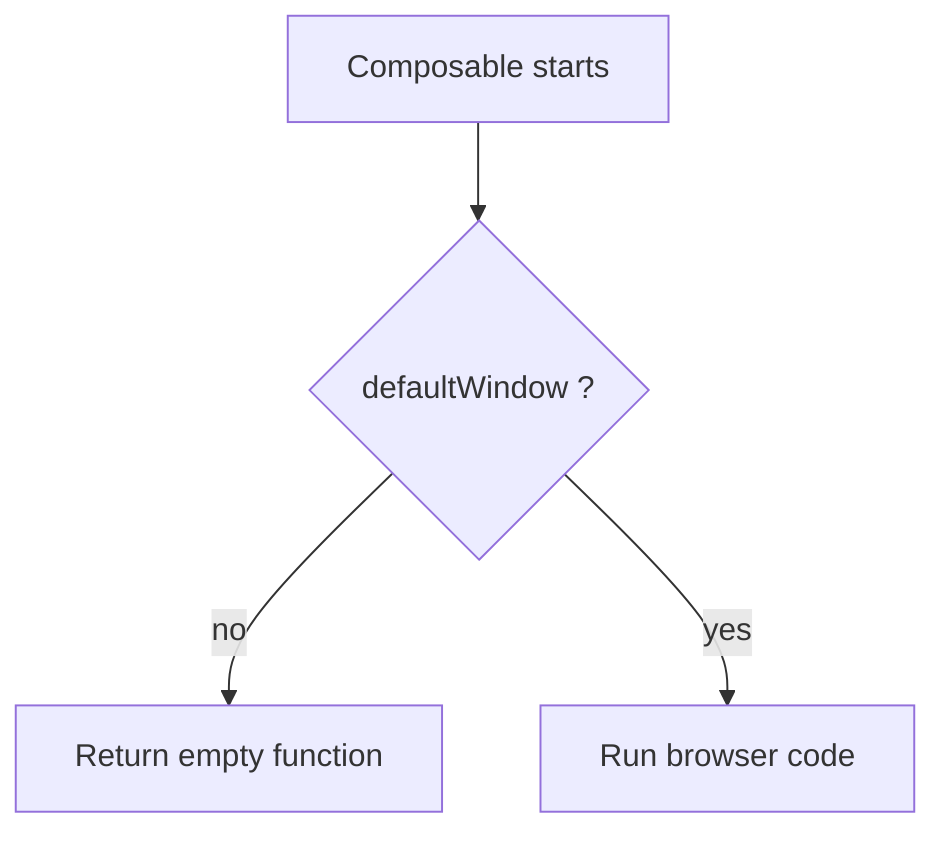

I am a big fan of [VueUse](https://vueuse.org). Every time I browse the docs I discover a new utility that saves me hours of work. Yet VueUse does more than offer nice functions. It also keeps your code safe when you mix client-side JavaScript with server-side rendering (SSR). In this post I show the typical **"`window` is not defined"** problem, explain why it happens, and walk through the simple tricks VueUse uses to avoid it.

## The Usual Pain: `window` Fails on the Server

When you run a Vue app with SSR, Vue executes in **two** places:

1. **Server (Node.js)** – It renders HTML so the user sees a fast first screen.
2. **Browser (JavaScript runtime in the user's tab)** – It takes over and adds interactivity.

The server uses **Node.js**, which has **no browser objects** like `window`, `document`, or `navigator`. The browser has them. If code that needs `window` runs on the server, Node.js throws an error and the page render breaks.

### Diagram: How SSR Works



## Node.js vs Browser: Two Different Worlds

| Feature     | Node.js on the server | Browser in the tab |
| ----------- | --------------------- | ------------------ |
| `window`    | ❌ not defined        | ✅ defined         |
| `document`  | ❌                    | ✅                 |
| `navigator` | ❌                    | ✅                 |
| DOM access  | ❌                    | ✅                 |
| Goal        | Render HTML fast      | Add interactivity  |

A Vue _composable_ that reads the mouse position or listens to scroll events needs those browser objects. It must **not** run while the server renders.

## How VueUse Solves the Problem

VueUse uses three small patterns: a **client check**, **safe defaults**, and an **SSR guard** inside each composable.

### 1. One-Line Client Check

VueUse first asks, "Are we in the browser?" It does that in [`is.ts`](https://github.com/vueuse/vueuse/blob/main/packages/shared/utils/is.ts):

```ts
export const isClient =
  typeof window !== "undefined" && typeof document !== "undefined";
```

#### Diagram



### 2. Safe Defaults for Browser Objects

Instead of making _you_ write `if (isClient)` checks, VueUse exports harmless fallbacks from [`_configurable.ts`](https://github.com/vueuse/vueuse/blob/main/packages/core/_configurable.ts):

```ts
import { isClient } from "@vueuse/shared";

export const defaultWindow = isClient ? window : undefined;
export const defaultDocument = isClient ? window.document : undefined;
export const defaultNavigator = isClient ? window.navigator : undefined;
```

On the server these constants are `undefined`. That value is safe to read, so nothing crashes.

#### Diagram



### 3. The SSR Guard Inside Every Composable

Each composable that might touch the DOM adds a simple guard. Example: [`onElementRemoval`](https://github.com/vueuse/vueuse/blob/main/packages/core/onElementRemoval/index.ts):

```ts
export function onElementRemoval(options: any = {}) {
  const { window = defaultWindow } = options;

  if (!window)
    // server path
    return () => {}; // no-op

  // browser logic goes here
}
```

If `window` is `undefined`, the function returns a no-op and exits. The server render keeps going without errors.

#### Diagram



### 4. Extra Safety with `useSupported`

Sometimes you **are** in the browser, but the user's browser lacks a feature. VueUse offers [`useSupported`](https://github.com/vueuse/vueuse/blob/main/packages/core/useSupported/index.ts) to check that:

```ts
export function useSupported(test: () => unknown) {
  const isMounted = useMounted();
  return computed(() => {
    isMounted.value; // make it reactive
    return Boolean(test());
  });
}
```

#### Example: `useEyeDropper`

`useEyeDropper` checks both SSR and feature support (see the full file [here](https://github.com/vueuse/vueuse/blob/main/packages/core/useEyeDropper/index.ts)):

```ts
export function useEyeDropper() {
  const isSupported = useSupported(
    () => typeof window !== "undefined" && "EyeDropper" in window
  );

  async function open() {
    if (!isSupported.value) return; // safe exit
    const eyeDropper = new (window as any).EyeDropper();
    await eyeDropper.open();
  }

  return { isSupported, open };
}
```

## Wrap-Up

- **Node.js** renders HTML but lacks browser globals.
- **VueUse** avoids crashes with three steps:
  1. A single **`isClient`** flag tells where the code runs.
  2. **Safe defaults** turn `window`, `document`, and `navigator` into `undefined` on the server.
  3. Every composable adds a quick **SSR guard** that eliminates environment concerns.

Because of this design you can import any VueUse composable, even ones that touch the DOM, and trust it to work in SSR without extra code.

### Learn More

- VueUse guidelines that inspired these patterns: [https://vueuse.org/guidelines](https://vueuse.org/guidelines)
- Full VueUse repository: [https://github.com/vueuse/vueuse](https://github.com/vueuse/vueuse)
