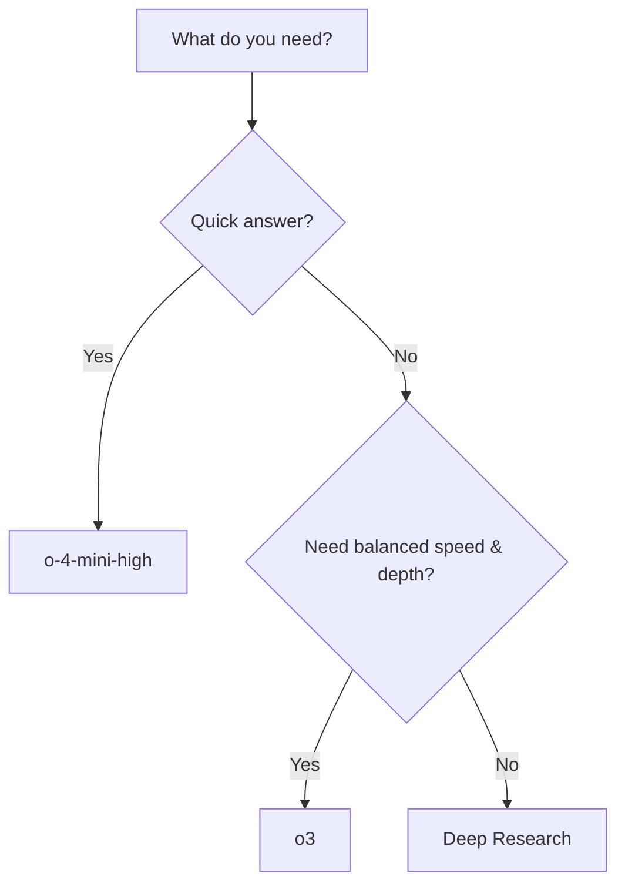

## tldr:

> **Prompt:** "How does Vercel use Speakeasy for API testing?"

| Feature / Model       | o-4-mini-high                     | o3                                      | Deep Research                              |
| --------------------- | --------------------------------- | --------------------------------------- | ------------------------------------------ |
| **Speed**             | ⚡ Instant                        | 🕒 Conversational                       | 🐢 Slower                                  |
| **Depth of Response** | 🟢 Basic facts                    | 🟡 Balanced depth                       | 🔵 Comprehensive analysis                  |
| **Citation Quality**  | Inline links only                 | Inline links                            | 30+ footnotes                              |
| **Latency Friction**  | None                              | Low                                     | High (3-min delay)                         |
| **Cost**              | 💸 Lowest                         | 💸 Moderate                             | 💸💸 Highest                               |
| **Best Use Case**     | Sanity-checks, quick verification | Background research, architectural docs | Formal research, literature-style analysis |
| **Output Length**     | Medium (~4.8k characters)         | Longer (~7.5k characters)               | Very Long (~13.9k characters)              |
| **Sources Used**      | 10                                | 15                                      | 31                                         |
| **Ideal Context**     | Slack pings, fact-checks          | Blog prep, decision-making              | Deep dive reports, whitepapers             |

## Introduction

While reading about the "Docs as Tests" approach to API documentation, I found something interesting about Vercel using Speakeasy for their API testing. This caught my attention because I wanted to learn more about how they put this into practice.

Last week, Simon Willison had published a compelling argument that modern LLMs have essentially "solved" web search for everyday research tasks (with the caveat that you should still verify any potential inaccuracies). ([AI assisted search-based research actually works now](https://simonwillison.net/2025/Apr/21/ai-assisted-search/))

This gave me an idea: instead of using Google like most people would, I could test different LLM models against each other. I decided to ask three different OpenAI models the same research question:

## Why is this now working?

The key difference with models like o3 is that they're no longer just language models that predict the next token—they're becoming mini agents. This means they can also predict when to call a function or use a tool, like running a Python script or performing a web search.

For example, o3 is often powered by tools like Bing for real-time web access or a Python interpreter for calculations. That’s why it can generate tables, analyze data, and reason with up-to-date information.

Traditional "vanilla" models (that only predict the next token without tools) are limited—they rely solely on their internal knowledge, which can be outdated and prone to hallucinations. But once you give a model access to tools, it can fetch accurate, real-world context on demand, making its next-token prediction much smarter.

## Model Response Analysis

> **Prompt:** "How does Vercel use Speakeasy for API testing?"

### Raw Response Samples

_(First words of each, to give you a feel for the tone)_

### 🟢 o-4-mini-high

Vercel leverages Speakeasy's OpenAPI-driven toolchain to generate both their official TypeScript SDK and a comprehensive suite of contract tests based on their public spec at `https://openapi.vercel.sh` ([sdk/tests-overlay.yaml at main · vercel/sdk · GitHub](https://github.com/vercel/sdk/blob/main/tests-overlay.yaml), [Testing | Speakeasy](https://www.speakeasy.com/product/api-testing)). Using the Speakeasy CLI's `speakeasy test` command, they spin up a mock server and validate every endpoint against its schema automatically ([GitHub - speakeasy-api/speakeasy](https://github.com/speakeasy-api/speakeasy)). To handle endpoints that are still evolving, Vercel maintains a `tests-overlay.yaml` overlay file in their SDK repository, which disables specific tests by annotating operations with `x-speakeasy-test: false` ([sdk/tests-overlay.yaml at main · vercel/sdk · GitHub](https://github.com/vercel/sdk/blob/main/tests-overlay.yaml)). This entire process is woven into their CI/CD via GitHub Actions: running `speakeasy configure tests` scaffolds a "Test SDKs" workflow that executes these tests on every pull request ([Testing in GitHub Actions](https://www.speakeasy.com/docs/customize-testing/github-actions)). As a showcase customer, Vercel is explicitly listed on Speakeasy's product page among world-class API teams using automated API testing in their pipelines ([Testing | Speakeasy](https://www.speakeasy.com/product/api-testing)).

_Thought for 41 seconds · 10 sources_  
_Characters: 4,811_

[Full conversation →](https://chatgpt.com/share/6813248e-cd28-8004-8cb4-ab662014271b)

### 🟡 o3 Result

Speakeasy sits in Vercel's CI/CD pipeline as an **OpenAPI-driven "safety-net"**: every time the Vercel REST-API spec changes, Speakeasy (1) regenerates an SDK, (2) boots a ready-made Bun test-suite that hits live endpoints, and (3) compares the new spec against the last published contract in its registry. The workflow automatically runs in GitHub Actions; if an endpoint breaks schema, status-codes, or core behaviour, the job fails and engineers are alerted before the change ships. Below is a deep-dive into each moving part and how they fit together.

#### Why Vercel Automates API Tests

- Vercel's public API is used by thousands of deploy hooks, CLIs, and partners; even a minor breaking change can halt customer CI pipelines. Speakeasy markets its testing product to "world-class API companies" and lists Vercel as a reference logo, highlighting reliability as a selling point. ([Testing | Speakeasy](https://www.speakeasy.com/product/api-testing?utm_source=chatgpt.com))
- In Speakeasy's Series A announcement the company calls out Vercel as one of the "fast-growing innovators" that relies on automated contract testing to "make sure no unintentional breaking changes get shipped." ([Speakeasy's $15M Series A](https://www.speakeasy.com/post/fundraising-series-a?utm_source=chatgpt.com))

_Thought for 1m 25s · 15 Sources_  
_Characters: 7,483_

[Full conversation →](https://chatgpt.com/share/68132509-ea28-8004-8cf0-beeb88c77577)

### 🔵 Deep Research

#### Vercel's Speakeasy-Powered API Toolchain

Vercel uses Speakeasy to automate its REST API tooling – generating SDKs, docs, mocks and tests from an OpenAPI spec. In late 2024 Vercel announced a new **TypeScript SDK** (`@vercel/sdk`) built with Speakeasy ([Introducing the Vercel TypeScript SDK - Vercel](https://vercel.com/changelog/introducing-the-vercel-typescript-sdk#:~:text=This%20SDK%20includes%3A)). The SDK is **fully type-safe** (using Zod schemas) and provides complete coverage of the Vercel REST API ([Introducing the Vercel TypeScript SDK - Vercel](https://vercel.com/changelog/introducing-the-vercel-typescript-sdk#:~:text=This%20SDK%20includes%3A)) ([Using the Vercel SDK - Vercel API Docs](https://vercel.com/docs/rest-api/sdk#:~:text=The%20%60%40vercel%2Fsdk%60%20is%20a%20type,of%20the%20Vercel%20REST%20API)). In fact, Vercel's SDK repo explicitly notes "SDK Created by Speakeasy" ([GitHub - vercel/sdk](https://github.com/vercel/sdk?trk=public_post_comment-text#:~:text=SDK%20Created%20by%20Speakeasy)). Under the hood, Vercel maintains an OpenAPI spec (`vercel-spec.json`) and a Speakeasy config (`.speakeasy/gen.yaml`) that drives code generation. A GitHub Actions workflow invokes the Speakeasy CLI on each update, regenerating the SDK (and publishing to npm) whenever the API spec changes. This ensures the SDK and docs stay in sync with the API. As a result, every Vercel endpoint is exposed via the SDK with up-to-date **documentation and code examples**, and the generated code is optimized (e.g. "standalone functions" for tree-shaking) ([Introducing the Vercel TypeScript SDK - Vercel](https://vercel.com/changelog/introducing-the-vercel-typescript-sdk#:~:text=,REST%20API%20with%20Zod%20schemas)) ([Using the Vercel SDK - Vercel API Docs](https://vercel.com/docs/rest-api/sdk#:~:text=The%20%60%40vercel%2Fsdk%60%20is%20a%20type,of%20the%20Vercel%20REST%20API)).

_Research completed in 3m · 31 sources_  
_Characters: 13,942_

[Full conversation →](https://chatgpt.com/share/6813258e-4a70-8004-a4ec-a229ac12ac6c)

### Key Finding

For _search-focused_ tasks, **o3 beat Deep Research**. I got almost the same depth but twice as fast and for a fraction of the cost.

## Choosing the Right Model

## Best Practices for LLM Research

My testing matches what Simon Willison recently said about using AI to search for information. He made a strong point:

> I still don’t fully trust these tools not to make mistakes. But for small, low-risk tasks, I might skip double-checking.

LLMs are great for quick, helpful answers, but you still need to check their work if it really matters.

**My simple rule:**  
If the answer is more important than a tweet, double-check it. Look for two good sources or ask a second AI.  
You’ll catch most errors in under a minute.
Also its always worth to check the original sources.

## Conclusion

LLM search helps you _start_ a research rabbit-hole in seconds:

- Use **o3** for deeper answers that balance depth and speed
- Switch to **o-4-mini-high** when time is of the essence
- Choose **Deep Research** only when you need a comprehensive report with extensive citations

In practice, cost considerations play a significant role in model selection. With a $20 monthly subscription, my usage of Deep Research and o3 needs to be strategic. The key is matching the model to both your needs and context: When I'm on my smartphone and need quick answers, o4-mini-high is my go-to choice for its balance of speed and simplicity.

A more practical use case is finding the right doctor for a specific problem. Instead of dealing with Google's clutter (like ads, SEO traps, and scattered reviews), I can just ask a reasoning model to do the heavy lifting. It can quickly suggest the top three doctors who best match my situation. Then I can check their websites myself to get a feel for them. This way, I do not just save time; I also make more informed decisions.
