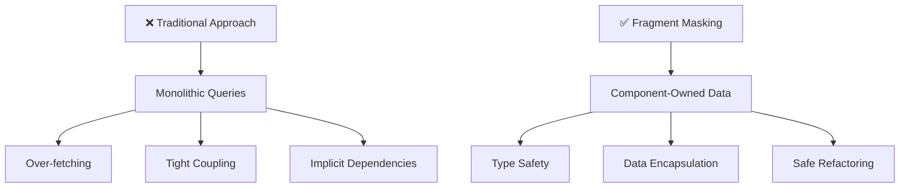
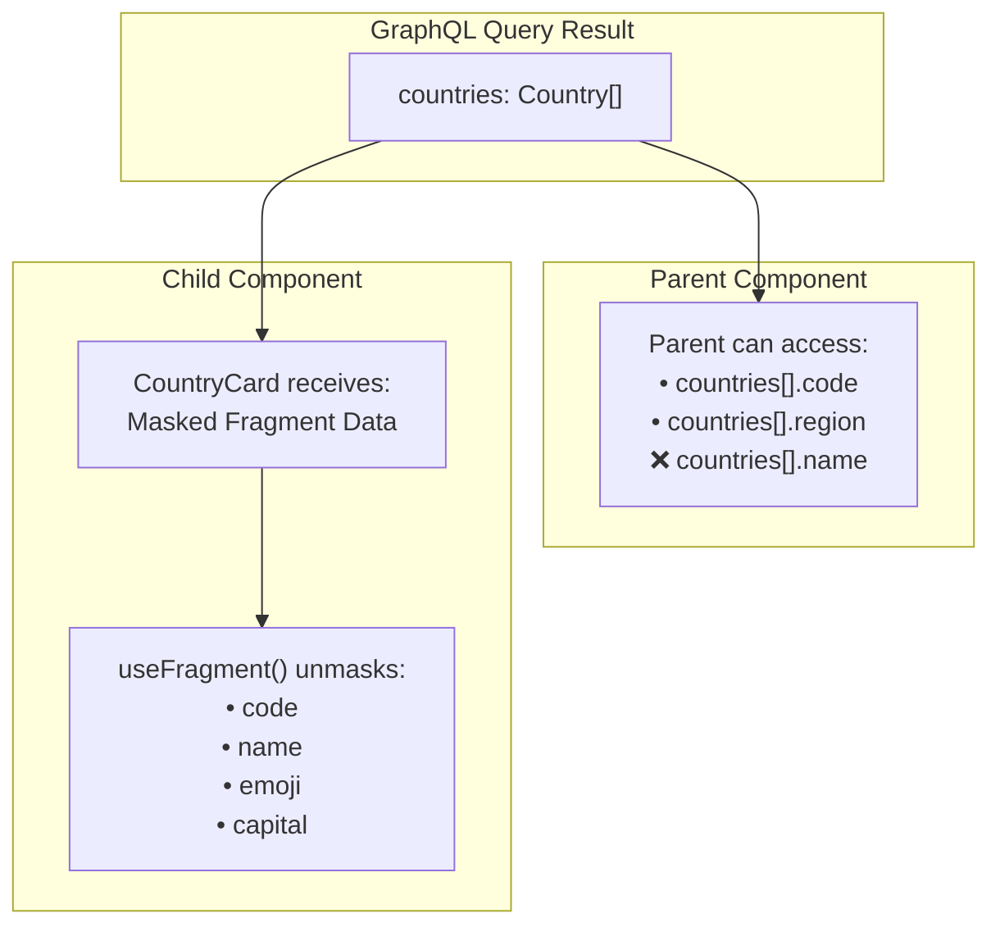
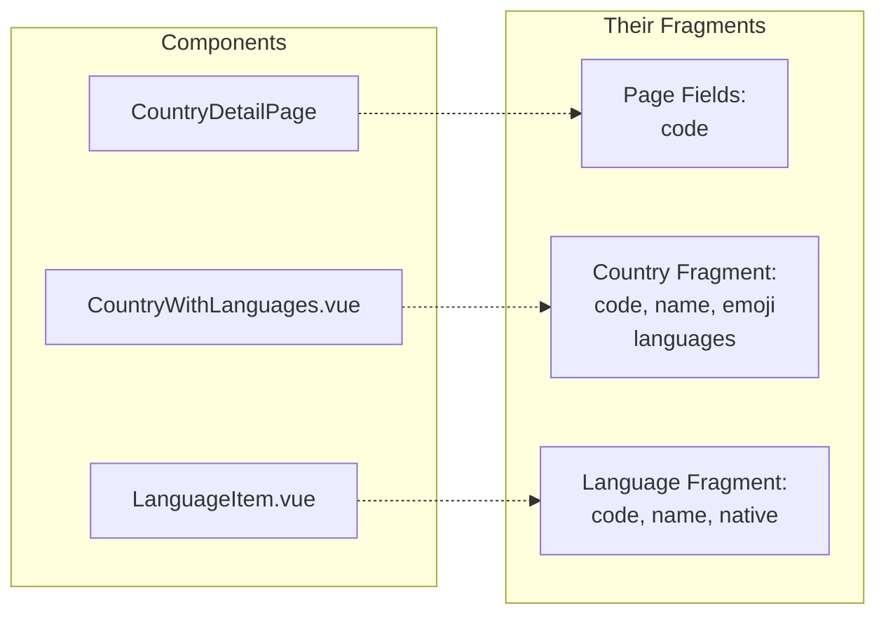
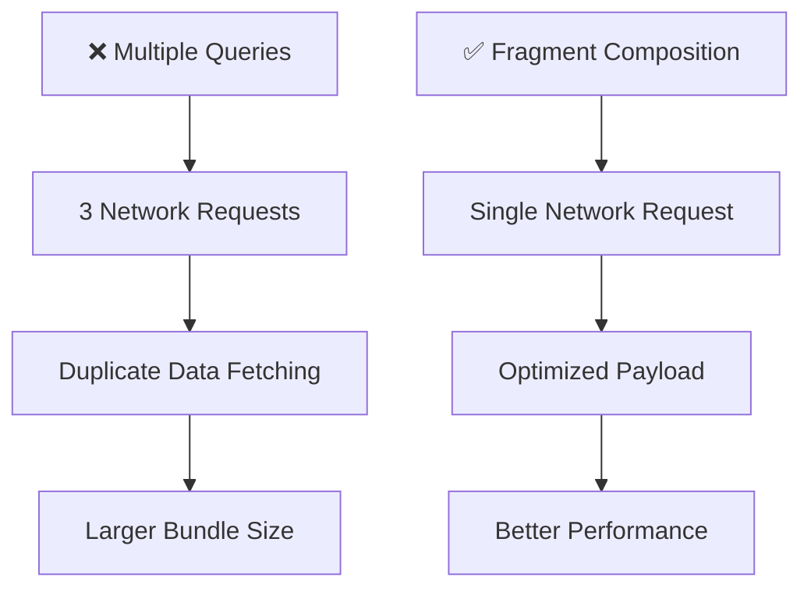

## Why Fragments Are a Game-Changer

In Part 2, we achieved type safety with GraphQL Code Generator. But our queries are still monolithic—each component doesn't declare its own data needs. This creates several problems:

- **Over-fetching**: Parent components request data their children might not need
- **Under-fetching**: Adding a field means hunting down every query using that type
- **Tight coupling**: Components depend on their parents to provide the right data
- **Implicit dependencies**: Parent components can accidentally rely on data from child fragments
- **Brittle refactoring**: Changing a component's data needs can break unrelated components

Enter GraphQL fragments with **fragment masking**—the pattern that Relay popularized and that Apollo Client 3.12 has made even more powerful. This transforms how we think about data fetching by providing **true data encapsulation** at the component level.

## What Are GraphQL Fragments?

GraphQL fragments are **reusable units of fields** that components can declare for themselves. But they're more than just field groupings—when combined with fragment masking, they provide **data access control**.

```graphql
fragment CountryBasicInfo on Country {
  code
  name
  emoji
  capital
}
```

**Fragment masking** is the key innovation that makes fragments truly powerful. It ensures that:

1. **Data is encapsulated**: Only the component that defines a fragment can access its fields
2. **Dependencies are explicit**: Components can't accidentally rely on data from other fragments
3. **Refactoring is safe**: Changing a fragment won't break unrelated components
4. **Type safety is enforced**: TypeScript prevents accessing fields you didn't request

## Understanding Fragments Through the Spread Operator

If you're familiar with JavaScript's spread operator, fragments work exactly the same way:

```javascript
// JavaScript objects
const basicInfo = { code: "US", name: "United States" };
const fullCountry = { ...basicInfo, capital: "Washington D.C." };
```

```graphql
# GraphQL fragments
fragment CountryBasicInfo on Country {
  code
  name
}

query GetCountryDetails {
  country(code: "US") {
    ...CountryBasicInfo # Spread fragment fields
    capital # Add extra fields
  }
}
```

**Fragment masking** takes this further by ensuring components can only access the data they explicitly request—pioneered by **Relay** and now enhanced in **Apollo Client 3.12**.

## Step 1: Enable Fragment Masking

Ensure your `codegen.ts` uses the client preset (from Part 2):

```typescript
const config: CodegenConfig = {
  overwrite: true,
  schema: "https://countries.trevorblades.com/graphql",
  documents: ["src/**/*.vue", "src/**/*.graphql"],
  generates: {
    "src/gql/": {
      preset: "client",
      plugins: [],
      config: { useTypeImports: true },
    },
  },
};
```

This generates:

- `FragmentType<T>`: Masked fragment types for props
- `useFragment()`: Function to unmask fragment data
- Type safety to prevent accessing non-fragment fields

## Step 2: Your First Fragment with Masking

Let's create a `CountryCard` component that declares its own data requirements:

```vue
<script setup lang="ts">
import { computed } from "vue";
import { graphql } from "../gql";
import { FragmentType, useFragment } from "../gql/fragment-masking";

// Define what data this component needs
const CountryCard_CountryFragment = graphql(`
  fragment CountryCard_CountryFragment on Country {
    code
    name
    emoji
    capital
    phone
    currency
  }
`);

// Props accept a masked fragment type
interface Props {
  country: FragmentType<typeof CountryCard_CountryFragment>;
}

const props = defineProps<Props>();

// Unmask to access the actual data (reactive for Vue)
const country = computed(() =>
  useFragment(CountryCard_CountryFragment, props.country)
);
</script>

<template>
  <div class="country-card">
    <h3>{{ country.emoji }} {{ country.name }}</h3>
    <p>Capital: {{ country.capital }}</p>
    <p>Phone: +{{ country.phone }}</p>
    <p>Currency: {{ country.currency }}</p>
  </div>
</template>
```

## Understanding Fragment Masking: The Key to Data Isolation

**Fragment masking** is the core concept that makes this pattern so powerful. It's not just about code organization—it's about **data access control and encapsulation**.

### What Fragment Masking Actually Does

Think of fragment masking like **access control in programming languages**. Just as a module can have private and public methods, fragment masking controls which components can access which pieces of data.

```typescript
// Without fragment masking (traditional approach)
const result = useQuery(GET_COUNTRIES);
const countries = result.value?.countries || [];

// ❌ Parent can access ANY field from the query
console.log(countries[0].name); // Works
console.log(countries[0].capital); // Works
console.log(countries[0].currency); // Works
```

With fragment masking enabled:

```typescript
// ✅ Parent component CANNOT access fragment fields
const name = result.value?.countries[0].name; // TypeScript error!

// ✅ Only CountryCard can access its fragment data
const country = useFragment(CountryCard_CountryFragment, props.country);
console.log(country.name); // Works!
```

### The Power of Data Encapsulation

Fragment masking provides **true data encapsulation**:

1. **Prevents Implicit Dependencies**: Parent components can't accidentally rely on data their children need
2. **Catches Breaking Changes Early**: If a child component removes a field, the parent can't access it anymore
3. **Enforces Component Boundaries**: Each component owns its data requirements
4. **Enables Safe Refactoring**: Change a fragment without breaking unrelated components

### Why This Matters

Without fragment masking, parent components can accidentally depend on child fragment data. When the child removes a field, the parent breaks at runtime. With fragment masking, TypeScript catches this at compile time.

```typescript
// Parent can only access explicitly requested fields
countries[0].id; // ✅ Works (parent requested this)
countries[0].name; // ❌ TypeScript error (only in fragment)

// Child components unmask their fragment data
const country = useFragment(CountryCard_CountryFragment, props.country);
country.name; // ✅ Works (component owns this fragment)
```

> **📝 Vue Reactivity Note**: Always wrap `useFragment` in a `computed()` for Vue reactivity. This ensures the component updates when fragment data changes.

## Step 3: Parent Component Uses the Fragment

Now the parent component includes the child's fragment in its query:

```vue
<script setup lang="ts">
import { computed } from "vue";
import { useQuery } from "@vue/apollo-composable";
import { graphql } from "../gql";
import CountryCard from "./CountryCard.vue";

const COUNTRIES_WITH_DETAILS_QUERY = graphql(`
  query CountriesWithDetails {
    countries {
      code
      # Parent can add its own fields
      region
      # Child component's fragment
      ...CountryCard_CountryFragment
    }
  }
`);

const { result, loading, error } = useQuery(COUNTRIES_WITH_DETAILS_QUERY);

// Parent can access its own fields
const countriesByRegion = computed(() => {
  if (!result.value?.countries) return {};

  return result.value.countries.reduce(
    (acc, country) => {
      const region = country.region;
      if (!acc[region]) acc[region] = [];
      acc[region].push(country);
      return acc;
    },
    {} as Record<string, typeof result.value.countries>
  );
});

// But parent CANNOT access fragment fields:
// const name = result.value?.countries[0].name ❌ TypeScript error!
</script>

<template>
  <div class="countries-container">
    <div v-if="loading">Loading countries...</div>
    <div v-else-if="error">Error: {{ error.message }}</div>
    <div v-else class="countries-by-region">
      <div
        v-for="(countries, region) in countriesByRegion"
        :key="region"
        class="region-section"
      >
        <h2>{{ region }}</h2>
        <div class="country-grid">
          <CountryCard
            v-for="country in countries"
            :key="country.code"
            :country="country"
          />
        </div>
      </div>
    </div>
  </div>
</template>
```

## The Magic of Fragment Masking

Here's what just happened:



The parent component **cannot access** fields from `CountryCard_Fragment`—they're masked! Only `CountryCard` can unmask and use that data.

## Step 4: Nested Fragments

Fragments can include other fragments, creating a hierarchy:

```graphql
# Basic fragment
fragment LanguageItem_LanguageFragment on Language {
  code
  name
  native
}

# Fragment that uses other fragments
fragment CountryWithLanguages_CountryFragment on Country {
  code
  name
  emoji
  languages {
    ...LanguageItem_LanguageFragment
  }
}
```

Child components use their own fragments:

```vue
<!-- LanguageItem.vue -->
<script setup lang="ts">
import { computed } from "vue";
import { graphql, FragmentType, useFragment } from "../gql";

const LanguageItem_LanguageFragment = graphql(`
  fragment LanguageItem_LanguageFragment on Language {
    code
    name
    native
  }
`);

interface Props {
  language: FragmentType<typeof LanguageItem_LanguageFragment>;
}

const props = defineProps<Props>();
const language = computed(() =>
  useFragment(LanguageItem_LanguageFragment, props.language)
);
</script>

<template>
  <div class="language-item">
    <span>{{ language.name }} ({{ language.code }})</span>
  </div>
</template>
```

## Fragment Dependency Management

Notice how the query automatically includes all nested fragments:



## Step 5: Conditional Fragments

Use GraphQL directives to conditionally include fragments:

```graphql
query CountriesConditional($includeLanguages: Boolean!) {
  countries {
    code
    name
    ...CountryDetails_CountryFragment @include(if: $includeLanguages)
  }
}
```

This enables dynamic data loading based on user interactions or application state.

## Best Practices

### Key Guidelines

1. **Naming**: Use `ComponentName_TypeNameFragment` convention
2. **Vue Reactivity**: Always wrap `useFragment` in `computed()`
3. **TypeScript**: Use `FragmentType<typeof MyFragment>` for props
4. **Organization**: Colocate fragments with components

```typescript
// ✅ Good naming and Vue reactivity
const CountryCard_CountryFragment = graphql(`...`);

interface Props {
  country: FragmentType<typeof CountryCard_CountryFragment>;
}

const country = computed(() =>
  useFragment(CountryCard_CountryFragment, props.country)
);
```

## Performance Benefits

Fragments aren't just about developer experience - they provide concrete performance and maintainability benefits:



## Summary

GraphQL fragments with fragment masking enable **component-driven data fetching** in Vue 3:

✅ **Type Safety**: Components can only access their declared fields
✅ **True Modularity**: Each component declares its exact data needs  
✅ **Better Performance**: Load only the data you need
✅ **Maintainable Code**: Changes to fragments don't break unrelated components

## Migration Checklist

1. Start with leaf components (no children)
2. Always use `computed()` with `useFragment` for Vue reactivity
3. Update TypeScript interfaces to use `FragmentType`
4. Run `npm run codegen` after fragment changes

## What's Next?

This is Part 3 of our Vue 3 + GraphQL series:

1. **Part 1**: Setting up Apollo Client with Vue 3
2. **Part 2**: Type-safe queries with GraphQL Code Generator
3. **Part 3**: Advanced fragments and component-driven data fetching (current)
4. **Part 4**: GraphQL Caching Strategies in Vue 3 (coming next!)

## Other Fragment Use Cases

Beyond component-driven data fetching, fragments offer additional powerful patterns:

- **Fragments on Unions and Interfaces**: Handle polymorphic types with inline fragments (`... on Type`)
- **Batch Operations**: Share field selections between queries, mutations, and subscriptions
- **Schema Documentation**: Use fragments as living documentation of data shapes
- **Testing**: Create fragment mocks for isolated component testing
- **Fragment Composition**: Build complex queries from simple, reusable pieces

For more advanced fragment patterns, see the [Vue Apollo Fragments documentation](https://apollo.vuejs.org/guide-composable/fragments).

## Source Code

Find the full demo for this series here: [example](https://github.com/alexanderop/vue-graphql-simple-example)

**Note:** The code for this tutorial is on the `part3` branch.

```bash
git clone https://github.com/alexanderop/vue-graphql-simple-example.git
cd vue-graphql-simple-example
git checkout part3
```
