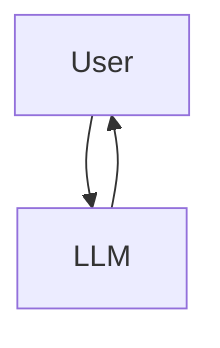
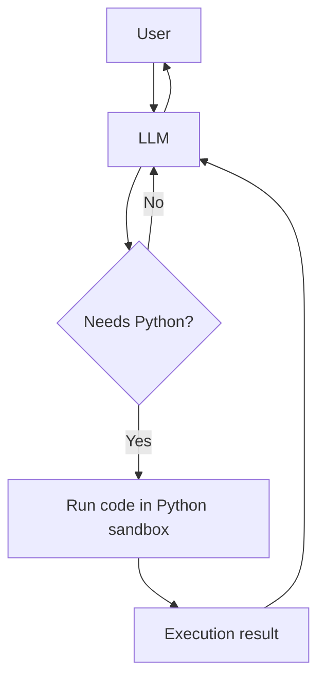
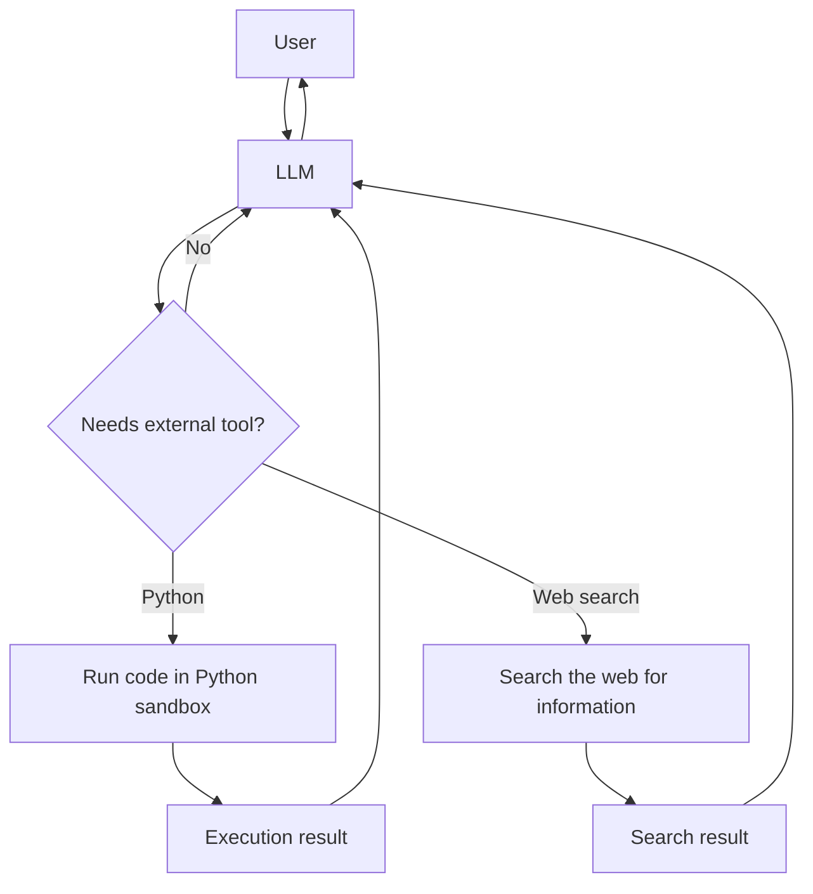
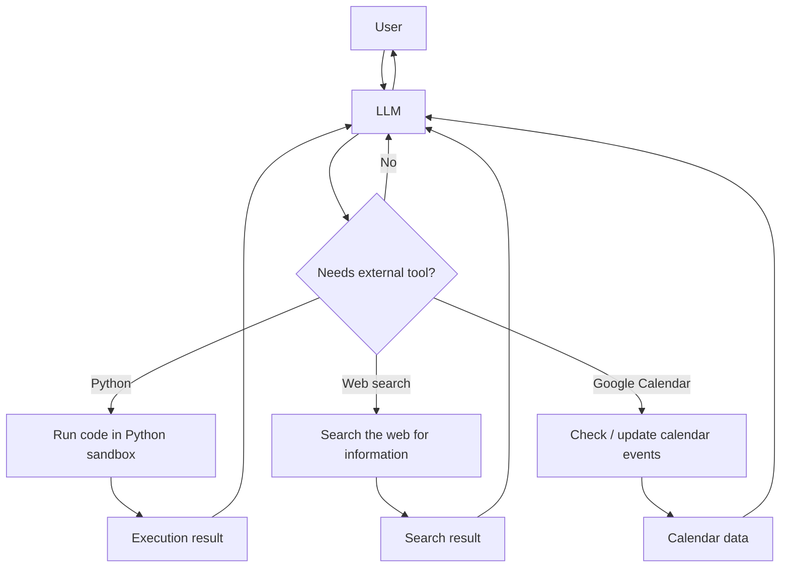
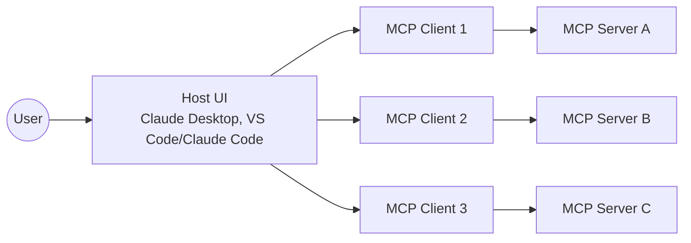

I did not see how powerful MCP was until I used Claude Code with the Playwright MCP.
**Playwright MCP lets an AI use a real browser.** It can open a page, click buttons, fill forms, and take screenshots.
I asked Claude to audit my site for SEO. It ran checks in a real browser, gave me the results, and sent screenshots. You can read more about [how I use Claude Code for doing SEO audits](/blog/how-i-use-claude-code-for-doing-seo-audits).
**That was when I saw it.** This was not just text prediction. This was an AI that can see and work with the web like a human tester.

## What is MCP

MCP means Model Context Protocol.
Before we define it, let us see how we got here.

## How it started



In 2022 ChatGPT made AI open to everyone.
You typed a question. It predicted the next tokens and sent back text.
You could ask for your favorite author or create code.

## The problem with plain LLMs

A plain LLM is a text generator.

- It has no live data
- It cannot read your files
- It struggles with math
- It cannot tell you who won yesterday in football

You can read more in my post about [LLM limits](/blog/how-chatgpt-works-for-dummies).

## The first fix: tools



When OpenAI added a Python sandbox, LLMs could run code and give exact results.

## More tools mean more power



Web search gave live knowledge. Now the model could answer fresh questions.

## Even more tools



Anthropic added more tools to Claude like Google Calendar and email.
You can ask it what meetings you have next week and it tells you.

## The solution: a protocol

We need a standard.
One tool for Google Calendar that any agent can use.
In November the Model Context Protocol was released.

## Definition

**MCP** is an open protocol that lets apps give context to LLMs in a standard way.

Think of **USB-C**. You plug in power, a display, or storage and it just works.

MCP does the same for AI with data sources and tools.

With MCP you can build agents and workflows without custom glue code.

---

## How MCP Works (mental model)

At its core, MCP has **three roles**:

- **Host** → LLM applications that initiate connections
- **Client** → Connectors within the host application
- **Server** → Services that provide context and capabilities

> 
  MCP takes some inspiration from the Language Server Protocol, which
  standardizes how to add support for programming languages across a whole
  ecosystem of development tools. In a similar way, MCP standardizes how to
  integrate additional context and tools into the ecosystem of AI applications.

The host embeds clients, and those clients connect to one or more servers.
Your VS Code could have a Playwright MCP server for browser automation and another MCP server for your docs — all running at the same time.



---

## How MCP Connects: Transports

MCP uses **JSON-RPC 2.0** for all messages and supports two main transport mechanisms:

**Key points:**

- Messages are UTF-8 encoded JSON-RPC
- stdio uses newline-delimited JSON (one message per line)
- HTTP supports session management via `Mcp-Session-Id` headers
- Both transports handle requests, responses, and notifications equally well

The transport choice depends on your use case: stdio for local tools with minimal latency, HTTP for remote services that multiple clients can connect to.

## What servers can expose

An MCP server can offer any combination of three capabilities:

### Tools: Functions the AI can call

- Give AI ability to execute actions (check weather, query databases, solve math)
- Each tool describes what it does and what info it needs
- AI sends parameters → server runs function → returns results

```typescript
// Simple calculator tool example
server.registerTool(
  "calculate",
  {
    title: "Calculator",
    description: "Perform mathematical calculations",
    inputSchema: {
      operation: z.enum(["add", "subtract", "multiply", "divide"]),
      a: z.number(),
      b: z.number(),
    },
  },
  async ({ operation, a, b }) => {
    let result;
    switch (operation) {
      case "add":
        result = a + b;
        break;
      case "subtract":
        result = a - b;
        break;
      case "multiply":
        result = a * b;
        break;
      case "divide":
        result = b !== 0 ? a / b : "Error: Division by zero";
        break;
    }

    return {
      content: [
        {
          type: "text",
          text: `${a} ${operation} ${b} = ${result}`,
        },
      ],
    };
  }
);
```

### Resources: Context and data

- AI can read files, docs, database schemas
- Provides context before answering questions or using tools
- Supports change notifications when files update

```typescript
server.registerResource(
  "app-config",
  "config://application",
  {
    title: "Application Configuration",
    description: "Current app settings and environment",
    mimeType: "application/json",
  },
  async uri => ({
    contents: [
      {
        uri: uri.href,
        text: JSON.stringify(
          {
            environment: process.env.NODE_ENV,
            version: "1.0.0",
            features: {
              darkMode: true,
              analytics: false,
              beta: process.env.BETA === "true",
            },
          },
          null,
          2
        ),
      },
    ],
  })
);
```

### Prompts: Templates for interaction

- Pre-made templates for common tasks (code review, data analysis)
- Exposed as slash commands or UI elements
- Makes repetitive workflows quick and consistent

````typescript
server.registerPrompt(
  "code-review",
  {
    title: "Code Review",
    description: "Review code for quality and best practices",
    argsSchema: {
      language: z.enum(["javascript", "typescript", "python", "go"]),
      code: z.string(),
      focus: z
        .enum(["security", "performance", "readability", "all"])
        .default("all"),
    },
  },
  ({ language, code, focus }) => ({
    messages: [
      {
        role: "user",
        content: {
          type: "text",
          text: [
            `Please review this ${language} code focusing on ${focus}:`,
            "",
            "```" + language,
            code,
            "```",
            "",
            "Provide feedback on:",
            focus === "all"
              ? "- Security issues\n- Performance optimizations\n- Code readability\n- Best practices"
              : focus === "security"
                ? "- Potential security vulnerabilities\n- Input validation\n- Authentication/authorization issues"
                : focus === "performance"
                  ? "- Time complexity\n- Memory usage\n- Potential optimizations"
                  : "- Variable naming\n- Code structure\n- Comments and documentation",
          ].join("\n"),
        },
      },
    ],
  })
);
````

## What a Client can expose

An MCP client can provide capabilities that let servers interact with the world beyond their sandbox:

### Roots: Filesystem boundaries

- Client tells server which directories it can access
- Creates secure sandbox (e.g., only your project folder)
- Prevents access to system files or other projects

### Sampling: Nested LLM calls

- Servers can request AI completions through the client
- No API keys needed on server side
- Enables autonomous, agentic behaviors

### Elicitation: Asking users for input

- Servers request missing info from users via client UI
- Client handles forms and validation
- Users can accept, decline, or cancel requests

## Example: How we can use MCPS in Vscode

Your `mcp.json` could look like this:

```json
{
  "servers": {
    "playwright": {
      "gallery": true,
      "command": "npx",
      "args": ["@playwright/mcp@latest"],
      "type": "stdio"
    },
    "deepwiki": {
      "type": "http",
      "url": "https://mcp.deepwiki.com/sse",
      "gallery": true
    }
  }
}
```

- **playwright** → Runs `npx @playwright/mcp@latest` locally over stdio for low-latency browser automation
- **deepwiki** → Connects over HTTP/SSE to `https://mcp.deepwiki.com/sse` for live docs and codebase search
- **gallery: true** → Makes them visible in tool pickers

## What MCP is not

- **Not a hosted service** — It is a protocol
- **Not a replacement** for your app logic
- **Not a magic fix** for every hallucination — It gives access to real tools and data
- You still need good prompts and good UX

---

## Simple example of your first MCP Server

```ts
#!/usr/bin/env node
import { z } from "zod";
import { McpServer } from "@modelcontextprotocol/sdk/server/mcp.js";
import { StdioServerTransport } from "@modelcontextprotocol/sdk/server/stdio.js";

const server = new McpServer({
  name: "echo-onefile",
  version: "1.0.0",
});

server.tool(
  "echo",
  "Echo back the provided text",
  {
    text: z
      .string()
      .min(1, "Text cannot be empty")
      .describe("Text to echo back"),
  },
  async ({ text }) => ({
    content: [{ type: "text", text }],
  })
);

const transport = new StdioServerTransport();

server
  .connect(transport)
  .then(() => console.error("Echo MCP server listening on stdio"))
  .catch(err => {
    console.error(err);
    process.exit(1);
  });
```

This example uses the official [MCP SDK for TypeScript](https://modelcontextprotocol.io/docs/sdk), which provides type-safe abstractions for building MCP servers.

The server exposes a single tool called "echo" that takes text input and returns it back. We're using [Zod](https://zod.dev/) for runtime schema validation, ensuring the input matches our expected structure with proper type safety and clear error messages.

## Simple MCP Client Example

Here's how to connect to an MCP server and use its capabilities:

```typescript
import { Client } from "@modelcontextprotocol/sdk/client/index.js";
import { StdioClientTransport } from "@modelcontextprotocol/sdk/client/stdio.js";

// Create a client that connects to your MCP server
async function connectToServer() {
  // Create transport - this runs your server as a subprocess
  const transport = new StdioClientTransport({
    command: "node",
    args: ["./echo-server.js"],
  });

  // Create and connect the client
  const client = new Client({
    name: "my-mcp-client",
    version: "1.0.0",
  });

  await client.connect(transport);

  return client;
}

// Use the server's capabilities
async function useServer() {
  const client = await connectToServer();

  // List available tools
  const tools = await client.listTools();
  console.log("Available tools:", tools);

  // Call a tool
  const result = await client.callTool({
    name: "echo",
    arguments: {
      text: "Hello from MCP client!",
    },
  });

  console.log("Tool result:", result.content);

  // List and read resources
  const resources = await client.listResources();
  for (const resource of resources) {
    const content = await client.readResource({
      uri: resource.uri,
    });
    console.log(`Resource ${resource.name}:`, content);
  }

  // Get and execute a prompt
  const prompts = await client.listPrompts();
  if (prompts.length > 0) {
    const prompt = await client.getPrompt({
      name: prompts[0].name,
      arguments: {
        code: "console.log('test')",
        language: "javascript",
      },
    });
    console.log("Prompt messages:", prompt.messages);
  }

  // Clean up
  await client.close();
}

// Run the client
useServer().catch(console.error);
```

This client example shows how to:

- Connect to an MCP server using stdio transport
- List and call tools with arguments
- Read resources from the server
- Get and use prompt templates
- Properly close the connection when done

## Use it with Vscode

```json
{
  "servers": {
    "echo": {
      "gallery": true,
      "type": "stdio",
      "command": "node",
      "args": ["--import", "tsx", "/absolute/path/echo-server.ts"]
    }
  }
}
```

## Summary

This was just my starter post for MCP to give an overview. I will write more blog posts that will go in depth about the different topics.

> 
  If you need a TypeScript starter template for your next MCP server, you can
  use my
  [mcp-server-starter-ts](https://github.com/alexanderop/mcp-server-starter-ts)
  repository to get up and running quickly.

