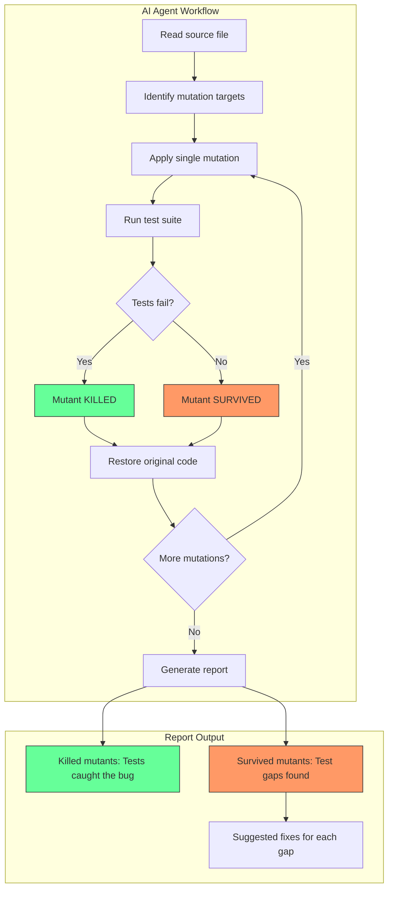

## The Coverage Lie

Code coverage lies. A test that exercises a line doesn't mean it verifies that line does the right thing:

```typescript
function add(a: number, b: number): number {
  return a + b
}

// 100% coverage - would still pass if add() returned 999
it('adds numbers', () => {
  add(2, 2)
})
```

Mutation testing flips the question. Instead of asking "did tests run this code?", it asks **"if I break this code, do tests fail?"**

Using our `add` example, a mutation tester would:

```typescript
// Original
function add(a: number, b: number): number {
  return a + b
}

// Mutated: swap + for -
function add(a: number, b: number): number {
  return a - b  // <-- bug introduced
}
```

Now run the test. `add(2, 2)` returns `0` instead of `4`. Does the test fail? No—it never checked the result. **The mutant survives.** Your test has a gap.

The process:
1. **Mutate**: Introduce a small bug (change `>` to `>=`, swap `&&` for `||`, delete a line)
2. **Run tests**: Execute your test suite against the mutated code
3. **Evaluate**: If tests pass with the bug, your tests are weak. If tests fail, they caught it.

A mutation that tests fail to catch is a "surviving mutant"—proof of a test gap.

---

## When Stryker Works: The Gold Standard

When your test stack supports it, automated mutation testing with Stryker is the way to go. It's fast, deterministic, generates HTML reports, and runs in CI pipelines. This is especially valuable when you have pure functions with high test coverage but want to verify test quality.

Here's what it looks like in practice:

```bash
pnpm test:mutation
# or: stryker run
```

```
INFO ProjectReader Found 7 of 2947 file(s) to be mutated.
INFO Instrumenter Instrumented 7 source file(s) with 394 mutant(s)
INFO DryRunExecutor Initial test run succeeded. Ran 184 tests in 0 seconds.

Mutation testing  [====================] 100% | 394/394 Mutants tested
(35 survived, 0 timed out)

--------------|---------|----------|----------|----------|
File          |  % score | # killed | # survived | # no cov |
--------------|---------|----------|----------|----------|
All files     |   90.86 |      358 |         35 |        1 |
 backlinks.ts |   96.30 |       26 |          1 |        0 |
 callouts.ts  |   93.94 |       62 |          4 |        0 |
 graph.ts     |   91.55 |       65 |          6 |        0 |
 mentions.ts  |   91.30 |       63 |          5 |        1 |
 minimark.ts  |   82.61 |       76 |         16 |        0 |
 text.ts      |  100.00 |       34 |          0 |        0 |
 wikilinks.ts |   91.43 |       32 |          3 |        0 |
--------------|---------|----------|----------|----------|

INFO MutationTestExecutor Done in 36 seconds.
```

394 mutants tested across 7 files in 36 seconds. The report shows exactly which files have weak spots—`minimark.ts` at 82.61% needs attention, while `text.ts` is solid at 100%.

Stryker also generates an interactive HTML report where you can drill into each surviving mutant and see exactly what code change your tests failed to catch.

> 
  If your stack supports Stryker (standard Vitest in Node mode, Jest, Mocha), use it. Deterministic tooling in your CI pipeline beats manual approaches every time. The AI agent technique in this post is for when Stryker isn't an option.

---

## The Vitest Browser Mode Problem

But what if Stryker doesn't support your stack? Stryker doesn't work with Vitest's browser mode. Their instrumentation assumes Node.js execution, but browser mode runs tests in actual Chromium via Playwright.

My setup:
- **Framework**: Vitest 4 with `browser.enabled: true`
- **Provider**: Playwright (Chromium)
- **Test style**: Integration tests with real DOM

[My testing strategy](/blog/vue3_testing_pyramid_vitest_browser_mode) relies heavily on Vitest browser mode for realistic user flow testing. Stryker's mutation coverage reports? Not an option. And switching to Node-based testing would mean losing the browser-specific behavior I'm actually testing.

---

## AI Agents as Manual Mutation Testers

The mutation testing algorithm is simple enough that an AI coding agent can execute it manually. Claude Code can:

1. Read your source code
2. Apply mutations systematically
3. Run `pnpm test --run`
4. Record whether tests passed or failed
5. Restore the original code
6. Report surviving mutants with suggested fixes

I adapted a [Claude Code skill](/blog/claude-code-customization-guide-claudemd-skills-subagents) originally created by [Paul Hammond](https://www.linkedin.com/posts/paul-hammond-bb5b78251_mutation-testing-is-typically-expensive-but-activity-7414719212071473152-_xTm) that codifies this workflow.



### The Mutation Testing Skill

The skill defines mutation operators in priority order:

**Priority 1 - Boundaries** (most likely to survive):

| Original | Mutate To |
|----------|-----------|
| `<` | `<=` |
| `>` | `>=` |
| `<=` | `<` |
| `>=` | `>` |

**Priority 2 - Boolean Logic**:

| Original | Mutate To |
|----------|-----------|
| `&&` | `\|\|` |
| `\|\|` | `&&` |
| `!condition` | `condition` |

**Priority 3 - Return Values**:

| Original | Mutate To |
|----------|-----------|
| `return x` | `return null` |
| `return true` | `return false` |
| Early return | Remove it |

**Priority 4 - Statement Removal**:

| Original | Mutate To |
|----------|-----------|
| `array.push(x)` | Remove |
| `await save(x)` | Remove |
| `emit('event')` | Remove |

The agent applies each mutation one at a time, runs tests, records results, and restores the original code immediately.

---

## Real Example: Settings Feature

I ran this against my settings feature. The integration tests looked comprehensive—theme toggling, language switching, unit preferences. Code coverage would show high percentages.

**Results: 38% mutation score** (5 killed, 8 survived out of 13 mutations)

Here's what the AI agent found:

### Surviving Mutant #1: Volume Boundary Not Tested

```typescript
// Original (stores/settings.ts:65)
Math.min(Math.max(volume, 0.5), 1)

// Mutation: Change 0.5 to 0.4
Math.min(Math.max(volume, 0.4), 1)

// Result: Tests PASSED -> Mutant SURVIVED
```

My tests never verified the minimum volume constraint. A bug changing the minimum from 50% to 40% would ship undetected.

### Surviving Mutant #2: Theme DOM Class Not Verified

```typescript
// Original (composables/useTheme.ts:26)
newMode === 'dark'

// Mutation: Negate the condition
newMode !== 'dark'

// Result: Tests PASSED -> Mutant SURVIVED
```

My test checked that clicking the toggle changed the stored preference. It never verified that `document.documentElement.classList` actually received the `dark` class. The UI could break while tests pass.

### Surviving Mutant #3: Error Handling Path Untested

```typescript
// Original (stores/settings.ts:28)
if (error) return

// Mutation: Negate the condition
if (!error) return

// Result: Tests PASSED -> Mutant SURVIVED
```

No test exercised the error handling branch. A bug that inverted error handling would go unnoticed.

### The Fixes

The agent suggested specific tests for each surviving mutant:

```typescript
// Fix for Mutant #1: Boundary test
it('volume slider has minimum value constraint of 50%', async () => {
  const volumeSlider = page.getByTestId('timer-sound-volume-slider')
  await expect.poll(async () => {
    const el = await volumeSlider.element()
    return el.getAttribute('min')
  }).toBe('0.5')
})

// Fix for Mutant #2: DOM verification
it('adds dark class to html element when dark mode enabled', async () => {
  const themeToggle = page.getByTestId('theme-toggle')
  await userEvent.click(themeToggle)

  await expect.poll(() =>
    document.documentElement.classList.contains('dark')
  ).toBe(true)
})
```

---

## How to Set This Up

### Step 1: Create the Skill

Save this as `.claude/skills/mutation-testing/SKILL.md`:

<details>
<summary>Full Mutation Testing Skill (click to expand)</summary>

```markdown
---
name: mutation-testing
description: |
  Mutation testing patterns for verifying test effectiveness. Use when analyzing branch code
  to find weak or missing tests. Triggers: "mutation testing", "test effectiveness",
  "would tests catch this bug", "weak tests", "are my tests good enough", "surviving mutants".
---

# Mutation Testing

Mutation testing answers: **"Would my tests catch this bug?"** by actually introducing bugs and running tests.

---

## Execution Workflow

**CRITICAL**: This skill actually mutates code and runs tests. Follow this exact process:

### Step 1: Identify Target Code

git diff main...HEAD --name-only | grep -E '\.(ts|js|tsx|jsx|vue)' | grep -v '\.test\.' | grep -v '\.spec\.'

### Step 2: For Each Function to Test

Execute this loop for each mutation:

1. READ the original file and note exact content
2. APPLY one mutation (edit the code)
3. RUN tests: pnpm test --run (or specific test file)
4. RECORD result: KILLED (test failed) or SURVIVED (test passed)
5. RESTORE original code immediately
6. Repeat for next mutation

### Step 3: Report Results

After all mutations, provide a summary table:

| Mutation | Location | Result | Action Needed |
|----------|----------|--------|---------------|
| `>` → `>=` | file.ts:42 | SURVIVED | Add boundary test |
| `&&` → `||` | file.ts:58 | KILLED | None |

---

## Mutation Operators to Apply

### Priority 1: Boundary Mutations (Most Likely to Survive)

| Original | Mutate To | Why It Matters |
|----------|-----------|----------------|
| `<` | `<=` | Boundary not tested |
| `>` | `>=` | Boundary not tested |
| `<=` | `<` | Equality case missed |
| `>=` | `>` | Equality case missed |

### Priority 2: Boolean Logic Mutations

| Original | Mutate To | Why It Matters |
|----------|-----------|----------------|
| `&&` | `\|\|` | Only tested when both true |
| `\|\|` | `&&` | Only tested when both false |
| `!condition` | `condition` | Negation not verified |

### Priority 3: Arithmetic Mutations

| Original | Mutate To | Why It Matters |
|----------|-----------|----------------|
| `+` | `-` | Tested with 0 only |
| `-` | `+` | Tested with 0 only |
| `*` | `/` | Tested with 1 only |

### Priority 4: Return/Early Exit Mutations

| Original | Mutate To | Why It Matters |
|----------|-----------|----------------|
| `return x` | `return null` | Return value not asserted |
| `return true` | `return false` | Boolean return not checked |
| `if (cond) return` | `// removed` | Early exit not tested |

### Priority 5: Statement Removal

| Original | Mutate To | Why It Matters |
|----------|-----------|----------------|
| `array.push(x)` | `// removed` | Side effect not verified |
| `await save(x)` | `// removed` | Async operation not verified |
| `emit('event')` | `// removed` | Event emission not tested |

---

## Practical Execution Example

### Example: Testing a Validation Function

**Original code** (`src/utils/validation.ts:15`):

export function isValidAge(age: number): boolean {
  return age >= 18 && age <= 120;
}

**Mutation 1**: Change `>=` to `>`

export function isValidAge(age: number): boolean {
  return age > 18 && age <= 120;  // MUTATED
}

**Run tests**: `pnpm test --run src/__tests__/validation.test.ts`

**Result**: Tests PASS → **SURVIVED** (Bad! Need test for `isValidAge(18)`)

**Restore original code immediately**

**Mutation 2**: Change `&&` to `||`

export function isValidAge(age: number): boolean {
  return age >= 18 || age <= 120;  // MUTATED
}

**Run tests**: `pnpm test --run src/__tests__/validation.test.ts`

**Result**: Tests FAIL → **KILLED** (Good! Tests catch this bug)

**Restore original code immediately**

---

## Results Interpretation

### Mutant States

| State | Meaning | Action |
|-------|---------|--------|
| **KILLED** | Test failed with mutant | Tests are effective |
| **SURVIVED** | Tests passed with mutant | **Add or strengthen test** |
| **TIMEOUT** | Tests hung (infinite loop) | Counts as detected |

### Mutation Score

Score = (Killed + Timeout) / Total Mutations * 100

| Score | Quality |
|-------|---------|
| < 60% | Weak - significant test gaps |
| 60-80% | Moderate - improvements needed |
| 80-90% | Good - minor gaps |
| > 90% | Strong test suite |

---

## Fixing Surviving Mutants

When a mutant survives, add a test that would catch it:

### Surviving: Boundary mutation (`>=` → `>`)

// Add boundary test
it('accepts exactly 18 years old', () => {
  expect(isValidAge(18)).toBe(true);  // Would fail if >= became >
});

### Surviving: Logic mutation (`&&` → `||`)

// Add test with mixed conditions
it('rejects when only one condition met', () => {
  expect(isValidAge(15)).toBe(false);  // Would pass if && became ||
});

### Surviving: Statement removal

// Add side effect verification
it('saves to database', async () => {
  await processOrder(order);
  expect(db.save).toHaveBeenCalledWith(order);  // Would fail if save removed
});

---

## Quick Checklist During Mutation

For each mutation, ask:

1. **Before mutating**: Does a test exist for this code path?
2. **After running tests**: Did any test actually fail?
3. **If survived**: What specific test would catch this?
4. **After fixing**: Re-run mutation to confirm killed

---

## Common Surviving Mutation Patterns

### Tests Only Check Happy Path

// WEAK: Only tests success case
it('validates', () => {
  expect(validate(goodInput)).toBe(true);
});

// STRONG: Tests both cases
it('validates good input', () => {
  expect(validate(goodInput)).toBe(true);
});
it('rejects bad input', () => {
  expect(validate(badInput)).toBe(false);
});

### Tests Use Identity Values

// WEAK: Mutation survives
expect(multiply(5, 1)).toBe(5);  // 5*1 = 5/1 = 5

// STRONG: Mutation detected
expect(multiply(5, 3)).toBe(15);  // 5*3 ≠ 5/3

### Tests Don't Assert Return Values

// WEAK: No return value check
it('processes', () => {
  process(data);  // No assertion!
});

// STRONG: Asserts outcome
it('processes', () => {
  const result = process(data);
  expect(result).toEqual(expected);
});

---

## Important Rules

1. **ALWAYS restore original code** after each mutation
2. **Run tests immediately** after applying mutation
3. **One mutation at a time** - don't combine mutations
4. **Focus on changed code** - prioritize branch diff
5. **Track all results** - report full mutation summary

---

## Summary Report Template

After completing mutation testing, provide:

## Mutation Testing Results

**Target**: `src/features/workout/utils.ts` (functions: X, Y, Z)
**Total Mutations**: 12
**Killed**: 9
**Survived**: 3
**Score**: 75%

### Surviving Mutants (Action Required)

| # | Location | Original | Mutated | Suggested Test |
|---|----------|----------|---------|----------------|
| 1 | line 42 | `>=` | `>` | Test boundary value |
| 2 | line 58 | `&&` | `\|\|` | Test mixed conditions |
| 3 | line 71 | `emit()` | removed | Verify event emission |

### Killed Mutants (Tests Effective)

- Line 35: `+` → `-` killed by `calculation.test.ts`
- Line 48: `true` → `false` killed by `validate.test.ts`
- ...
```

</details>

### Step 2: Invoke It

```bash
claude "Run mutation testing on the settings feature"
```

The agent will:
- Find changed files on your branch
- Identify testable functions
- Apply mutations systematically
- Report surviving mutants with suggested test fixes

### Step 3: Review and Fix

The agent produces a markdown report. Review each surviving mutant and decide:
- Add the suggested test
- Accept the risk (document why)
- Refactor the code to be more testable

---

## When to Use This Approach

| Good Fit | Not Ideal |
|----------|-----------|
| Vitest browser mode (no Stryker support) | Large codebases needing full mutation coverage |
| Playwright component testing | CI/CD automation (manual agent invocation) |
| Small-to-medium codebases | Strict mutation score thresholds |
| Pre-merge review of specific features | |
| Learning what makes tests effective | |

> 
  This approach works best alongside your existing testing strategy. Use it to spot-check critical features before merge, not as a replacement for automated mutation testing where available.

> 
  This skill shines on **feature branches** where you want to validate test quality before merging. Running AI agents in CI/CD pipelines is possible—you could build [an automated QA agent](/blog/building_ai_qa_engineer_claude_code_playwright) with the Claude Agent SDK—but it adds complexity and cost. For pipeline automation, deterministic tools like Stryker remain the better choice when your stack supports them. Think of this as a developer tool for improving tests during development, not a CI gate.

---

## Key Takeaways

1. **Coverage doesn't equal confidence.** High code coverage can coexist with ineffective tests.

2. **Mutation testing reveals test gaps.** By breaking code and checking if tests notice, you find what's actually being verified.

3. **AI agents can execute manual mutation testing.** When tooling doesn't support your stack, an agent can apply the algorithm systematically.

4. **Focus on surviving mutants.** Each one is a potential bug your tests wouldn't catch.

5. **This complements, not replaces.** Use this alongside coverage reports, not instead of automated mutation testing where available.

---

## Resources

- [Paul Hammond's Mutation Testing Skill](https://github.com/citypaul/.dotfiles/blob/main/claude/.claude/skills/mutation-testing/SKILL.md) - The original skill this post is based on
- [Mutation Testing on Wikipedia](https://en.wikipedia.org/wiki/Mutation_testing)
- [Stryker Mutator](https://stryker-mutator.io/) - When your stack supports it
- [My TDD workflow with Claude Code](/blog/custom-tdd-workflow-claude-code-vue) - Related approach for test-first development
