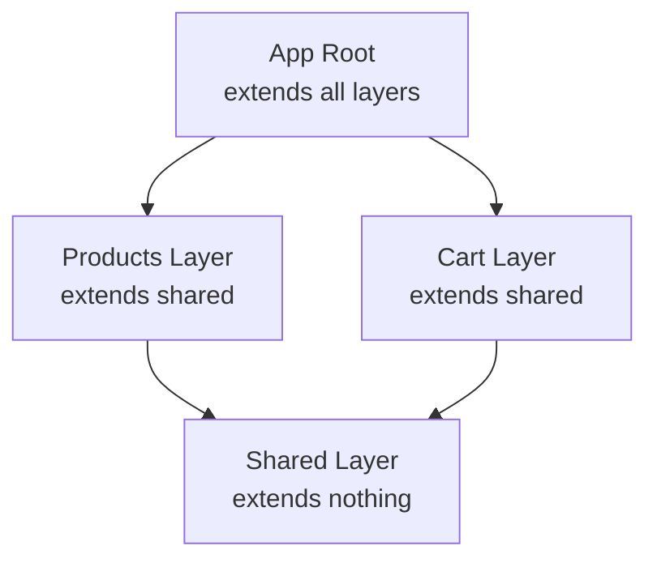
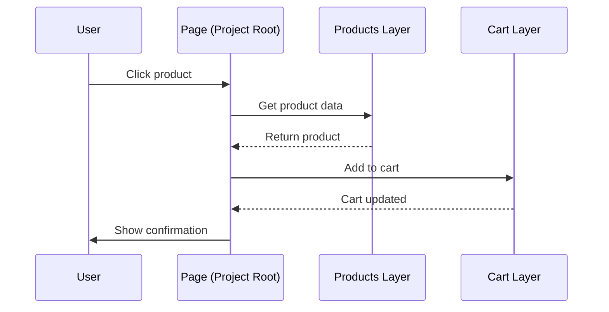
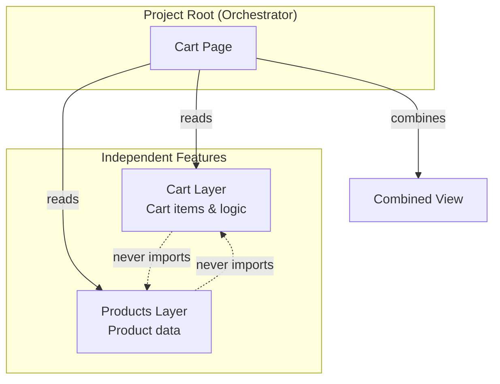
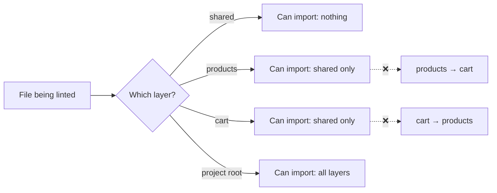

I once worked on a project that wanted to build an e-commerce website with Nuxt that could be used by multiple countries. The architecture was a nightmare: they had a base repository, and then they would merge the base repo into country-specific code. This was before Nuxt Layers existed, back in the Nuxt 2 days, and managing this was incredibly painful. Every merge brought conflicts, and maintaining consistency across countries was a constant struggle.

Now with Nuxt Layers, we finally have a much better solution for this exact use case. But in this blog post, we're going to explore something even more powerful: using Nuxt Layers to build a **modular monolith architecture**.

I recently built a simple example e-commerce application to explore this pattern in depth, and I want to share what I learned. By the end of this post, you'll understand how to structure your Nuxt applications with clean boundaries and enforced separation of concerns, without the complexity of microservices or the pain of repository merging strategies.

**Full project repository**: https://github.com/alexanderop/nuxt-layer-example

This is Part 4 of my [How to Structure Vue Projects](/posts/how-to-structure-vue-projects/). If you're choosing between architecture patterns, start there first.

## The Problem: When Flat Architecture Stops Scaling

Most projects start the same way. You create a new Nuxt project, organize files into `components/`, `composables/`, and `stores/` folders, and everything feels clean and organized. This works beautifully at first.

Then your application grows. You add a product catalog, then a shopping cart, then user profiles, then an admin panel. Suddenly your `components/` folder has 50+ files. Your stores reference each other in complex ways you didn't plan for. A seemingly innocent change to the cart accidentally breaks the product listing page.

I've been there, and I'm sure you have too.

The core problem is simple: **flat architectures have no boundaries**. Nothing prevents your cart component from directly importing from your products store. Nothing stops circular dependencies. You can import anything from anywhere, and this freedom becomes a liability as your codebase grows.

When I first encountered this problem, I considered micro frontends. While [How to build Microfrontends with Module Federation and Vue](/posts/how-to-build-microfrontends-with-module-federation-and-vue/) solve similar problems, Nuxt Layers offers better developer experience for monorepos. I wanted clean boundaries without the operational complexity of deploying and maintaining separate services.

That's when I discovered Nuxt Layers.

## What Are Nuxt Layers?

Before diving into the implementation, let me explain what Nuxt Layers actually are and why they solve our problem.

Nuxt Layers let you split your application into independent, reusable modules. Think of each layer as a mini Nuxt application with its own components, composables, pages, and stores. Each layer lives in its own folder with its own `nuxt.config.ts` file.

> 
  For comprehensive documentation on Nuxt Layers, visit the [official Nuxt
  Layers guide](https://nuxt.com/docs/4.x/guide/going-further/layers).

You compose these layers together using the `extends` keyword in your main configuration:

```typescript
// nuxt.config.ts
export default defineNuxtConfig({
  extends: [
    "./layers/shared", // Local folder
    "./layers/products",
    "./layers/cart",
  ],
});
```

> 
  Layers aren't limited to local folders. You can also extend from npm packages
  (`@your-org/ui-layer`) or git repositories (`github:your-org/shared-layer`).
  For remote sources to work as valid layers, they must contain a
  `nuxt.config.ts` file in their repository. This makes layers incredibly
  powerful for code reuse across projects.

When you extend layers, Nuxt merges their configurations and makes their code available to your application. All extended layers become accessible through auto-generated TypeScript paths (like `#layers/products/...`), and their components, composables, and utilities are automatically imported.

Here's the important part: **by default, there's no compile-time enforcement preventing cross-layer imports**. If your app extends both the products and cart layers, the cart layer can technically import from products at runtime—even if cart doesn't extend products directly. This is where ESLint enforcement becomes crucial, which I'll cover later.



## Building an E-commerce Application with Layers

Let me show you how I structured a real e-commerce application using this pattern. I created three layers, each with a specific purpose:

**Shared Layer**: The foundation. This layer provides UI components (like badges and buttons), utility functions (currency formatting, storage helpers), and nothing else. No business logic lives here.

**Products Layer**: Everything related to browsing and viewing products. Product schemas, the product store, catalog pages, and filter components all live here. Crucially, this layer knows nothing about shopping carts.

**Cart Layer**: Everything related to managing a shopping cart. The cart store, localStorage persistence, and cart UI components. This layer knows nothing about product catalogs.

**Your Project Root**: The orchestrator. This is not a separate layer—it's your main application that extends all the layers. This is where you create pages that combine features from multiple layers (like a product listing page with "add to cart" functionality).

Here's the folder structure:

Notice how the products and cart layers never import from each other. They are completely independent features. This is the core principle that makes this pattern work.

## The Difference: Before and After

Let me show you the contrast between a traditional approach and the layered approach.

### Without Layers: Tight Coupling

In a traditional flat structure, your product component might directly import the cart store:

```vue
<script setup lang="ts">
// ❌ Tight coupling in flat architecture
import { useCartStore } from "~/stores/cart";
import { useProductsStore } from "~/stores/products";

const cart = useCartStore();
const products = useProductsStore();

function addToCart(productId: string) {
  const product = products.getById(productId);
  cart.addItem(product);
}
</script>
```

This creates hidden dependencies. The products feature now depends on the cart feature. You cannot use products without including cart. You cannot understand one without reading the other. Testing becomes harder because everything is coupled.

### With Layers: Clear Boundaries

With layers, the product component has no idea that carts exist:

```vue
<!-- layers/products/components/ProductCard.vue -->
<script setup lang="ts">
import { computed } from "vue";
import type { Product } from "#layers/products/schemas/product.schema";

const props = defineProps<{
  product: Product;
}>();

const emit = defineEmits<{
  select: [productId: string];
}>();
</script>

<template>
  <UCard>
    <h3>{{ product.name }}</h3>
    <p>{{ product.price }}</p>
    <UButton @click="emit('select', product.id)"> View Details </UButton>
  </UCard>
</template>
```

The product component simply emits an event. The parent page (living in your project root) connects products to cart:

```vue
<!-- pages/index.vue (in your project root) -->
<script setup lang="ts">
import { useProductsStore } from "#layers/products/stores/products/useProductsStore";
import { useCartStore } from "#layers/cart/stores/cart/useCartStore";
import ProductCard from "#layers/products/components/ProductCard.vue";

const products = useProductsStore();
const cart = useCartStore();

function handleProductSelect(productId: string) {
  const product = products.getById(productId);
  if (product) {
    cart.addItem(product);
  }
}
</script>

<template>
  <div>
    <ProductCard
      v-for="product in products.items"
      :key="product.id"
      :product="product"
      @select="handleProductSelect"
    />
  </div>
</template>
```

Your project root acts as the orchestrator. It knows about both products and cart, but the features themselves stay completely independent.

> 
  This pattern follows the dependency inversion principle. High-level modules
  (the app) depend on low-level modules (features), but features don't depend on
  each other. Changes to one feature won't cascade to others.

## How Features Communicate

When a page needs functionality from multiple layers, your project root orchestrates the interaction. I like to think of this pattern as similar to micro frontends with an app shell.

**Feature layers** are independent workers. Each does one job well. They expose simple interfaces (stores, components, composables) but have no knowledge of each other.

**Your project root** is the manager. It knows all the workers. When a task needs multiple workers, your project root coordinates them.

Here's a sequence diagram showing how this works:



Let me show you a real example from the cart page. It needs to display cart items (from the cart layer) with product details (from the products layer):

```vue
<!-- pages/cart.vue -->
<script setup lang="ts">
import { computed } from "vue";
import { useCartStore } from "#layers/cart/stores/cart/useCartStore";
import { useProductsStore } from "#layers/products/stores/products/useProductsStore";
import CartItemCard from "#layers/cart/components/CartItemCard.vue";

const cart = useCartStore();
const products = useProductsStore();

// App layer combines data from both features
const enrichedItems = computed(() => {
  return cart.items.map(cartItem => {
    const product = products.getById(cartItem.productId);
    return {
      ...cartItem,
      productDetails: product,
    };
  });
});
</script>

<template>
  <div>
    <h1>Your Cart</h1>
    <CartItemCard
      v-for="item in enrichedItems"
      :key="item.id"
      :item="item"
      @remove="cart.removeItem"
      @update-quantity="cart.updateQuantity"
    />
  </div>
</template>
```

Your project root queries both stores and combines the data. Neither feature layer knows about the other. This keeps your features loosely coupled and incredibly easy to test in isolation.



## Enforcing Boundaries with ESLint

Now here's something important I discovered while working with this pattern. Nuxt provides basic boundary enforcement through TypeScript: if you try to import from a layer not in your `extends` array, your build fails. This is good, but it's not enough.

The problem is this: if your main config extends both products and cart, nothing prevents the cart layer from importing from products. Technically both layers are available at runtime. This creates the exact coupling we're trying to avoid.

I needed stricter enforcement. So I built a custom ESLint plugin called `eslint-plugin-nuxt-layers`.

This plugin enforces two critical rules:

1. **No cross-feature imports**: Cart cannot import from products (or vice versa)
2. **No upward imports**: Feature layers cannot import from the app layer

The plugin detects which layer a file belongs to based on its path, then validates all imports against the allowed dependencies.

```javascript
// ❌ This fails linting
// In layers/cart/stores/cart/useCartStore.ts
import { useProductsStore } from "#layers/products/stores/products/useProductsStore";
// Error: cart layer cannot import from products layer

// ✅ This passes linting (in layers/cart/)
import { formatCurrency } from "#layers/shared/utils/currency";
// OK: cart layer can import from shared layer

// ✅ This also passes linting (in your project root)
import { useCartStore } from "#layers/cart/stores/cart/useCartStore";
import { useProductsStore } from "#layers/products/stores/products/useProductsStore";
// OK: project root can import from any layer
```

> 
I've published this ESLint plugin on npm so you can use it in your own projects. Install it with `pnpm add -D eslint-plugin-nuxt-layers` and get immediate feedback in your editor.

**Package link**: [eslint-plugin-nuxt-layers on npm](https://www.npmjs.com/package/eslint-plugin-nuxt-layers?activeTab=readme)

Here's how the validation logic works:



The ESLint plugin gives you enforcement of your architecture. Your IDE will warn you immediately if you violate boundaries, and your CI/CD pipeline will fail if violations slip through.

## Important Gotchas to Avoid

Working with Nuxt Layers comes with some quirks you should know about. I learned these the hard way, so let me save you the trouble:

> 
Layer order determines override priority: **earlier layers have higher priority and override later ones**. This matters when multiple layers define the same component, page, or config value.

```typescript
// shared overrides products, products overrides cart
extends: ['./layers/shared', './layers/products', './layers/cart']

// cart overrides products, products overrides shared
extends: ['./layers/cart', './layers/products', './layers/shared']
```

For dependency purposes, all extended layers are available to each other at runtime. However, for clean architecture, you should still organize by semantic importance—typically putting shared/base layers first, then feature layers. Use ESLint rules to prevent unwanted cross-layer imports regardless of order.

> 
If multiple layers have a file at the same path (like `pages/index.vue`), only the first one wins. The later ones are silently ignored. This can cause confusing bugs where pages or components mysteriously disappear.

I recommend using unique names or paths for pages in different layers to avoid this issue entirely.

> 
  Changes to `nuxt.config.ts` files in layers don't always hot reload properly.
  When you modify layer configuration, restart your dev server. I learned this
  after spending 30 minutes debugging why my changes weren't applying!

**Route paths need full names**: Layer names don't auto-prefix routes. If you have `layers/blog/pages/index.vue`, it creates the `/` route, not `/blog`. You need `layers/blog/pages/blog/index.vue` to get `/blog`.

**Component auto-import prefixing**: By default, nested components get prefixed. A component at `components/form/Input.vue` becomes `<FormInput>`. You can disable this with `pathPrefix: false` in the components config if you prefer explicit names.

## When Should You Use This Pattern?

I want to be honest with you: Nuxt Layers add complexity. They're powerful, but they're not always the right choice. Here's when I recommend using them:

**Your app has distinct features**: If you're building an application with clear feature boundaries (products, cart, blog, admin panel), layers shine. Each feature gets its own layer with its own components, pages, and logic.

**You have multiple developers**: Layers prevent teams from stepping on each other's toes. The cart team works in their layer, the products team works in theirs. No more merge conflicts in a giant shared components folder.

**You want to reuse code**: Building multiple apps that share functionality? Extract common features into layers and publish them as npm packages. Your marketing site and main app can share the same blog layer without code duplication.

**You're thinking long-term**: A small project with 5 components doesn't need layers. But a project that will grow to 50+ features over two years? Layers will save your sanity.

> 
  I don't recommend starting with layers on day one for small projects. Begin
  with a flat structure. When you notice features bleeding into each other and
  boundaries becoming unclear, that's the perfect time to refactor into layers.
  The patterns in this article will guide you through that migration.

## The Benefits You'll Get

After working with this pattern for several months, here are the concrete benefits I've experienced:

| Benefit                                | Description                                                                                                                                                                                                                                                                                                            |
| -------------------------------------- | ---------------------------------------------------------------------------------------------------------------------------------------------------------------------------------------------------------------------------------------------------------------------------------------------------------------------- |
| **Clear boundaries enforced by tools** | Import rules aren't just documentation that developers ignore. Your build fails if someone violates the architecture. This is incredibly powerful for maintaining standards as your team grows.                                                                                                                        |
| **Independent development**            | Team members can work on different features without conflicts. The cart team never touches product code. Changes are isolated and safe.                                                                                                                                                                                |
| **Easy testing**                       | Each layer has minimal dependencies. You can test features in complete isolation without complex mocking setups.                                                                                                                                                                                                       |
| **Gradual extraction**                 | If you need to extract a feature later (maybe to share across projects or even split into a micro frontend), you already have clean boundaries. You could publish a layer as its own npm package with minimal refactoring.                                                                                             |
| **Better code review**                 | When someone adds an import in a pull request, you immediately see if it crosses layer boundaries. Architecture violations become obvious during review.                                                                                                                                                               |
| **Scales with complexity**             | As your app grows, you simply add new layers. Existing layers stay independent and unaffected.                                                                                                                                                                                                                         |
| **Better AI assistant context**        | You can add layer-specific documentation files (like `claude.md`) to each layer with context tailored to that feature. When working with AI coding assistants like Claude or GitHub Copilot, changes to the cart layer will only pull in cart-specific context, making the AI's suggestions more accurate and focused. |
| **Targeted testing**                   | Running tests becomes more efficient. Instead of running your entire test suite, you can run only the tests related to the feature you're working on.                                                                                                                                                                  |

## Getting Started with Your Own Project

If you want to try this pattern, here's how to get started:

### 1. Clone and Explore the Example

Start by exploring the complete example project:

```bash
# 📥 Clone the repository
git clone https://github.com/alexanderop/nuxt-layer-example
cd nuxt-layer-example

# 📦 Install dependencies
pnpm install

# 🚀 Start development server
pnpm dev
```

Browse through the layers to see how everything connects. Try making changes to understand how the boundaries work.

### 2. Create Your Own Layered Project

To start your own project from scratch:

```bash
# 📁 Create layer folders
mkdir -p layers/shared layers/products layers/cart

# 🔧 Add a nuxt.config.ts to each layer
echo "export default defineNuxtConfig({
  \$meta: {
    name: 'shared',
    description: 'Shared UI and utilities'
  }
})" > layers/shared/nuxt.config.ts
```

> 
  Nuxt automatically discovers and extends layers in the `layers/` directory.
  You only need to explicitly configure `extends` in your `nuxt.config.ts` if
  you're using external layers (npm packages, git repositories) or if your
  layers are in a different location.

### 3. Add ESLint Enforcement

Install the ESLint plugin:

```bash
# 📦 Install ESLint plugin
pnpm add -D eslint-plugin-nuxt-layers
```

> 
  This ESLint plugin only works when auto-imports are disabled. You need to
  explicitly import from layers using `#layers/` aliases for the plugin to
  detect and validate cross-layer imports. If you rely on Nuxt's auto-import
  feature, the plugin won't be able to enforce boundaries.

Configure it in your `eslint.config.mjs` with the `layer-boundaries` rule:

```javascript
import nuxtLayers from "eslint-plugin-nuxt-layers";

export default [
  {
    plugins: {
      "nuxt-layers": nuxtLayers,
    },
    rules: {
      "nuxt-layers/layer-boundaries": [
        "error",
        {
          root: "layers", // 📁 Your layers directory name
          aliases: ["#layers", "@layers"], // 🔗 Path aliases that point to layers
          layers: {
            shared: [], // 🏗️ Cannot import from any layer
            products: ["shared"], // 🛍️ Can only import from shared
            cart: ["shared"], // 🛒 Can only import from shared
            // 🏠 Your project root files can import from all layers (use '*')
          },
        },
      ],
    },
  },
];
```

The plugin will now enforce your architecture boundaries automatically. It detects violations in ES6 imports, dynamic imports, CommonJS requires, and export statements—giving you immediate feedback in your IDE and failing your CI/CD pipeline if boundaries are violated.

## Conclusion

I've been working with modular monoliths for a while now, and I believe this pattern gives you the best of both worlds. You get the clear boundaries and independent development of micro frontends without the operational complexity of deployment, networking, and data consistency.

Nuxt Layers makes this pattern accessible and practical. You get compile-time enforcement of boundaries through TypeScript. You get clear dependency graphs that are easy to visualize and understand. You get a structure that scales from small teams to large organizations without a rewrite.

You can start with layers from day one, or you can refactor gradually as your application grows. Either way, your future self will thank you when your codebase is still maintainable after two years and 50+ features.

I hope this blog post has been insightful and useful. The complete code is available for you to explore, learn from, and build upon. Clone it, break it, experiment with it.

**Full project repository**: https://github.com/alexanderop/nuxt-layer-example

If you have questions or want to share your own experiences with Nuxt Layers, I'd love to hear from you. This pattern has fundamentally changed how I approach application architecture, and I'm excited to see how you use it in your own projects.
