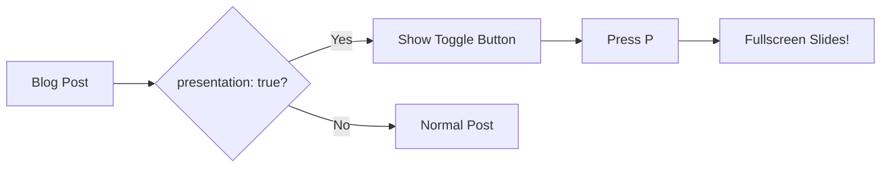
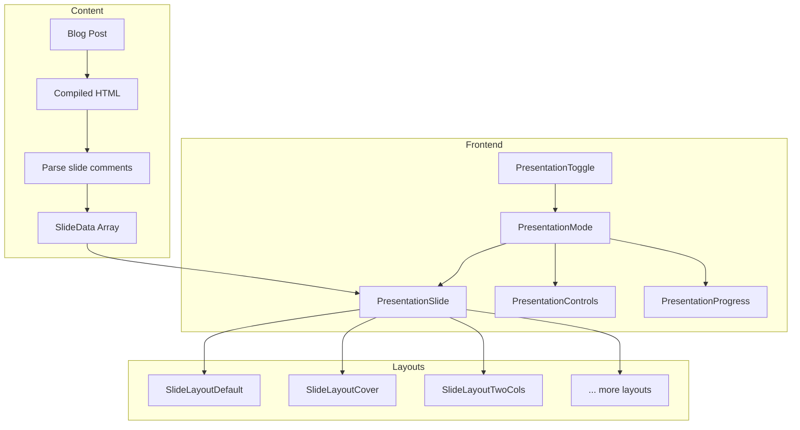

> 
  Press **P** on your keyboard or click the floating button in the bottom-right corner to enter presentation mode. Use arrow keys to navigate between slides, and press **D** to draw annotations directly on slides!

# Presentation Mode

Turn your blog posts into beautiful slides with incremental reveals

---

## Why Presentation Mode?

**The Problem:** You write a great blog post, then need to present it at a meetup.

**Old Solution:** Recreate everything in PowerPoint or Google Slides.

**New Solution:** Just add `presentation: true` to your frontmatter!

```yaml
---
title: "My Awesome Post"
presentation: true
---
```

---

## Keyboard Shortcuts

| Key | Action |
|-----|--------|
| **P** | Toggle presentation mode |
| **→** or **Space** | Next click step, then next slide |
| **←** | Previous click step, then previous slide |
| **1-9** | Jump to slide N (resets clicks) |
| **Home** | First slide |
| **End** | Last slide |
| **D** | Toggle drawing mode |
| **G** | Toggle grid overview |
| **Escape** | Exit drawing → grid → presentation |

---

# Drawing Annotations

Draw directly on slides with Excalidraw!

---

## Try Drawing Mode

Press **D** to toggle drawing mode. A toolbar will appear with these tools:

- **↖ Selection** - Select and move drawings
- **✏️ Freedraw** - Freehand drawing (press P)
- **→ Arrow** - Draw arrows (press A)
- **□ Rectangle** - Draw rectangles (press R)
- **○ Ellipse** - Draw circles (press O)
- **T Text** - Add text annotations (press T)
- **🧹 Eraser** - Erase drawings (press E)

---

## Drawing Features

**Colors:** 6 preset colors - Red, Blue, Green, Yellow, White, Black

**Stroke Widths:** 3 sizes - Thin (1px), Medium (2px), Thick (4px)

**Persistence:** Drawings stay when you navigate between slides!

**Shortcuts:**
- `C` - Clear current slide
- `Shift+C` - Clear all slides
- `Escape` - Exit drawing mode

---

## Use Cases

Why draw on slides during presentations?

- Circle important code sections
- Draw arrows connecting concepts
- Add quick annotations for Q&A
- Highlight key points in diagrams
- Sketch ideas during discussions

---

# V-Click Animations

Reveal content step-by-step with Slidev-style click animations

---

## Sequential Reveals

Press **→** to reveal each point:

**Step 1:** First, we define the problem clearly.

**Step 2:** Then, we explore possible solutions.

**Step 3:** Finally, we implement and test!

---

## Building a List

Benefits of incremental reveals:

- Keeps audience focused on the current point
- Creates natural pacing for your talk
- Prevents information overload
- Makes complex topics digestible

---

## V-Click Syntax

In MDX files, use components to control reveals:

```mdx
<VClick />
Content appears on click

<VClicks>
- Each list item
- Gets its own click
</VClicks>

<VClick order={3} />
Explicit order (appears third)

<VClick hide />
This disappears on click
```

---

# Custom Components

Interactive React components work in slides!

---

## Context Window Visualizer

This is a custom React component rendered inside a slide:

Try typing messages to see the context fill up!

---

## Code Blocks Work Perfectly

Here's a Vue composable example with full syntax highlighting:

```typescript
import { ref, computed } from 'vue'

export function useCounter(initial = 0) {
  const count = ref(initial)

  const double = computed(() => count.value * 2)

  function increment() {
    count.value++
  }

  return { count, double, increment }
}
```

---

## Magic Move: Code Evolution

Watch code transform with smooth animations (press **→** to advance):

Each arrow press animates the code to its next state!

---

## Mermaid Diagrams

Flowcharts render beautifully in slides:



---

## Animated Diagrams

Interactive diagrams with self-contained animations:

Click **Start** to see the Explore subagent flow animation!

---

# Slide Layouts

---

## Available Layouts

This feature supports 9 different layout types:

| Layout | Description |
|--------|-------------|
| `default` | Standard centered prose |
| `cover` | Large title, full-bleed |
| `center` | Fully centered content |
| `two-cols` | Two-column split |
| `image-left` | Image 40%, content 60% |
| `image-right` | Content 60%, image 40% |
| `image` | Full-bleed background |
| `quote` | Prominent blockquote |
| `section` | Section divider |
| `iframe` | Embedded website/demo |

---

## Iframe Layout

Embed live demos, CodePen, StackBlitz, or videos directly in slides:

This is a live StackBlitz embed - fully interactive!

---

## Layout Syntax

In **.md files**, use HTML comments. In **.mdx files**, use components:

```mdx
{/* MDX format */}
<Slide layout="cover" />
# My Title

---

{/* .md format */}
<!--slide:{"layout":"cover"}-->
# My Title
```

> 
Both file formats support layouts and v-clicks! For `.md` files use HTML comments, for `.mdx` files use the `Slide`, `VClick`, and `VClicks` components.

---

## Layout Properties

All layouts accept these properties:

| Property | Description |
|----------|-------------|
| `layout` | Layout name (required) |
| `image` | Path to image in /public |
| `backgroundSize` | CSS value (default: cover) |
| `class` | Custom CSS class |
| `src` | URL for iframe layout |
| `title` | Accessibility title for iframe |

---

## Layout Animations

Each layout type has its own animation:

| Layout | Animation |
|--------|-----------|
| `default` | Slide |
| `center` | Slide |
| `two-cols` | Slide |
| `cover` | **Fade** |
| `image` | **Zoom** |
| `quote` | **Fade** |
| `section` | **Fade** |
| `iframe` | **Fade** |

---

# Technical Details

---

## Architecture Overview



---

## Tips for Great Slides

> 

1. **Keep slides focused** - One idea per slide
2. **Use headings** - They become slide titles
3. **Leverage layouts** - Pick the right layout for content
4. **Use v-clicks** - Reveal complex info step-by-step
5. **Test navigation** - Make sure flow makes sense

### Content Length

- Short slides work best
- If content overflows, it scrolls within the slide
- But try to keep each slide digestible
- Use v-clicks to break up longer content

---

## Accessibility Features

- **Focus trap** - Tab stays within the modal
- **ARIA live region** - Announces "Slide X of Y, Step N of M"
- **Escape to exit** - Standard modal behavior
- **Keyboard navigation** - No mouse required
- **Theme aware** - Respects light/dark mode
- **Reduced motion** - V-click respects `prefers-reduced-motion`

---

## Speaker Notes & Presenter View

Press **N** to open the presenter view popup!

The presenter view shows:

- Current and next slide previews
- Speaker notes with click-step highlighting
- A timer you can start/pause/reset
- Navigation controls

{"This is a speaker note! It's only visible in the presenter view.\n[click] Now explain that the presenter view opens in a popup window.\n[click] Walk through each feature: previews, notes, timer, controls.\n[click] Mention keyboard shortcuts: T for timer, R to reset."}

---

## Notes with Click Markers

Notes can reveal progressively with your click steps:

**Step 1:** Define the problem

**Step 2:** Explore solutions

**Step 3:** Implement and ship!

{"Always visible intro text for this slide.\n[click] Talk about why defining the problem clearly matters.\n[click] Mention 2-3 solution approaches you considered.\n[click] Emphasize shipping fast and iterating."}

---

# Thank You!

Press **Escape** to exit or continue with arrow keys

---

## Quick Reference

**File format trade-offs:**

| Format | Custom Components | Layouts | V-Click | Syntax |
|--------|-------------------|---------|---------|--------|
| `.mdx` | Yes | Yes | Yes | Components |
| `.md` | No | Yes | Yes | HTML comments |

Press **Escape** to exit presentation mode!
