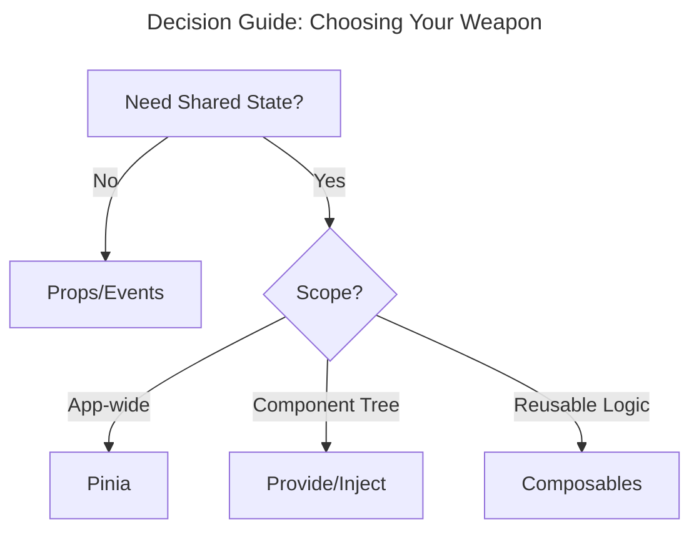

## TL;DR: Prop Drilling Solutions at a Glance

- **Global state**: Pinia (Vue's official state management)
- **Reusable logic**: Composables
- **Component subtree sharing**: Provide/Inject
- **Avoid**: Event buses for state management

> Click the toggle button to see interactive diagram animations that demonstrate each concept.

---

## The Hidden Cost of Prop Drilling: A Real-World Scenario

Imagine building a Vue dashboard where the user's name needs to be displayed in seven nested components. Every intermediate component becomes a middleman for data it doesn't need. Imagine changing the prop name from `userName` to `displayName`. You'd have to update six components to pass along something they don't use!

**This is prop drilling** – and it creates:

- 🚨 **Brittle code** that breaks during refactors
- 🕵️ **Debugging nightmares** from unclear data flow
- 🐌 **Performance issues** from unnecessary re-renders

---

## Solution 1: Pinia for Global State Management

### When to Use: App-wide state (user data, auth state, cart items)

**Implementation**:

```javascript
// stores/user.js
import { defineStore } from 'pinia';

export const useUserStore = defineStore('user', {
const username = ref(localStorage.getItem('username') || 'Guest');
const isLoggedIn = computed(() => username.value !== 'Guest');

function setUsername(newUsername) {
    username.value = newUsername;
    localStorage.setItem('username', newUsername);
}

return {
    username,
    isLoggedIn,
    setUsername
};
});
```

**Component Usage**:

```vue
<!-- DeeplyNestedComponent.vue -->
<script setup>
import { useUserStore } from "@/stores/user";
const user = useUserStore();
</script>

<template>
  <div class="user-info">
    Welcome, {{ user.username }}!
    <button v-if="!user.isLoggedIn" @click="user.setUsername('John')">
      Log In
    </button>
  </div>
</template>
```

✅ **Pros**

- Centralized state with DevTools support
- TypeScript-friendly
- Built-in SSR support

⚠️ **Cons**

- Overkill for small component trees
- Requires understanding of Flux architecture

---

## Solution 2: Composables for Reusable Logic

### When to Use: Shared component logic (user preferences, form state)

**Implementation with TypeScript**:

```typescript
// composables/useUser.ts
import { ref } from "vue";
const username = ref(localStorage.getItem("username") || "Guest");

export function useUser() {
  const setUsername = (newUsername: string) => {
    username.value = newUsername;
    localStorage.setItem("username", newUsername);
  };

  return {
    username,
    setUsername,
  };
}
```

**Component Usage**:

```vue
<!-- UserProfile.vue -->
<script setup lang="ts">
const { username, setUsername } = useUser();
</script>

<template>
  <div class="user-profile">
    <h2>Welcome, {{ username }}!</h2>
    <button @click="setUsername('John')">Update Username</button>
  </div>
</template>
```

✅ **Pros**

- Zero-dependency solution
- Perfect for logic reuse across components
- Full TypeScript support

⚠️ **Cons**

- Shared state requires singleton pattern
- No built-in DevTools integration
- **SSR Memory Leaks**: State declared outside component scope persists between requests
- **Not SSR-Safe**: Using this pattern in SSR can lead to state pollution across requests

## Solution 3: Provide/Inject for Component Tree Scoping

### When to Use: Library components or feature-specific user data

**Type-Safe Implementation**:

```typescript

// utilities/user.ts
import type { InjectionKey } from 'vue';

interface UserContext {
  username: Ref<string>;
  updateUsername: (name: string) => void;
}

export const UserKey = Symbol('user') as InjectionKey<UserContext>;

// ParentComponent.vue
<script setup lang="ts">
import { UserKey } from '@/utilities/user';

const username = ref<string>('Guest');
const updateUsername = (name: string) => {
  username.value = name;
};

provide(UserKey, { username, updateUsername });
</script>

// DeepChildComponent.vue
<script setup lang="ts">
import { UserKey } from '@/utilities/user';

const { username, updateUsername } = inject(UserKey, {
  username: ref('Guest'),
  updateUsername: () => console.warn('No user provider!'),
});
</script>
```

✅ **Pros**

- Explicit component relationships
- Perfect for component libraries
- Type-safe with TypeScript

⚠️ **Cons**

- Can create implicit dependencies
- Debugging requires tracing providers

---

## Why Event Buses Fail for State Management

Event buses create more problems than they solve for state management:

1. **Spaghetti Data Flow**  
   Components become invisibly coupled through arbitrary events. When `ComponentA` emits `update-theme`, who's listening? Why? DevTools can't help you track the chaos.

2. **State Inconsistencies**  
   Multiple components listening to the same event often maintain duplicate state:

   ```javascript
   // Two components, two sources of truth
   eventBus.on("login", () => (this.isLoggedIn = true));
   eventBus.on("login", () => (this.userStatus = "active"));
   ```

3. **Memory Leaks**  
   Forgotten event listeners in unmounted components keep reacting to events, causing bugs and performance issues.

**Where Event Buses Actually Work**

- ✅ Global notifications (toasts, alerts)
- ✅ Analytics tracking
- ✅ Decoupled plugin events

**Instead of Event Buses**: Use Pinia for state, composables for logic, and provide/inject for component trees.



## Pro Tips for State Management Success

1. **Start Simple**: Begin with props, graduate to composables
2. **Type Everything**: Use TypeScript for stores/injections
3. **Name Wisely**: Prefix stores (`useUserStore`) and injection keys (`UserKey`)
4. **Monitor Performance**: Use Vue DevTools to track reactivity
5. **Test State**: Write unit tests for Pinia stores/composables

By mastering these patterns, you'll write Vue apps that scale gracefully while keeping component relationships clear and maintainable.
