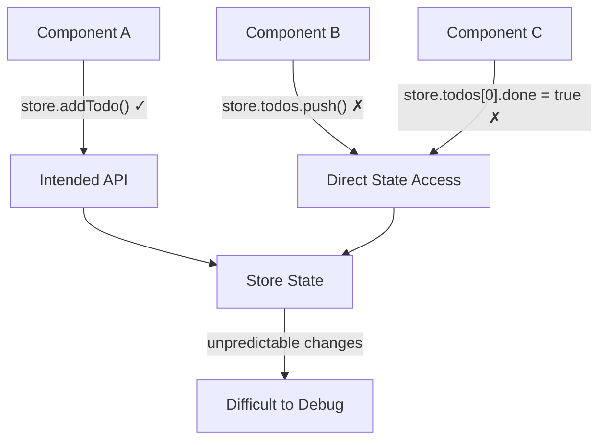
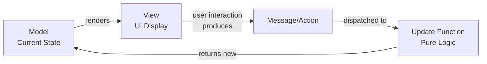
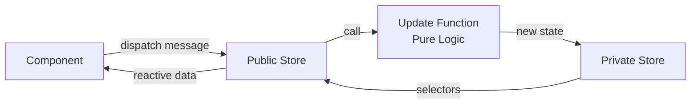
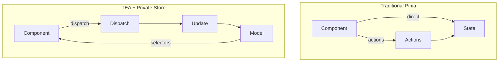

## The Problem: Pinia Gives You Freedom, Not Rules

Pinia is a fantastic state management library for Vue, but it doesn't enforce any architectural patterns. It gives you complete freedom to structure your stores however you want. This flexibility is powerful, but it comes with a hidden cost: without discipline, your stores can become unpredictable and hard to test.

The core issue? Pinia stores are inherently mutable and framework-coupled. While this makes them convenient for rapid development, it creates three problems:

```ts
// Traditional Pinia approach - tightly coupled to Vue
export const useTodosStore = defineStore("todos", () => {
  const todos = ref<Todo[]>([]);

  function addTodo(text: string) {
    todos.value.push({ id: Date.now(), text, done: false });
  }

  return { todos, addTodo };
});
```

The problem? Components can bypass your API and directly manipulate state:

```vue
<script setup lang="ts">
import { useTodosStore } from "@/stores/todos";

const store = useTodosStore();

// Intended way
store.addTodo("Learn Pinia");

// But this also works! Direct state manipulation
store.todos.push({ id: 999, text: "Hack the state", done: false });
</script>
```

This leads to unpredictable state changes, makes testing difficult (requires mocking Pinia's entire runtime), and couples your business logic tightly to Vue's reactivity system.



## The Solution: TEA + Private Store Pattern

What if we could keep Pinia's excellent developer experience while adding the predictability and testability of functional patterns? Enter The Elm Architecture (TEA) combined with the "private store" technique from [Mastering Pinia](https://masteringpinia.com/blog/how-to-create-private-state-in-stores) by Eduardo San Martin Morote (creator of Pinia).

This hybrid approach gives you:

- **Pure, testable business logic** that's framework-agnostic
- **Controlled state mutations** through a single dispatch function
- **Seamless Vue integration** with Pinia's reactivity
- **Full devtools support** for debugging

You'll use a private internal store for mutable state, expose only selectors and a dispatch function publicly, and keep your update logic pure and framework-agnostic.

> 
  This pattern shines when you have complex business logic, need framework
  portability, or want rock-solid testing. For simple CRUD operations with
  minimal logic, traditional Pinia stores are perfectly fine. Ask yourself:
  "Would I benefit from testing this logic in complete isolation?" If yes, this
  pattern is worth it.

> 
  The Elm Architecture emerged from the [Elm programming
  language](https://guide.elm-lang.org/architecture/), which pioneered a purely
  functional approach to building web applications. This pattern later inspired
  Redux's architecture in the JavaScript ecosystem, demonstrating the value of
  unidirectional data flow and immutable updates. While Elm enforces these
  patterns through its type system, we can achieve similar benefits in Vue with
  disciplined patterns.

## Understanding The Elm Architecture

Before we dive into the implementation, let's understand the core concepts of TEA:

1. **Model**: The state of your application
2. **Update**: Pure functions that transform state based on messages/actions
3. **View**: Rendering UI based on the current model



The key insight is that update functions are pure—given the same state and action, they always return the same new state. This makes them trivial to test without any framework dependencies.

## How It Works: Combining TEA with Private State

The pattern uses three key pieces: a private internal store for mutable state, pure update functions for business logic, and a public store that exposes only selectors and dispatch.

### The Private Internal Store

First, create a private store that holds the mutable model. This stays in the same file as your public store but is not exported:

```ts
// Inside stores/todos.ts - NOT exported!
const useTodosPrivate = defineStore("todos-private", () => {
  const model = ref<TodosModel>({
    todos: [],
  });

  return { model };
});
```

The key here: no `export` keyword means components can't access this directly.

### Pure Update Function

Next, define your business logic as pure functions:

> 
  A pure function always returns the same output for the same inputs and has no
  side effects. No API calls, no mutations of external state, no `console.log`.
  Just input → transformation → output. This makes them trivially easy to test
  and reason about: `update(state, action)` always produces the same new state.

```ts
// stores/todos-update.ts
import type { TodosModel, TodosMessage } from "./todos-model";

export function update(model: TodosModel, message: TodosMessage): TodosModel {
  switch (message.type) {
    case "ADD_TODO":
      return {
        ...model,
        todos: [
          ...model.todos,
          { id: Date.now(), text: message.text, done: false },
        ],
      };

    case "TOGGLE_TODO":
      return {
        ...model,
        todos: model.todos.map(todo =>
          todo.id === message.id ? { ...todo, done: !todo.done } : todo
        ),
      };

    default:
      return model;
  }
}
```

This update function is completely framework-agnostic. You can test it with simple assertions:

```ts
import { describe, it, expect } from "vitest";
import { update } from "./todos-update";

describe("update", () => {
  it("adds a todo", () => {
    const initial = { todos: [] };
    const result = update(initial, { type: "ADD_TODO", text: "Test" });

    expect(result.todos).toHaveLength(1);
    expect(result.todos[0].text).toBe("Test");
  });
});
```

> 
  If you've used Redux, this pattern will feel familiar—the `update` function is
  like a reducer, and `TodosMessage` is like an action. The key difference?
  We're using Pinia's reactivity instead of Redux's subscription model, and
  we're keeping the private store pattern to prevent direct state access. This
  gives you Redux's testability with Pinia's developer experience.

### Public Store with Selectors + Dispatch

Finally, combine everything in a single file. The private store is defined but not exported:

```ts
// stores/todos.ts (this is what components import)
import { defineStore } from "pinia";
import { ref, computed } from "vue";
import { update } from "./todos-update";
import type { TodosModel, TodosMessage } from "./todos-model";

// Private store - not exported!
const useTodosPrivate = defineStore("todos-private", () => {
  const model = ref<TodosModel>({
    todos: [],
  });

  return { model };
});

// Public store - this is what gets exported
export const useTodosStore = defineStore("todos", () => {
  const privateStore = useTodosPrivate();

  // Selectors
  const todos = computed(() => privateStore.model.todos);

  // Dispatch
  function dispatch(message: TodosMessage) {
    privateStore.model = update(privateStore.model, message);
  }

  return { todos, dispatch };
});
```



> 
Reddit user [maertensen](https://www.reddit.com/user/maertensen/) helpfully pointed out that the private store pattern only prevents direct mutation of primitives, **not arrays and objects**. Components can still mutate through selectors:

```vue
<script setup lang="ts">
import { useTodosStore } from "./todos.ts";

const publicTodosStore = useTodosStore();

function mutateTodosSelector() {
  // This still works and bypasses dispatch! ✗
  publicTodosStore.todos.push({
    id: Date.now(),
    text: "Mutated by selector",
    done: false,
  });
}
</script>
```

This is why I recommend using **`readonly` only** (shown below) instead of the private store pattern.

### Usage in Components

Components interact with the public store:

```vue
<script setup lang="ts">
import { useTodosStore } from "@/stores/todos";

const store = useTodosStore();
</script>

<template>
  <div>
    <input
      @keyup.enter="
        store.dispatch({ type: 'ADD_TODO', text: $event.target.value })
      "
    />

    <div v-for="todo in store.todos" :key="todo.id">
      <input
        type="checkbox"
        :checked="todo.done"
        @change="store.dispatch({ type: 'TOGGLE_TODO', id: todo.id })"
      />
      {{ todo.text }}
    </div>
  </div>
</template>
```

## Simpler Alternative: Using Vue's readonly

If you want to prevent direct state mutations without creating a private store, Vue's `readonly` utility provides a simpler approach:

```ts
// stores/todos.ts
import { defineStore } from "pinia";
import { ref, readonly } from "vue";
import { update } from "./todos-update";
import type { TodosModel, TodosMessage } from "./todos-model";

export const useTodosStore = defineStore("todos", () => {
  const model = ref<TodosModel>({
    todos: [],
  });

  // Dispatch
  function dispatch(message: TodosMessage) {
    model.value = update(model.value, message);
  }

  // Only expose readonly state
  return {
    todos: readonly(model),
    dispatch,
  };
});
```

With `readonly`, any attempt to mutate the state from a component will fail:

```vue
<script setup lang="ts">
const store = useTodosStore();

// ✓ Works - using dispatch
store.dispatch({ type: "ADD_TODO", text: "Learn Vue" });

// ✓ Works - accessing readonly state
const todos = store.model.todos;

// ✗ TypeScript error - readonly prevents mutation
store.model.todos.push({ id: 1, text: "Hack", done: false });
</script>
```

> 
  **Prefer `readonly` over the private store pattern.** The private store
  pattern has a critical flaw: it doesn't prevent mutation of arrays and objects
  (see warning above). Using `readonly` is simpler, more effective, and truly
  prevents all direct state mutations.

## Benefits of This Approach

1. **Pure business logic**: The `update` function has zero dependencies on Vue or Pinia
2. **Easy testing**: Test your update function with simple unit tests
3. **Framework flexibility**: Could swap Vue for React without changing update logic
4. **Type safety**: TypeScript ensures message types are correct
5. **Devtools support**: Still works with Pinia devtools since we're using real stores
6. **Encapsulation**: Private store is an implementation detail



## Conclusion

By combining The Elm Architecture with Pinia's private store pattern, we achieve:

- Pure, testable business logic
- Clear separation of concerns
- Framework-agnostic state management
- Full Pinia devtools integration
- Type-safe message dispatching

This pattern scales from simple forms to complex domain logic while keeping your code maintainable and your tests simple.

---

_Credit: This post synthesizes ideas from [The Elm Architecture](https://guide.elm-lang.org/architecture/) and Eduardo San Martin Morote's ["private store" pattern](https://masteringpinia.com/blog/how-to-create-private-state-in-stores) from Mastering Pinia._
