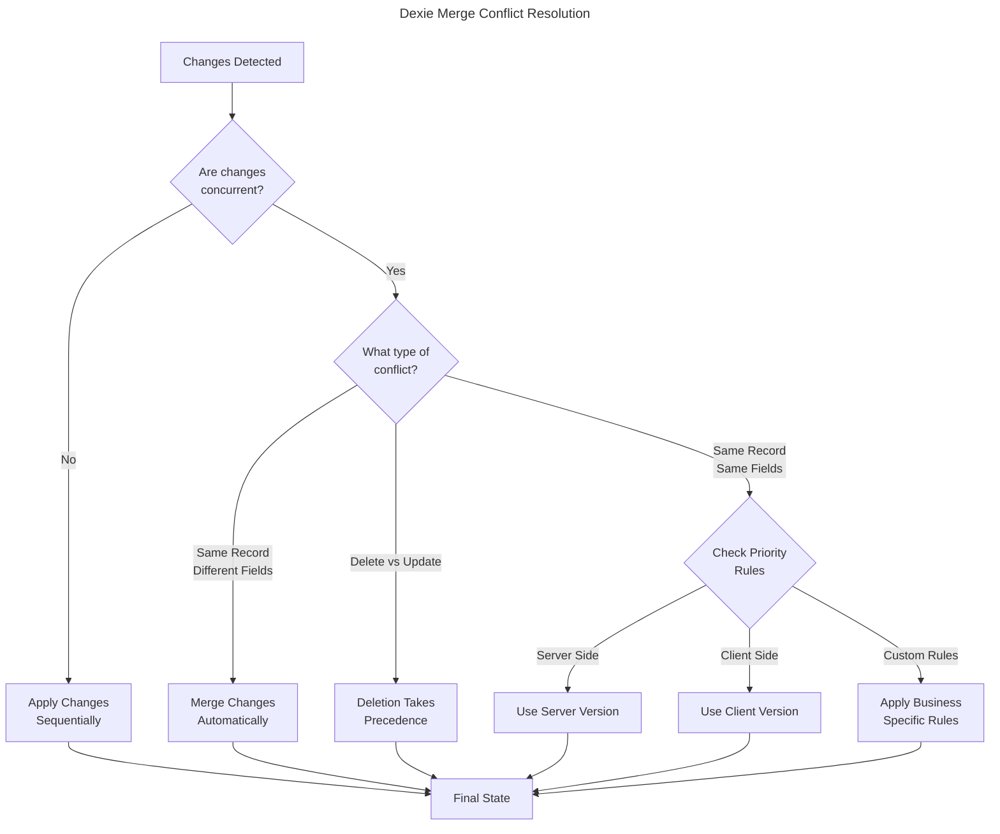

## Handling Merge Conflicts Like a Pro

One of the trickiest parts of local-first apps is handling conflicts. Here's a high-level overview of how Dexie manages them (for a detailed deep-dive, check out my [article on Dexie.js merge conflicts](/blog/understanding-dexie-merge-conflicts)):



Dexie uses a pragmatic "last-write-wins" approach by default:

1. Each change gets timestamped
2. Most recent change wins in conflicts
3. All devices sync to match
4. Local history preserves all changes

This means:

- No complex conflict resolution code needed
- Changes are preserved in history
- System stays snappy during conflicts
- Users always see latest data

## TLDR

Dexie.js uses a "last-write-wins" strategy by default for handling merge conflicts, with timestamps for each change. This approach favors simplicity and performance over complex conflict resolution, making it ideal for most applications where data conflicts are rare or non-critical.

## Introduction

In my [previous post about building local-first apps with Vue and Dexie.js](/blog/building-local-first-apps-vue-dexie), I briefly touched on how Dexie handles merge conflicts. This post dives deeper into the mechanics of conflict resolution in Dexie.js and how you can customize it for your needs.

## The Challenge of Merge Conflicts

When building local-first applications, merge conflicts are inevitable. They occur when:

- Multiple users modify the same data offline
- Changes sync back to the server at different times
- The same record is updated on different devices

## Dexie's Default Conflict Resolution

Dexie.js takes a pragmatic approach to conflict resolution with its "last-write-wins" strategy. Here's how it works:

```typescript
// Example of how Dexie tracks modifications
interface ModificationTracker {
  id: string;
  timestamp: number;
  modifiedBy: string;
  value: any;
  previousValue: any;
}

// Simplified version of how Dexie handles updates
async function updateRecord(table: string, id: string, changes: any) {
  const timestamp = Date.now();
  const currentUser = await db.cloud.currentUser;

  await db.table(table).update(id, {
    ...changes,
    _modifiedAt: timestamp,
    _modifiedBy: currentUser.id,
  });
}
```

### The Four Rules of Conflict Resolution

1. **Timestamp Priority**
   - Each modification is timestamped
   - Most recent change takes precedence
   - Server time is used as source of truth

2. **Field-Level Merging**
   - Changes to different fields merge automatically
   - No conflict raised for non-overlapping changes
   - Example:

   ```typescript
   // Device 1: Update title
   await db.todos.update(1, { title: "New Title" });

   // Device 2: Update completed status
   await db.todos.update(1, { completed: true });

   // Result: Both changes are merged
   // { id: 1, title: "New Title", completed: true }
   ```

3. **Deletion Dominance**
   - Deletes always win over updates
   - Prevents "zombie" records
   - Example:

   ```typescript
   // Device 1: Delete todo
   await db.todos.delete(1);

   // Device 2: Update todo (offline)
   await db.todos.update(1, { title: "Updated" });

   // After sync: Record remains deleted
   ```

4. **Conflict History**
   - All changes are logged
   - History can be accessed for auditing
   - Enables manual conflict resolution if needed

## Customizing Conflict Resolution

While the default strategy works well for most cases, you can customize it:

```typescript
// Custom conflict handler
db.cloud.configure({
  conflictHandler: async (
    localValue: any,
    serverValue: any,
    context: ConflictContext
  ) => {
    if (context.table === "critical_data") {
      // Use custom logic for critical data
      return mergeStrategies.manual(localValue, serverValue);
    }

    // Use default for everything else
    return mergeStrategies.lastWriteWins(localValue, serverValue);
  },
});

// Example merge strategies
const mergeStrategies = {
  lastWriteWins: (local: any, server: any) => {
    return local._modifiedAt > server._modifiedAt ? local : server;
  },

  manual: async (local: any, server: any) => {
    // Notify user and let them choose
    const choice = await showConflictDialog(local, server);
    return choice === "local" ? local : server;
  },

  combine: (local: any, server: any) => {
    // Custom logic to combine values
    return {
      ...server,
      ...local,
      combinedAt: Date.now(),
    };
  },
};
```

## Best Practices

1. **Design for Conflict Avoidance**

   ```typescript
   // Instead of shared counters
   let counter = await db.counters.get(1);
   await db.counters.update(1, { value: counter.value + 1 });

   // Use per-user counters
   await db.userCounters.add({
     userId: currentUser.id,
     value: 1,
     timestamp: Date.now(),
   });
   ```

2. **Use Appropriate Data Structures**

   ```typescript
   // Bad: Single shared list
   interface SharedList {
     id: string;
     items: string[];
   }

   // Good: Append-only structure
   interface ListItem {
     id: string;
     listId: string;
     value: string;
     addedAt: number;
     addedBy: string;
   }
   ```

3. **Implement Version Control**
   ```typescript
   interface VersionedRecord {
     id: string;
     value: any;
     version: number;
     history: {
       version: number;
       value: any;
       timestamp: number;
       userId: string;
     }[];
   }
   ```

## Monitoring and Debugging Conflicts

Dexie provides tools to monitor and debug sync conflicts:

```typescript
// Listen for sync conflicts
db.cloud.syncComplete.subscribe(({ conflicts }) => {
  if (conflicts.length > 0) {
    console.log("Sync conflicts:", conflicts);

    // Log to monitoring service
    monitoringService.logConflicts(conflicts);
  }
});

// Debug specific table conflicts
db.todos.hook("updating", (modifications, primKey, obj) => {
  console.log("Updating todo:", {
    id: primKey,
    changes: modifications,
    currentValue: obj,
  });
});
```

## Conclusion

Understanding how Dexie.js handles merge conflicts is crucial for building robust local-first applications. While its default "last-write-wins" strategy works well for most cases, knowing how to customize conflict resolution enables you to handle complex scenarios when needed.

For a practical implementation of these concepts, check out my [tutorial on building a local-first todo app](/blog/building-local-first-apps-vue-dexie) with Vue and Dexie.js.

## References

1. [Dexie.js Documentation on Sync](https://dexie.org/docs/Syncable/Dexie.Syncable.js)
2. [Martin Kleppmann's Local-First Software](https://www.inkandswitch.com/local-first/)
3. [CRDTs for Mortals](https://www.youtube.com/watch?v=DEcwa68f-jY)
