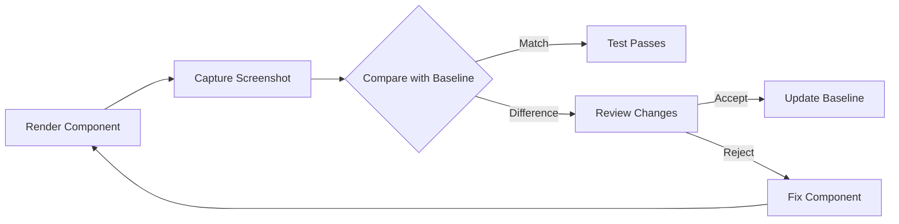

TL;DR:
Visual regression testing detects unintended UI changes by comparing screenshots. With Vitest's experimental browser mode and Playwright, you can:

- **Run tests in a real browser environment**
- **Define component stories for different states**
- **Capture screenshots and compare them with baseline images using snapshot testing**

In this guide, you'll learn how to set up visual regression testing for Vue components using Vitest.

Our test will generate this screenshot:

> 
  Visual regression testing captures screenshots of UI components and compares
  them against baseline images to flag visual discrepancies. This ensures
  consistent styling and layout across your design system.

## Vitest Configuration

Start by configuring Vitest with the Vue plugin:

```typescript
import { defineConfig } from "vitest/config";
import vue from "@vitejs/plugin-vue";

export default defineConfig({
  plugins: [vue()],
});
```

## Setting Up Browser Testing

Visual regression tests need a real browser environment. Install these dependencies:

```bash
npm install -D vitest @vitest/browser playwright
```

You can also use the following command to initialize the browser mode:

```bash
npx vitest init browser
```

First, configure Vitest to support both unit and browser tests using a workspace file, `vitest.workspace.ts`. For more details on workspace configuration, see the [Vitest Workspace Documentation](https://vitest.dev/guide/workspace.html).

> 
  Using a workspace configuration allows you to maintain separate settings for
  unit and browser tests while sharing common configuration. This makes it
  easier to manage different testing environments in your project.

```typescript
import { defineWorkspace } from "vitest/config";

export default defineWorkspace([
  {
    extends: "./vitest.config.ts",
    test: {
      name: "unit",
      include: ["**/*.spec.ts", "**/*.spec.tsx"],
      exclude: ["**/*.browser.spec.ts", "**/*.browser.spec.tsx"],
      environment: "jsdom",
    },
  },
  {
    extends: "./vitest.config.ts",
    test: {
      name: "browser",
      include: ["**/*.browser.spec.ts", "**/*.browser.spec.tsx"],
      browser: {
        enabled: true,
        provider: "playwright",
        headless: true,
        instances: [{ browser: "chromium" }],
      },
    },
  },
]);
```

Add scripts in your `package.json`

```json
{
  "scripts": {
    "test": "vitest",
    "test:unit": "vitest --project unit",
    "test:browser": "vitest --project browser"
  }
}
```

Now we can run tests in separate environments like this:

```bash
npm run test:unit
npm run test:browser
```

## The BaseButton Component

Consider the `BaseButton.vue` component a reusable button with customizable size, variant, and disabled state:

```vue
<template>
  <button
    :class="[
      'button',
      `button--${size}`,
      `button--${variant}`,
      { 'button--disabled': disabled },
    ]"
    :disabled="disabled"
    @click="$emit('click', $event)"
  >
    <slot></slot>
  </button>
</template>

<script setup lang="ts">
interface Props {
  size?: "small" | "medium" | "large";
  variant?: "primary" | "secondary" | "outline";
  disabled?: boolean;
}

defineProps<Props>();
defineEmits<{
  (e: "click", event: MouseEvent): void;
}>();
</script>

<style scoped>
.button {
  display: inline-flex;
  align-items: center;
  justify-content: center;
  /* Additional styling available in the GitHub repository */
}

/* Size, variant, and state modifiers available in the GitHub repository */
</style>
```

## Defining Stories for Testing

Create "stories" to showcase different button configurations:

```typescript
const buttonStories = [
  {
    name: "Primary Medium",
    props: { variant: "primary", size: "medium" },
    slots: { default: "Primary Button" },
  },
  {
    name: "Secondary Medium",
    props: { variant: "secondary", size: "medium" },
    slots: { default: "Secondary Button" },
  },
  // and much more ...
];
```

Each story defines a name, props, and slot content.

## Rendering Stories for Screenshots

Render all stories in one container to capture a comprehensive screenshot:

```typescript
import type { Component } from "vue";

interface Story<T> {
  name: string;
  props: Record<string, any>;
  slots: Record<string, string>;
}

function renderStories<T>(
  component: Component,
  stories: Story<T>[]
): HTMLElement {
  const container = document.createElement("div");
  container.style.display = "flex";
  container.style.flexDirection = "column";
  container.style.gap = "16px";
  container.style.padding = "20px";
  container.style.backgroundColor = "#ffffff";

  stories.forEach(story => {
    const storyWrapper = document.createElement("div");
    const label = document.createElement("h3");
    label.textContent = story.name;
    storyWrapper.appendChild(label);

    const { container: storyContainer } = render(component, {
      props: story.props,
      slots: story.slots,
    });
    storyWrapper.appendChild(storyContainer);
    container.appendChild(storyWrapper);
  });

  return container;
}
```

## Writing the Visual Regression Test

Write a test that renders the stories and captures a screenshot:

```typescript
import { describe, it, expect } from "vitest";
import BaseButton from "../BaseButton.vue";
import { render } from "vitest-browser-vue";
import { page } from "@vitest/browser/context";
import type { Component } from "vue";

// [buttonStories and renderStories defined above]

describe("BaseButton", () => {
  describe("visual regression", () => {
    it("should match all button variants snapshot", async () => {
      const container = renderStories(BaseButton, buttonStories);
      document.body.appendChild(container);

      const screenshot = await page.screenshot({
        path: "all-button-variants.png",
      });

      // this assertion is acutaly not doing anything
      // but otherwise you would get a warning about the screenshot not being taken
      expect(screenshot).toBeTruthy();

      document.body.removeChild(container);
    });
  });
});
```

Use `render` from `vitest-browser-vue` to capture components as they appear in a real browser.

> 
  Save this file with a `.browser.spec.ts` extension (e.g.,
  `BaseButton.browser.spec.ts`) to match your browser test configuration.

## Beyond Screenshots: Automated Comparison

Automate image comparison by encoding screenshots in base64 and comparing them against baseline snapshots:

```typescript
// Helper function to take and compare screenshots
async function takeAndCompareScreenshot(name: string, element: HTMLElement) {
  const screenshotDir = "./__screenshots__";
  const snapshotDir = "./__snapshots__";
  const screenshotPath = `${screenshotDir}/${name}.png`;

  // Append element to body
  document.body.appendChild(element);

  // Take screenshot
  const screenshot = await page.screenshot({
    path: screenshotPath,
    base64: true,
  });

  // Compare base64 snapshot
  await expect(screenshot.base64).toMatchFileSnapshot(
    `${snapshotDir}/${name}.snap`
  );

  // Save PNG for reference
  await expect(screenshot.path).toBeTruthy();

  // Cleanup
  document.body.removeChild(element);
}
```

Then update the test:

```typescript
describe("BaseButton", () => {
  describe("visual regression", () => {
    it("should match all button variants snapshot", async () => {
      const container = renderStories(BaseButton, buttonStories);
      await expect(
        takeAndCompareScreenshot("all-button-variants", container)
      ).resolves.not.toThrow();
    });
  });
});
```

> 
  Vitest is discussing native screenshot comparisons in browser mode. Follow and
  contribute at
  [github.com/vitest-dev/vitest/discussions/690](https://github.com/vitest-dev/vitest/discussions/690).



## Conclusion

Vitest's experimental browser mode empowers developers to perform accurate visual regression testing of Vue components in real browser environments.
While the current workflow requires manual review of screenshot comparisons, it establishes a foundation for more automated visual testing in the future.
This approach also strengthens collaboration between developers and UI designers.
Designers can review visual changes to components before production deployment by accessing the generated screenshots in the component library.
For advanced visual testing capabilities, teams should explore dedicated tools like Playwright or Cypress that offer more features and maturity.
Keep in mind to perform visual regression tests against your Base components.
