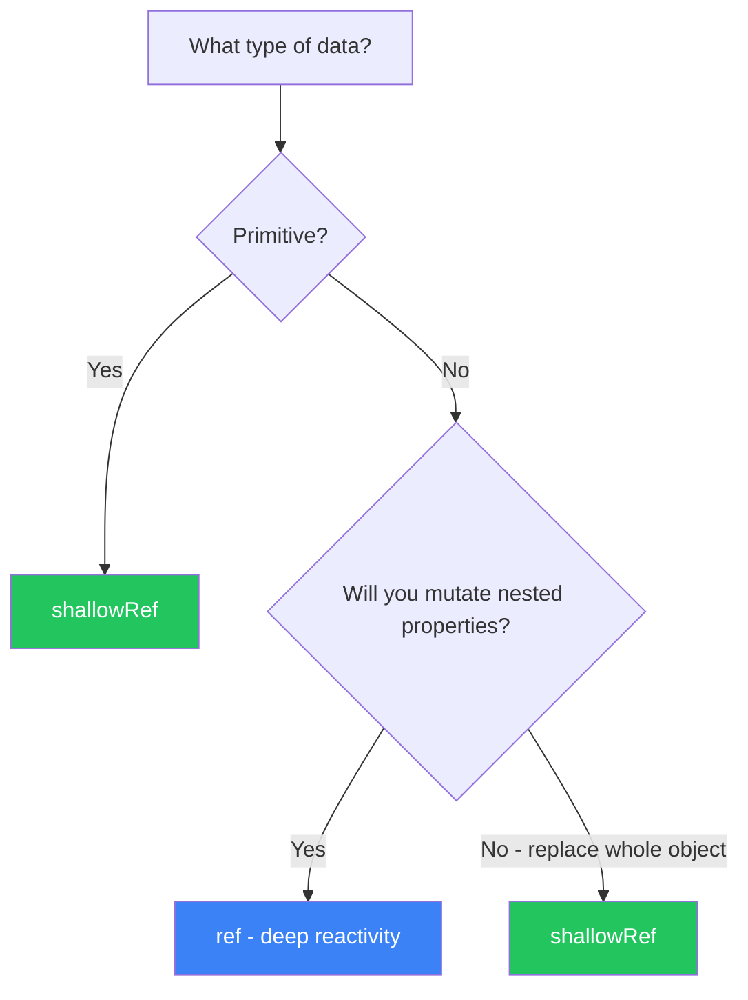
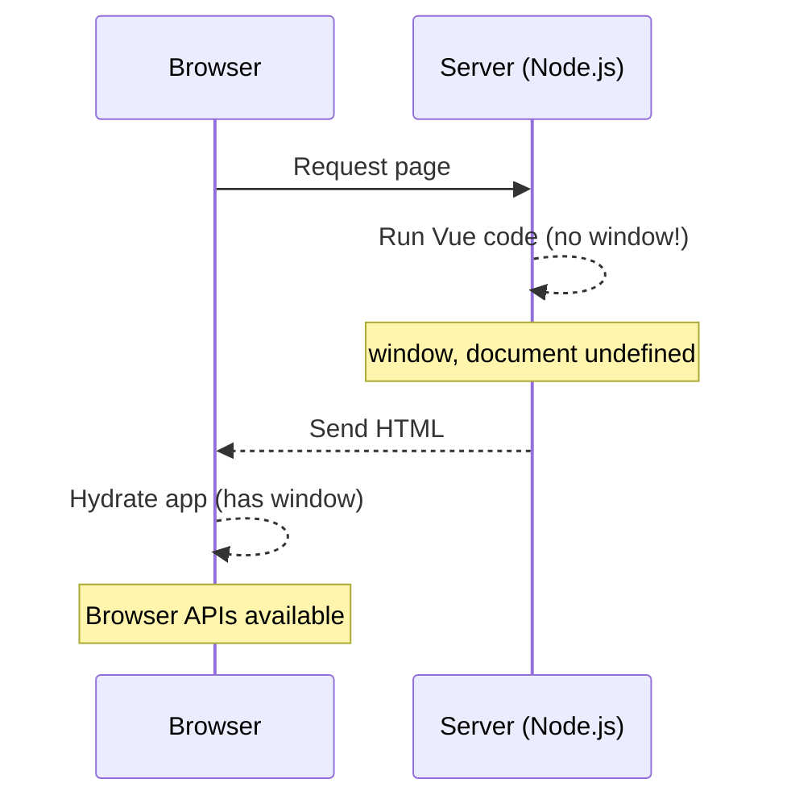
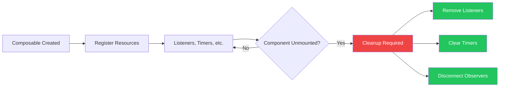
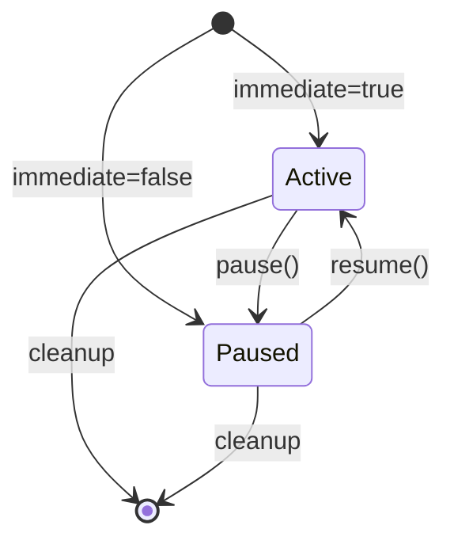

I was studying VueUse's codebase to understand how they structure their composables. VueUse has become the de facto standard library for Vue utilities, and I wanted to understand the patterns that make their composables so reliable. After diving deep into their source code, I distilled the key patterns into this style guide.

Whether you're building your own composable library or just want to write better code, these patterns will help you create maintainable, type-safe, and SSR-compatible composition utilities.

If you're new to Vue composables, I recommend starting with my earlier post [Mastering Vue 3 Composables: A Comprehensive Style Guide](/blog/mastering-vue-3-composables-a-comprehensive-style-guide), which covers many of the same patterns from a beginner-friendly perspective.

## Quick Summary

This guide covers patterns for writing production-quality Vue 3 composables:

- **Project structure** and naming conventions
- **Ref type selection** (shallowRef vs ref)
- **Flexible inputs** with `MaybeRefOrGetter`
- **SSR safety** patterns for server-side rendering
- **Cleanup and memory management** with auto-cleanup utilities
- **Controllable composables** (pausable, stoppable patterns)
- **TypeScript best practices** for full type inference
- **Testing strategies** - see [How to Test Vue Composables](/blog/how-to-test-vue-composables)

## Table of Contents

---

## 1. Getting Started

### What Makes a Good Composable?

A well-designed composable should be:

- **Focused**: Does one thing well
- **Flexible**: Accepts refs, getters, or plain values
- **Safe**: Works in SSR, handles cleanup automatically
- **Typed**: Full TypeScript support with inference
- **Testable**: Easy to unit test in isolation

### Minimal Example

```typescript
import { shallowRef, toValue, type MaybeRefOrGetter } from 'vue'

export function useCounter(initialValue: MaybeRefOrGetter<number> = 0) {
  const count = shallowRef(toValue(initialValue))

  const increment = () => count.value++
  const decrement = () => count.value--
  const reset = () => count.value = toValue(initialValue)

  return { count, increment, decrement, reset }
}
```

This simple example already demonstrates several VueUse patterns: using `shallowRef` for primitives, accepting `MaybeRefOrGetter` for flexible inputs, and returning an object with reactive state and methods.

---

## 2. Project Structure

### Recommended Layout

### Export Pattern

```typescript
// src/composables/index.ts
export { useCounter } from './useCounter'
export { useFetch } from './useFetch'
export type { UseCounterReturn, UseCounterOptions } from './useCounter'
export type { UseFetchReturn, UseFetchOptions } from './useFetch'
```

> 
Use named exports only. Never use default exports for composables. This ensures better tree-shaking and clearer imports.

For more on project organization, check out [How to Structure Vue Projects](/blog/how-to-structure-vue-projects).

---

## 3. Naming Conventions

### Function Names

| Prefix | Use Case | Example |
|--------|----------|---------|
| `use` | Standard composables | `useMouse`, `useStorage`, `useFetch` |
| `create` | Factory functions that return composables | `createSharedState`, `createEventHook` |
| `on` | Event listener composables | `onClickOutside`, `onKeyPress` |
| `try` | Safe operations that may fail silently | `tryOnMounted`, `tryOnCleanup` |

### Type Names

```typescript
// Options: Use{Name}Options
export interface UseStorageOptions {
  deep?: boolean
  listenToChanges?: boolean
}

// Return type: Use{Name}Return
export interface UseStorageReturn<T> {
  data: Ref<T>
  set: (value: T) => void
  remove: () => void
}

// Inferred type shorthand
export type UseStorageReturnType<T> = ReturnType<typeof useStorage<T>>
```

---

## 4. Choosing the Right Ref Type

This is one of the most important decisions when writing composables. VueUse consistently follows this pattern:



### shallowRef - For Primitives and Replaced Objects

```typescript
// Primitives
const count = shallowRef(0)
const isActive = shallowRef(false)
const name = shallowRef('')

// Objects that get replaced, not mutated
const user = shallowRef<User | null>(null)
const response = shallowRef<Response | null>(null)

// Usage: Replace the whole object
user.value = { name: 'John', age: 30 }  // Triggers reactivity
```

### ref - For Deep Mutations

```typescript
// Objects with nested mutations
const form = ref({
  user: { name: '', email: '' },
  settings: { theme: 'light' }
})

// Usage: Mutate nested properties
form.value.user.name = 'John'  // Triggers reactivity
form.value.settings.theme = 'dark'  // Triggers reactivity
```

### Let Users Choose

For composables storing user data, let them decide:

```typescript
export interface UseStateOptions {
  /**
   * Use shallow reactivity for better performance with large objects
   * @default false
   */
  shallow?: boolean
}

export function useState<T>(initialValue: T, options: UseStateOptions = {}) {
  const { shallow = false } = options

  const state = shallow
    ? shallowRef(initialValue)
    : ref(initialValue)

  return { state }
}
```

---

## 5. Flexible Inputs

### Accept Refs, Getters, or Plain Values

Use `MaybeRefOrGetter<T>` to make your composables flexible:

```typescript
import { toValue, type MaybeRefOrGetter } from 'vue'

export function useTitle(title: MaybeRefOrGetter<string>) {
  // toValue() handles all input types:
  // - Plain value: 'Hello' → 'Hello'
  // - Ref: ref('Hello') → 'Hello'
  // - Getter: () => 'Hello' → 'Hello'

  watchEffect(() => {
    document.title = toValue(title)
  })
}

// All of these work:
useTitle('Static Title')
useTitle(ref('Reactive Title'))
useTitle(() => `Page ${currentPage.value}`)
useTitle(computed(() => `${userName.value}'s Profile`))
```

### Reactive Configuration

For options that should be reactive:

```typescript
export interface UseIntervalOptions {
  interval?: MaybeRefOrGetter<number>
  immediate?: boolean
}

export function useInterval(
  callback: () => void,
  options: UseIntervalOptions = {}
) {
  const { interval = 1000, immediate = true } = options

  // Watch the interval for changes
  watch(
    () => toValue(interval),
    (ms) => {
      clearInterval(timer)
      if (ms > 0) {
        timer = setInterval(callback, ms)
      }
    },
    { immediate }
  )
}

// Interval can change reactively
const delay = ref(1000)
useInterval(() => console.log('tick'), { interval: delay })
delay.value = 500  // Interval updates automatically
```

---

## 6. Designing Options

### Structure

```typescript
export interface UseStorageOptions<T> {
  /**
   * Storage type to use
   * @default 'local'
   */
  storage?: 'local' | 'session'

  /**
   * Custom serializer for complex data
   * @default JSON.stringify/parse
   */
  serializer?: {
    read: (raw: string) => T
    write: (value: T) => string
  }

  /**
   * Sync across browser tabs
   * @default true
   */
  listenToStorageChanges?: boolean

  /**
   * Called when an error occurs
   */
  onError?: (error: Error) => void
}
```

### Rules for Options

1. **Document every option** with JSDoc
2. **Provide sensible defaults** using `@default`
3. **Use callbacks** for events (`onError`, `onSuccess`, `onChange`)
4. **Group related options** in nested objects if complex

### Extending Base Interfaces

Create reusable option interfaces:

```typescript
// src/composables/utils/types.ts

/** Options for composables that use window */
export interface ConfigurableWindow {
  /**
   * Custom window instance (useful for iframes or testing)
   * @default window
   */
  window?: Window
}

/** Options for composables that use document */
export interface ConfigurableDocument {
  /**
   * Custom document instance
   * @default document
   */
  document?: Document
}

// Usage in composables
export interface UseEventListenerOptions extends ConfigurableWindow {
  capture?: boolean
  passive?: boolean
}
```

---

## 7. Return Values

### Object Return (Recommended for Multiple Values)

```typescript
export interface UseMouseReturn {
  /** Current X position */
  x: Readonly<Ref<number>>
  /** Current Y position */
  y: Readonly<Ref<number>>
  /** Source of the last event */
  sourceType: Readonly<Ref<'mouse' | 'touch' | null>>
}

export function useMouse(): UseMouseReturn {
  const x = shallowRef(0)
  const y = shallowRef(0)
  const sourceType = shallowRef<'mouse' | 'touch' | null>(null)

  // ... implementation

  return {
    x: readonly(x),
    y: readonly(y),
    sourceType: readonly(sourceType),
  }
}
```

### Single Ref Return (For Simple Composables)

```typescript
export function useOnline(): Readonly<Ref<boolean>> {
  const isOnline = shallowRef(navigator.onLine)

  // ... implementation

  return readonly(isOnline)
}
```

### Tuple Return (When Destructuring Order Matters)

```typescript
export function useToggle(
  initialValue = false
): [Ref<boolean>, (value?: boolean) => void] {
  const state = shallowRef(initialValue)

  const toggle = (value?: boolean) => {
    state.value = value ?? !state.value
  }

  return [state, toggle]
}

// Usage
const [isOpen, toggleOpen] = useToggle()
```

### Making Composables Awaitable

For async composables, implement `PromiseLike`:

```typescript
export function useFetch<T>(url: MaybeRefOrGetter<string>) {
  const data = shallowRef<T | null>(null)
  const isLoading = shallowRef(true)
  const error = shallowRef<Error | null>(null)

  const execute = async () => {
    isLoading.value = true
    try {
      const response = await fetch(toValue(url))
      data.value = await response.json()
    } catch (e) {
      error.value = e as Error
    } finally {
      isLoading.value = false
    }
  }

  execute()

  const shell = { data, isLoading, error, execute }

  return {
    ...shell,
    // Make it awaitable
    then<TResult>(
      onFulfilled?: (value: typeof shell) => TResult
    ): Promise<TResult> {
      return new Promise((resolve) => {
        watch(isLoading, (loading) => {
          if (!loading) resolve(onFulfilled?.(shell) as TResult)
        }, { immediate: true })
      })
    }
  }
}

// Can be used both ways:
const { data, isLoading } = useFetch('/api/users')

// Or awaited:
const { data } = await useFetch('/api/users')
console.log(data.value)  // Data is ready
```

---

## 8. SSR Safety

### The Problem

Browser APIs (`window`, `document`, `localStorage`) don't exist on the server. Accessing them during SSR causes errors.

For a deep dive into this topic, see [How VueUse Solves SSR Window Errors](/blog/how-vueuse-solves-ssr-window-errors-vue-applications).



### Solution: Create SSR Utilities

```typescript
// src/composables/utils/ssr.ts

/**
 * Check if code is running in browser
 */
export const isClient = typeof window !== 'undefined'

/**
 * Check if code is running on server
 */
export const isServer = !isClient

/**
 * Safe window reference (undefined on server)
 */
export const defaultWindow = isClient ? window : undefined

/**
 * Safe document reference (undefined on server)
 */
export const defaultDocument = isClient ? document : undefined

/**
 * Safe localStorage reference (undefined on server)
 */
export const defaultStorage = isClient ? localStorage : undefined
```

### Using SSR Utilities

```typescript
import { defaultWindow, type ConfigurableWindow } from '../utils/ssr'

export interface UseWindowSizeOptions extends ConfigurableWindow {
  initialWidth?: number
  initialHeight?: number
}

export function useWindowSize(options: UseWindowSizeOptions = {}) {
  const {
    window = defaultWindow,
    initialWidth = Infinity,
    initialHeight = Infinity,
  } = options

  const width = shallowRef(initialWidth)
  const height = shallowRef(initialHeight)

  const update = () => {
    // Guard: Only run if window exists
    if (window) {
      width.value = window.innerWidth
      height.value = window.innerHeight
    }
  }

  // Only set up listeners on client
  if (window) {
    update()
    window.addEventListener('resize', update)

    onUnmounted(() => {
      window.removeEventListener('resize', update)
    })
  }

  return { width, height }
}
```

### Feature Detection

Create a utility to safely check for browser features:

```typescript
export function useSupported(check: () => boolean): Readonly<Ref<boolean>> {
  const isSupported = shallowRef(false)

  onMounted(() => {
    isSupported.value = check()
  })

  return readonly(isSupported)
}

// Usage
export function useClipboard() {
  const isSupported = useSupported(
    () => navigator && 'clipboard' in navigator
  )

  const copy = async (text: string) => {
    if (!isSupported.value) {
      console.warn('Clipboard API not supported')
      return false
    }
    // ... implementation
  }

  return { isSupported, copy }
}
```

---

## 9. Cleanup and Memory Management

### The Problem

Event listeners, timers, and observers must be cleaned up to prevent memory leaks.



### Solution: Auto-Cleanup Utility

```typescript
// src/composables/utils/cleanup.ts
import { getCurrentScope, onScopeDispose } from 'vue'

/**
 * Register a cleanup function that runs when the scope is disposed.
 * Safe to call outside of component context.
 *
 * @returns true if cleanup was registered, false otherwise
 */
export function tryOnCleanup(fn: () => void): boolean {
  if (getCurrentScope()) {
    onScopeDispose(fn)
    return true
  }
  return false
}

/**
 * Safe onMounted that doesn't error outside component context
 */
export function tryOnMounted(fn: () => void): void {
  if (getCurrentScope()) {
    onMounted(fn)
  }
}
```

### Using Auto-Cleanup

```typescript
import { tryOnCleanup } from '../utils/cleanup'

export function useInterval(callback: () => void, ms: number) {
  let timer: ReturnType<typeof setInterval> | null = null

  const start = () => {
    stop()
    timer = setInterval(callback, ms)
  }

  const stop = () => {
    if (timer) {
      clearInterval(timer)
      timer = null
    }
  }

  start()

  // Automatically stops when component unmounts
  tryOnCleanup(stop)

  return { start, stop }
}
```

### Event Listener Composable with Auto-Cleanup

```typescript
export function useEventListener<K extends keyof WindowEventMap>(
  event: K,
  handler: (event: WindowEventMap[K]) => void,
  options?: AddEventListenerOptions & ConfigurableWindow
): () => void {
  const { window = defaultWindow, ...listenerOptions } = options ?? {}

  let cleanup = () => {}

  if (window) {
    window.addEventListener(event, handler, listenerOptions)
    cleanup = () => window.removeEventListener(event, handler, listenerOptions)
  }

  tryOnCleanup(cleanup)

  return cleanup
}
```

---

## 10. Controllable Composables

### Pausable Pattern



For composables that can be paused and resumed:

```typescript
export interface Pausable {
  /** Whether the composable is currently active */
  isActive: Readonly<Ref<boolean>>
  /** Pause the composable */
  pause: () => void
  /** Resume the composable */
  resume: () => void
}

export interface UseIntervalOptions {
  /** Start immediately */
  immediate?: boolean
  /** Call callback immediately when starting */
  immediateCallback?: boolean
}

export function useIntervalFn(
  callback: () => void,
  interval: MaybeRefOrGetter<number> = 1000,
  options: UseIntervalOptions = {}
): Pausable {
  const { immediate = true, immediateCallback = false } = options

  const isActive = shallowRef(false)
  let timer: ReturnType<typeof setInterval> | null = null

  function clean() {
    if (timer) {
      clearInterval(timer)
      timer = null
    }
  }

  function pause() {
    isActive.value = false
    clean()
  }

  function resume() {
    const ms = toValue(interval)
    if (ms <= 0) return

    isActive.value = true
    if (immediateCallback) callback()

    clean()
    timer = setInterval(callback, ms)
  }

  if (immediate) resume()

  tryOnCleanup(pause)

  return {
    isActive: readonly(isActive),
    pause,
    resume,
  }
}

// Usage
const { isActive, pause, resume } = useIntervalFn(() => {
  console.log('tick')
}, 1000)

pause()   // Stop ticking
resume()  // Start again
```

### Stoppable Pattern

For one-way stopping (e.g., timeouts, one-time operations):

```typescript
export interface Stoppable {
  /** Whether the operation is pending */
  isPending: Readonly<Ref<boolean>>
  /** Stop the operation */
  stop: () => void
}

export function useTimeoutFn(
  callback: () => void,
  interval: MaybeRefOrGetter<number>,
  options: { immediate?: boolean } = {}
): Stoppable & { start: () => void } {
  const { immediate = true } = options

  const isPending = shallowRef(false)
  let timer: ReturnType<typeof setTimeout> | null = null

  function stop() {
    isPending.value = false
    if (timer) {
      clearTimeout(timer)
      timer = null
    }
  }

  function start() {
    stop()
    isPending.value = true
    timer = setTimeout(() => {
      isPending.value = false
      timer = null
      callback()
    }, toValue(interval))
  }

  if (immediate) start()

  tryOnCleanup(stop)

  return {
    isPending: readonly(isPending),
    stop,
    start,
  }
}
```

---

## 11. Error Handling

### Graceful Degradation

```typescript
export function useGeolocation() {
  const isSupported = useSupported(
    () => navigator && 'geolocation' in navigator
  )

  const coords = shallowRef<GeolocationCoordinates | null>(null)
  const error = shallowRef<GeolocationPositionError | null>(null)

  function update() {
    if (!isSupported.value) return

    navigator.geolocation.getCurrentPosition(
      (position) => {
        coords.value = position.coords
        error.value = null
      },
      (err) => {
        error.value = err
      }
    )
  }

  if (isSupported.value) {
    update()
  }

  return {
    isSupported,
    coords,
    error,
    update,
  }
}
```

### Error Callbacks

```typescript
export interface UseAsyncStateOptions<T> {
  /** Called on success */
  onSuccess?: (data: T) => void
  /** Called on error */
  onError?: (error: unknown) => void
  /**
   * Whether to throw errors
   * @default false
   */
  throwError?: boolean
}

export function useAsyncState<T>(
  promise: () => Promise<T>,
  initialState: T,
  options: UseAsyncStateOptions<T> = {}
) {
  const { onSuccess, onError, throwError = false } = options

  const state = shallowRef<T>(initialState)
  const error = shallowRef<unknown>(null)
  const isLoading = shallowRef(false)

  async function execute() {
    isLoading.value = true
    error.value = null

    try {
      const data = await promise()
      state.value = data
      onSuccess?.(data)
    } catch (e) {
      error.value = e
      onError?.(e)
      if (throwError) throw e
    } finally {
      isLoading.value = false
    }
  }

  execute()

  return { state, error, isLoading, execute }
}
```

---

## 13. TypeScript Best Practices

### Generic Type Inference

Let TypeScript infer types when possible:

```typescript
// Type T is inferred from defaultValue
export function useStorage<T>(key: string, defaultValue: T): Ref<T> {
  // ...
}

// Usage - types are inferred
const name = useStorage('name', 'John')     // Ref<string>
const count = useStorage('count', 0)        // Ref<number>
const user = useStorage('user', { id: 1 })  // Ref<{ id: number }>
```

### Function Overloads

Use overloads for different call signatures:

```typescript
// Overload 1: Window events
export function useEventListener<K extends keyof WindowEventMap>(
  event: K,
  handler: (e: WindowEventMap[K]) => void
): () => void

// Overload 2: Element events
export function useEventListener<K extends keyof HTMLElementEventMap>(
  target: MaybeRefOrGetter<HTMLElement | null>,
  event: K,
  handler: (e: HTMLElementEventMap[K]) => void
): () => void

// Implementation
export function useEventListener(...args: any[]): () => void {
  // ... implementation handles all cases
}
```

### Conditional Return Types

```typescript
// If passed a ref, return just the toggle function
export function useToggle(
  value: Ref<boolean>
): (value?: boolean) => boolean

// If passed a plain value, return tuple
export function useToggle(
  initialValue?: boolean
): [Ref<boolean>, (value?: boolean) => boolean]

// Implementation
export function useToggle(
  initialValue: MaybeRef<boolean> = false
) {
  const valueIsRef = isRef(initialValue)
  const state = shallowRef(toValue(initialValue))

  const toggle = (value?: boolean) => {
    state.value = value ?? !state.value
    return state.value
  }

  if (valueIsRef) {
    return toggle
  }
  return [state, toggle] as const
}
```

---

## 14. Testing

For comprehensive testing strategies including basic test structure, testing with timers, and testing async composables, see [How to Test Vue Composables](/blog/how-to-test-vue-composables).

---

## 15. Documentation

### JSDoc Comments

```typescript
/**
 * Reactive mouse position
 *
 * @param options - Configuration options
 * @returns Reactive mouse coordinates and source type
 *
 * @example
 * ```ts
 * const { x, y } = useMouse()
 *
 * watchEffect(() => {
 *   console.log(`Mouse at ${x.value}, ${y.value}`)
 * })
 * ```
 *
 * @see https://your-docs.com/composables/use-mouse
 */
export function useMouse(options?: UseMouseOptions): UseMouseReturn {
  // ...
}
```

### Document Every Option

Every option should have a JSDoc comment with a `@default` tag:

```typescript
export interface UseStorageOptions {
  /**
   * Storage type to use
   * @default 'local'
   */
  storage?: 'local' | 'session'

  /**
   * Whether to sync across browser tabs
   * @default true
   */
  listenToStorageChanges?: boolean
}
```

---

## 16. Templates

### Basic Composable Template

```typescript
import { shallowRef, readonly, toValue, type MaybeRefOrGetter, type Ref } from 'vue'
import { tryOnCleanup } from '../utils/cleanup'

export interface UseXxxOptions {
  /**
   * Option description
   * @default 'defaultValue'
   */
  someOption?: string
}

export interface UseXxxReturn {
  /** Description of value */
  value: Readonly<Ref<number>>
  /** Description of action */
  doSomething: () => void
}

/**
 * Short description of what this composable does
 *
 * @param param - Description of parameter
 * @param options - Configuration options
 */
export function useXxx(
  param: MaybeRefOrGetter<string>,
  options: UseXxxOptions = {}
): UseXxxReturn {
  const { someOption = 'defaultValue' } = options

  const value = shallowRef(0)

  function doSomething() {
    const paramValue = toValue(param)
    value.value++
  }

  // Cleanup if needed
  tryOnCleanup(() => {
    // cleanup logic
  })

  return {
    value: readonly(value),
    doSomething,
  }
}
```

### Async Composable Template

```typescript
import { shallowRef, readonly, toValue, type MaybeRefOrGetter, type Ref } from 'vue'
import { createEventHook, type EventHook } from '../utils/eventHook'
import { tryOnCleanup } from '../utils/cleanup'

export interface UseAsyncXxxOptions<T> {
  /**
   * Execute immediately
   * @default true
   */
  immediate?: boolean
  /**
   * Called on success
   */
  onSuccess?: (data: T) => void
  /**
   * Called on error
   */
  onError?: (error: Error) => void
}

export interface UseAsyncXxxReturn<T> {
  data: Readonly<Ref<T | null>>
  error: Readonly<Ref<Error | null>>
  isLoading: Readonly<Ref<boolean>>
  execute: () => Promise<void>
  onSuccess: EventHook<T>['on']
  onError: EventHook<Error>['on']
}

export function useAsyncXxx<T>(
  fetcher: () => Promise<T>,
  options: UseAsyncXxxOptions<T> = {}
): UseAsyncXxxReturn<T> {
  const { immediate = true, onSuccess, onError } = options

  const data = shallowRef<T | null>(null)
  const error = shallowRef<Error | null>(null)
  const isLoading = shallowRef(false)

  const successHook = createEventHook<T>()
  const errorHook = createEventHook<Error>()

  async function execute() {
    isLoading.value = true
    error.value = null

    try {
      const result = await fetcher()
      data.value = result
      onSuccess?.(result)
      successHook.trigger(result)
    } catch (e) {
      const err = e as Error
      error.value = err
      onError?.(err)
      errorHook.trigger(err)
    } finally {
      isLoading.value = false
    }
  }

  if (immediate) {
    execute()
  }

  return {
    data: readonly(data),
    error: readonly(error),
    isLoading: readonly(isLoading),
    execute,
    onSuccess: successHook.on,
    onError: errorHook.on,
  }
}
```

### Pausable Composable Template

```typescript
import { shallowRef, readonly, toValue, type MaybeRefOrGetter, type Ref } from 'vue'
import { tryOnCleanup } from '../utils/cleanup'

export interface Pausable {
  isActive: Readonly<Ref<boolean>>
  pause: () => void
  resume: () => void
}

export interface UsePausableXxxOptions {
  /**
   * Start immediately
   * @default true
   */
  immediate?: boolean
}

export function usePausableXxx(
  callback: () => void,
  interval: MaybeRefOrGetter<number> = 1000,
  options: UsePausableXxxOptions = {}
): Pausable {
  const { immediate = true } = options

  const isActive = shallowRef(false)
  let timer: ReturnType<typeof setInterval> | null = null

  function clean() {
    if (timer) {
      clearInterval(timer)
      timer = null
    }
  }

  function pause() {
    isActive.value = false
    clean()
  }

  function resume() {
    const ms = toValue(interval)
    if (ms <= 0) return

    isActive.value = true
    clean()
    timer = setInterval(callback, ms)
  }

  if (immediate) {
    resume()
  }

  tryOnCleanup(pause)

  return {
    isActive: readonly(isActive),
    pause,
    resume,
  }
}
```

---

## Quick Reference Checklist

Use this checklist when creating new composables:

**Structure**
- [ ] Named export (no default)
- [ ] Explicit return type interface
- [ ] JSDoc with `@param`, `@returns`, `@example`

**Reactivity**
- [ ] `shallowRef` for primitives
- [ ] `ref` only when deep mutations needed
- [ ] `MaybeRefOrGetter` for flexible inputs
- [ ] `toValue()` to unwrap inputs
- [ ] `readonly()` for exposed refs

**Safety**
- [ ] Guard browser APIs (`if (window)`)
- [ ] Auto-cleanup with `tryOnCleanup`
- [ ] Feature detection for optional APIs

**TypeScript**
- [ ] Generic type inference where possible
- [ ] Overloads for multiple signatures
- [ ] Strict types, no `any`

**Testing**
- [ ] Unit tests for all functionality
- [ ] Edge cases (null, undefined, empty)
- [ ] Cleanup verification

---

## Additional Resources

- [Vue Composition API Docs](https://vuejs.org/guide/extras/composition-api-faq.html)
- [Vue Reactivity in Depth](https://vuejs.org/guide/extras/reactivity-in-depth.html)
- [VueUse](https://vueuse.org) - Collection of Vue composables (the source of these patterns)
- [Vitest](https://vitest.dev) - Testing framework for Vue

---

These patterns represent the accumulated wisdom from VueUse's codebase. Apply them consistently to build maintainable, type-safe, and production-ready Vue composables.
