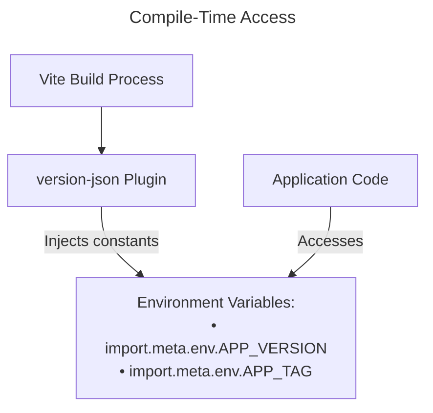

Today I discovered a very simple way for my Vue 3 single-page app to tell users when I've released a new update.

## The idea

1.  **Build-time**: Each time I run `vite build`, a small Vite plugin creates a `version.json` file. It also sets up some information that's available when the app is built.
2.  **Run-time**: The app regularly checks the `/version.json` file.
3.  If the **`version`** or **`tag`** in that file doesn't match the information the app was built with, we show a message like "New version available – refresh!"



## The Vite plugin ( `plugins/version-json.ts` )

```ts
export default function versionJson(): Plugin {
  // …snip…
  const versionDetails = {
    name: pkg.name,
    version: pkg.version, // 2.0.0
    tag: gitTag(), // v2.0.0-2-gabcdef
    commit: gitCommitHash(), // abcdef…
    commitTime: gitCommitTimestamp(),
    created: new Date().toISOString(),
  };

  return {
    name: "version-json",
    // 👉 1. Serve /version.json in dev
    configureServer(server) {
      server.middlewares.use((req, res, next) => {
        if (req.url === "/version.json") {
          res.setHeader("Content-Type", "application/json");
          res.end(JSON.stringify(versionDetails, null, 2));
          return;
        }
        next();
      });
    },

    // 👉 2. Emit dist/version.json in production
    closeBundle() {
      writeFileSync(
        resolve(outDir, "version.json"),
        JSON.stringify(
          { ...versionDetails, created: new Date().toISOString() },
          null,
          2
        )
      );
    },
  };
}
```

> 
  <h3>Version Information Format</h3>
  <p>The version information includes:</p>
  <ul>
    <li>Application name - From package.json (e.g., "vue-package-json")</li>
    <li>Version number - From package.json (e.g., "2.0.0")</li>
    <li>Git tag - Latest repository tag</li>
    <li>Git commit hash - Current commit identifier</li>
    <li>Git commit timestamp - When the code was committed</li>
    <li>Creation timestamp - When the version.json was generated</li>
  </ul>

The plugin also makes `import.meta.env.APP_VERSION` and `APP_TAG` available, so the app always knows which version it's running.

---

## The watcher component ( `ShowNewVersion.vue` )

```vue
<script setup lang="ts">
const props = defineProps<{
  initialVersion: string | null;
  initialTag: string | null;
}>();
const { isNewVersion, details } = useCheck();

function useCheck() {
  const isNewVersion = ref(false);
  const details = ref<string | null>(null);

  async function poll() {
    if (!props.initialVersion) return;
    const res = await fetch("/version.json");
    const v = await res.json();
    if (v.version !== props.initialVersion || v.tag !== props.initialTag) {
      isNewVersion.value = true;
      details.value = `${v.version} (${v.tag})`;
    }
  }
  onMounted(() => poll(), setInterval(poll, 30_000));
  return { isNewVersion, details };
}
</script>

<template>
  <div v-if="isNewVersion" class="alert">
    A new version is available → refresh! {{ details }}
  </div>
</template>
```

---

## How I use it

I run this command:

```bash
npm run build        # emits dist/version.json
```

When people use the app, their browser checks the `/version.json` file every 30 seconds. As soon as the file's content changes, the yellow banner appears. They can then do a manual refresh (`⌘R`) to load the new version.

## Takeaways

- **No server changes needed** – it's just one static file.
- It works the same way when I'm developing locally (the file is served on the fly) and in the live app (the file is created once during the build).
- You get information at build-time **and** a check at run-time, all in one.
- You can find the full code I showed above in this repository → [vueNewVersion](https://github.com/alexanderop/vueNewVersion).

For more details, you can look at the [Deep Wiki documentation](https://deepwiki.com/alexanderop/vueNewVersion/1-overview).

That's it – one plugin, one tiny component, and an easy way to manage cache-busting!
