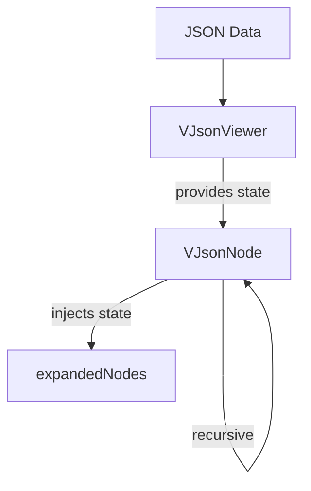

Today I discovered how powerful the combination of Vue's provide/inject pattern and recursive components can be when dealing with nested data structures like JSON. Here are the key insights:



1. **Provide/Inject eliminates prop drilling** - Instead of passing state through multiple component levels, the parent component provides it directly to any descendant that needs it.

2. **Symbols prevent naming conflicts** - Using a Symbol as the injection key ensures uniqueness throughout the application:

   ```js
   export const jsonViewerKey = Symbol("jsonViewer");
   ```

3. **Centralized state management is cleaner** - The parent component manages all state changes:

   ```js
   provide(jsonViewerKey, {
     toggleNode: path => {
       expandedNodes.value.has(path)
         ? expandedNodes.value.delete(path)
         : expandedNodes.value.add(path);
     },
     isExpanded: path => expandedNodes.value.has(path),
   });
   ```

4. **Recursive components handle infinite nesting elegantly** - A component that renders itself can handle any level of nesting in your data structure:

   ```vue
   // src/components/VJsonNode.vue
   <VJsonNode
     v-for="entry in entries"
     :key="entry.path"
     :value="entry.value"
     :path="entry.path"
   />
   ```

5. **Computed properties make type handling clean** - Vue's reactivity system helps manage complex logic:

   ```js
   const valueType = computed(() => {
     if (Array.isArray(props.value)) return "array";
     if (props.value === null) return "null";
     return typeof props.value;
   });
   ```

6. **Path-based identifiers track state** - Using paths like `root.users[0].name` makes tracking expansion state straightforward across the entire structure.

7. **Validation improves component reliability** - Checking for proper context prevents misuse:
   ```js
   if (!jsonViewerProvider.withinJsonViewer) {
     throw new Error("VJsonNode must be used within a VJsonViewer component");
   }
   ```

This pattern has dramatically simplified how I handle complex nested data in Vue applications. What seemed like a daunting task became elegant and maintainable.

